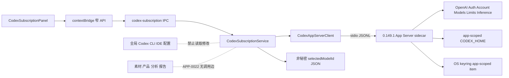

# Codex-SDK订阅接入-DEV-0013-v1.0

## 1. 文档信息

| 项目 | 内容 |
| --- | --- |
| 文档类型 | Codex 订阅产品集成技术设计 |
| 文档状态 | DRAFT；与 APP-0022 实现和验证同步收口 |
| 关联需求 | [Codex订阅接入-REQ-0007-v1.0](../requirements/Codex订阅接入-REQ-0007/Codex订阅接入-REQ-0007-v1.0.md) |
| 关联排障 | [Codex订阅登录与调用-TRB-0010-v1.0](../troubleshooting/Codex订阅登录与调用-TRB-0010-v1.0.md) |
| 关联任务 / 分支 | APP-0022 / `codex/req-0007-app-0022-codex-subscription` |
| 基线 | APP-0020 已提交的 API Key Provider、Model Service、IPC、UI 与系统安全存储能力 |
| runtime | `@openai/codex-sdk`、`@openai/codex` 与目标平台包精确锁定 `0.149.1` |
| 发布单元 | macOS arm64/x64、Windows x64 Electron 客户端；不新增自建 backend |
| 创建 / 更新日期 | 2026-08-25 / 2026-08-25 |

本文描述 APP-0022 的目标技术合同和验证门禁。代码、mock、未登录 runtime、打包以及真实账号是不同证据层；某一层通过不能替代其他层。

## 2. 目标、范围与非范围

技术目标是：在现有“模型管理”页面旁路接入一个 Material 专属的 Codex App Server，支持 ChatGPT 浏览器/设备码登录、账号/套餐/限额、模型目录、显式选择、固定非业务测试和退出，同时保持 API Key 模型链路不变。

本设计包含：

- 官方 runtime 解析、固定版本、App Server stdio JSONL、生命周期与打包；
- app-scoped `CODEX_HOME`、系统 keyring、最小配置、环境白名单和空测试目录；
- 窄 preload/IPC、账号登录状态机、限额/credits、模型目录与非秘密选择；
- 单个逻辑 thread + turn 的固定测试、工具/文件/扩展事件失败关闭；
- 错误净化、秘密禁入、mock/无登录 runtime/真实 smoke/双平台分层验证；
- 升级、回退、卸载以及与全局 Codex CLI/IDE 隔离的真机门禁。

本设计不把订阅接入 `ModelProvider.complete`、新建分析、分析编排、报告或记录；不提供任意 Codex 对话、线程恢复、仓库操作、工具或用户 Prompt；不读取全局 `~/.codex`；不把订阅失败回退为 API Key；不在本任务中建设多账号、团队账号池或自建登录代理。

## 3. 官方接口选择与 runtime 决策

### 3.1 App Server 是主接口

官方高层 Codex SDK 适合通过 `Codex` / thread API 执行 `codex exec`，但 APP-0022 还需要账号登录、取消、账号更新、`model/list`、`account/rateLimits/read` 和退出，并要求非持久测试。`0.149.1` 高层 `ThreadOptions` 不公开这些托管账号接口，也不提供 APP-0022 所需的 ephemeral 控制。因此：

- 产品协议主接口固定为 `codex app-server --stdio --strict-config`；
- 账号、目录、限额和固定测试都通过官方 App Server JSONL 方法完成；
- `@openai/codex-sdk` `0.149.1` 用于锁定官方 SDK/runtime 供应链，`@openai/codex` 及平台包提供可打包的官方可执行文件；
- 不为了形式上的“使用 SDK”而实例化不满足账号/非持久合同的高层 `Codex` 类；
- WebSocket 仍属实验接口，V1 不监听端口、不启用 WebSocket 或自建桥接服务。

依据：[Codex SDK](https://learn.chatgpt.com/docs/codex-sdk)、[Codex App Server](https://learn.chatgpt.com/docs/app-server)。

### 3.2 与 APP-0020 `ModelProvider.complete` 的关系

现有 `ModelProvider.complete` 面向 BYOK：调用由 configuration ID、model ID、API Key 和 Provider Adapter 解析，并允许业务消息合同。ChatGPT 订阅由 App Server 托管凭据、账号、线程与 turn，其安全前置、事件流和取消语义不同，不能把订阅 token 塞进 `apiKey` 参数，也不能让既有任意消息调用绕过固定测试。

APP-0022 因而采用独立 `CodexSubscriptionService`，不注册为分析 Provider、不迁移 Vault schema、不改现有 API Key 密文。未来完整素材分析若要复用统一上层抽象，必须另立任务定义受控业务输入、输出 schema、数据外发、持久化、工具策略和成本；不能把本次连通测试直接升级为 `complete`。

### 3.3 版本和上游行为

依赖和运行时必须精确为 `0.149.1`，禁止 `^`、`~`、latest、PATH 或用户全局 CLI 兜底。启动时核对 runtime 版本；依赖、平台包、打包资源或报告版本不一致时标记 `RUNTIME_UNAVAILABLE`。

Codex 内置 OpenAI Provider 具有请求/流传输恢复默认值；当前不能通过 `model_providers.openai` 覆盖内置 Provider 将其配置为 0。Material 只能保证每次用户确认创建一个 thread 和一个 turn，不在失败/断流/受控终态后发第二个 `turn/start`，不能声称底层只有一次 HTTP 尝试。测试前披露该事实，验收统计逻辑方法次数，runtime 升级时复核默认值与可配置性。依据：[Config Reference](https://learn.chatgpt.com/docs/config-file/config-reference)、[openai/codex#3026](https://github.com/openai/codex/issues/3026)。

## 4. 总体架构与模块边界



推荐模块职责与当前目录对应：

| 模块 | 责任 | 禁止责任 |
| --- | --- | --- |
| `types.ts` | renderer 可见状态、稳定错误、窄方法与摘要类型 | token、完整 auth URL、原始账号、JSONL 类型外泄 |
| `runtime.ts` | 平台 runtime 解析、专属 home/config、环境、进程启动参数 | PATH/全局 CLI 回退、全量 `process.env` 继承 |
| `client.ts` | stdio JSONL 分帧、请求关联、generation、截止和关闭 | 业务状态、原始 stderr 日志、任意 renderer RPC |
| `service.ts` | 登录竞态、权威账号快照、目录/限额、选择、固定测试和失败关闭 | BYOK Key、任意 Prompt、分析 Provider 注册 |
| `ipc.ts` / preload | trusted sender、输入校验、结果包装、监听器回收 | `send(channel, payload)` 泛化接口、child handle/stdin 暴露 |
| `CodexSubscriptionPanel.tsx` | 双分区中的订阅状态与真实 dialog | auth URL、token、任意 App Server 参数 |

服务在 Electron 主进程内为单例。同一应用实例最多一个 sidecar generation、一个 pending 登录和一个 testing；renderer 重载或窗口关闭不得复制 sidecar，也不得让旧监听器继续收到状态。

## 5. runtime 解析、sidecar 与打包

### 5.1 开发与生产解析

- 开发态根据 `process.platform/process.arch` 映射官方平台可选包，通过 `require.resolve(<platform-package>/package.json)` 找到其 `vendor/<triple>/bin/codex[.exe]`。
- 生产态只从 `process.resourcesPath` 下的固定 `extraResource` 位置解析 `codex` / `codex.exe`；资源必须在 ASAR 外。
- 只允许 macOS arm64/x64 和 Windows x64 发布目标。上游存在 Linux 或 Windows arm64 包不等于本产品支持。
- spawn 前检查文件存在、准确架构、macOS 执行位、规范化真实路径和版本；路径不能是符号链接到用户可写目录。
- 不从 PATH、npm global、ChatGPT.app、`~/.codex`、下载目录或 renderer 参数选择可执行文件。

### 5.2 进程合同

sidecar 使用固定可执行路径与 argv `app-server --stdio --strict-config`，`shell:false`，stdin/stdout/stderr pipes，Windows 隐藏控制台窗口。工作目录是受控目录；生产不使用仓库、素材或用户 home 作为 cwd。

生命周期为：解析和校验 → 准备 app-scoped home/config → spawn → `initialize` → `initialized` → 账号读取。initialize 为 15 秒目标截止；失败使当前 generation 无效并拒绝所有 pending。关闭时先 interrupt 活跃 turn、关闭 stdin/请求正常退出，5 秒仍未退出才终止准确 child；禁止进程名广泛 kill。

stderr 可能包含账号、路径或上游错误，只允许丢弃或在进程内保存受限、已净化的诊断类别，不得直接继承到终端、console、文件日志或 renderer。

### 5.3 打包与供应链

- package/lock 中 SDK、CLI runtime 和平台包版本一致且精确锁定 `0.149.1`；安装使用 lockfile，不在应用启动时下载 runtime。
- Electron Forge 为各目标复制准确单个平台二进制，防止把所有架构打进包或把开发机路径写入产物。
- macOS 对嵌套可执行保留执行位并纳入签名、公证和 Gatekeeper 验证；arm64/x64 分别检查。
- Windows x64 验证 Squirrel 资源位置、空格路径、安装/升级/卸载和安全软件拦截恢复。
- 产物生成依赖清单、版本/哈希证据、SBOM 与上游 Apache-2.0 notice；依赖锁定不替代签名和来源检查。

## 6. app-scoped `CODEX_HOME`、keyring 与最小配置

### 6.1 路径和凭据隔离

`CODEX_HOME` 固定在 Electron `app.getPath('userData')` 下的 Material 专属目录，首次进入订阅区域并启动 sidecar 前创建为当前用户私有权限、写入非秘密受管 config，并 `realpath` 规范化。随后执行 `account/read` 读取 app-scoped 账号状态；未登录则停止，已登录则继续读取模型目录与限额摘要。这个初始化不自动登录、不创建推理 turn，也不消耗模型额度。禁止读取/复制全局 `~/.codex`、全局 config、auth、AGENTS、rules、MCP、skills、hooks 或 session。

固定 `0.149.1` 源码的 keyring account key 由 canonical `CODEX_HOME` 的 SHA-256 前 16 位参与命名；稳定、独立的 canonical home 因而为账号项提供命名隔离。依据：[openai/codex auth storage](https://github.com/openai/codex/blob/main/codex-rs/login/src/auth/storage.rs)。这仍只是实现依据：macOS Keychain 与 Windows Credential Manager 上登录/退出不影响全局 CLI/IDE，必须分别由真机 canary 证明，不能由源码推导直接宣称已验证。

凭据策略只能是 `cli_auth_credentials_store = "keyring"`。创建 home/config 本身不创建凭据；新的 app-scoped keyring 凭据只在用户显式完成登录后由 runtime 产生或更新。keyring 不可用、锁定、拒绝或 runtime 尝试生成 `auth.json` 时失败关闭；不改为 `auto`/`file`，不写现有 safeStorage Vault、SQLite、环境变量或 renderer。显式 `account/logout` 后必须以 `account/read` 的 `account === null` 确认成功；退出只能作用于该 app-scoped home 对应账号项。

### 6.2 固定 config

应用写入受管 `config.toml`，权限限当前用户，至少落实：

```toml
forced_login_method = "chatgpt"
cli_auth_credentials_store = "keyring"
check_for_update_on_startup = false
web_search = "disabled"
approval_policy = "never"
sandbox_mode = "read-only"

[history]
persistence = "none"

[analytics]
enabled = false

[feedback]
enabled = false

[agents]
enabled = false

[memories]
generate_memories = false
use_memories = false

[features]
apps = false
hooks = false
multi_agent = false
remote_plugin = false
shell_snapshot = false
shell_tool = false
skill_mcp_dependency_install = false
unified_exec = false

[tools]
view_image = false
web_search = false
```

不写 `mcp_servers`、hooks、skills、plugins、apps/connectors 或 additional directories。实际键名和 `--strict-config` 兼容性以固定 runtime 启动测试为准；未知、废弃或未生效字段必须使能力不可用，不能静默忽略后继续测试。配置关闭项不是唯一防线，运行时事件防火墙和 canary 必须同时存在。依据：[Config Reference](https://learn.chatgpt.com/docs/config-file/config-reference)。

### 6.3 非持久性门禁

测试使用 App Server 的 nonpersistent/ephemeral thread 能力，并设置 `history.persistence = "none"`。正常、失败、超时、安全违规和进程崩溃后都扫描专属 home，不得出现包含固定 Prompt、回复、reasoning 的 history、rollout 或 session 明文。不得先允许落盘再事后删除；若 `0.149.1` 无法满足不落盘，真实测试必须失败关闭。

## 7. 环境白名单与工作目录

禁止把完整 `process.env` 传给 sidecar。实现从新对象开始，强制写入 canonical `CODEX_HOME`，再只复制下列固定名称白名单；命令始终用应用资源中的绝对路径，PATH 不参与 runtime 选择：

| 类别 | 默认策略 |
| --- | --- |
| 专属账号 home | `CODEX_HOME` 由应用强制设置，不接受父环境同名值 |
| Windows / 用户态系统兼容 | `APPDATA`、`LOCALAPPDATA`、`USERPROFILE`、`SYSTEMROOT`、`WINDIR`、`COMSPEC`、`PATH`、`PATHEXT` |
| macOS/Linux 用户态系统兼容 | `HOME`、`PATH`、`XDG_RUNTIME_DIR`、`DBUS_SESSION_BUS_ADDRESS` |
| 临时目录、locale 与证书 | `TEMP`、`TMP`、`TMPDIR`、`LANG`、`LC_ALL`、`LC_CTYPE`、`SSL_CERT_DIR`、`SSL_CERT_FILE` |
| 系统代理兼容 | `HTTP_PROXY`、`HTTPS_PROXY`、`ALL_PROXY`、`NO_PROXY`；值可能包含敏感代理信息，只供 child 使用且不得进入 renderer/日志 |
| OpenAI/API/业务/云凭据 | 不在白名单，包括 `OPENAI_API_KEY`、其他 Provider Key、Authorization、cookie、素材/数据库路径和业务 token |
| shell/开发变量 | 不在白名单，包括 shell rc 内容、npm token、Git/SSH、CI 和调试注入 |

若平台运行必须新增变量，应加入显式大小/字符校验和单项测试，不能恢复为复制整个父环境。环境哨兵测试一方面证明 API Key、业务/素材/数据库路径和非白名单凭据在 child 命中数为 0；另一方面证明 HOME/PATH/APPDATA/代理等允许值不会越过 child 进入 renderer、console、文件日志或错误。

每次固定测试创建新的空工作目录，验证不是符号链接且不位于 repo、素材、Desktop、Documents、home 或全局 Codex 目录。测试只使用最小 read-only sandbox 且无 additional directories。“read-only”不等于“不可读”，因此在进程/目录隔离和事件防火墙上分别证明业务文件不可达。

## 8. JSONL 客户端与协议防线

### 8.1 分帧和请求关联

App Server 默认 stdio 一行一个 JSONL 消息。客户端必须：

- 按字节缓存和换行分帧，允许部分行/多行 chunk；每行不超过 1 MiB；
- 只接受合法 UTF-8 JSON object；拒绝数组、标量、非法/超长行和缺少必需结构的消息；
- request ID 只在单 generation 内唯一，限制数字/字符串长度；重复不一致 ID 为协议错误；
- request map 在响应、截止、child exit、协议失败和 stop 时准确清理定时器；
- sidecar 重启递增 generation，旧响应/通知/登录/turn ID 永不匹配新实例；
- stdout 只由 parser 消费，原始 JSONL 不进入日志、renderer 或测试快照。

单连接只发送一次 `initialize`，收到成功后再发 `initialized`。初始化可设置受控客户端元数据和不需要的正文 delta opt-out，但 opt-out 只是减少输出，不替代正文过滤和安全事件检查。

### 8.2 方法白名单

Material 可发起的方法仅限：

| 阶段 | 方法 |
| --- | --- |
| 握手 | `initialize`、`initialized` |
| 账号 | `account/read`、`account/login/start`、`account/login/cancel`、`account/logout` |
| 限额/目录 | `account/rateLimits/read`、`model/list` |
| 测试 | `thread/start`、`turn/start`、`turn/interrupt` |

接收 `account/updated`、`account/login/completed`、限额与 thread/turn 生命周期通知。未知普通通知忽略前先做大小/结构限制；未知必需结构或服务器主动 request 一律返回“不支持”，并在测试期间按安全事件处理。renderer 不能提交方法名、params、request ID、cursor、auth type、cwd、approval 或 sandbox。

### 8.3 截止、退出与错误

initialize 15 秒；普通账号/目录/限额 RPC 30 秒；登录最多 10 分钟或服务更早终态；测试 60 秒；logout 30 秒。登录截止执行 login cancel；测试截止或安全违规执行一次 interrupt。任何截止都不自动新建第二个逻辑操作。

child exit、stdin 关闭、部分尾行、非法消息、版本不一致和超长输出归一为稳定错误，清空 pending 并使 generation 失效。原始 JSON-RPC error、stdout/stderr、Prompt、回复和账号值不得穿透异常对象或 telemetry。

## 9. IPC 与 renderer 安全合同

preload 仅暴露具名方法，不暴露通用 `invoke(channel, ...args)`、EventEmitter、App Server client 或 child 进程。所有 handler 校验 `webContents` 为可信窗口、参数类型/长度/枚举和服务当前状态；窗口销毁时回收监听器。

| 方法 | renderer 可传 | renderer 可收 | 明确禁止 |
| --- | --- | --- | --- |
| `getState` / `refreshAccount` | 无 | 安全状态、掩码账号、plan | token、原始 email/account ID、auth URL |
| `startBrowserLogin` | 无 | loginId | auth URL、回调、cookie |
| `startDeviceLogin` | 无 | loginId、固定 URL、短期 userCode | token、任意 URL |
| `openDeviceVerificationPage` | 无 | null | renderer 自定义 URL |
| `cancelLogin` | 当前 loginId | null | 任意 request ID、旧 generation ID |
| `refreshModels` | 无 | 安全模型摘要 | cursor/includeHidden/任意 Provider 参数 |
| `selectModel` | 最新目录 ID 或 null | 安全状态 | 手填模型、模型 override |
| `getRateLimits` | 无 | 归一化 buckets/credits 或 null | 购买/兑换/原始响应 |
| `testSelectedModel` | 无 | 时间、耗时、requested/returned model、plan | Prompt、正文、usage、thread/turn ID、工具参数 |
| `logout` | 无 | null | 全局路径/账号/凭据 |

browser login 的 `authUrl` 只在 main 短时存在，校验 `https:`、无 URL credentials、官方 OpenAI/ChatGPT host 后由 main 自行 `shell.openExternal`；不得先发 renderer 再让 UI 打开。设备码只允许精确 `https://auth.openai.com/codex/device`，userCode 仅当前 dialog 内存，复制必须由用户点击，终态/取消/关闭/Escape 后清除 DOM、无障碍树与内存。

所有返回使用 `ok/data` 或 `ok:false/error:{code,message}` 的稳定封装；生产错误文案不包含上游正文或路径。

## 10. 登录、账号、限额和模型状态机

### 10.1 浏览器与设备码登录

浏览器调用 `account/login/start {type:"chatgpt"}`；设备码调用 `{type:"chatgptDeviceCode"}`。`account/read` 的实际响应包含 `account` 与 `requiresOpenaiAuth`；只有 `account` 是对象且 `account.type === "chatgpt"`（或版本化适配器确认的等价官方字段）才进入 ready，`account === null` 为 signed out，其他账号类型按安全违规处理。renderer 只看到派生状态，不收到原始 account 对象或 `requiresOpenaiAuth`。

登录尝试由 `(runtimeGeneration, loginId, kind)` 标识，同时只允许一个。`loginId` 必须满足长度/格式限制。完成监听 `account/login/completed`，账号变化监听 `account/updated`；通知可能早于 start response 或与 cancel 乱序，服务须暂存/关联当前 generation。

取消只接受当前 pending loginId。匹配尝试的第一个完成/取消终态结束“等待”，但最终账号页面始终由随后 `account/read` 的权威快照决定：cancel 晚于成功时可以 ready，成功通知晚于已取消且账号为 null 时保持 signed out。旧 ID、旧 generation、重复终态忽略。sidecar 崩溃或 10 分钟截止清除 pending，再读账号；不可恢复虚假 loginPending。

### 10.2 账号、套餐、限额与 credits

main 只返回掩码账号标签、`planType` 和归一化状态。掩码失败时返回“已登录 ChatGPT”，不返回原值。账号、限额和模型响应不写业务存储；应用重启后重新读取。

`account/rateLimits/read` 归一化主/次 bucket、usedPercent、窗口、reset time、`rateLimitReachedType` 和 reset credits。有限 usedPercent 越界时以 `min(100,max(0,value))` 钳制；null/缺失/非数值/非有限值或窗口结构无效时将该可选窗口映射为 null 并显示“暂不可用”；整体 response 不是 object 等顶层合同破坏才是 `PROTOCOL_ERROR`。不得把未知转成 0/无限。达限不触发换模型、换 API Key 或自动购买。额度只按 OpenAI 快照展示，Material 不计算价格/剩余次数。依据：[Codex Pricing](https://learn.chatgpt.com/docs/pricing)。

### 10.3 模型目录和选择

`model/list` 固定 `includeHidden:false`，按 `nextCursor` 分页，设置 20 页/200 项/字段长度上限并按精确 ID 去重。只返回可见、支持 text 的模型摘要；`isDefault` 只用于推荐排序，不自动选择。

用户必须从最新成功目录显式选择。只持久化非秘密 `selectedModelId`，使用原子小型 JSON、大小/权限/schema 校验；不保存账号、目录、限额或测试结果。目录变旧、刷新失败、账号变化、模型下线/隐藏或不再支持 text 时清空可调用选择并要求重选，绝不采用 upgrade/default 自动替换。

## 11. 固定连通性测试和能力防火墙

### 11.1 启动 gate 与单逻辑测试

测试前在 main 重新校验：`account` 为 ChatGPT 账号对象、非 limited、目录当前、selectedModelId 属于当前目录、没有 pending 登录/测试。renderer 的 `testSelectedModel()` 无参数；固定 Prompt、schema、模型、cwd、sandbox、approval 和截止都由 main 生成。

一次用户确认只允许：

1. 创建一个 nonpersistent/ephemeral thread，cwd 为新空目录，sandbox 为最小 read-only，approval 为 never，无 additional directories；
2. 为该 thread 创建一个 turn，输入为版本固定短文本和固定 JSON 输出约束；
3. 等待受控终态；仅在 60 秒截止或安全违规时发送一次 `turn/interrupt`，V1 不提供运行中手动取消测试 API；
4. 终态后不再发 `turn/start`，不 resume/continue，不换模型、不切 API Key、不创建补偿 thread。

App Server mock 必须精确断言 `thread/start` 和 `turn/start` 各最多一次。固定 runtime 的内置 OpenAI Provider 可能在同一 turn 内执行其传输恢复；不把该上游行为误记为客户端第二 turn，也不声称底层只有一次网络传输。UI 在每次确认前说明额度/credits 与该剩余风险。

### 11.2 输出最小化

主进程只用完整的受控终态和固定 schema 判断“有合法返回”，随后丢弃正文、reasoning、usage、JSONL、thread/turn ID。renderer 只得到 `checkedAt`、`durationMs`、`requestedModelId`、`returnedModelId` 和 plan 摘要。returned 与 requested 不同必须同时显示并提示核对，不能覆盖、称为自动切换或写回选择。

测试不刷新目录/限额，不持久化健康状态，不开放正文排障，也不建立到新建分析的调用边。成功只证明当次账号/模型/平台/时间可达。

### 11.3 失败关闭事件

配置禁用和 `approvalPolicy=never` 不足以证明安全。测试期间出现以下任一 server request、item 或 notification，立即拒绝/响应“不支持”、发送 interrupt、使测试失败为 `SECURITY_VIOLATION`，且正文不返 renderer：

- command/shell/process/terminal 执行或输出；
- file change、patch、写入、目录扩展或文件权限请求；
- MCP、apps/connectors、dynamic tool、remote plugin、hook、skill、memory、subagent/collab；
- web search、view image、computer use、任意工具网络；
- approval、user input、权限提升或未知 server request。

为防止“事件已发生后才拦截”，runtime 测试还要在 cwd 外放置不可读 canary，并确认无命令/文件副作用。若 runtime 在发事件前已执行副作用，当前版本不满足合同，功能停止真实测试。

## 12. 数据、秘密、可观察性与错误映射

### 12.1 数据存储与外发

| 数据 | 生命周期 | 允许位置 | 禁止位置 |
| --- | --- | --- | --- |
| ChatGPT token | runtime/keyring 管理 | OS keyring 的 app-scoped item | renderer、safeStorage Vault、SQLite、JSON、env、日志、Git |
| auth URL | browser start 短时 | main 内存、系统浏览器 | renderer/IPC、日志、存储 |
| device code | pending dialog 短时 | main/renderer 当前尝试内存 | 自动剪贴板、通知、日志、截图、存储 |
| 账号 | 当前会话 | main 原值、renderer 掩码 | 原值 IPC/DOM/日志/存储 |
| 目录/限额 | 时效快照 | main/renderer 内存 | 作为离线可调用真相、业务数据库 |
| selected model | 非秘密偏好 | app-scoped 小型 JSON | Vault token schema、全局 Codex config |
| 固定 Prompt/回复/reasoning | 单 turn 内存 | main/runtime 短时 | renderer、日志、history/rollout、业务记录 |

外发只有官方登录、账号/目录/限额读取和用户确认的固定测试。APP-0022 不发素材、产品、证据、报告、历史或 API Key，也不运行完整分析。

### 12.2 可观察性

允许记录：应用/runtime 版本、平台/架构、generation、RPC 方法类别、受控 request ID、阶段、时间/耗时、稳定状态/错误码、模型数量、requested/returned model ID、child exit code、安全事件类别。生产默认不记录 raw JSONL/stderr。

禁止记录：token、authorization/cookie、完整 auth URL/callback、device code、账号原值、完整路径、Prompt/回复/reasoning、原始限额、原始 OpenAI 错误、父环境。合成哨兵在 renderer、console、日志、crash、快照、持久化和包产物中的命中数必须为 0。

### 12.3 稳定错误与失败语义

至少支持：`INVALID_INPUT`、`RUNTIME_UNAVAILABLE`、`PROTOCOL_ERROR`、`SIGNED_OUT`、`LOGIN_IN_PROGRESS`、`LOGIN_FAILED`、`NO_MODEL_SELECTED`、`MODEL_UNAVAILABLE`、`RATE_LIMITED`、`TEST_FAILED`、`TEST_TIMEOUT`、`SECURITY_VIOLATION`、`UNKNOWN`。

网络、管理员禁用、账号过期、模型下线和 child exit 可以映射到稳定类别和安全恢复文案，但不透传供应商正文。未知终态不猜成功：登录重读账号，测试显示失败/未知且等待用户重新确认，退出只有 `account/read.account === null` 才称成功。

## 13. UI 集成与无障碍工程约束

现有侧栏“模型管理”保持唯一入口；页面先“Codex 订阅 Beta”，后“API Key 模型”。订阅组件独立订阅服务状态，不改变 API Key 草稿、CRUD、模型刷新或固定测试。

浏览器登录确认、设备码、测试确认、退出确认均使用语义真实 dialog：标题关联、焦点圈定，关闭后焦点返回触发按钮。login pending dialog 的关闭/Escape 必须调用 `cancelLogin`，不能只隐藏 UI；测试确认 dialog 的关闭/Escape 只表示“不启动 turn”，测试一旦运行便没有手动 cancel API；退出确认的关闭/Escape 只表示“不 logout”。登录取消完成后用 `getState/account read` 安全快照收敛。

状态用 `aria-live`，错误用 alert，限额用文本加 progress 语义；禁用原因常驻显示而非只用 tooltip。360 CSS px、200% 缩放、高对比度、减少动画和完整键盘路径必须纳入 UI 测试。设备码终态后从 DOM/无障碍树移除。

“当前仅支持登录、模型发现和连通测试，尚未接入素材分析”常驻可见。limited 不自动切 API Key；Codex logout 不删除 API Key，反向亦然。

## 14. 测试分层与验收证据

### 14.1 自动化层级

| 层级 | 必测内容 | 允许结论 | 不允许结论 |
| --- | --- | --- | --- |
| 单元/parser | JSONL chunk/多行/超长/非法、ID/generation、timeout/exit、错误净化 | 客户端协议合同通过 | 官方 runtime/账号可用 |
| service/mock | 登录乱序、account/limits/models、逻辑 thread/turn 计数、安全事件、秘密哨兵 | 状态机与失败关闭通过 | 真实订阅调通 |
| IPC/UI | trusted sender、无参数测试、payload 禁入、四 dialog、a11y、API Key 回归 | renderer 边界和交互通过 | token/keyring/外部浏览器真机安全 |
| 无登录 runtime | 版本/架构、initialize、signed-out `account/read`、安全关闭 | 固定官方 runtime 兼容未登录协议 | 登录、目录、额度或测试可用 |
| package | extraResource、ASAR 外、执行位、签名链/资源路径 | 当前产物含准确 runtime | 另一平台、真实账号或全局隔离 |
| 真实订阅 smoke | 同会话 account/read、model/list、rateLimits、用户确认一个固定测试 | 当次账号/模型/平台/时间可达 | 无限额度、模型质量、完整分析、另一平台 |
| 双平台真机 | keyring 拒绝/登录/退出、CLI/IDE canary、升级/回退/卸载 | 对应平台当次隔离和生命周期 | 未来 runtime 永久无影响 |

### 14.2 必需自动化场景

- JSONL：部分行、并行 ID、超长/非法/数组、重复 ID、server request、child exit、旧 generation、stderr 哨兵；
- 登录：browser main-only auth URL、恶意 URL、device fixed URL/code、早到完成、完成/取消双顺序、旧 ID、超时、重启；
- 账号：`account.type=chatgpt`、`account=null`、非法账号类型、掩码失败、token 过期、管理员禁用、logout 后确认 null；
- 限额：主/次 bucket、null/缺失/非数值窗口、有限越界值钳制、顶层非法响应、达限/恢复、credits/null；
- 目录：分页/游标、hidden、text modality、default 不自动选、非法项过滤、空目录状态、超 200 失败、下线/账号切换；
- 测试：所有 gate、重复点击、一次 `thread/start` + 一次 `turn/start`、60 秒截止/terminal 竞态、无运行中手动取消 API、无客户端第二 turn、requested/returned 差异、正文/reasoning 禁返；
- 安全：command/file/approval/MCP/web/dynamic tool/image/collab/skill/hook 事件、空 cwd、环境/全局配置 canary、所有退出路径无 prompt/rollout；
- 回归：DeepSeek、官方 OpenAI API Key、自定义兼容配置和既有 ModelProvider 测试均不退化。

固定 runtime 的 turn 内传输恢复不能由 mock 伪装成单次底层传输。自动化断言 Material 的 App Server 方法次数，并验证 UI 披露；真实 smoke 只记录一个逻辑测试，不从无法观察的底层 HTTP 次数推断成本。

### 14.3 真实 smoke 边界

真实 smoke 只在用户通过 Material 专属入口登录测试账号并在 UI 每次确认后执行。缺少登录、权益、模型、网络、用户确认或目标平台时记录 SKIP/失败原因；不得用 mock、开发机全局登录或无登录 runtime 补成 PASS。

同一 sidecar 会话依次核对 `account/read.account.type=chatgpt`、`model/list includeHidden:false`、`account/rateLimits/read` 和一个选定模型的固定测试。证据只保留构建/runtime、平台、掩码 plan、requested/returned model、时间、耗时、状态；不保留账号、token、URL/code、Prompt/回复、原始限额或 JSONL。

### 14.4 真机与持久化验证

macOS arm64/x64 和 Windows x64 分别使用准确安装包验证 keyring 可用/拒绝、登录、重启、离线、过期、退出、全局 CLI/IDE canary、升级、回退、卸载/重装。专属 home/keyring 的源码命名机制不能替代该证据。

在正常、失败、超时、security violation 和 crash 后扫描专属 home：固定 Prompt、回复、reasoning、history/rollout 明文命中数为 0。发现任何持久化、全局账号变化或文件/工具副作用均阻断对应平台真实测试和发布。

## 15. 升级、回退与失败处置

runtime 升级必须独立提交和验证，不浮动更新。升级门禁至少比较：App Server method/field、登录事件、keyring 命名、模型/限额 schema、ephemeral/history 行为、内置 Provider request/stream retry 默认值与是否可配置、工具事件、打包资源和签名。

应用升级后重新 initialize、account/read 和 model/list，不沿用旧 ready；保留 app-scoped home/keyring 和非秘密选择，但选择必须重新验证。配置 schema 或安全能力未知时停止 Codex 分区，不删除 token，也不回退全局 CLI/API Key。

回退到上一已验证客户端/runtime 时保留 API Key 和业务数据。旧版不认识订阅能力时不得扫描/删除专属 home；用户要退出应回到支持该能力的已验证版本。普通卸载不等于 logout 或凭据擦除，帮助文案和平台证据必须如实说明。

出现 token/账号/auth URL/code/Prompt 泄漏、全局 CLI/IDE 被影响、auth.json 回退、工具/文件/网络扩展实际执行、测试内容落盘、一次确认产生第二逻辑 turn 或 runtime 来源不明时：中断当前 turn、停止该 generation 与 Codex 分区真实调用，保留不含秘密的摘要，回退/修复后复跑全层验证。不得删除整个 userData 或 API Key 配置作为处置。

## 16. 已知限制与完成声明

- `@openai/codex-sdk` 高层线程 API 不是本产品账号/目录/限额接口；APP-0022 以 SDK 锁定的官方 runtime + App Server 完成集成。
- 当前只完成登录、账号/限额、模型发现/选择和固定测试，不进入新建分析，不接完整素材分析。
- runtime 内置 OpenAI Provider 的同 turn 传输恢复不可由当前客户端配置成零，实际额度消耗具有剩余不确定性。
- mock 通过只证明客户端合同；无登录 runtime 通过只证明官方程序可启动；二者都不等于真实订阅调通。
- app-scoped home 和 keyring 命名提供隔离机制，但“绝不影响 CLI/IDE”必须由 macOS/Windows 真机分别证明。
- Beta 不降低秘密禁入、工具/文件失败关闭、验证实际运行和最终发布确认门禁。

只有范围内自动化实际通过、准确安装包验证、真实账号 smoke 和对应平台真机证据完成时，才能按层级报告结果；未运行、超时、取消或 skipped 均不能写为通过。最终合并、部署、发布和移除 Beta 由用户决定。

## 17. 官方资料

- [Codex SDK](https://learn.chatgpt.com/docs/codex-sdk)
- [Codex Authentication](https://learn.chatgpt.com/docs/auth)
- [Codex App Server](https://learn.chatgpt.com/docs/app-server)
- [Codex Pricing](https://learn.chatgpt.com/docs/pricing)
- [Codex Config Reference](https://learn.chatgpt.com/docs/config-file/config-reference)
- [Codex auth storage source](https://github.com/openai/codex/blob/main/codex-rs/login/src/auth/storage.rs)
- [Built-in OpenAI Provider retry override limitation](https://github.com/openai/codex/issues/3026)

## 18. 变更历史

| 版本 | 日期 | 摘要 | 关联任务 |
| --- | --- | --- | --- |
| v1.0 | 2026-08-25 | 新增 App Server 主接口、固定 0.149.1 runtime、JSONL/IPC/sidecar、app-scoped home/keyring、登录竞态、目录/限额、固定单 thread/turn 测试、能力失败关闭、环境白名单、打包回退和分层证据设计 | APP-0022 |
