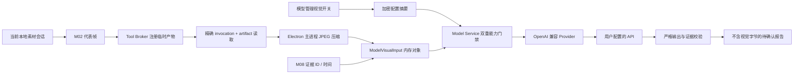

# OpenAI兼容视觉模型分析-DEV-0021-v1.0

## 1. 文档信息

| 项目 | 内容 |
| --- | --- |
| 关联需求 | [单素材分析-REQ-0005-v1.0](../requirements/单素材分析-REQ-0005/单素材分析-REQ-0005-v1.0.md) |
| 关联任务 | `APP-0028` |
| 前置能力 | M01～M08 确定性媒体解析、Tool Broker 临时产物、BYOK Model Service、分析引擎、对话重新分析与报告记录闭环 |
| 实现范围 | 用户显式启用的 OpenAI 兼容图片输入、视频 M02 代表帧输入、主进程压缩与限额、证据绑定、错误恢复和界面说明 |
| 发布单元 | macOS、Windows 共享 TypeScript 核心；Electron 图像解码和真实第三方视觉模型仍需分别真机验证 |

## 2. 目标、边界与非范围

APP-0028 让用户自行配置的 `openai-compatible` 模型可以真正接收视觉信息，而不是只读取 OCR、ASR 和媒体结构文本。图片和视频统一复用当前分析运行中 M02 `media.frame.extract` 生成并注册的临时图片：图片取 1 张，视频取最多 8 张代表帧。视觉结果继续经过现有行业模板、严格 JSON、证据引用、评分、标签和报告确认链路。

数据外发边界已经由产品负责人确认：图片只发送当前素材产生的受控 JPEG；视频只发送 M02 代表帧；不上传原视频、音频、远程图片 URL、任意用户文件或 renderer 提供的字节。视觉数据不持久化，不进入报告 schema、SQLite、PDF、普通日志、审计、任务记录或崩溃诊断。项目不增加代理 backend、共享 Key、模型自动探测、路由、并行调用、静默重试、视觉缓存或供应商特有协议。

## 3. 架构与数据流

`AnalysisRuntimeService` 只在配置明确启用视觉时调用 `VisualInputPreparer`。预处理必须在 Tool Broker `release` 前完成；运行结束的 `finally` 释放所有临时工作区。首轮完成后，对话重新分析仅复用当前主进程 `RefinementContext` 中的受控 Base64，不重新读取更广文件范围；上下文最多保留现有 8 个运行，关闭应用或淘汰上下文即释放内存。

## 4. 临时产物读取与图像编码

Tool Broker 在产物注册时计算 SHA-256，并在成功调用后只保存不可变产物元数据映射。`readArtifact(invocationId, artifactId)` 要求调用已经结束、产物属于该调用且尚未 `release`；`TemporaryArtifactManager` 再验证安全相对路径、工作区和文件均不是符号链接、真实路径仍位于精确工作区、文件大小与 SHA-256 均未变化，才读取字节。任意不匹配均 fail closed，不把绝对路径或底层异常返回页面。

`VisualInputPreparer` 逐帧把 M02 `artifactRelativePath` 映射到该调用唯一注册产物，并使用 `frameEvidenceId(frameId)` 生成与 M08 相同的证据 ID。图片的 `timeMs=null`；视频保留 M02 毫秒时间。输出不含源路径、临时路径、artifact ID或 invocation ID。

`ElectronVisualImageCodec` 使用 `nativeImage` 解码，先按比例收敛到单边不超过 1280 像素，再以不高于 80 的 JPEG 质量尝试编码；仍超限时降低质量并按比例缩小，无法在受控下限内满足预算则拒绝整批。当前固定安全合同为：

| 限制 | 值 | 行为 |
| --- | --- | --- |
| 单次图片数 | 1～8 | 之外拒绝，不调用模型 |
| 最大单边 | 1280 px | 保持比例缩放 |
| 初始 JPEG 质量 | 80 | 可为满足字节预算降到 40 |
| 单张上限 | 1 MiB | 超限继续受控压缩或拒绝 |
| Base64 解码后的 JPEG 负载合计 | 6 MiB | 按帧数平均分配单张预算，保证 8 张也不越界 |

这些是验证版本工程安全上限，不是业务素材大小上限，也不改变本地播放器和 M01～M08 对原素材的读取规则。

## 5. 模型配置与请求合同

Provider 的 `inputKinds` 从固定文本扩展为 `text | image` 列表。当前固定 DeepSeek Provider 保持 `['text']`；通用 `openai-compatible` 声明 `['text','image']`。配置新增 `visualInputEnabled`，旧 schema v1 信封缺字段时按 `false` 读取；只有 Provider 声明图片能力时才允许保存 `true`。该开关是用户对具体配置能力和发送范围的显式声明，不通过可能计费的 completion 自动探测。

模型管理弹窗只对支持图片的 Provider 显示视觉开关并解释“压缩图片 / 视频代表帧、无原视频音频”。配置卡和新建分析模型选项显示当前视觉状态。保存和“测试并刷新”仍只调用 `GET /models`；不会为验证视觉能力调用 `POST /chat/completions`。

`ModelCompletionRequest.visualInputs` 是主进程内部可选字段，元素只包含 JPEG Base64、证据 ID、尺寸和可选时间。`ModelService` 在读取凭据后再次核对 Provider 图片能力与持久配置开关，并验证数量、Base64 规范编码、解码后单张 / 总字节、尺寸、时间和证据 ID。renderer 即使伪造开始参数也不能绕过服务端门禁。

Provider 采用 OpenAI 官方 Chat Completions 的用户消息内容块形状，把原文本保留为 `text`，每张图片前增加证据 ID / 时间文本，再增加 `image_url` data URL，并固定 `detail=low`。官方合同参考：[Chat Completions API](https://developers.openai.com/api/reference/cli/resources/chat/subresources/completions)。兼容供应商可能只实现该合同的子集；“OpenAI 兼容”不等于功能、隐私、地域或价格认证。

## 6. 分析、证据与报告边界

分析 Prompt 的结构化上下文只增加 `visualEvidence: [{evidenceId,timeMs}]`，不重复放入 Base64。Provider 在组装 HTTP Body 时才产生 data URL。模型返回的每个视觉结论仍必须引用证据包中真实存在且本次发送的 `evidenceId`；未知证据继续导致整份模型输出无效。

视频报告始终加入“视觉理解仅覆盖 N 个代表帧，不代表完整视频逐帧分析”的可见局限。未启用视觉的配置加入“画面结论仅依据 OCR 与结构化工具证据”。视觉输入不会加入 `AnalysisReportDraft`；融合层只读取媒体证据、模型结构化输出和现有审计摘要，因此确认记录、反馈、历史详情和 PDF 不会持有 Base64 或 data URL。

## 7. 失败、取消与恢复

| 失败 | 行为 | 用户恢复 |
| --- | --- | --- |
| M02 或注册产物缺失 / 被替换 | 视觉准备失败，零模型调用，释放临时工作区 | 保留表单和素材会话后重试 |
| 图片无法解码或仍超限 | 整批拒绝，错误不含路径 / 字节 | 换素材、关闭视觉或改选配置后显式重开 |
| Provider / 配置未启用视觉 | Model Service 在网络前拒绝 | 编辑配置并重新验证，或使用仅文本分析 |
| 模型不支持图片、限流、超时或响应无效 | 固定模型只调用一次，不重试、不切换、不静默回退文本 | 页面显示受影响视觉维度，由用户决定 |
| 用户取消 | AbortSignal 终止当前工具 / 模型链路，不形成报告 | 使用保留设置重新开始 |
| 对话重新分析源素材变化 | 指纹复核失败，不复用旧视觉上下文 | 重新定位相同文件后从配置重新开始 |

模型失败时页面显示画面、镜头、卖点和情绪等依赖视觉的维度未生成。系统不能为了返回一份报告而静默移除图片重发文本，也不能自动切换模型；这两种行为都会改变费用、数据和结果边界。

## 8. 安全、不变量与可观察性

- API Key 继续只存在于 safeStorage 和单次主进程请求内存；视觉功能不改变凭据路径。
- renderer、preload 和 IPC 只接收配置布尔摘要、运行状态和不含字节的报告；没有视觉字节读取 API。
- 模型审计只保存配置 / 模型 / Provider / Adapter、时间、耗时、状态和错误码，不序列化请求。
- Tool 审计只保存输入 / 输出字节计数和产物元数据，不保存产物内容。
- 普通错误统一为安全中文摘要，不包含 Base64、data URL、完整 URL、文件路径、供应商正文或图像解码细节。
- 视觉请求失败后仍执行精确临时目录清理；清理失败不得把临时路径返回页面或扩成递归删除。

## 9. 验证与证据

自动化覆盖：旧配置默认关闭视觉、Provider / 配置双重门禁、模型设置持久化、官方内容块映射、Base64 / 尺寸 / 字节 / 数量校验、精确产物读取直到 release、路径与符号链接逃逸拒绝、帧证据 ID、视频时间、8 帧预算、整批 fail closed、模型单次调用、报告零视觉字节和重新分析内存复用。

APP-0028 的固定受控验证包括 docs / static reconcile、desktop lint、typecheck、普通测试、`test:model-runtime`、Electron package 和治理单测；mac、win 发布单元使用同一代码合同。未运行、失败、超时或跳过均不是通过。

模拟 HTTP 和合成字节不能代替真实模型质量与第三方政策验收。真实验收仍需用户用自己的视觉模型完成固定图片和视频样例，并在 macOS、Windows 安装包分别核对图像解码、请求取消、safeStorage、临时产物清理和报告结果。产品负责人自行测试的模型名、数据发送范围、时间和结果可用性应记录为外部验收证据，但不得记录 Key 或请求正文。

## 10. 兼容、回退与后续

密文信封仍为 schema v1，`visualInputEnabled` 是可选兼容字段；旧配置按 `false` 使用。回退到不认识该字段的旧客户端时，视觉能力不可用但配置、密文和历史报告必须保留；若旧客户端期间没有重写配置，重新升级可恢复该开关，若发生编辑则未知字段可能被旧版丢弃并按关闭恢复，用户需重新显式启用。由于视觉字节从未持久化，代码回退不需要数据库迁移，也不能删除用户模型配置或分析记录。

如果通用供应商不支持 `image_url` data URL，只能新增受控 Adapter 或后续协议版本，不能让 renderer 注入任意 HTTP Body、Header、远程 URL或路径。后续若支持原视频、音频、更多帧、远程对象存储或视觉缓存，均属于发送范围扩大，必须另立需求并重新核对成本、隐私、账号、地域、许可、停服和回退影响。
