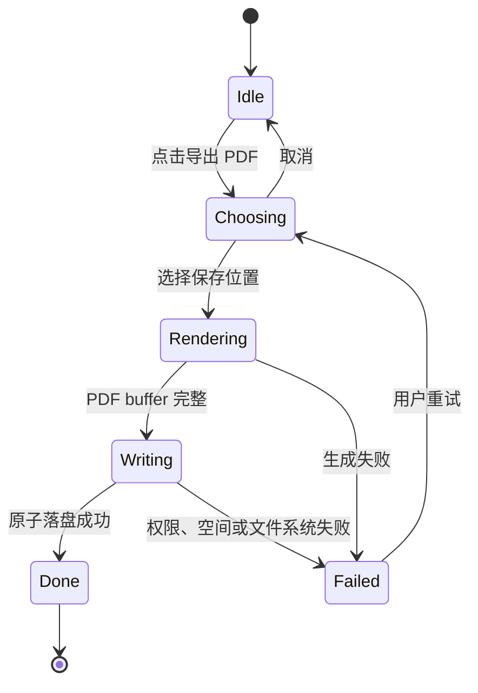

# PDF 报告导出 DEV-0016 v1.0

## 1. 目标与范围

本工作包实现 REQ-0005 的单条已确认报告 PDF 导出。导出入口位于分析记录详情，只接受稳定记录 ID；主进程重新读取本地不可变快照后生成文件，Renderer 不提交报告正文或保存路径以外的导出内容。

V1 包含系统保存窗口、A4 可读版式、素材评分、固定 / 动态标签、问题诊断、优化建议、分析局限和必要时间证据。V1 不包含批量或 JSON 导出、源素材嵌入、导出历史、报告编辑、用户可见对话和可信反馈。

## 2. 组件边界

- `record/pdf-document.ts`：纯函数生成无脚本 HTML；所有记录文本先进行 HTML 转义，文档 CSP 默认拒绝外部资源和活动内容。
- `record/pdf-exporter.ts`：打开原生保存窗口，在无 preload、无 Node、关闭 JavaScript且启用 sandbox 的隐藏页面中调用 Electron `printToPDF`。
- `record/ipc.ts`：验证请求来自受信主窗口，按记录 ID 读回快照，再调用导出器；未知记录、不可用存储和导出失败分别返回可理解错误。
- `preload.ts`：只暴露 `records.exportPdf(recordId)`；成功结果仅返回文件名和字节数，不把绝对路径带回 Renderer。
- `RecordsPage.tsx`：展示导出中、成功、取消和失败状态；失败不修改记录，可再次选择保存位置重试。

## 3. 数据与安全不变量

1. 只有已确认且仍存在的记录可以导出；未确认预览不能经过该 IPC。
2. PDF 不读取或嵌入源素材，不要求源素材仍可用。
3. 导出版式不输出绝对路径、素材指纹、API Key、模型配置、内部提示词、工具日志或内部调用拓扑。
4. 对话和可信反馈是独立对象，V1 默认不进入 PDF；报告评分仍按确认时规则快照输出。
5. HTML 使用 `data:` 页面，无外链、脚本或 Node 能力；窗口禁止新开页面和后续导航。
6. PDF buffer 必须带 `%PDF-` 文件头才允许落盘；先写同目录随机临时文件，再以 rename 完成替换。失败清理临时文件且不报告成功。

## 4. 状态与恢复

选择位置后发生失败时，主进程内存保留本记录最后一次目标作为下一次原生对话框默认值；应用重启后不保留导出历史。删除分析记录不删除用户已经导出的 PDF。

## 5. 兼容与回退

macOS 和 Windows 共享报告模板、IPC 和业务测试，各自使用 Electron / Chromium 的系统字体和打印实现，允许分页与字体细节存在平台差异，内容结构必须一致。回退本工作包时移除导出 IPC、按钮与生成器即可；分析记录 schema 无迁移，已导出副本继续由用户管理。

## 6. 验证

- 模板单测：报告正文、时间证据、HTML 转义、敏感 / 内部字段排除和跨平台文件名。
- 导出器单测：取消零写入、完整 PDF 原子写入、生成失败零目标文件和隐藏窗口销毁。
- IPC 单测：不受信来源拒绝；受信来源必须由主进程按 ID 重新读取记录。
- 桌面验证：lint、typecheck、完整单测和 Electron package。
- 治理验证：docs、static 和治理单测。
