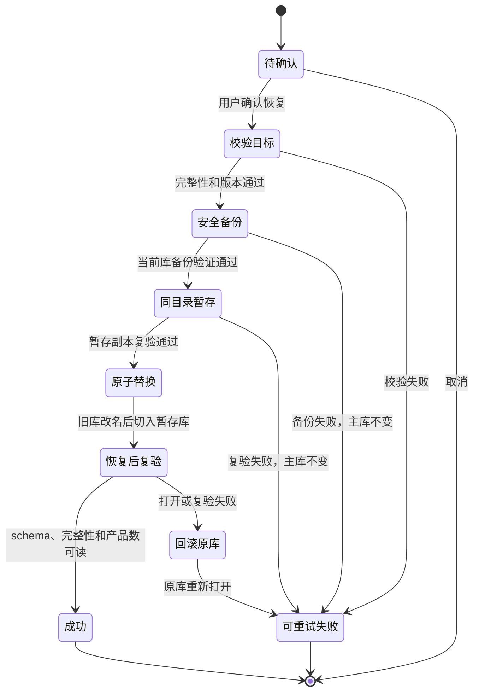

# 产品库持久化治理-DEV-0005-v1.0

## 1. 文档信息

| 项目 | 内容 |
| --- | --- |
| 关联需求 | [产品库-REQ-0003-v1.0](../requirements/产品库-REQ-0003/产品库-REQ-0003-v1.0.md) |
| 关联任务 | `APP-0007` |
| 实现范围 | 产品库本地 SQLite 的状态、分页、备份、恢复和性能基线 |
| 发布单元 | macOS、Windows 共享业务代码；本任务在 macOS 完成本地验证，Windows 仍需真机验收 |

## 2. 目标与非目标

本工作包在 [产品库客户端-DEV-0004-v1.0](产品库客户端-DEV-0004-v1.0.md) 的本地核心上增加不依赖模型的持久化治理：显示数据库完整性、schema、读写状态、产品数和备份数；允许用户创建并验证本地备份；从已验证备份恢复前二次确认并自动保存当前库；恢复失败时回滚；产品列表按页读取；用固定 10,000 条数据记录列表、搜索和写入性能。

本工作包不实现 schema v2 或伪造迁移，不提供任意文件导入导出、云备份、跨设备同步、自动删除备份、备份合并、应用层数据库加密、联网补全、模型、素材解析、报告或分析记录。备份是客户端维护副本，不是用户可携带的产品导出格式。

## 3. 组件和信任边界

| 层 | 能力 | 边界 |
| --- | --- | --- |
| renderer | 展示有限状态、备份元数据、二次确认和恢复结果 | 不接触文件路径、SQLite、SQL、堆栈或 Node API |
| preload | 只暴露状态、分页、备份清单、创建备份和按 ID 恢复 | 不提供路径参数或通用文件系统方法 |
| 主进程 IPC | 校验调用并把失败映射为有限业务错误 | 不把异常对象、绝对路径或产品正文写入 UI 消息 |
| `ProductRepository` | SQLite 事务、在线备份、校验、替换、回滚和启动恢复 | 只处理应用数据目录内精确命名的数据库、备份和恢复临时文件 |

Electron 继续使用 `contextIsolation: true`、`nodeIntegration: false`、`sandbox: true`。renderer 只能提交应用生成的不可预测备份 ID；主进程会从当前扫描到的应用备份清单中重新解析 ID，不能借 ID 读取任意路径。

## 4. 文件与权限

- 主库：Electron `userData/material-products.sqlite3`。
- 备份目录：Electron `userData/backups/products`。
- 应用生成的备份名包含备份类型、毫秒时间和 UUID；只有完全匹配合同的普通文件才进入清单，软链接和用户自命名文件被忽略。
- 应用生成的恢复临时文件只允许同目录、固定前缀和 UUID 后缀；启动恢复和清理也使用同一精确合同，避免误处理其他文件。
- 在支持 POSIX 权限的平台，主库和备份为 `0600`，备份目录为 `0700`。Windows 由平台用户目录 ACL 提供边界，仍需真机验证。
- 普通 SQLite 没有应用层静态加密。本任务不声称 OS 权限可以抵御已获得当前用户权限的本地进程。

## 5. 状态、备份与校验

“数据维护”页读取以下有限状态：`PRAGMA user_version`、`PRAGMA quick_check` 结果、是否可写、当前产品数和应用备份数。当前唯一支持的业务 schema 是 v1；其他版本停止打开，不降级、不重建空库。

创建备份使用 Node SQLite 在线备份接口，不直接复制正在写入的 WAL 状态。备份成功必须同时满足：

1. 文件创建成功；
2. `quick_check` 全部返回 `ok`；
3. `user_version = 1`；
4. 产品表可读取并记录产品数；
5. 元数据可以从备份文件重新读回。

任何一步失败都删除本次未通过校验的精确目标文件，主库零修改。V1 支持“手动备份”和恢复流程产生的“恢复前安全备份”；`pre-migration` 是未来迁移合同中的保留类型，当前没有 schema 变化，因此不会伪造迁移备份。

## 6. 恢复状态机

恢复只接受当前备份清单中的精确 ID。主进程先重新校验目标，再创建并验证当前库的 `pre-restore` 安全备份，然后在主库同目录复制和复验暂存文件。关闭连接后使用同文件系统改名替换；成功打开并复验后才删除旧库临时副本。若替换、打开或复验失败，移除失败的新库并把旧库改回原名，再重新打开。

若进程在旧库已改名、主库尚未形成的窗口中终止，下次启动只从精确 UUID 命名的 `restore-old` 普通文件中选取最新副本恢复；健康主库打开且 `quick_check` 通过后，才清理精确命名的遗留恢复临时文件。用户自命名文件不被恢复或删除。

## 7. UI 行为与恢复提示

- 产品库标题区提供“数据维护”入口，不新增首页。
- 页面区分检查中、健康、完整性失败、只读、空备份清单、备份失败、恢复成功和恢复失败。
- 恢复按钮只对完整性通过、schema 兼容且主库可写的备份启用。
- 二次确认展示目标备份时间和产品数，并说明将替换当前库、恢复前会生成安全备份、失败会回滚。
- 取消确认不改变任何数据；失败保留备份并允许重试；成功后重新读取状态、产品列表和下游产品选择。
- V1 不自动删除任何手动或恢复前备份。自动迁移备份的保留与清理只在实际 schema 迁移任务中按 PRD 单独实现和验证。

## 8. 分页和性能基线

产品仓储列表返回 `items`、`total`、`limit` 和 `offset`。UI 每页读取 50 条，筛选条件变化后回到第一页；删除导致当前页越界时回到最后一个有效页。仓储把单次读取限制在 1 到 10,000 条，普通 UI 不一次渲染完整库。

2026-08-24 在当前 macOS 开发机、Node/Vitest 单进程环境运行固定数据集：服饰 5,000 条、游戏 5,000 条，部分游戏带版本和渠道；先预热搜索，再分别采集列表 10 次、搜索 30 次、写入 30 次，以 nearest-rank 计算 P95。一次受控前的本地复跑结果为：

| 操作 | 样本 | P95 | 当前工程基线 |
| --- | ---: | ---: | ---: |
| 读取 10,000 条仓储结果 | 10 | 235.845 ms | < 1,000 ms |
| 单关键词搜索 | 30 | 0.979 ms | < 1,000 ms |
| 本地新建 | 30 | 0.894 ms | < 1,000 ms |

测试输出保留每个原始耗时样本，避免只记录聚合结论。该结果是可调整工程基线，不是容量承诺，也不代替 Electron renderer 大数据交互、磁盘压力、低配设备或 Windows 真机性能验收。

## 9. 验证覆盖

Vitest 当前覆盖：

- 创建备份后重新读取完整性、schema、产品数和状态；
- 从已验证备份恢复，并确认恢复前安全备份保留替换前数据；
- 损坏备份不能恢复且主库产品保持不变；
- 进程中断遗留旧库时，下次启动恢复并清理应用临时文件；
- 不符合应用命名合同的备份和恢复文件不被接纳或删除；
- 分页总数、边界和跨页稳定 ID；
- 固定 10,000 条数据的列表、搜索和写入 P95。

任务门禁还执行文档与静态治理核对、ESLint、TypeScript、全部桌面测试、Electron 打包和治理单元测试。尚未完成的真实证据包括 Windows 安装包运行、Windows ACL、磁盘满/文件占用/断电故障注入和未来真实 schema 迁移。

## 10. 回退和后续工作

代码回退不得删除主库或备份目录。由于当前 schema 仍为 v1，回退到 APP-0006 不需要数据降级，但旧 UI 不显示备份维护入口；文件仍应原样保留。若恢复操作失败，优先按 [产品库本地存储-TRB-0002-v1.0](../troubleshooting/产品库本地存储-TRB-0002-v1.0.md) 判断状态，不手工删除数据库或恢复临时文件。

下一批不依赖模型的建议工作是分析记录本地 schema、报告确认后原子保存、列表和本地检索；它必须使用独立任务，不与本工作包混入同一提交。
