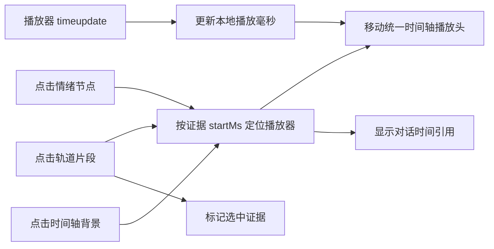

# 分析工作区时间轴与布局 DEV-0019 v1.0

## 1. 文档信息

| 项目 | 内容 |
| --- | --- |
| 关联需求 | [单素材分析 REQ-0005 v1.0](../requirements/单素材分析-REQ-0005/单素材分析-REQ-0005-v1.0.md) |
| 关联任务 | `APP-0026` |
| 实现范围 | 三处分隔线、布局本地记忆、视频时间轴缩放和播放器联动 |
| 发布单元 | macOS、Windows 共享 Renderer 代码；两个发布单元执行相同受控验证，真实窗口缩放与输入设备仍需分别验收 |

## 2. 目标与非目标

本工作包把分析工作区原型中的确定性交互接入客户端：用户可调整主导航栏宽度、播放器与对话区比例，以及视频时间轴高度；视频播放位置与时间轴播放头同步，用户可缩放或滚动统一时间轴，并从镜头、字幕、口播 / 声音或情绪节点定位播放器和形成可见的对话时间引用。

本工作包不修改分析、评分、标签或报告数据，不增加模型调用、脚本、Skill、媒体解析器或第三方依赖；不提供浏览器级缩放、跨设备布局同步、素材持久化、组图、批量分析、素材库、标签库、发布或最终合并。图片工作区只保留图片预览和对话 / 进度，不显示视频时间轴、情绪曲线或视频专属高度分隔线。

## 3. 布局模型

Renderer 只保存三个版本化数字：

| 属性 | 默认值 | 安全范围 | 控制区域 |
| --- | ---: | ---: | --- |
| `sidebarWidth` | 196 px | 168～280 px | 主导航栏与应用内容 |
| `mediaPercent` | 58% | 38%～72% | 播放器 / 图片与对话 / 进度 |
| `timelineHeight` | 292 px | 220～440 px | 视频上半工作区与时间轴 |

布局以 `material.workspace-layout.v1` 保存到当前操作系统用户的 Renderer `localStorage`。它不进入 SQLite、报告、导出、任务记录或模型上下文。读取失败、JSON 损坏、非数字或越界值分别回落或裁剪到安全范围；存储被系统拒绝时仅失去跨重启记忆，当前会话仍可调整。“恢复默认布局”同时恢复三个值，不改动素材、报告或当前播放位置。

每个分隔线均支持指针拖动、可见悬停 / 焦点状态、`separator` 语义、方向和当前值。获得焦点后，左右分隔线使用左右方向键，时间轴分隔线使用上下方向键；所有输入经过同一边界函数，不允许把关键区域压缩到不可用尺寸。

## 4. 视频时间轴结构

时间轴使用深色图表并保持左侧轨道名称可见。刻度、情绪曲线、镜头、画面说明、OCR 字幕、口播 / 声音、标签说明和播放头共享同一内容宽度。缩放级别固定为 `100% / 150% / 200% / 300% / 400%`；放大后内容横向滚动，“适应全片”回到 100% 并滚到起点。缩放只改变显示宽度，不改写毫秒时间、证据区间、报告或播放器资源。

时间尺展示起点、四分之一、二分之一、四分之三和终点。报告未就绪时仍以播放器可读时长渲染刻度；不能取得时长时以最小安全时基防止除零，不伪造分析证据。

## 5. 播放器与证据联动

播放器 `loadedmetadata` 提供兜底总时长，`timeupdate` 驱动播放头。报告媒体时长存在时，它是报告证据比例的首选时基。点击轨道片段会定位到 `startMs`、高亮该证据并把证据文本和时间写入对话引用；点击情绪节点使用该节点的时间、解释和首个证据 ID；点击空白时间轴按统一内容宽度换算位置。用户可移除对话引用，移除不改变播放器或报告。

情绪曲线仅使用报告中同时具备合法时间和强度的数据。没有可靠情绪数据时显示证据不足的虚线占位，不生成可点击节点、精确转折或数值。画面轨 V1 继续声明代表帧只能证明采样位置，不能把确定性取帧误写为画面语义。

## 6. 状态、取消与恢复

- 工作区预览、分析中、成功、失败和取消状态均可播放本地视频和调整布局；分析任务不会阻塞分隔线或时间轴显示操作。
- 报告尚未生成时轨道显示证据不足，不用演示片段填充；报告生成后增量使用真实融合证据。
- 缩放、滚动、选中证据和播放位置只属于当前页面会话；离开工作区后可重建，不写入正式报告。
- localStorage 写入失败不弹出破坏流程的错误；损坏值在下次读取时恢复默认。
- 图片切换或新建图片分析时，不复用视频时间轴 UI；已保存的布局值保留供以后视频工作区使用。

## 7. 无障碍与输入边界

分隔线必须可聚焦并播报标签、方向、最小值、最大值和当前值。缩放按钮在边界禁用并使用明确名称；情绪节点和证据片段均提供包含时间和内容的可访问名称。时间轴背景点击不是唯一定位方式，键盘用户可通过可聚焦的证据按钮定位。播放头为纯展示元素，不进入 Tab 序列。

## 8. 验证与回退

自动化验证覆盖布局解析、损坏值回落、边界裁剪、精确序列化和有限缩放级别；TypeScript 与 ESLint 约束 Renderer 接线；全部桌面测试、Electron 打包、文档 / 静态核对和治理单元测试继续作为任务门禁。真实 macOS 与 Windows 还需分别检查鼠标、触控板、键盘、窗口最小尺寸、系统缩放和重启恢复。

代码回退只移除本任务 UI 与辅助模块。旧版本会忽略 `material.workspace-layout.v1`，无需数据库迁移；必要时可删除该单个 localStorage 键恢复默认，但不得清理整个站点存储或用户数据库。排障见[分析工作区时间轴与布局问题排查 TRB-0016 v1.0](../troubleshooting/分析工作区时间轴与布局-TRB-0016-v1.0.md)。
