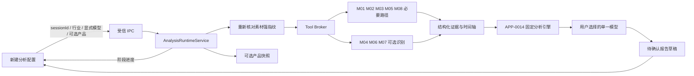
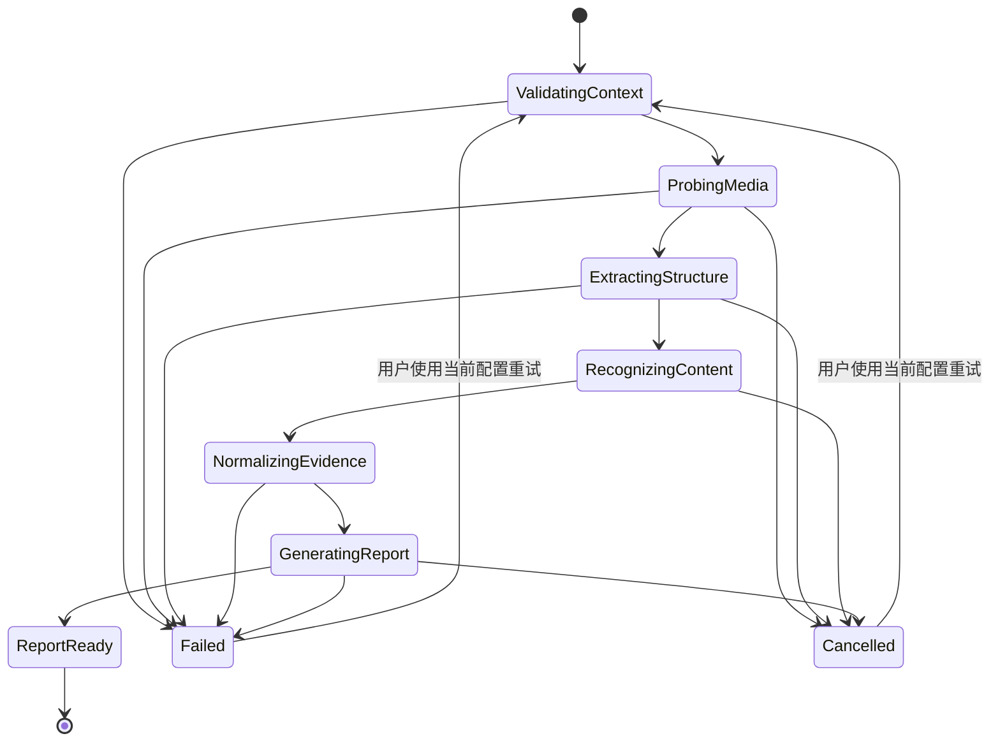

# 分析编排与报告预览-DEV-0013-v1.0

## 1. 文档信息

| 项目 | 内容 |
| --- | --- |
| 关联需求 | [单素材分析-REQ-0005-v1.0](../requirements/单素材分析-REQ-0005/单素材分析-REQ-0005-v1.0.md) |
| 关联任务 | `APP-0015` |
| 前置能力 | APP-0010 工具执行底座、APP-0011 确定性媒体解析、APP-0012 模型接入、APP-0013 行业规则、APP-0014 分析引擎 |
| 当前范围 | 新建分析启动、主进程工具编排、可选产品快照、进度 / 取消 IPC、工作区真实状态和待确认报告预览 |
| 发布单元 | macOS、Windows 共享 Electron / React 代码；本任务只做本地构建验证，不代表双平台真机发布验收 |

## 2. 目标、范围与非范围

本工作包走通“选择本地单素材和上下文 → 使用用户显式选择的模型启动 → 查看工具 / 模型进度 → 查看完整待确认报告”的首条真实分析链路。运行固定本次 `configurationId` 和 `modelId`；产品绑定仍为可选，绑定时在主进程生成不可变产品快照。报告草稿只在当前 Renderer 内存中存在，状态为 `awaiting_confirmation`。

本任务不实现确认保存、分析记录写入、可信程度反馈、权重反馈、指出问题后重新分析、运行中增量对话、组图、PDF、其他 Provider、模型或媒体运行时下载、push、合并、发布。报告上的“确认并保存”明确禁用并标注为下一阶段，不能把预览伪装成正式记录。现有分析记录页继续只读取既有本地记录，不接收本任务草稿。

DeepSeek 当前能力仍为结构化文本证据，`rawMediaUpload=false`。原始图片、视频、临时帧和 WAV 不上传模型端；没有 OCR、ASR、声音事件或未来视觉 Provider 证据时，相应章节必须为空或显示局限。

## 3. 主链路与组件边界

Renderer 不获得素材绝对路径、工具命令、API Key、Prompt 正文或模型原始响应。`preload` 只暴露 `analysis.start`、`analysis.cancel` 和单向 `analysis.onProgress`。主进程只接受当前应用窗口的 IPC sender；关闭应用会取消全部活跃运行，并释放 Broker 调用和临时产物。

## 4. 编排计划和失败分级

编排先核对素材会话与产品，再调用 M01。视频并行执行代表帧、镜头候选和音轨基础提取；图片只执行代表帧。之后并行尝试 OCR，以及有音轨视频的 ASR 和声音事件，最后由 M08 校验素材身份、时间和来源并形成证据。

| 能力 | 当前必要性 | 失败行为 |
| --- | --- | --- |
| 素材会话 / M01 / M02 / M08 | 必要 | 整次失败，保留配置，用户处理后显式重试 |
| 视频 M03 / M05 | 必要 | 整次失败；图片不调用，视频无音轨由 M05 返回明确空结果 |
| M04 / M06 / M07 | 可选 | 继续生成降级报告，失败原因规范化写入 `limitations` |
| 产品快照 | 仅绑定时必要 | 产品已删除、不可用或行业不符则失败；取消绑定后可重试 |
| 模型与输出融合 | 必要 | 失败后不重试、不切模型、不形成报告草稿 |

并行节点使用 `Promise.allSettled` 等待已启动的调用收口，避免某一节点先失败后，其他节点晚到的临时产物越过统一释放阶段。每个 Tool Broker invocation 在终态中显式 `release`；应用启动时只清扫严格隔离且超过 24 小时的旧工作区。

## 5. 证据、代表帧和产品快照

M08 现在始终产生 `metadata.media` 技术证据，并可接收 M02 的代表帧元数据。代表帧证据类型为 `metadata.frame.sample`，只证明取样时间、尺寸和能力来源；它不进入语义时间线，文本明确写明“不包含画面语义”。不同素材身份、图片非零时间或视频越界帧会拒绝归一化。

可选产品由 `ProductRepository.snapshot` 在运行开始时生成；行业必须与本次分析一致。快照随草稿返回且不受之后产品编辑影响，但本任务不持久化它。产品名称、详情和用户补充关注点都作为不可信数据进入有界模型上下文，不能改变系统指令。

## 6. 进度、取消、失败与恢复

进度是有序阶段文本，不是剩余时间或准确百分比。工作区“对话分析”展示本次关注点和当前真实状态，“分析进度”展示实际收到的阶段事件。取消通过同一 `AbortSignal` 传入工具和模型；取消是当前运行终态，不自动重试。失败 / 取消后本地素材、行业、产品和模型选择保持，用户可用当前配置创建新运行。

运行中补充对话尚未实现，输入框保持禁用并说明后续接入，避免把启动前关注点和运行中改写混为一谈。详细恢复见[分析编排与报告预览-TRB-0010-v1.0](../troubleshooting/分析编排与报告预览-TRB-0010-v1.0.md)。

## 7. 工作区和报告预览

工作区保留源素材播放器、播放器 / 对话区水平拖拽、时间轴高度拖拽和键盘方向键调整。运行完成后，时间轴展示 M08 的镜头、OCR、语音 / 声音时间证据；画面轨明确提示代表帧不等于画面语义，报告级标签没有可靠时间定位时不强行放到某个时段。情绪波浪线来自通过严格证据引用校验的模型输出，并持续声明它是素材表达强度，不是用户真实情绪测量。

待确认报告展示：摘要与目标场景、产品快照、模型 / 规则审计、总分和各维度、固定与动态标签、情绪变化、问题诊断、优化建议、脚本 / 镜头 / 画面 / 字幕 / 口播声音 / 商品玩法 / 卖点 / CTA、证据数量和能力局限。证据不足的维度显示空值，不按 0 分；报告标签只属于本次报告，不写标签库。

## 8. 安全、隐私和可观测性

- API Key 继续只由 Electron `safeStorage` 管理，不进入启动参数、进度、报告、日志或导出。
- 原始素材留在用户选择的位置；临时帧和 WAV 只在系统临时目录的隔离工作区内使用，运行结束释放。
- 模型上下文没有绝对路径、原始媒体、临时产物路径、脚本、Skill、Key、内部工具日志或其他配置。
- IPC 错误使用稳定、可理解的分类；不把供应商正文、Python 堆栈或 FFmpeg 原始 stderr 传给 Renderer。
- 一次运行 ID 只允许一个活跃控制器；同一任务不自动重试或切换模型。

## 9. 验证矩阵与限制

自动化覆盖编排的必要 / 可选失败、产品快照、取消、统一释放、M08 代表帧非语义证据、严格分析引擎回归，以及桌面端 lint、typecheck、普通测试和打包。治理验证由 `taskctl run-required APP-0015` 统一记录，不能以单独运行命令替代任务状态。

本任务没有执行真实中文 OCR / ASR / YAMNet 推理、Windows x64 真机交互、macOS 安装后交互、真实长视频或视觉 Provider 分析。FFmpeg / ffprobe 仍须在本地可执行搜索路径中；学习型模型目录通过 `MATERIAL_OCR_MODEL_PATH`、`MATERIAL_ASR_MODEL_PATH`、`MATERIAL_AUDIO_EVENT_MODEL_PATH` 显式提供，不会隐式下载。没有这些能力时预期生成可见降级，不能据此声称完整理解画面、口播或声音。

## 10. 兼容、回退与后续阶段

本任务不新增 SQLite schema，也不修改已保存产品或分析记录；回退可移除 `analysis-runtime`、IPC / Renderer 接线、报告预览、M08 代表帧元数据扩展和打包的 Python sidecar 资源。回退前取消运行，临时产物按 Broker 生命周期清理；无需删除用户 Key、产品库、已有分析记录或素材源文件。

下一阶段应独立实现“用户确认报告 → 报告、素材引用、产品 / 规则 / 模型快照原子保存 → 分析记录可查看”，再单独实现可信程度反馈、指出问题后的重新分析和调权建议。运行时发行、第三方许可证归档、双平台真机与视觉 Provider 也分别验收，不能在本任务中默认视为完成。
