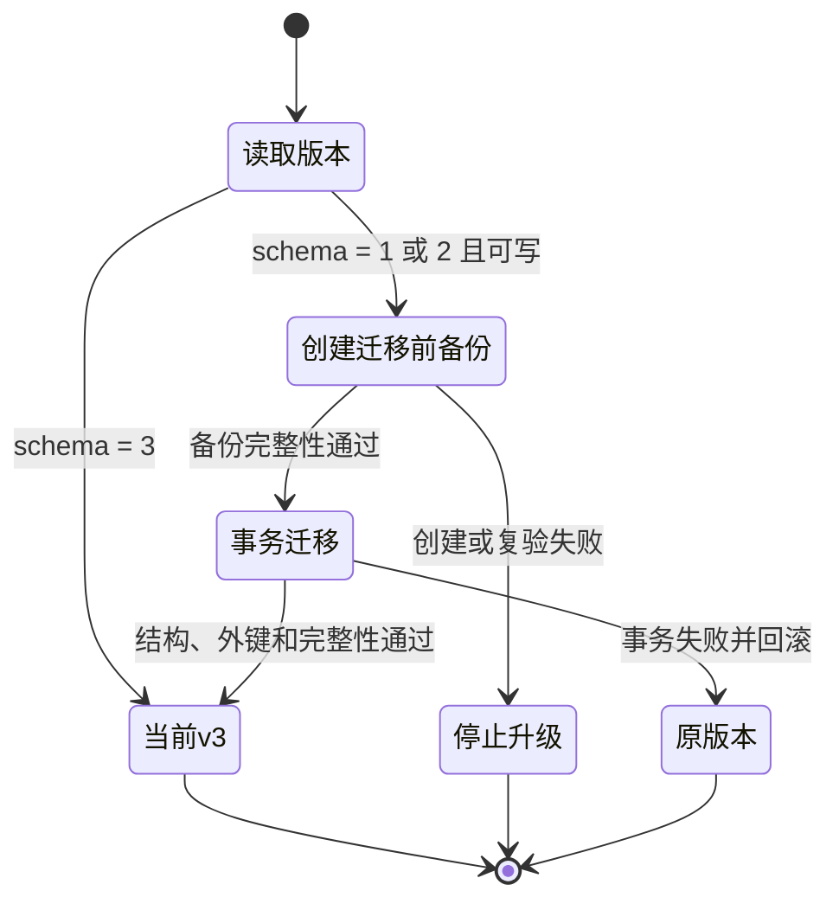
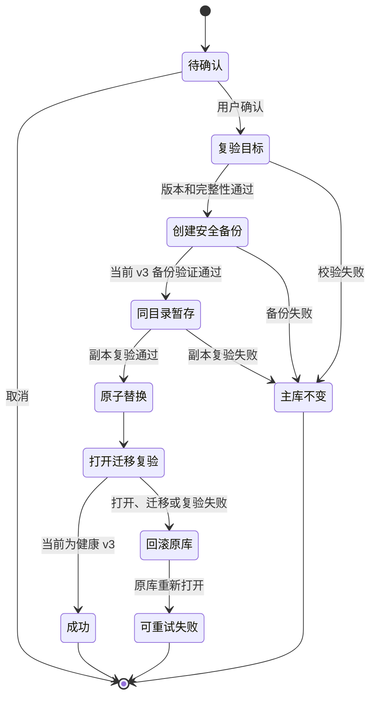

# 分析记录备份恢复 DEV-0018 v1.0

## 1. 文档信息

| 项目 | 内容 |
| --- | --- |
| 关联需求 | [单素材分析 REQ-0005 v1.0](../requirements/单素材分析-REQ-0005/单素材分析-REQ-0005-v1.0.md) |
| 关联任务 | `APP-0025` |
| 实现范围 | 分析记录本地 SQLite 状态、手动备份、迁移前备份、恢复和中断保护 |
| 发布单元 | macOS、Windows 共享业务代码；两个发布单元执行相同受控验证，真实平台故障仍需分别验收 |

## 2. 目标与非目标

本工作包为已确认分析记录补齐不依赖模型的数据保护闭环。用户可从“分析记录”进入“数据维护”，查看 schema、完整性、读写状态、记录数、反馈数、加密素材引用数和应用备份数；可创建并验证手动备份，从兼容备份恢复前二次确认。文件型 v1 或 v2 数据库在升级到当前 v3 前必须先创建并验证迁移前备份，失败则不执行迁移。

备份包含确认报告、产品与规则快照、可见对话、重新分析关系、用户反馈和 `safeStorage` 加密素材引用。它不复制源素材字节、API Key、模型凭据文件、模型安全存储秘密、临时工具产物或用户导出的 PDF。本工作包不提供任意文件导入导出、云备份、跨设备同步、自动删除、备份合并、密码包或批量报告导出。

## 3. 组件与信任边界

| 层 | 能力 | 不得承担 |
| --- | --- | --- |
| Renderer | 展示有限状态和备份元数据；发起创建；按不可预测 ID 请求恢复 | 不接触文件路径、SQL、数据库正文、密文或 Node API |
| Preload | 暴露状态、清单、创建和按 ID 恢复四类窄接口 | 不提供路径参数、文件选择或通用文件系统调用 |
| 主进程 IPC | 拒绝非主窗口来源；把仓储错误映射为有限业务错误 | 不返回堆栈、绝对路径、备份文件名或报告正文 |
| `RecordRepository` | 在线备份、校验、迁移保护、原子替换、回滚和启动恢复 | 只处理主库与精确命名的应用管理文件 |

Electron 继续启用 `contextIsolation`、Renderer sandbox 并关闭 `nodeIntegration`。恢复 ID 必须由当前应用备份清单重新解析；调用方不能借 ID 指定任意文件。

## 4. 文件、权限与数据边界

- 主库：Electron `userData/material-analysis-records.sqlite3`。
- 备份目录：Electron `userData/backups/records`。
- 备份名只接受 `record-{manual|pre-migration|pre-restore}-{13 位毫秒时间}-{UUID}.sqlite3`；非普通文件、软链接和用户自命名文件不进入清单。
- 恢复临时文件位于主库同目录，只接受主库名加 `restore-new` 或 `restore-old` 与 UUID 的精确合同。
- POSIX 平台把主库和备份设为 `0600`、备份目录设为 `0700`；Windows 依赖当前用户目录 ACL，仍需真机验证。
- SQLite 报告正文未增加应用层静态加密。素材路径只以系统账户绑定的 `safeStorage` 密文存在；备份不是可公开分享的数据包。

将备份迁移到不同设备、操作系统账户或安全存储上下文后，即使报告可读，加密素材引用也可能无法解密。客户端必须把该情况降级为“需重新定位”，不能泄露或猜测路径。

## 5. 状态、备份与校验

状态页读取 `PRAGMA user_version`、`PRAGMA quick_check`、写入能力及三个业务计数。备份成功必须同时满足：文件创建成功、完整性为 `ok`、schema 可识别、业务表可读取、计数可重新生成。当前手动备份和恢复前备份必须为 v3；清单可识别 v1、v2、v3，以便恢复旧迁移备份。

手动和恢复前备份使用 Node SQLite 在线备份接口，不复制运行中的 WAL 文件。迁移前备份只发生在应用启动、IPC 尚未注册且没有并发业务写入时；仓储先执行完整 WAL checkpoint，再以排他创建复制主库，并使用独立只读连接复验。备份失败时只移除本次精确创建且未通过校验的文件，原库不迁移、不改写。

V1 不自动删除任何应用备份。清理策略、用户永久删除和空间配额另立需求，不能通过后台静默删除解决磁盘占用。

## 6. 迁移保护

v1 先迁移到 v2，再迁移到 v3；v2 直接迁移到 v3。两个步骤共享同一份迁移前原始备份，旧报告 JSON 不重写。恢复 v1 或 v2 备份时，替换完成后仍执行同一迁移保护，所以会额外产生新的 `pre-migration` 备份。

## 7. 恢复状态机

恢复只接受清单中的兼容备份。主进程先重新检查目标，再生成当前库的 `pre-restore` 安全备份；随后把目标复制到主库同目录并复验，关闭连接后通过同一文件系统改名完成替换。新库成功打开、必要迁移完成、schema 为 v3 且完整性通过后，才移除旧库临时副本。失败时移除失败的新库、把旧库改回并重新打开。

若进程在旧库改名后中断且主库缺失，下次启动只从精确 UUID 命名的 `restore-old` 普通文件中选择最新副本恢复。健康主库已存在并通过完整性检查时，才清理精确命名的遗留临时文件；相似名称的用户文件不恢复、不删除。

## 8. UI 行为

- 分析记录标题区提供“数据维护”入口，不新增首页或素材库。
- 页面区分加载、健康、只读、无备份、备份失败、损坏备份、恢复中、恢复成功和恢复失败。
- 恢复按钮只对完整性通过且主库可写的兼容备份启用。
- 二次确认展示备份时间和记录数，并说明当前库会被替换、恢复前自动留档、源素材和外部 PDF 不删除。
- 取消不改变数据；失败保留错误和备份清单；成功重新读取状态及分析记录列表。
- UI 不公开绝对路径、内部文件名、SQL、密文或记录正文。

## 9. 验证覆盖

自动化覆盖：手动备份完整性与记录、反馈、引用计数；备份不含明文路径和模型凭据；损坏备份拒绝恢复；恢复后替换前数据进入安全备份；启动处理中断的旧库；忽略非应用命名文件；v1 迁移前备份、恢复旧备份后重新迁移；可信 IPC 边界。

任务门禁还执行文档与静态核对、ESLint、TypeScript、全部桌面测试、Electron 打包和治理单元测试。真实 Windows ACL、文件长期占用、磁盘满、断电故障注入和跨系统账户 `safeStorage` 降级仍需平台验收，不能仅凭单元测试宣称已覆盖。

## 10. 回退与运维边界

代码回退不得删除主库或备份目录。旧客户端若不识别 v3，不得直接写入同一数据库；应继续使用当前客户端恢复兼容备份，或升级客户端。排障见[分析记录备份恢复问题排查 TRB-0015 v1.0](../troubleshooting/分析记录备份恢复-TRB-0015-v1.0.md)。不得手工降低 `user_version`、改名伪造应用备份、删除唯一副本或关闭完整性和 IPC 校验。
