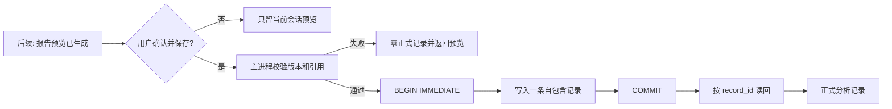

# 分析记录本地核心-DEV-0006-v1.0

## 1. 文档信息

| 项目 | 内容 |
| --- | --- |
| 关联需求 | [单素材分析-REQ-0005-v1.0](../requirements/单素材分析-REQ-0005/单素材分析-REQ-0005-v1.0.md) |
| 关联任务 | `APP-0008` |
| 实现范围 | 分析记录 SQLite、只读 IPC、列表、详情、反馈、删除和来源关系 |
| 发布单元 | macOS、Windows 共享业务代码；本任务在 macOS 本地验证，Windows 仍需真机验收 |

## 2. 产品能力与工程边界

本工作包实现不依赖模型的分析记录本地核心：版本化 SQLite schema、主进程内部“确认并保存”原子合同、不可变报告及上下文快照、本地搜索筛选、分页、详情、可信度反馈、调权方向反馈、单条删除和非级联重新分析来源关系。一级导航中的“分析记录”从禁用占位筛选变为真实本地查询。

当前尚无真实分析运行和报告预览，因此客户端不会生成示例报告，也不向 renderer 暴露任意创建记录方法。空库是真实状态。正式记录只能在后续报告预览工作包中，由主进程确认合同接收已经完成且由用户确认的版本化快照。本工作包不实现模型、Tool、脚本解析、报告生成、未确认预览、素材句柄与重新定位、播放器证据跳转、重新分析运行、PDF 导出、云同步或发布。

## 3. 分层与调用边界

| 层 | 位置 | 职责 |
| --- | --- | --- |
| 数据合同 | `apps/desktop/src/record/types.ts` | 报告、素材、规则、运行、反馈、记录、查询和 IPC 类型 |
| 领域校验 | `apps/desktop/src/record/domain.ts` | 版本、评分、证据引用、反馈和敏感字段边界 |
| SQLite 仓储 | `apps/desktop/src/record/repository.ts` | schema、确认保存、查询、详情、反馈、删除和关系 |
| 主进程 IPC | `apps/desktop/src/record/ipc.ts` | 只读记录、反馈和删除白名单；不暴露确认创建 |
| preload | `apps/desktop/src/preload.ts` | 暴露窄化 `records` API |
| UI | `apps/desktop/src/ui/RecordsPage.tsx` | 列表、筛选、详情、反馈、关系与删除确认 |

renderer 可以读取列表和详情、更新/删除反馈、删除单条记录，但不能直接创建或修改报告正文。确认保存方法只存在主进程仓储边界，后续报告预览不能通过开放的 renderer 输入伪造正式记录。

## 4. SQLite schema v1

数据库位于 Electron `userData/material-analysis-records.sqlite3`，当前 `PRAGMA user_version = 1`：

| 表 | 内容与不变量 |
| --- | --- |
| `analysis_records` | 稳定 ID、列表检索字段、确认时间、来源记录 ID和一个自包含版本化快照 JSON |
| `analysis_record_feedback` | 可信程度 1～5、可用性原因、调权方向和更新时间；随所属记录删除 |

列表列是不可变快照的受控投影，用于分页和筛选；完整 `record_json` 保存确认时的素材引用、可选产品快照、报告、规则版本、模型配置显示摘要、可见对话和转化依据。来源记录 ID 不建立级联外键：删除来源后，后续记录保留自身完整快照和来源 ID，并显示“来源记录已删除”。

首次建立空库不属于既有数据迁移。旧客户端遇到非 v1 schema 时停止打开，不降级、不重建空库。启动执行有限完整性检查；失败时只让分析记录模块不可用，不删除文件，也不阻止产品库继续启动。

## 5. 确认保存与不可变性

`confirmAndSave` 每次生成稳定 UUID 和确认时间，在同一事务中写入完整快照与检索投影。输入必须满足：报告/素材/规则/运行 schema v1、行业一致、总分和维度分在 0～100、证据 ID 唯一、标签和诊断只引用存在证据、来源记录存在、总 JSON 不超过 4 MiB。任一校验或写入失败时事务回滚，正式记录数不变。

已保存报告正文、评分、规则、产品和可见对话没有更新 API。读取时重新校验 v1 快照；发现损坏或不兼容时返回有限错误，不用默认值伪造报告。反馈使用独立表更新或删除，不修改报告分数和规则版本。

## 6. 隐私、安全和内容边界

- 不保存视频、图片或持久缩略图，只保存素材显示名、媒体类型、大小、可选指纹及确认时来源状态。
- 本工作包不保存或向 renderer 返回绝对路径；素材定位令牌将在独立本地素材句柄工作包设计。
- 对快照对象递归拒绝 API Key、密码、私钥、绝对路径、文件路径、内部 Prompt、推理和工具日志等字段名。
- 报告文本只作为 React 文本节点显示，不执行 HTML、脚本、链接或控制指令。
- 数据库在支持 POSIX 权限的平台设为 `0600`；普通 SQLite 不具备应用层静态加密，Windows ACL 和真实安装目录边界仍需真机验证。
- 单条记录安全上限和反馈 2,000 字符上限超出时明确拒绝，不静默截断。

## 7. 列表、筛选和恢复状态

列表默认按确认时间从新到旧，每页 50 条，返回 `items/total/limit/offset`。本地关键词覆盖素材显示名和产品快照名称；可组合筛选行业、媒体类型、源素材状态、反馈状态和本地确认日期范围，也可切换从旧到新。`LIKE` 通配符按普通字符处理，不联网、不扫描源素材目录。

UI 明确区分：

- 记录库为空：说明只有确认保存成功的报告才进入，并引导新建分析；
- 当前条件无结果：保留筛选并提供清空条件；
- 查询失败：保留已有结果和所有条件，显示重试；
- 详情加载：不把等待误报为无记录；
- 源素材不可用：报告和反馈可用，播放、证据定位与重新定位准确标为后续接入；
- 删除取消/失败：记录零变化；成功后只移除本地记录和反馈，不触碰源素材或其他记录。

从详情返回列表时恢复关键词、筛选、排序、页码和滚动位置。当前不提供批量选择、批量删除或批量导出。

## 8. 详情与反馈

详情页从已保存快照显示：总分和维度、报告摘要、标签、诊断建议、脚本/镜头/画面/字幕/口播声音/卖点玩法/情绪/CTA、时间证据、分析局限、规则版本、产品摘要、模型配置显示名和来源关系。打开详情不调用模型或重新计算旧报告。

反馈包含可信程度 1～5、可选原因和可选调权方向；用户可新增、修改或删除。反馈状态同步到列表，但不会自动改变模板、评分权重、素材总分或其他用户数据。重新分析和 PDF 按钮明确显示“后续接入”，不制造虚假成功。

## 9. 10,000 条性能证据

2026-08-24 在当前 macOS 开发机、Node/Vitest 单进程环境建立 10,000 条固定记录，覆盖两行业、视频/图片、可用/需定位状态和不同分数；预热后分别采集分页列表、关键词搜索和完整详情读取各 30 次，以 nearest-rank 计算 P95：

| 操作 | 样本 | P95 | 工程基线 |
| --- | ---: | ---: | ---: |
| 50 条分页列表 | 30 | 1.173 ms | < 1,000 ms |
| 10,000 条内关键词搜索 | 30 | 4.637 ms | < 1,000 ms |
| 自包含详情读取与校验 | 30 | 0.077 ms | < 1,000 ms |

测试输出保留原始耗时数组。结果是当前硬件上的可调整工程基线，不是业务容量上限，也不代替 Electron renderer 渲染、低配磁盘或 Windows 真机验收。

## 10. 验证、回退与后续

自动化覆盖确认写入与读回、失败零记录、不可变快照、组合查询、通配符、当地日期边界、反馈分离、来源删除不级联、敏感字段拒绝和 10,000 条性能。任务门禁还需执行文档/静态治理、ESLint、TypeScript、全部 Vitest、Electron 打包和治理单元测试。

回退代码不得删除 `material-analysis-records.sqlite3`。当前没有 schema v2，回退到 APP-0007 时旧客户端不会展示记录，但文件应原样保留。数据库损坏、只读或版本不兼容时按 [分析记录本地存储-TRB-0003-v1.0](../troubleshooting/分析记录本地存储-TRB-0003-v1.0.md) 处理。

后续独立工作包按依赖顺序建议为：本地素材句柄、指纹和重新定位；固定行业报告模板与确认预览；把用户确认事件接入主进程保存合同；真实播放器证据跳转；重新分析草稿；PDF 导出；分析记录备份、迁移和跨平台故障注入。
