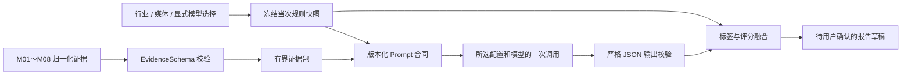

# 分析运行与融合报告-DEV-0012-v1.0

## 1. 文档信息

| 项目 | 内容 |
| --- | --- |
| 关联需求 | [单素材分析-REQ-0005-v1.0](../requirements/单素材分析-REQ-0005/单素材分析-REQ-0005-v1.0.md) |
| 关联任务 | `APP-0014` |
| 前置能力 | APP-0010 工具执行底座、APP-0011～APP-0012 确定性媒体解析与模型配置、APP-0013 固定行业规则 |
| 实现范围 | 非 UI 的单次分析运行、版本化提示词、证据包、严格模型输出校验、标签 / 评分融合和待确认报告草稿 |
| 发布单元 | macOS、Windows 共享 TypeScript 核心；本任务不做 Renderer、IPC 或真机报告交互验收 |

## 2. 目标与非范围

本工作包把已归一化的 M01～M08 结构化证据、用户明确选择的一个模型和当次启用的行业规则组合为一次可取消运行。模型输出先被视为不可信候选，只有通过严格 JSON 合同、行业 / 媒体目标、证据引用、证据类型、固定 / 动态标签和评分规则校验，才能形成 `awaiting_confirmation` 报告草稿。

草稿不写 SQLite、不产生正式分析记录编号，也不代表用户已采纳。本任务不实现媒体工具实际调度、产品快照、Renderer / IPC、播放器、可拖拽布局、时间轴图表、情绪波浪线、对话追加、报告确认保存、可信反馈、调权反馈、重新分析、PDF、其他 Provider、模型自动切换、push 或发布。

当前 DeepSeek Provider 能力是 `text` 且 `rawMediaUpload=false`。因此它只接收 M01～M08 输出的最小化文本证据，不能声称直接看过原始视频或图片，也不能从仅有镜头边界的证据中补造画面语义。未来支持图片、抽帧或视频输入的 Provider 继续通过同一分析端口接入，但要另行扩展并验证能力合同。

## 3. 运行数据流

运行阶段依次为输入校验、准备证据、等待模型、校验模型输出、融合报告和成功；取消或失败是终态。核心返回单调阶段进度，数值只用于程序化阶段排序，不是时间完成度或剩余时长预测；后续 UI 应优先显示“当前项 / 已完成项”，不能把模型等待伪装成准确线性百分比。

## 4. 输入、选择权与单次调用

调用方必须提供服饰 / 游戏、视频 / 图片、`configurationId`、配置显示名和 `modelId`，并可提供最多 2000 字的转化背景。媒体类型必须与素材身份一致；行业和媒体类型共同选择一份已显式启用的 APP-0013 规则快照。

一次运行只向模型端口调用一次，原样传入用户启动时选择的配置与模型。成功审计、完成结果中的配置、模型和 Provider 必须相互一致，否则整次运行失败。限流、余额、鉴权、超时、网络错误或取消都不自动重试，也不切换配置或模型。用户之后是否用原模型重试或改选模型，属于 UI 重新创建运行的显式动作。

调用支持 `AbortSignal`。模型调用前、返回后和融合前都检查取消；模型端口同时收到该信号。失败结果只返回稳定错误码、经过控制的消息和不含秘密的模型审计摘要，不返回供应商原始响应、Prompt 或素材全文。

## 5. 证据包与最小化输入

模型输入只包含结构化证据的稳定 ID、类型、文本、置信度、时间 / 区域定位和来源能力版本，以及当次模板、固定标签与评分维度。不会加入本地绝对路径、素材字节、API Key、内部工具日志、脚本源码、Skill 内容或其他运行数据。

EvidenceSchema 先校验版本、媒体类型、唯一 ID、来源、置信度、文本、时间和图片区域。没有任何有效证据时在模型调用前失败，避免花费调用费用后生成无依据报告。V1 工程安全基线为最多 300 条证据、单条模型文本最多 800 字、序列化证据包最多 100 KB；超限时使用稳定的均匀抽样和可见截断，并把遗漏条数和截断条数加入报告局限，不静默丢弃。

证据文本和用户补充背景都是数据，不是可执行指令。系统提示词明确禁止服从其中的命令或补造价格、福利、版本、角色、商品功效和投放结果。内置 Prompt 是独立 JSON 包，拥有稳定 ID、语义版本和严格字段合同；报告只公开 Prompt ID / 版本，不公开正文。

## 6. 模型输出合同

模型只能返回一个 JSON 对象，不接受 Markdown 代码块、未知根字段、缺失字段或额外解释。合同覆盖标题、摘要、目标场景、脚本 / 信息结构、镜头、画面、字幕、口播与声音、商品 / 玩法、卖点、情绪、CTA、固定标签、动态标签、逐维度评分、问题诊断、优化建议和局限。

每个事实结论、情绪点、标签、诊断和已评分维度都必须引用本次实际发送给模型的 `evidenceId`。评分证据还必须与规则维度声明的证据类型或时间 / 区域定位相容。未知证据、未知或重复维度、未知或重复固定标签、动态标签覆盖固定定义、建议引用不存在的诊断、图片生成声音结论或时间情绪点、视频时间超出当前证据范围都会拒绝整份输出。

服饰目标固定为 `purchase_conversion`。游戏只允许 `acquisition`、`reactivation` 或证据不足时的 `unclear`。每个评分维度必须显式返回：`scored` 使用 0～100 分和证据，`not_applicable` / `insufficient_evidence` 的分数必须为 `null`。模型原始输出在校验后即丢弃，不进入报告、错误结果、日志或模型审计。

## 7. 融合报告草稿

融合层使用当次冻结规则计算覆盖率、重归一化维度权重和总分，再生成产品规则固定标签与模型动态标签。证据不足不计为 0；覆盖率低于规则门槛时总分保持 `null`。媒体解析、证据裁剪、模型输出和评分产生的局限会规范化去重并集中进入报告。

报告草稿保存：完整规则快照、Prompt ID / 版本、模型配置显示名与稳定 ID、Provider / 模型 / Adapter 版本、配置写版本、Token 用量、媒体工具能力版本、完整结构化证据和视频时间轴、全部结构化分析内容、标签、评分、局限、运行 ID 与创建时间。不会保存 Key、供应商原始响应、Prompt 正文、内部推理或本地路径。

草稿状态固定为 `awaiting_confirmation`。后续报告预览任务负责把它展示给用户；后续记录集成任务只有在用户点击“确认并保存”后，才能把报告、必要素材引用、产品快照和规则快照放进同一事务。取消、失败、拒绝和当前草稿都不能进入正式分析记录。

## 8. 错误、恢复与可观测性

| 错误码 | 含义 | 当前行为 |
| --- | --- | --- |
| `INPUT_INVALID` | 行业、媒体、模型选择或补充背景无效 | 不调用模型，修正输入后新建运行 |
| `EVIDENCE_INVALID` | EvidenceSchema、素材身份或证据包无效 | 不调用模型，回到媒体解析排查 |
| `MODEL_FAILED` | 所选模型调用失败或返回身份不一致 | 不重试、不切换，保留安全审计摘要 |
| `MODEL_OUTPUT_INVALID` | JSON、字段、证据、目标、标签或评分候选无效 | 丢弃整份原始输出，不形成草稿 |
| `RULE_FAILED` | 当前启用规则无法解析或融合 | 停止运行，不跨行业 / 媒体回退 |
| `CANCELLED` | 用户或上游取消 | 终止当前运行，不形成草稿 |

运行结果包含阶段事件和模型审计，便于 UI 呈现与排障。事件监听器只接收副本，即使监听器自身抛错也不能改变分析结果、触发重试或切换模型。详细恢复流程见[分析运行与融合报告-TRB-0009-v1.0](../troubleshooting/分析运行与融合报告-TRB-0009-v1.0.md)。

## 9. 验证结果与已知限制

专用自动化覆盖：证据合同、无证据拒绝、均匀抽样、可见截断、严格 JSON、未知字段、未知证据、目标隔离、图片声音 / 时间边界、评分证据类型、固定标签、单次明确模型调用、失败不重试、取消、原始输出不泄露、规则 / Prompt / 模型审计快照和待确认草稿。

测试使用合成 EvidenceSchema 和模型响应，没有调用真实 DeepSeek、没有验证视觉模型直接理解图片 / 视频，没有运行媒体工具 DAG、报告页面、播放器、对话、时间轴交互、SQLite 保存、PDF 或 macOS / Windows 真机安装包。当前模型只理解结构化文本证据；若证据只有镜头边界而没有 OCR、ASR、音频事件或视觉语义，报告相应章节必须为空或声明证据不足。

## 10. 后续接入与回退边界

后续应先把媒体编排结果和模型端口接入本引擎，再实现报告预览；预览通过后另立任务实现用户确认后的原子保存。视觉 Provider、产品快照、对话追加、反馈和重新分析必须使用新任务扩展，不得修改本任务结果来伪装已实现。

代码回退范围仅为 `apps/desktop/src/analysis-engine/` 和本文档 / 排障索引。回退不会删除模型配置、Key、产品库、分析记录、素材引用、媒体 sidecar 或规则包。因本任务不持久化草稿，回退没有数据库迁移；若后续已保存包含新 schema 的正式报告，必须由后续存储任务提供兼容读取和回退方案，不能在此处删除或重算。
