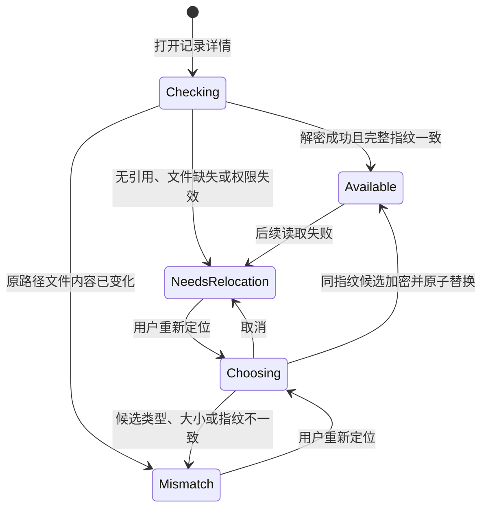

# 历史记录源素材恢复 DEV-0017 v1.0

## 1. 目标与范围

本工作包实现 REQ-0005 中已确认记录与用户本地源素材的安全恢复闭环。确认报告时，主进程校验当前素材会话与报告强指纹一致，把绝对路径经 Electron `safeStorage` 加密后，与分析记录在同一 SQLite 事务中关联。源素材字节不复制、不上传，明文路径不进入 SQLite、Renderer、报告、日志、PDF 或任务记录。

打开记录详情时，应用按需解密引用、重新读取文件并计算完整 SHA-256。匹配后创建新的短生命周期素材会话，恢复视频播放器或图片预览；带时间的报告证据可定位视频播放头。移动、删除、权限失效或指纹不符时，报告、反馈和 PDF 保持可用，播放、证据定位与重新分析明确暂停。

本任务不实现目录扫描、素材库、批量恢复、源文件复制、云同步、macOS App Store 安全作用域书签或发布。当前非 App Store 沙箱构建使用系统账户绑定的 `safeStorage` 密文；未来进入 App Store 沙箱时另立书签兼容任务。

## 2. 数据模型与原子边界

分析记录 schema 从 v2 迁移到 v3，新增 `analysis_record_sources`：

| 字段 | 规则 |
| --- | --- |
| `record_id` | 分析记录稳定 ID，主键并外键级联删除 |
| `schema_version` | 当前固定为 1 |
| `encrypted_path` | `safeStorage` 密文的 Base64，不是路径编码或可回读摘要 |

报告 `record_json` 继续保存确认时的素材显示名、媒体类型、大小、完整指纹和分析元数据，不保存访问路径。`analysis_records.source_status` 是可变化的本地访问状态投影；读取详情时用它覆盖快照中的旧状态，但不改写报告正文。

确认流程先在主进程从受控会话取得路径并完成加密，再由一个 SQLite 事务写入报告、列表投影和密文引用。系统安全存储暂不可用时不得退化为明文；报告仍可保存，状态保持“需重新定位”。删除记录时外键在同一事务中移除密文引用，不触碰用户源文件。

## 3. 主进程组件边界

- `record/source-access.ts`：封装 `safeStorage`、强指纹匹配、加密引用打开和同文件重新定位；不向 Renderer 返回路径或密文。
- `media/session.ts`：继续负责真实文件读取、完整 SHA-256、短生命周期会话和 `material-local` 协议源。
- `record/repository.ts`：管理 v3 迁移、密文引用事务、动态素材状态和级联删除。
- `record/ipc.ts`：只接受受信主窗口；确认时接收不持久化的会话 ID，详情打开时按记录 ID读回引用，重新定位只通过系统文件选择器。
- `RecordsPage.tsx`：呈现校验、可用、需重新定位和不匹配状态；可播放源素材、定位时间证据和复用已验证会话创建重新分析草稿。

Renderer 只能获得显示文件名、素材摘要、状态、随机会话 ID 与受控预览 URL。会话在详情离开时释放；转入重新分析时显式移交会话所有权，避免悬空或提前释放。

## 4. 状态与恢复

不匹配候选只返回文件名、媒体类型和大小摘要，不保存新密文、不覆盖旧引用。旧记录没有 v3 引用时不扫描磁盘；用户首次选择同指纹文件后才补齐密文引用。打开或恢复失败不影响报告查看、反馈、PDF 和删除。

## 5. 兼容、迁移与回退

新数据库直接创建 v3；v1 数据库先沿用既有 v1→v2 迁移，再在独立事务中创建引用表升级到 v3；v2 直接升级到 v3。旧报告 JSON 不重写，旧记录默认没有引用并保持需重新定位。只读旧库仍可查看报告，但没有引用表时返回无持久句柄。

迁移失败回滚建表事务并停止以新版写入。代码回退到仅支持 v2 的旧客户端前，应使用应用数据备份恢复 v2 数据库；不得手工删除表或降低 `user_version`。删除本功能代码不会删除源文件，但 v3 数据库不能由旧代码直接写入。

## 6. 验证

- 仓库测试：v1→v3 迁移、密文引用事务、动态状态、删除级联和畸形引用零写入。
- 访问服务测试：密文恢复、路径移动、同指纹接受、不同指纹拒绝和短生命周期会话。
- IPC 测试：不受信来源拒绝、确认前主进程加密、详情主进程读回、成功重新定位才替换引用。
- 桌面验证：lint、typecheck、完整单测、Electron package，以及 macOS / Windows 两个受控发布单元。
