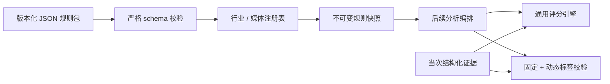

# 固定行业模板与评分规则-DEV-0011-v1.0

## 1. 文档信息

| 项目 | 内容 |
| --- | --- |
| 关联需求 | [单素材分析-REQ-0005-v1.0](../requirements/单素材分析-REQ-0005/单素材分析-REQ-0005-v1.0.md) |
| 关联任务 | `APP-0013` |
| 实现范围 | 服饰 / 游戏 × 视频 / 图片四套固定规则包、注册表、评分引擎、标签校验和规则快照 |
| 发布单元 | macOS、Windows 复用同一份 JSON 规则和 TypeScript 引擎；真实报告集成与双平台人工验收属于后续任务 |

## 2. 目标与非范围

本工作包把行业模板、固定标签和评分体系从页面、模型供应商和具体工具中分离出来。产品维护的四套 V1 JSON 规则包经过严格运行时校验后注册；调用方必须同时给出行业和媒体类型，才能得到当前明确启用的版本。标签和评分都只接受当次证据引用，规则快照可以随之后确认的报告保存，使后续调权不追溯旧结果。

当前不实现 Prompt、分析 DAG、模型或工具调度、时间轴 / 情绪曲线生成、融合报告、对话分析、报告预览 / 确认保存、分析记录接线、页面权重滑杆、规则编辑后台、标签库、远程规则下发、自动选择最高版本、历史报告重算或发布。规则包表达产品规则，不包含模型消息、内部推理、API Key、脚本源码或用户素材。

## 3. 规则架构

每个规则包固定包含 `schemaVersion`、规则包 ID / 版本、模板、标签定义和评分定义。代码只认识稳定合同，不用 `if (DeepSeek)`、页面常量或工具名称表达行业内容。JSON 不允许未知字段；ID、版本、文本长度、集合数量、行业目标、报告章节、权重总和和证据种类都在注册前校验。

当前 schema 为 v1。遇到未知 schema、字段缺失、额外字段、非法版本、重复 ID / 标签、权重总和不为 1、图片声明视频章节、视频缺少时间轴或声画章节时，整个规则包拒绝注册，不使用部分内容继续运行。

## 4. 四类 V1 模板

| 行业 / 媒体 | 固定目标 | 报告侧重点 | 视频专有内容 |
| --- | --- | --- | --- |
| 服饰视频 | 下单 / 转化 | 脚本、镜头、商品呈现、面料 / 版型 / 场景卖点、情绪与 CTA | 字幕口播与声音、时间轴 |
| 服饰图片 | 下单 / 转化 | 视觉层级、商品呈现、卖点可信、人群场景与 CTA | 无播放器时间轴或声音章节 |
| 游戏视频 | 拉新或拉活，由后续分析结合素材场景判断 | 玩法、角色、版本 / 渠道准确性、情绪与目标 CTA | 字幕口播与声音、时间轴 |
| 游戏图片 | 拉新或拉活，由后续分析结合素材场景判断 | 角色 / 玩法清晰度、福利与版本、视觉层级、情绪与目标 CTA | 无播放器时间轴或声音章节 |

四类模板共享稳定章节 ID 和证据合同，但固定标签、评分维度和权重分别维护。服饰规则不能变成游戏目标，图片规则不能产生伪时间轴；注册表使用 `industry + mediaKind` 精确选择，未注册或未启用时明确失败。

## 5. 标签合同

固定标签由每个规则包维护，覆盖稳定行业语义，例如服饰的商品展示、版型、面料、人群、穿搭场景与行动引导，以及游戏的玩法、角色、福利、版本、渠道、拉新 / 拉活与行动引导。固定标签输出携带稳定 ID、facet、显示名和 `product_rule` 来源。

动态标签用于补充单条素材特有内容，最多 24 个。输入必须包含 facet、来源、标签文本和当次已知证据 ID；来源只允许 `tool / model / fusion`。文本执行 NFKC、首尾空白和连续空白规范化。动态标签不得重复、不得冒充固定标签 ID 或显示名，也不能引用其他运行或不存在的证据。校验结果只属于当次报告草稿，本工作包不保存标签、不建立标签库。

## 6. 评分合同与初始基线

每个维度的输入状态必须显式为：

- `scored`：提供 0～100 分和至少一条证据；
- `not_applicable`：该维度不适用于当前素材，不携带分数；
- `insufficient_evidence`：规则适用但当前证据不足，不携带分数。

不得省略维度、增加未知维度、复用维度或把证据不足直接写成 0 分。评分先从分母移除 `not_applicable`，再计算已评分权重占仍适用权重的覆盖率。覆盖率达到规则门槛后，只对已评分维度重新归一化并计算一位小数总分；低于门槛则总分为 `null`，保留各维度状态、覆盖率和局限说明。V1 四套规则的初始门槛均为 60%。

初始权重如下，它们是可版本化的产品验证基线，不是页面中可由最终用户直接修改的参数：

| 模板 | 维度与权重 |
| --- | --- |
| 服饰视频 | 视觉开场 15%、信息清晰度 13%、商品呈现 18%、卖点可信度 17%、情绪与动机 12%、转化引导 15%、声画协同 10% |
| 服饰图片 | 视觉吸引力 18%、视觉层级 15%、商品呈现 20%、卖点可信度 18%、人群场景匹配 12%、文字清晰度 8%、转化引导 9% |
| 游戏视频 | 开场吸引力 14%、玩法清晰度 18%、角色内容呈现 13%、版本渠道准确性 10%、卖点可信度 14%、情绪与动机 12%、目标引导匹配 12%、声画协同 7% |
| 游戏图片 | 视觉吸引力 18%、视觉层级 12%、玩法角色清晰度 20%、利益版本准确性 15%、卖点可信度 15%、情绪与动机 10%、目标引导匹配 10% |

素材评分与用户对报告可信程度的反馈是不同合同；本引擎只计算前者，不读取或修改可信反馈。

## 7. 版本、启用与快照

规则包、模板、标签和评分分别拥有语义版本。注册新版本不会自动改变当前选择，产品发布流程必须显式调用启用操作；这样不能因为文件排序或“版本号最大”静默改变结果。同一个模板 ID 和版本只能由一个规则包注册。

注册表始终保存防御性副本，对外解析和快照也返回重新校验后的深拷贝，调用方修改对象不会污染注册表。规则快照保存完整规则包，而不是只存一个可能失效的版本引用。后续报告确认任务负责将当次快照和报告原子保存；新版本只进入之后开始的新分析，旧快照不升级、不重算。

发布规则内容时至少执行：新版本注册校验、四类选择隔离、固定样例评分、标签冲突、旧快照不变和显式启用测试。若内容校准不正确，停用新版本并重新启用最后一个已验证版本；不修改已经确认的报告。

## 8. 错误、恢复与可观测性

规则错误分为规则包无效、重复注册、规则不存在、评分输入无效和标签输入无效。错误信息只说明字段路径或业务原因，不拼接整份规则、素材证据正文、Prompt 或供应商响应。页面接入后应把“规则暂不可用”与“素材证据不足”分开显示，前者阻止分析，后者允许形成带局限的结果。

排障顺序和安全恢复参照 [规则包加载与评分-TRB-0008-v1.0](../troubleshooting/规则包加载与评分-TRB-0008-v1.0.md)。规则加载失败不得回退到其他行业、媒体类型或未显式启用的版本；评分失败不得伪造 0 分或沿用上一条素材结果。

## 9. 验证结果与限制

自动化覆盖四类内置包注册、行业 / 媒体 / 目标隔离、视频专有章节、防御性副本、旧快照不变、显式版本启用、未知字段、跨行业目标、非法权重、重复模板版本、完整评分、重归一化、覆盖不足、未知 / 缺失维度、固定与动态标签分组、固定标签冒充、重复标签和未知证据。

当前验证使用合成规则与证据 ID，没有声称评分权重已由真实投放效果校准，也没有执行真实素材、真实报告页面、macOS / Windows 安装包人工交互或历史数据库回读。后续分析编排必须继续校验工具与模型输出，不能因其引用了规则 ID 就视为可信。

## 10. 后续接入与回退边界

后续分析任务从注册表获取一次规则快照，将模板章节、固定标签定义和评分维度组装进受控分析合同；融合结果必须通过业务 schema、证据、标签和评分校验后才能进入报告预览。用户指出问题重新分析时创建新的运行并重新获取当时启用规则，不覆盖原草稿或已确认记录。

代码回退范围仅为 `apps/desktop/src/analysis-rules/` 和本文档。回退不删除产品库、分析记录、模型配置、素材引用或媒体 sidecar。若已经有后续报告保存了新规则快照，回退应用仍应保留数据；无法读取新 schema 时停止写入并提示升级，不能静默丢弃或重算。
