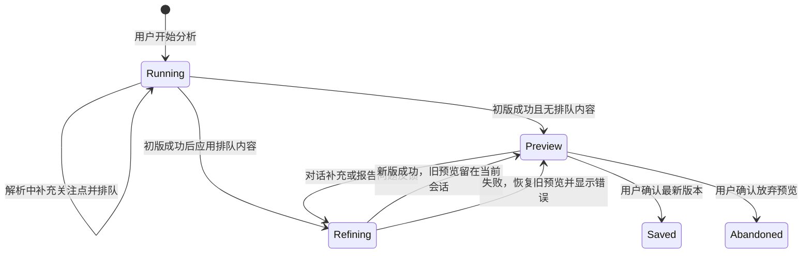

# 对话分析与重新分析-DEV-0015-v1.0

## 1. 目标与依据

本文记录 `APP-0021` 对[单素材分析-REQ-0005-v1.0](../requirements/单素材分析-REQ-0005/单素材分析-REQ-0005-v1.0.md)中“对话分析、报告问题反馈与重新分析”链路的实现。它依赖既有的媒体解析、模型运行、待确认报告和分析记录能力。

产品需求是：用户能补充当前素材的分析关注点、指出待确认报告的问题、生成新预览，并在历史记录中创建独立的重新分析结果。技术方案是：当前进程内缓存归一化媒体证据，通过受控 IPC 再次调用原模型。具体工作包括运行时合同、Renderer 状态、记录快照、界面和测试；三者不互相替代。

## 2. 范围

- 分析工作区展示用户可见对话，并允许引用一个时间轴证据片段。
- 初次解析运行中提交的关注点进入当前运行队列；初版报告成功后再明确发起一次模型调用。
- 已生成报告可填写问题并重新分析；默认沿用原模型、原产品快照和同一份归一化媒体证据。
- 当前页面会话保留各版未确认预览供前后切换；只有最新版本允许确认。
- 确认保存当前版本时，同时保存用户可见对话和可选来源记录关系。
- 从记录详情发起重新分析时，由用户选择本地原文件并校验 SHA-256；一致后创建预填草稿，不自动运行。

本任务不实现 PDF、未确认草稿持久化、跨应用重启恢复旧预览、自动调权、自动模型切换、批量分析、素材库、标签库、部署或发布。

## 3. 运行时合同

`AnalysisRuntimeApi.refine` 接收新运行标识、来源运行标识、用户关注点和可选时间引用。主进程只接受长度和格式满足约束的输入，并只从最多八条当前进程成功运行上下文中查找来源。

成功初次运行后，服务保存以下内存副本：起始配置、素材指纹、归一化媒体证据、媒体摘要和产品快照。重新分析前再次检查素材会话可用且指纹不变，然后把关注点合并进受控 `conversionContext`，复用证据调用分析引擎。媒体 Tool 不会重复运行，模型仍使用来源运行的配置。成功结果成为新的可继续细化的来源；失败不删除上一条成功上下文。

这些上下文不写 SQLite、不含 API Key，也不跨重启恢复。模型配置本身仍由模型管理和系统安全存储维护。

## 4. Renderer 状态与交互

活动运行同时维护当前报告、当前会话历史预览、可见对话、排队关注点和可选来源记录标识。

重新分析运行中保留旧报告可读，但冻结版本切换、确认和离开报告页；用户可在工作区取消当前调用。取消或失败后恢复最近一次成功报告，并把失败说明追加为用户可见消息。

时间轴片段是按钮而不是静态块。选择后，对话输入显示时间引用；提交时引用进入本次模型上下文和用户可见对话。图片不生成伪时间引用。

## 5. 报告与记录边界

当前会话中的旧预览只用于比较，不写入正式记录。确认动作始终读取最新成功报告，并通过既有幂等原子确认合同写入一条记录。正式记录保存：

- 当前确认报告、规则、产品、模型和素材摘要快照；
- 用户可见对话，不保存内部提示词、推理或工具日志；
- `sourceRecordId`，仅在从历史记录草稿确认新报告时存在。

记录详情显示确认时的可见对话和重新分析关系。来源记录删除不级联删除后续记录；后续记录仍保持自包含可读。

## 6. 历史记录重新分析

记录详情不持久化源文件路径。用户点击重新分析后通过系统文件选择器重新选择文件；媒体服务计算当前文件指纹，只有与记录指纹一致才进入新建分析页。选择取消、不匹配或读取失败时，原记录、当前草稿和正式记录数量均不变化。

预填规则如下：行业与转化依据取来源记录；原模型按“配置显示名 + 模型标识”匹配；原产品按稳定产品标识和行业匹配。模型或产品缺失时显示警告并留空，要求用户显式选择；不静默替代。进入草稿后仍需用户点击“开始分析”。

## 7. 安全与输入约束

- Renderer 只能调用固定的 `start`、`refine`、`cancel` IPC；主进程验证可信发送方。
- 单条关注点、对话消息和转化依据有长度上限；时间引用必须是有限非负数且不超过视频时长。
- 记录保存继续扫描内部提示词、密钥、绝对路径和工具日志等禁止字段。
- 素材仍在用户原位置；报告记录只保存强指纹和可读摘要。
- 不因模型错误、历史偏好或多个可用 Provider 自动切换模型。

## 8. 失败、取消与恢复

- 来源运行上下文已过期：拒绝增量调用，保留旧预览，提示从当前配置重新开始。
- 素材移动、变化或失权：拒绝重新分析，要求重新选择或重新开始。
- 模型调用失败或被取消：恢复最近成功预览；不会生成记录，也不会重复运行媒体 Tool。
- 记录来源不存在：确认保存失败并保留待确认报告；不创建悬空关系。
- 保存失败：待确认报告、可见对话和来源关系仍留在 Renderer，可重试。
- 应用退出：未确认预览和运行时证据缓存按 V1 约束丢弃；已确认记录不受影响。

具体排查见[对话分析与重新分析-TRB-0012-v1.0](../troubleshooting/对话分析与重新分析-TRB-0012-v1.0.md)。

## 9. 验证

- 类型检查覆盖 IPC、Preload、运行时、记录合同和页面属性。
- 单元测试覆盖证据复用、同模型调用、来源上下文缺失、素材指纹匹配、模型 / 产品失效预填、可见对话与来源关系保存。
- 记录仓库测试覆盖关系读回、来源删除后后续记录保留、对话输入边界和敏感字段拒绝。
- 全量桌面端测试、Lint、仓库治理检查和 macOS / Windows 受控验证由任务 `APP-0021` 记录实际结果。

## 10. 回退

代码回退可移除 refine IPC、当前会话版本状态和重新分析入口；已有 SQLite schema 与既有记录不需要降级，因为本任务复用已经存在的可见对话和来源关系字段。回退不得删除已确认记录或用户模型配置。
