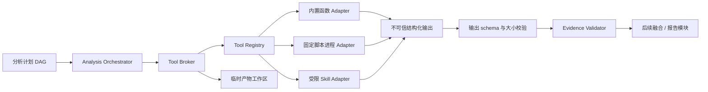
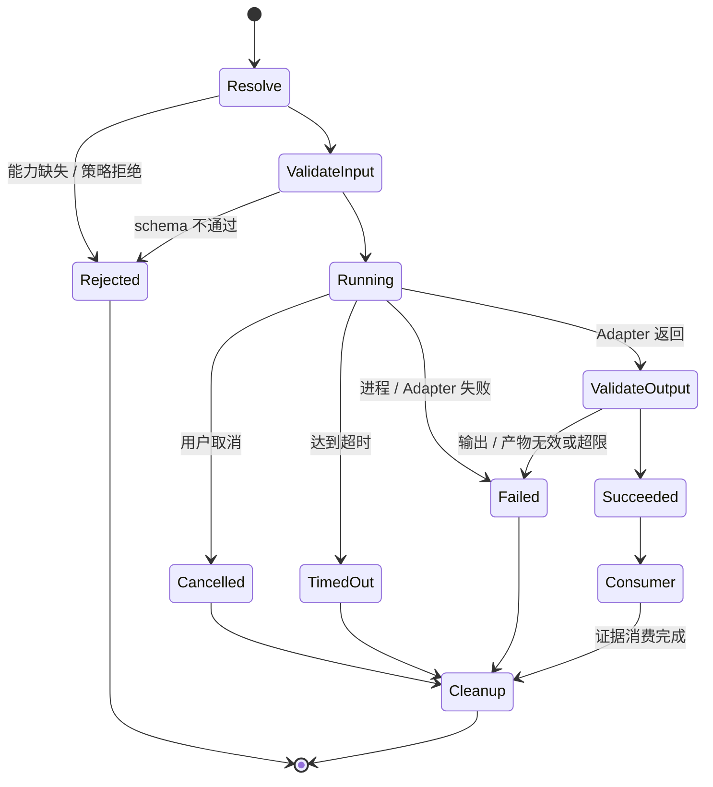

# 工具执行底座-DEV-0008-v1.0

## 1. 文档信息

| 项目 | 内容 |
| --- | --- |
| 关联需求 | [单素材分析-REQ-0005-v1.0](../requirements/单素材分析-REQ-0005/单素材分析-REQ-0005-v1.0.md) |
| 关联任务 | `APP-0010` |
| 实现范围 | T01 能力注册、T02 Broker、T03 脚本 / Skill 适配合同、T04 有界并行编排、T05 临时产物、T06 证据校验 |
| 发布单元 | macOS、Windows 共享 TypeScript 代码；当前在 macOS 本地验证，Windows 进程与文件系统边界仍需 CI 和真机复验 |

## 2. 目标与非范围

本底座把“工具是什么、能接收什么、能做什么、最多运行多久、产生什么证据”从具体分析页面和具体供应商中拆开。之后接入 FFmpeg、OCR、ASR、自研脚本或 Skill 时，只需注册版本化能力和适配器，不应修改分析页面、报告 schema 或编排器核心。

当前实现不安装或调用 FFmpeg、ffprobe、镜头检测、OCR、ASR、声音识别和模型厂商；不实现模板、标签、评分、融合报告、模型自动切换、renderer IPC 或 UI。它也不宣称已完成真实媒体分析。Python sidecar、自建 Tool、外部 Skill 和模型适配器可在后续任务中通过现有合同接入。

## 3. T01～T06 交付映射

| 编号 | 模块 | 当前能力 |
| --- | --- | --- |
| T01 | `registry.ts` | 注册多个能力及版本；校验 manifest、schema、权限和资源；按明确版本或当前最高版本解析；生成不可变 SHA-256 能力快照；拒绝覆盖同版本 |
| T02 | `broker.ts` | 统一校验输入、能力白名单、权限、直接调用并发、资源上限、超时、取消、输出大小和输出 schema；返回安全错误和不含原文的审计元数据 |
| T03 | `adapters.ts` | 内置函数适配器、无 Broker 句柄的 Skill 适配器、固定绝对可执行文件且 `shell: false` 的脚本进程适配器；脚本通过 stdin / stdout JSON 信封交换数据 |
| T04 | `orchestrator.ts` | 校验无环 DAG；独立节点按固定上限并行，依赖完成后再运行；可选失败降级、必要失败或必要依赖缺失失败；统一取消和显式清理 |
| T05 | `artifact-manager.ts` | 每次调用建立随机隔离工作区；只接受安全相对路径和普通非符号链接文件；限制数量与总字节；支持精确清理和过期工作区清扫 |
| T06 | `evidence.ts` | 校验视频时间点 / 区间、图片归一化区域、置信度、来源能力与版本、批次唯一 ID 和未知字段 |

## 4. 分层与数据流



调用者不能把任意命令或任意路径交给 Broker。能力必须先在客户端可信装配阶段注册；当前没有向 renderer 暴露通用“运行工具”IPC。脚本适配器配置固定的绝对可执行文件、固定参数和显式环境变量，不使用 shell，也不继承整个进程环境。Skill 执行器只获得输入、取消信号、资源上限和隔离工作区，不获得 Broker、任意子工具列表、素材目录或系统凭据。

## 5. 稳定合同

### 5.1 ToolManifest

每个能力声明：`capabilityId`、语义化 `version`、显示名、`builtin / script / skill` 类型、输入和输出 schema、权限、资源上限、是否可取消以及 `required / optional` 失败等级。当前权限集合为：

- `material:read`：读取由上层明确授权的当前素材引用；本任务尚未把真实素材句柄接入 Tool Context；
- `temp:write`：只写 Broker 分配的临时工作区；
- `process:spawn`：启动注册时固定的脚本进程；
- `network:access`：允许后续适配器联网；当前没有联网适配器。

schema 采用底座内置的有限 JSON 值合同，支持对象、数组、字符串、有限数值、布尔和 null。对象默认拒绝未声明字段，并拒绝 `__proto__`、`constructor` 和 `prototype` 等危险键；schema 嵌套、属性数、字符串、数组、输出字节和产物字节均有边界。

### 5.2 CapabilitySnapshot

注册时对规范化 manifest 计算 `sha256`，生成包含能力 ID、版本、类型、权限、资源、取消与失败等级的不可变快照。运行结果引用该快照，使后续确认报告可以保存使用过的能力摘要；快照不包含脚本源码、Skill 内容、输入原文、Prompt、素材路径或凭据。

### 5.3 Script 进程信封

脚本从 stdin 接收一个 JSON 输入，stdout 只能返回一个 JSON 对象：

```json
{
  "output": {},
  "artifacts": [
    { "path": "relative/file.json", "mediaType": "application/json" }
  ]
}
```

`output` 继续经过大小和 schema 校验。`artifacts` 只能引用当前工作区内的普通文件，路径逃逸、符号链接、重复登记、数量或字节超限均失败。stderr 不进入用户报告和审计记录；非零退出只转换为有限错误。当前合同不接受命令字符串、shell 片段、调用方自定义环境或绝对产物路径。

### 5.4 EvidenceSchema

证据必须包含 schema 版本、批次唯一 ID、媒体类型、证据类型、文本、0～1 置信度、来源类型、来源能力和版本。视频证据使用非负时间点或结束时间严格晚于开始时间的区间，并且不得超过素材时长；图片证据使用 0～1 坐标系中的正面积区域，完整区域不得越界。未知字段直接拒绝，避免把 API Key、Prompt、路径或任意私有对象夹带进正式证据。

## 6. 执行状态、失败与取消



Broker 不做静默重试，不自动切换工具或模型，也不重复产生远程成本。上层可依据安全错误码明确让用户重试。超时和外部取消使用 `AbortSignal` 传入 Adapter；脚本 Adapter 收到后终止固定子进程。函数与 Skill Adapter 必须遵守相同取消合同。

编排器按 DAG 依赖和 `maxConcurrency` 调度，Broker 自身还用 `maxConcurrentInvocations` 防止绕过编排器的直接调用形成无界并发；达到上限时返回可识别的 `RESOURCE_BUSY`，不排队制造不可见等待。无依赖节点可并行；依赖失败的节点不会运行。单个可选能力失败且没有必要能力依赖它时，结果为 `degraded`；任何必要能力失败，或必要节点因依赖缺失被跳过，结果为 `failed`。取消时不再启动待执行节点并取消正在运行的能力。工具或模型选择仍由后续产品流程明确决定，编排器不含候选模型和自动替换逻辑。

## 7. 临时产物生命周期

每次调用以随机 UUID 创建 `material-tool-run-<uuid>` 目录。写入使用排他创建和权限收窄；子目录逐层检查，已存在的符号链接或非目录父节点被拒绝。Adapter 返回后，产物以不含绝对路径的 ID、相对路径、媒体类型和字节数提供给可信消费层。

成功调用的工作区保留到消费层调用 `release` 或编排器 `cleanup`。失败、超时或取消的工作区在 Adapter 结束后清除，避免在未真正终止的子进程仍写入时提前复用路径。应用启动阶段可调用 `sweepStale` 清理超过明确时限且严格匹配命名合同的遗留目录；不得递归清理临时根目录中的其他文件。

## 8. 审计、隐私与信任边界

审计只记录 invocation ID、能力快照、开始 / 结束时间、耗时、状态、安全错误码及输入 / 输出字节数。它不记录输入输出原文、字幕、口播、文件名、绝对路径、Prompt、模型响应、脚本 stderr、API Key、环境变量或内部调用拓扑。返回文本与文件继续按不可信数据处理，不能作为 HTML、命令、链接、脚本或 Prompt 自动执行。

当前 Tool Broker 是应用级能力边界，不是操作系统级恶意代码沙箱。只有项目可信装配阶段可以实例化函数、脚本和 Skill Adapter；后续若允许用户导入第三方 Skill，必须另立任务增加签名 / hash、来源与许可、独立进程或系统沙箱、只读素材句柄、网络域名策略和可见授权，不能直接把任意代码注册为当前 `SkillToolAdapter`。

## 9. 接入新工具的工作拆分

1. 单独确认该工具解决的产品维度、是否必要、数据是否出本机、许可 / 成本 / 账号和平台兼容性。
2. 新建实现任务，固定安装来源和版本，声明 ToolManifest 与最小权限。
3. 编写 Adapter，把工具原始输出转换为稳定 JSON；不得让报告模块读取供应商私有格式。
4. 添加真实样例的合同、超时、取消、超限、错误降级和 EvidenceSchema 验证。
5. 在分析计划中显式加入节点及依赖，不在 Broker 内写死行业、模板、报告或模型选择。
6. macOS 与 Windows 分别验证可执行文件发现、路径、编码、进程终止和卸载 / 回退。

Python sidecar 可作为一种 `script` 或后续专用 Adapter；它不是产品需求，也不是默认必须项。只有出现多进程常驻、流式媒体或硬件推理需求时，再评估 JSON-RPC / stdio 常驻协议。

## 10. 验证、兼容与回退

自动化覆盖 manifest 和版本快照、危险键与未知字段、权限拒绝、输入输出 schema、审计脱敏、超时、取消、脚本 JSON 信封、stdout 超限、产物配额、路径逃逸、符号链接、并行上限、依赖顺序、可选降级、必要失败、DAG 环和视频 / 图片证据边界。完整门禁还执行 ESLint、TypeScript、全部 Vitest、Electron 打包、文档和治理回归。

当前未新增 SQLite schema、用户配置或 UI，代码回退只需移除 `apps/desktop/src/tooling/` 及对应文档，不触碰产品库、分析记录或源素材。能力快照 schema 固定为 v1；后续变更必须增加 schema 版本并保留旧报告的只读解释能力，不能原地重解释历史快照。

macOS 本地脚本进程测试使用当前 Node 可执行文件，不等于 Windows 下的 FFmpeg、Python 或第三方工具已经通过。Windows CI 负责共享代码回归，真实工具接入任务还必须在 Windows x64 真机验证进程终止、长路径、非 ASCII 路径、ACL、临时目录和安装 / 卸载。故障定位见 [工具执行底座-TRB-0005-v1.0](../troubleshooting/工具执行底座-TRB-0005-v1.0.md)。
