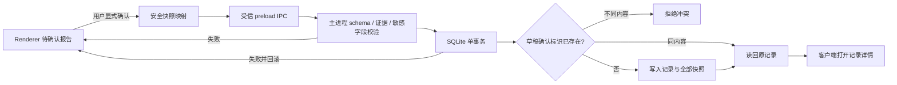

# 报告确认与分析记录接线-DEV-0014-v1.0

## 1. 文档信息

| 项目 | 内容 |
| --- | --- |
| 关联需求 | [单素材分析-REQ-0005-v1.0](../requirements/单素材分析-REQ-0005/单素材分析-REQ-0005-v1.0.md) |
| 关联任务 | `APP-0017` |
| 前置能力 | APP-0008 分析记录本地核心、APP-0015 分析编排与待确认报告预览 |
| 当前范围 | 报告草稿映射、受信确认 IPC、幂等原子保存、SQLite v2 兼容迁移、保存状态与成功后记录详情 |
| 发布单元 | macOS、Windows 共享 Electron / React 代码；本地构建不替代双平台真机验收 |

## 2. 目标、范围与非范围

本工作包接通最短正式闭环：待确认报告先完整展示，用户明确点击“确认并保存”后才创建分析记录；主进程完成校验、单事务写入和读回，成功后客户端直接打开新记录详情。未确认、返回、关闭、保存失败和保存中断都不进入记录列表；失败时预览保持在当前会话，可直接重试。

确认快照包含报告正文、评分与未评分状态、标签、诊断和建议、时间证据、行业规则版本、产品快照、模型运行摘要、用户填写的转化依据及素材指纹摘要。它不包含素材字节、绝对路径、会话令牌、API Key、Prompt、模型原始响应、工具日志或内部推理。

本任务不实现指出问题后的对话重分析、可信程度 / 权重反馈新交互、PDF、持久素材访问句柄、重新定位、从历史记录创建重新分析关系、记录备份恢复、其他模型分支整合、push、PR、合并或发布。现有记录列表、详情、反馈和删除能力只被复用，不在本任务扩大语义。

## 3. 确认数据流与所有权

Renderer 只负责把已经生成并展示的结构化草稿映射成窄化 `ConfirmedRecordInput`，不直接访问数据库。`preload` 只暴露 `records.confirm`；主进程只接受当前应用窗口的 sender，并再次执行 `RecordValidation`。Repository 是正式记录的唯一写入者。

报告的 `draftId` 作为 `confirmationId`。同一确认标识和完全相同快照再次到达时返回已有记录，因此双击、Renderer 重试或响应丢失不会产生重复记录；同一标识携带不同内容时返回 `CONFLICT`，不得覆盖已有快照。

## 4. 草稿到正式快照的映射

| 草稿来源 | 正式记录内容 | 处理规则 |
| --- | --- | --- |
| 素材会话 | 显示名、媒体类型、字节数、强指纹、时长 / 尺寸 | 不保存 `sessionId`、预览 URL 或绝对路径 |
| 融合报告 | 标题、摘要、结构、镜头、画面、字幕、口播声音、卖点、情绪、CTA | 只保存用户可见的结构化结果 |
| 评分 | 总分、维度、状态 | 证据不足保留 `null`，不转换为 0 |
| 标签 | 固定 / 动态标签及证据引用 | 仅属于本报告，不进入标签库 |
| 诊断 / 建议 | 问题及与其关联的建议动作 | 用 `diagnosisIndexes` 建立映射；没有对应动作时明确显示未生成 |
| 证据 | 类型、文本、时间范围和公开来源分类 | 图片区域不伪造成时间；不保存临时帧路径 |
| 规则 | 模板、评分、标签版本 | 旧报告不随规则更新重算 |
| 产品 | 当次自包含产品快照或空 | 之后编辑 / 删除产品不追溯本报告 |
| 模型运行 | 配置显示名、模型 ID、能力版本、完成时间 | 不保存配置凭据、供应商原始正文或 Prompt |

当前记录没有持久化 OS 文件访问句柄，所以强指纹完成“与素材关联”，但保存后的 `sourceStatus` 准确记为 `needs_relocation`。报告仍完整可读；后续独立任务接入同指纹重新定位后才能声明历史播放器可用。

## 5. 原子写入与 SQLite v2

`confirmAndSave` 在 `BEGIN IMMEDIATE` 中依次检查幂等键、来源记录（本任务新建均为空）、写入和读回。任何校验、约束、序列化或读回错误都会回滚；成功前 UI 不跳转、不清除预览。正式报告存为自包含 JSON，列表所需行业、媒体、名称、产品、总分、来源状态和确认时间使用索引列，不在查看详情时重算报告。

SQLite `user_version=2` 新增可为空且唯一的 `confirmation_id`，并把 `total_score` 放宽为可空。v1 到 v2 迁移在一个事务中重建记录和反馈表、复制旧数据、保留旧 JSON、将旧记录确认标识记为空、重建索引并执行外键检查；失败回滚原库并停止写入。只读 v1 库仍可查看，但必须恢复写权限后才能迁移和确认新报告。

回退到只理解 v1 的旧客户端前必须使用应用数据备份；v2 数据库不应由旧代码直接写入。代码回退不得删除数据库、报告或源素材。

## 6. UI 状态与恢复

- 默认：报告页显示“尚未保存”和可用的“确认并保存”。
- 保存中：两个确认入口统一显示进度，返回和侧栏离开被阻止，防止用户误以为已取消写入。
- 成功：以主进程读回的记录 ID 打开分析记录详情；列表可立即检索到同一条记录。
- 失败：页面显示人话错误，报告预览、素材摘要和配置保持，按钮恢复为可重试；列表中不得出现半条记录。
- 未确认离开：明确提示将放弃本次预览；用户取消则留在原页，确认离开则清理当前草稿且不保存。
- 重复确认：主进程返回同一记录；不同内容复用标识时显示冲突并保留预览。
- 未评分：预览、列表和详情统一显示“未评分”或破折号，不显示 0。

## 7. 安全与验证

安全扫描拒绝 `apiKey`、`password`、`privateKey`、`prompt`、`reasoning`、`absolutePath`、`filePath`、`toolLog` 等字段。确认输入限制文本、记录总字节数、分数范围、时间区间、证据 ID 唯一性与引用完整性；不可信 sender 在调用 Repository 前拒绝。

自动化覆盖：草稿安全映射、未评分保真、受信 / 非受信 IPC、同草稿幂等、冲突拒绝、非法证据不落库、v1 数据迁移和旧快照读回，以及全量 lint、typecheck、测试、打包和治理门禁。桌面测试文件串行执行，使产品库与分析记录的 10,000 条性能基线不与其他测试文件争抢 CPU / SQLite；产品库基准测试容器超时为 15 秒，阈值和样本规模保持不变，容器超时不替代 P95 断言。真实 Windows x64 与 macOS 安装后确认保存、数据库升级、磁盘满 / 只读和崩溃恢复仍需分别验收。

常见恢复见[报告确认与分析记录接线-TRB-0011-v1.0](../troubleshooting/报告确认与分析记录接线-TRB-0011-v1.0.md)。下一阶段可独立实现报告反馈与指出问题后重新分析；它们不能修改当前已确认报告正文或评分快照。
