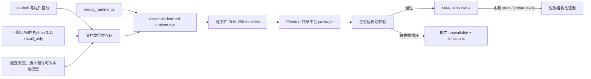
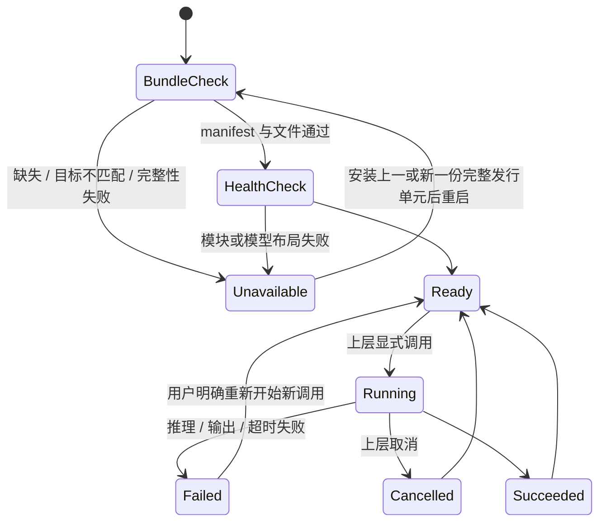

# 本地学习型媒体生产运行时-DEV-0022-v1.0

## 1. 文档信息

| 项目 | 内容 |
| --- | --- |
| 关联需求 | [单素材分析-REQ-0005-v1.0](../requirements/单素材分析-REQ-0005/单素材分析-REQ-0005-v1.0.md) |
| 关联任务 | `APP-0030` |
| 承接能力 | [确定性媒体解析-DEV-0009-v1.0](确定性媒体解析-DEV-0009-v1.0.md) 的 M04 OCR、M06 ASR、M07 声音事件 |
| 发布单元 | macOS arm64 / x64、Windows x64 分别构建；共享 manifest、sidecar 和 TypeScript 合同 |
| 目标状态 | 发行构建携带完整本地 bundle；分析期间离线、CPU 执行，不依赖系统 Python 或用户 PATH |

## 2. 目标、范围和非范围

本工作包把原先需要开发者手工填写 Python 与模型目录的可选适配器升级为可发行生产运行时。仓库提供固定依赖锁、模型与许可基线、运行时组装器、逐文件完整性清单、应用启动校验、打包注入、PaddleOCR 3.x / faster-whisper / YAMNet 执行合同，以及独立的 TypeScript 与 Python 回归测试。

本范围不把大型 Python 二进制、依赖 wheel 或模型权重提交到 Git；这些内容由受控发行流水线按平台准备后注入。V1 不实现后台下载、安装后补模型、云端 OCR / ASR、GPU / CUDA、说话人分离、模型管理 UI、自动切模型或中国大陆镜像托管。是否建立下载服务、镜像和模型更新 UI 是后续产品与运维需求，不在本任务中暗含。

## 3. 生产结构与信任边界

构建环境可以联网获取已批准的运行时和模型；正式分析进程没有网络权限，也不在运行时补下载。已打包应用只读取 `process.resourcesPath/learned-runtime`，忽略 `MATERIAL_MEDIA_PYTHON` 与各模型路径环境变量。开发模式可以显式使用 `MATERIAL_LEARNED_RUNTIME_ROOT` 验证一份完整 bundle，或使用旧的单项绝对路径覆盖；二者都不能改变发行包的解析规则。

## 4. 版本锁与组件基线

`apps/desktop/runtime/pyproject.toml` 固定 Python `>=3.11,<3.12`，直接依赖固定为 PaddleOCR 3.7.0、PaddlePaddle 3.3.1、faster-whisper 1.2.1、TensorFlow 2.21.0 和 SoundFile 0.13.1；`uv.lock` 固定传递依赖与发行文件 hash。更新任一直接或传递依赖必须重新生成 lock、构建各平台 bundle 并执行完整验收，不能只改 import 让现有包继续运行。

`runtime-components.json` 保存包和模型的名称、来源与许可证基线。候选模型为 PP-OCRv5 mobile detection + recognition、`Systran/faster-whisper-small` 与 YAMNet v1。每次实际组装仍必须在 build spec 中填写确定版本或不可变 revision；`main`、`latest` 或只有产品名而无版本的模型不能作为正式发行证据。

[python-build-standalone](https://github.com/astral-sh/python-build-standalone/blob/main/docs/running.rst) 的 `install_only` 发行用于提供不依赖系统 Python 的目标平台解释器；[PaddleOCR 3.x OCR pipeline](https://paddlepaddle.github.io/PaddleOCR/main/en/version3.x/pipeline_usage/OCR.html)、[faster-whisper](https://github.com/SYSTRAN/faster-whisper) 和 [TensorFlow YAMNet](https://www.tensorflow.org/hub/tutorials/yamnet) 是当前 API 合同依据。代码仓许可证不自动等同于每份模型权重的分发许可，发行前仍需法务或产品负责人核对权重条款。

## 5. Bundle 与 manifest 合同

组装输出目录的固定名称为 `learned-runtime`，根部必须有 `learned-runtime-manifest.json` 和 `THIRD_PARTY_NOTICES.json`。manifest 只允许以下结构：

- `schemaVersion`、`bundleVersion` 和目标 `platform / arch`；
- Python 相对可执行文件、3.11 补丁版本和 sidecar 相对路径；
- OCR detection / recognition、ASR、声音事件模型身份、版本和相对根目录；
- 组件名称、版本、HTTPS 来源和许可证；
- 除 manifest 自身外每个文件的 POSIX 相对路径、字节数、SHA-256 和可执行标记。

应用启动时执行完整校验，并在每次真正启动 sidecar 推理前重新执行同一校验；拒绝未知字段、未知 manifest 版本、绝对路径、反斜线、空路径段、`.` / `..`、重复文件、符号链接、设备文件、平台或架构不匹配、未声明文件、缺少声明文件、大小变化、hash 变化和缺少执行权限。OCR 的 detection / recognition 必须位于 OCR 根内，所有模型根至少包含一个受清单保护的文件。任何失败都只形成有限错误原因，不把运行时绝对路径放进 Renderer、日志、报告或治理记录。

## 6. 构建与打包流程

1. 在隔离发行暂存区取得与目标匹配的 Python 3.11 `install_only` 发行，先验证上游发布 hash。
2. 以仓库 `uv.lock` 的 `--frozen` 结果把依赖安装进该 Python 根；不得直接复制开发机普通 venv，也不得让客户端首次启动时安装依赖。
3. 取得固定 revision 的三个模型，核对文件 hash、许可证和分发范围。OCR 输入根含 `det/`、`rec/`，ASR 至少含 `config.json` 与 `model.bin`，YAMNet 含 `saved_model.pb` 与 `variables/`。
4. 创建不入 Git 的 build spec，填写 bundle 版本、目标、Python 根和相对可执行文件、sidecar、模型根 / 身份 / 版本、组件来源与许可。
5. 执行 `npm --prefix apps/desktop run runtime:assemble -- --spec <spec.json> --output <目录>/learned-runtime`。目标已存在时组装器失败，不覆盖旧 bundle；源中只有指向同一输入根普通文件的相对符号链接会被展开成普通文件，绝对 / 逃逸 / 目录链接、输出链接、特殊文件和不完整模型结构都会失败。
6. 使用应用的同一 verifier 读回 bundle。发行 package 时设置 `MATERIAL_REQUIRE_LEARNED_RUNTIME=1` 与 `MATERIAL_LEARNED_RUNTIME_BUNDLE=<绝对的 learned-runtime 目录>`；这些变量只供 Forge 构建，不会成为打包客户端的运行配置。
7. 对生成安装单元执行固定媒体烟测、应用 package 校验、签名 / 安装 / 卸载和回退验证。macOS arm64、macOS x64 与 Windows x64 不能共享二进制 bundle 或互相代替真机结论。

组装器先写入同级临时目录，完成清单后原子改名；失败只清理自己创建的临时目录。它不会下载依赖或模型，也不会删除已有输出，因此获取源、成本和许可始终由发行流程显式控制。

## 7. 三项执行合同

### 7.1 M04 OCR

PaddleOCR 只使用 bundle 内 `text_detection_model_dir` 与 `text_recognition_model_dir`，关闭文档方向分类、图像展开和文本行方向等非必要管线，固定 CPU，并调用 3.x `predict()`。解析层只读取识别文本、分数和多边形，转换为 0～1 区域；Paddle 结果中的输入路径、调试图像和内部对象不出 sidecar。视频仍只 OCR 上游 M02 生成的受控帧。

### 7.2 M06 ASR

faster-whisper 使用本地 CTranslate2 模型、CPU `int8`、4 个 CPU thread、单 worker、VAD、词级时间和 `local_files_only=True`。默认 beam size 为 3，并关闭跨段历史条件以减少长素材错误累积；`zh` 输入增加固定的普通话简体中文提示，以符合中国大陆优先的展示语境，但识别文本仍属于模型输出而非人工校正。V1 的 `speaker` 仍为 `null`；没有说话人分离不能在报告中推断具体人物身份。

### 7.3 M07 声音事件

YAMNet 通过 `tensorflow.saved_model.load()` 读取 bundle 内 SavedModel，不调用 TensorFlow Hub 网络客户端。输入固定为 M05 生成的 16kHz 单声道 WAV；输出每个窗口置信最高且超过阈值的类别，并合并连续同类窗口。YAMNet 约 0.96 秒窗口、0.48 秒步长，时间边界只能视为近似值。RMS 能量变化是额外候选，不等同于 BPM、beat 或节拍真值。

## 8. 进程、隐私与资源边界

- 主进程只用绝对 Python / sidecar / 模型路径和参数数组启动子进程，`shell: false`。子进程环境为最小集合，设置 `PYTHONNOUSERSITE`、`PYTHONDONTWRITEBYTECODE`、`HF_HUB_OFFLINE` 与 `TRANSFORMERS_OFFLINE`；Windows 仅补启动所需的系统根和临时目录。
- 健康检查先验证受控路径和模型结构，再 import 固定模块。执行失败只返回稳定错误，不回传 stderr、异常堆栈或路径。
- 原始图片、视频、帧、WAV、OCR / ASR 原文和模型输入不进入 Renderer、SQLite、分析记录、导出、普通日志或治理记录。TypeScript 只接受并裁剪结构化文本、时间、区域、事件、置信度和版本。
- 三项能力仍为 optional。缺失 / 损坏 bundle、单模型不完整、推理失败或输出非法必须进入分析 limitations；不得伪装为空内容、自动联网、自动换模型、云端回退或在同一任务中静默重试。

## 9. 状态、失败与恢复

不能在应用目录中手工替换单个模型或 Python 文件后点击重试；这会破坏 manifest。安全恢复是退出应用，重新安装同平台、完整、已签名且 hash 一致的发行单元，再启动并做健康检查。开发 bundle 修复后也必须重新组装，不能修改成品目录。

## 10. 验证矩阵

| 验证面 | 自动化 / 实际证据 | 通过条件 |
| --- | --- | --- |
| manifest schema 与目录边界 | `learned-runtime-bundle.test.ts` | 未知字段、逃逸路径、额外 / 缺失 / 篡改文件、符号链接、错误目标全部失败关闭；Windows hosted runner 使用无需提升权限的目录 junction 验证链接拒绝，POSIX 使用文件 symlink |
| 组装器 | `learned-runtime-builder.test.ts` | 由独立源组装、生成 notices / hash、被生产 verifier 接受；已有输出不覆盖；Windows 不依赖提升权限创建文件 symlink，POSIX 继续覆盖相对 symlink 展开 |
| 应用配置 | `learned-runtime-configuration.test.ts` | package 只读 resources bundle；开发环境变量不能污染 package；错误 bundle 不回退 |
| TypeScript Adapter | `learned-runtime.test.ts` | 健康、离线环境、脱敏、边界裁剪和 optional 失败语义稳定 |
| Python sidecar | `runtime/tests/test_media_runtime.py` | PaddleOCR 3.x 参数 / 结果、faster-whisper 本地 CPU int8、YAMNet SavedModel与时间限制通过 |
| 依赖可复现 | `uv.lock` + `uv sync --frozen` | 无隐式升级；直接和传递依赖一致 |
| 当前 macOS 架构真实烟测 | 2026-08-28 在 Apple Silicon 由真实 bundle v2 执行固定 PNG、PaddleSpeech 官方中文 WAV 和生成的 16kHz 双频 WAV | OCR 得到“新品上新 限时优惠”；ASR 得到简体中文全文和词级时间；YAMNet 得到 Telephone / Sine wave / Dial tone 及近似时间限制；三项 JSON 均不含本地路径 |
| 跨平台发行 | macOS arm64 / x64、Windows x64 package 与真机 | 每个平台独立 bundle、manifest、签名、安装、能力健康和固定样例通过 |

普通 `npm test` 不替代 `test:learned-runtime`。最终本地门禁由 `taskctl run-required APP-0030` 执行 lint、typecheck、完整 Vitest、专用 runtime、模型 / Codex 回归、Electron package、文档与治理校验；`APP-0035` 补充 Windows hosted runner 的链接测试可移植性回归。Windows 共享合同通过仍不等于 Windows 真机发布完成。

本次真实 macOS arm64 组装产生 32,821 个受 manifest 保护的普通文件，bundle 未压缩约 2.9 GiB，Electron `.app` 未压缩约 3.4 GiB；启用 `MATERIAL_REQUIRE_LEARNED_RUNTIME=1` 的生产 package 已读回全部 hash 并成功。该数字是当前依赖组合的工程实测，不是已确认产品体积目标；其中 TensorFlow 和 PaddlePaddle 原生库占主要部分。发布前若体积不可接受，应单独评估 TFLite / ONNX、按能力拆包或受控下载，不得在本任务中静默删除依赖文件。

## 11. 兼容、升级与回退

manifest schema、sidecar JSON 或 Tool schema 不兼容时提升相应版本；模型或阈值变化至少提升 bundle / 模型版本。已经确认的历史报告只保留当时的能力与模型版本摘要，不追溯运行新模型。运行时没有 SQLite schema，不保存素材副本；代码回退不需要迁移业务数据。

发行回退使用上一份完整、同目标、已签名并已验证的安装单元，不能仅覆盖 `models/`、Python 或 manifest。卸载清除随应用提供的运行时；用户本地产品库、分析记录和系统安全存储凭据遵循各自数据保留规则，不随运行时回退删除。

## 12. 假设、未决与后续

当前确认假设是 V1 CPU 性能可接受，M04 / M06 / M07 失败允许生成带 limitations 的降级分析，大型二进制由发行流水线提供而非 Git。模型准确率不是本任务通过自动化测试即可证明的产品事实，后续仍需要服饰与游戏素材集评测。

当前没有阻断实现的未决事项。后续需要另立需求决定：中国大陆运行时 / 模型托管及成本、当前约 3.4 GiB 未压缩客户端是否需要按能力拆包、用户可见模型更新、磁盘占用提示、后台下载与断点恢复、GPU 版本、说话人分离、行业准确率阈值和 Windows 真机发布。排障见 [本地学习型媒体生产运行时-TRB-0019-v1.0](../troubleshooting/本地学习型媒体生产运行时-TRB-0019-v1.0.md)。
