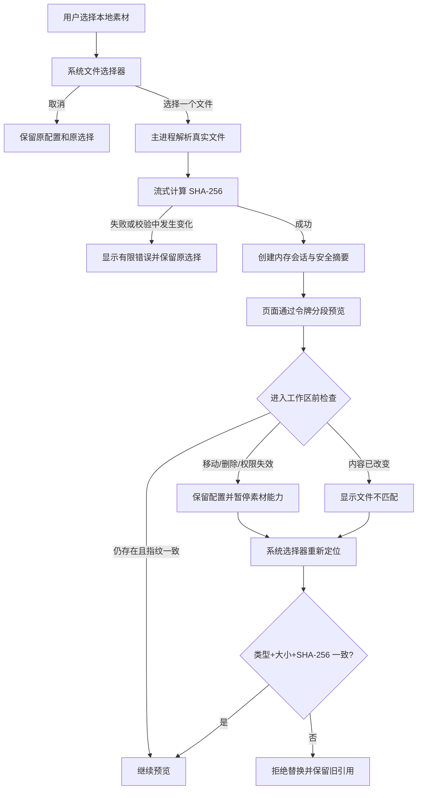

# 本地素材会话-DEV-0007-v1.0

## 1. 文档信息

| 项目 | 内容 |
| --- | --- |
| 关联需求 | [单素材分析-REQ-0005-v1.0](../requirements/单素材分析-REQ-0005/单素材分析-REQ-0005-v1.0.md) |
| 关联任务 | `APP-0009` |
| 实现范围 | 当前分析会话的系统文件选择、强指纹、安全预览、状态检查和同文件重新定位 |
| 发布单元 | macOS、Windows 共享业务代码；macOS 本地验证，Windows 系统选择器与真实播放仍需真机验收 |

## 2. 产品能力与范围边界

“新建分析”不再由 renderer 的网页文件输入直接持有 `File` 对象。用户点击选择后打开操作系统文件选择器，主进程只接受一个支持的视频或图片，流式计算完整文件 SHA-256，并向页面返回文件名、媒体类型、大小、指纹、素材状态和不可猜测会话 ID。绝对路径只存在主进程内存，不进入页面、报告、日志、任务记录或导出；源素材字节仍留在用户原位置。

当前会话支持主动检查。文件移动、删除、权限失效或原地改变时，行业、产品和关注点等配置继续保留；需要素材的播放器和后续分析暂停。用户通过系统选择器重新定位时，媒体类型、字节数与 SHA-256 必须全部一致才恢复引用，错误候选不替换旧引用。

本工作包不把草稿路径持久化，移除素材或退出应用即释放会话。它不实现历史记录的持久访问句柄、确认保存、模型/Tool 分析、镜头/OCR/ASR/声音解析、播放器证据跳转、PDF、云同步或发布。历史记录持久引用必须在后续确认保存集成中与正式记录生命周期一起设计，不能把当前会话句柄伪装成已保存记录。

## 3. 分层与信任边界

| 层 | 位置 | 职责 |
| --- | --- | --- |
| 安全类型 | `apps/desktop/src/media/types.ts` | renderer 可见的摘要、状态、错误和窄化 IPC 合同 |
| 会话服务 | `apps/desktop/src/media/session.ts` | 真实路径、流式指纹、会话映射、检查、重新定位和释放 |
| 系统选择器 | `apps/desktop/src/media/ipc.ts` | Electron 对话框与有限错误转换 |
| 分段读取 | `apps/desktop/src/media/range.ts` | 单段 HTTP Byte Range 解析和边界校验 |
| 安全预览协议 | `apps/desktop/src/media/protocol.ts` | 用会话令牌映射文件，按 Range 流式响应，不返回路径 |
| preload | `apps/desktop/src/preload.ts` | 只暴露 `select/inspect/relocate/release` |
| UI | `apps/desktop/src/ui/App.tsx` | 等待、取消、可用、失效、不匹配和恢复交互 |

renderer 不能提交任意路径，也没有“打开路径”或目录扫描 API。`select` 与 `relocate` 都只能由主进程弹出的系统选择器产生候选。预览地址为 `material-local://session/<uuid>`；协议只接受 `GET/HEAD` 和当前进程内仍存活的 UUID，其他 host、过期令牌和非读取方法失败。

## 4. 选择、校验和恢复流程

选择和重新定位期间页面显示“正在读取并生成素材指纹”，避免用户误以为无响应。取消对话框是零变化；新选择失败不释放原会话。成功替换选择后，React 生命周期释放旧会话。用户移除素材时页面立即回到未选择状态，主进程释放对应路径映射。

## 5. 指纹与文件一致性

当前算法标识为 `sha256-full-v1`：使用 Node 文件流读取完整字节，计算期间不把完整文件加载进内存，也不设置产品大小上限。哈希前后再次读取文件大小与修改时间；校验过程中发生变化则拒绝创建会话。相同字节改名或移动后仍可恢复；同名、同类型或同大小不足以视为相同文件。

主动 `inspect` 重新计算完整 SHA-256，用于进入工作区前的强校验。协议每次读取前执行轻量文件状态检查，发现大小或修改时间变化即停止继续提供；它不在每一个视频 Range 请求上重复计算全量哈希，避免大视频拖动进度时产生无界重复 I/O。需要开始分析、生成证据或确认保存前，后续编排仍必须调用强校验。

## 6. 大文件预览

自定义协议实现标准单段 Byte Range：

- 无 `Range` 时返回完整流，`GET` 不预读全部文件；
- 合法 `bytes=start-end`、开放结束和后缀范围返回 `206`、`Content-Range`、`Accept-Ranges` 与准确长度；
- 多段、倒序、越界或非法数字返回 `416`，不读取文件；
- `HEAD` 只返回元数据；
- MIME 由受支持扩展映射，不相信 renderer 传入值。

这保证播放器可分段读取和拖动，同时避免把源素材复制到应用目录或一次性塞入 renderer 内存。

## 7. 状态、失败与恢复

| 状态 | UI 与操作 | 不变量 |
| --- | --- | --- |
| 未选择 | 浏览文件 | 不存在路径或会话 |
| 选择/指纹中 | 明确等待并防重复提交 | 原选择在新选择成功前保留 |
| 可用 | 播放、检查、重新选择、移除 | 页面只看安全摘要和令牌 |
| 需重新定位 | 配置保留，显示恢复入口 | 播放和后续素材能力暂停 |
| 文件不匹配 | 显示原/候选文件名摘要 | 候选不覆盖旧引用 |
| 选择器取消 | 返回原状态 | 零变化 |
| 读取失败 | 有限错误，可重试 | 不泄露路径、系统堆栈或文件正文 |
| 会话过期 | 要求重新选择 | 不从磁盘恢复未确认草稿 |

## 8. 安全、兼容、验证与回退

- 只接受明确扩展白名单和普通文件；符号链接先解析为真实路径，renderer 仍看不到路径。
- 会话 UUID 不写入正式报告或分析记录，进程结束后全部失效。
- 源字节、缩略图、绝对路径、文件夹内容、API Key、Prompt、推理和工具日志均不写入本任务的数据存储。
- 自动化覆盖安全摘要、强指纹、移动后恢复、错误候选拒绝、原地变化、释放和 Range 边界；完整门禁还执行 ESLint、TypeScript、全部 Vitest、Electron 打包与治理回归。
- macOS 真实路径可能把 `/var` 规范化为 `/private/var`，比较和测试使用系统真实路径，不把两者误判为素材变化。
- Windows 仍需真机验证系统选择器、长路径/非 ASCII 文件名、文件占用、ACL 失效和视频 Range 播放；当前 macOS 打包不能替代这些证据。

代码回退只移除会话能力，不删除、移动或复制任何源素材，也不触碰产品库和分析记录 SQLite。由于本任务没有新增持久 schema，回退无需数据库迁移。故障处置见 [本地素材引用-TRB-0004-v1.0](../troubleshooting/本地素材引用-TRB-0004-v1.0.md)。

后续任务需要把“报告预览确认事件、主进程正式记录事务和持久本地访问机制”作为一个完整合同设计；在该合同完成前，分析记录页不得声称历史素材可自动恢复或播放。
