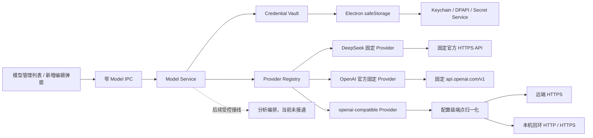
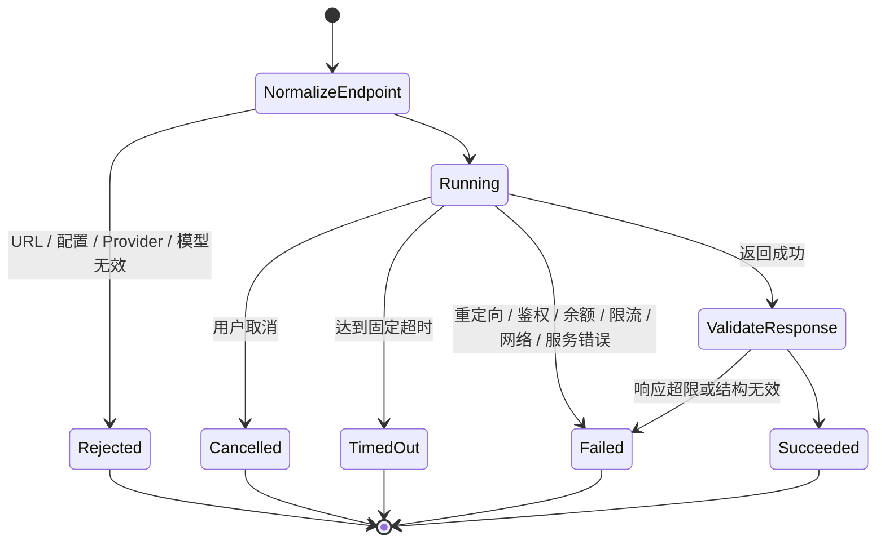

# 模型接入与安全存储-DEV-0010-v1.0

## 1. 文档信息

| 项目 | 内容 |
| --- | --- |
| 关联需求 | [模型管理与自定义模型-REQ-0006-v1.0](../requirements/模型管理与自定义模型-REQ-0006/模型管理与自定义模型-REQ-0006-v1.0.md)（模型配置主合同）；[单素材分析-REQ-0005-v1.0](../requirements/单素材分析-REQ-0005/单素材分析-REQ-0005-v1.0.md)（分析消费关系） |
| 关联任务 | `APP-0012`（固定 DeepSeek Provider）、`APP-0016`（用户自定义 OpenAI 兼容 API）、`APP-0017`（唯一入口与关键原型映射）、`APP-0018`（独立完整需求与验收追踪）、`APP-0019`（原型截图嵌入）、`APP-0020`（官方 OpenAI 与显式测试调用） |
| 首版接入 | DeepSeek 官方 API 固定地址；OpenAI 官方 API 固定 `https://api.openai.com/v1`；自定义 OpenAI 兼容 Bearer API 由用户填写端点和模型 ID |
| 发布单元 | macOS、Windows 共享 TypeScript 业务代码；Windows x64 系统安全存储、安装、升级和卸载仍需真机验收 |

## 2. 目标与非范围

`APP-0012` 建立 BYOK、Provider Registry、Model Service、系统安全存储和 DeepSeek 固定 Provider。`APP-0016` 在不改变这些安全不变量的前提下增加“模型管理”：用户可以在已保存配置列表中新增、编辑、刷新模型、修改 `selectedModelId` 和删除配置；当前 UI 将它标为“默认模型”，REQ-0006 统一产品术语为“配置内首选模型”。新增 / 编辑通过弹窗完成。DeepSeek 地址继续由代码固定，自定义配置则要求用户明确填写 API Base URL 或完整 `/chat/completions` 地址、API Key 和模型 ID。

`APP-0017` 不新增模型协议或业务实现，只把入口与交互合同追踪到主 PRD 的两张关键原型：应用级模型管理入口唯一位于左侧栏底部并标注“模型管理 / BYOK”；新建分析因模型不可用时提示用户使用该入口，用户完成或取消操作后点击侧栏“新建分析”返回，App 顶层状态保留分析草稿。

`APP-0018` 把上述用户可观察行为、安全与数据外发、配置生命周期、异常恢复、兼容回退和验收标准收敛到独立的 REQ-0006。本文只解释技术实现，不再承担产品需求主合同；与产品行为冲突时先更新并确认 REQ-0006，再调整实现。

`APP-0020` 增加固定 `openai` Provider，以及只接受 configuration ID + model ID 的显式测试操作。OpenAI 官方合同为固定 `https://api.openai.com/v1`、Bearer API Key、`GET /models` 与 `POST /responses`；自定义 `openai-compatible` 继续使用用户地址下的 `GET /models` 和 `POST /chat/completions`。保存、保存后验证和“刷新模型”仍只有模型列表请求、零 completion；只有用户另行点击“测试调用”才可发送一次固定非业务探测。

自定义接入首版只支持 OpenAI 兼容的 Bearer API。三类 Provider 都不支持供应商大全或套餐预置、自动扫描 / 编辑本地 JSON 配置、任意协议、任意 Header、查询参数鉴权、非 Bearer 鉴权、分别填写模型列表与完成地址、代理中转、共享 Key、模型竞价 / 自动路由、静默重试 / 切换或原始图片、视频和音频直传。参考图只提供列表和弹窗的交互方向，不把其中的导航、供应商清单、本地路径或产品文案直接纳入本产品。

本工作包不修改分析模板、证据组装、报告 schema、记录保存、产品库或媒体解析。分析运行继续锁定用户显式选择的配置与模型；模型管理成功不等于第三方服务、完整分析链路或发布验收完成。

## 3. 架构与扩展边界

模型管理页只使用稳定的 Provider / Model Service 设置合同，不读取供应商私有响应，也不持久化 API Key。分析编排未来接入后也必须使用相同的受控合同，不得持有 Key 或任意替换地址；当前代码不存在这条从分析页到 `ModelService.complete` 的业务调用边。APP-0020 只增加固定探测用的窄 `testModel(configurationId, modelId)` 能力，renderer 不能提供 Prompt、消息、URL、Header 或完成参数。DeepSeek 使用固定 Provider 信息和 Chat Completions；`openai` 使用固定官方地址和 Responses；`openai-compatible` 是一个通用 Provider 类型，其实际端点来自当前配置，而不是把每个用户地址注册为新供应商。每次模型调用必须同时给出 configuration ID 和 model ID，服务从该配置解析 Provider、凭据及规范化端点。

DeepSeek 官方接口参考：[模型列表](https://api-docs.deepseek.com/api/list-models/)、[Chat Completion](https://api-docs.deepseek.com/api/create-chat-completion)、[错误码](https://api-docs.deepseek.com/quick_start/error_codes/)。OpenAI 官方依据为 [API 鉴权概览](https://developers.openai.com/api/reference/overview)、[List models](https://developers.openai.com/api/reference/cli/resources/models/methods/list) 和 [Create a model response](https://developers.openai.com/api/reference/cli/resources/responses/methods/create)：Bearer Key 属于秘密，Models 使用 `/models`，Responses 使用 `/responses`。自定义端点是否真正兼容、是否可达以及数据处理规则由其运营方决定；通用合同不能等同于对该第三方的认证。

### 3.1 自定义 URL 归一化与网络策略

用户可输入下列两种形式，保存前都归一化为不带结尾 `/` 的 API Base URL：

- Base URL，例如 `https://example.test/v1`；
- 完整完成地址，例如 `https://example.test/v1/chat/completions`，仅剥离末尾 `/chat/completions`，保留 `/v1` 等路径前缀。

规范化后，模型列表固定请求 `{baseUrl}/models`，完成固定请求 `{baseUrl}/chat/completions`。首版不支持两个接口使用不同根路径；若供应商不满足该约定，需要后续新增受控 Adapter，而不是让用户拼接任意请求。

端点必须同时满足：

1. 远端主机只允许 `https:`；`http:` 只允许精确的 `127.0.0.1`、`localhost` 或 `::1` 回环主机，不能用局域网 IP、`0.0.0.0` 或相似域名代替。
2. 拒绝 URL 用户名 / 密码、query 和 hash，API Key 只进入 `Authorization: Bearer …`。
3. `/models` 与 `/chat/completions` 都设置 `redirect: error`，不把 Bearer 凭据跟随到跳转目标。
4. 解析、协议和路径校验在发起网络请求前完成；错误地址不保存为可调用配置，也不能靠关闭 TLS 校验或放宽 IPC 绕过。

## 4. 配置与系统安全存储

### 4.1 持久化内容

当前模型配置的非秘密字段、`selectedModelId` 和 `encryptedApiKey` 一起位于 `app.getPath('userData')/model-credentials.secure.json` 版本化信封，不写入 SQLite；`safeStorage` 保护其中 Key 密文，而不是为每个 Key 创建独立 Keychain / Credential Manager 记录。配置保存显示名、Provider ID、上次验证时间、连接状态、可用模型列表和配置内首选模型。`APP-0016` 在密文信封 schema v1 中增加可选 `baseUrl` 与 `manualModelId`：旧 DeepSeek 配置缺少这两个字段时按 `null` 读取，无需迁移；自定义配置在服务层要求二者通过对应校验。API Base URL 与模型 ID 是可在设置页回显核对的非秘密配置，但普通日志和审计不记录完整地址。

API Key 明文只在用户输入期间的 renderer 表单内存、受限 IPC 参数、主进程 `safeStorage` 加解密和单次供应商请求的短生命周期内存中存在；保存结束后清空输入态，不在 renderer 持久化或回读。Key 不进入 SQLite、报告、导出、日志、任务记录、测试快照或 Git。官方 OpenAI 与自定义 Provider 复用 DeepSeek 的同一凭据路径，不另建明文配置文件。通用 Key 校验只约束 8～512 字符、无空白 / 控制字符，不把 `sk-` 或其他前缀当作 OpenAI Key 真伪依据；真实有效性只由官方 Bearer 鉴权结果判断。当前页面若仍使用“只在主进程短暂使用”的简化文案，后续 UI 返工必须改为上述准确边界。

客户端使用 Electron 异步 `safeStorage`。macOS 的加密密钥由 Keychain 保护，Windows 使用 DPAPI；应用数据目录只保存无法独立解密的密文信封，并收窄为当前用户读写权限。安全能力不可用时，`list()` 仍可读非秘密摘要，信封可写时 `remove()` 也无需解密；禁止新增 / 编辑保存、凭据解密、模型刷新和调用，不回退为明文。Linux 若报告 `basic_text` 或未知后端同样 fail closed。实现依据：[Electron safeStorage](https://www.electronjs.org/docs/latest/api/safe-storage)。

密文信封采用 schema v1 和原子替换；写入先创建随机临时文件，成功后替换正式文件。并发操作串行化，且编辑、首选模型变更、连接状态刷新和删除都校验递增的 `writeVersion`；旧窗口使用过期版本写入时明确返回配置已变更，不覆盖新内容。信封损坏时保留原文件并返回安全存储不可用，不自动重建空文件覆盖凭据。密钥轮换要求重新加密时，在同一受控操作中写回新密文。

### 4.2 配置生命周期与模型合并

1. 新建必须提供 Provider、显示名和 API Key；自定义 Provider 还必须提供端点与手填模型 ID。编辑时 Key 留空表示保留原凭据。
2. DeepSeek 与官方 OpenAI 端点不可编辑；自定义地址在保存前按 3.1 节归一化并展示给用户核对。
3. 产品目标是：新建或修改 Key、端点、手填模型时先安全持久化，再执行一次 `GET /models`；只修改显示名或配置内首选模型只做本地保存，保留 ready 与快照。“刷新模型”执行一次 `GET /models`。上述操作都必须保持零 completion，不得暗中调用 `/chat/completions` 或 `/responses`。APP-0016 当前任何弹窗保存都会重新请求列表，尚未对齐纯名称本地更新。
4. `GET /models` 成功后，发现结果与 `manualModelId` 按模型 ID 精确去重合并，并显式选中手填项。手填项不因发现结果未列出它而被替换。
5. 首次发现失败时保留 `manualModelId` 和密文配置、把连接状态记为失败，但不把手填声明伪装成已验证的 `availableModels`，首选模型保持未选择。用户编辑后重试或再次“刷新模型”；失败不删除配置，也不显示成连接正常。
6. 用户修改 Key、端点或手填模型时，旧连接状态和旧发现列表失效并重新验证。网络、鉴权或列表失败保留可恢复信息，允许用户重试或删除。
7. 连接首次成功且尚无偏好时，自定义配置使用手填 `manualModelId`，DeepSeek 与官方 OpenAI 使用排序后首个发现模型；之后用户可显式修改配置内首选模型。新建分析未来将它排在同配置候选之前，但选择值仍为空；每次分析保存当次 configuration ID 和 model ID。APP-0016 当前已存 `selectedModelId` 但未用于候选排序。
8. 删除前显示准确配置名；确认后原子重写凭据信封，移除配置元数据与 `encryptedApiKey`，而不是删除独立 Keychain / Credential Manager 记录。新任务不可再用，历史报告不依赖该 Key。

## 5. Model Service 与调用合同

`ModelService.complete` 是主进程内部能力，不通过 preload 暴露任意 Prompt 调用。调用输入包含配置 ID、模型 ID、角色消息、`text / json` 格式、最大输出、思考模式和可选温度；字符串数量、总字符、消息数、数值范围均有上限。服务读取明确配置，验证请求模型属于该配置最近一次成功的手填 / 发现合并结果，再只调用对应 Adapter 一次。

DeepSeek Adapter 可以映射其受控扩展参数；通用 `openai-compatible` Adapter 只发送首版共同字段，不发送 DeepSeek 专用 `thinking` 字段，也不允许用户注入任意 Header 或请求字段。官方 `openai` Adapter 的模型发现固定 `GET https://api.openai.com/v1/models`，完成固定 `POST https://api.openai.com/v1/responses`；请求以 Bearer 发送 Key，且不能从配置覆盖 Base URL。Responses 只有 `status === completed`、`error` / `incomplete_details` 为空且能从受控 `output_text` 或 `output[].content[]` 提取非空文本时才成功；token 用量从 `input_tokens / output_tokens / total_tokens` 归一化，reasoning 内容和未知字段一律不进入合同。`response.model` 可能是 alias 解析后的 snapshot，必须作为 providerReturnedModelId 原样保留，不能用 requestedModelId 覆盖。

模型响应只转换为正文、finish reason、实际模型 ID、Provider ID、system fingerprint 和 token 用量。供应商可能提供的 reasoning content 不进入正式合同，避免暴露或持久化内部推理。JSON 模式仍必须按固定业务 schema 校验，不能因为供应商声称兼容或返回 JSON 就直接信任内容。

调用审计只记录配置 ID 及写入版本、Provider、模型、Adapter 版本、时间、耗时、状态和安全错误码；不记录 API Key、完整自定义 URL、消息原文、Prompt、模型正文、HTTP Body、供应商原始错误正文或 Authorization Header。

### 5.1 APP-0020 窄测试操作

preload 只暴露逻辑上等价于 `testModel(configurationId, modelId)` 的窄操作；renderer 不得传消息、Prompt、Base URL、Header、温度、输出格式或输出上限。Service 在主进程内完成以下固定步骤：

1. 读取 configuration，要求 `status === ready`、Provider 已注册、安全存储可用、`selectedModelId` 存在且精确属于该配置最近一次成功的 `availableModels`；IPC 传入 model ID 还必须等于当前 `selectedModelId`。请求严格绑定该 configuration 的首选模型，任一失败均在联网前返回稳定错误。
2. 使用版本固定的非业务探测文本和固定 `maxTokens = 128` 构造一次 text completion；不附带分析草稿、素材、产品、行业、转化依据、历史消息、工具或文件。探测常量不从 IPC、配置或远端内容生成。
3. 解密该 configuration 的 Key，仅向对应 Adapter 发起一次请求。OpenAI 使用 `/responses`，DeepSeek 与自定义兼容 Provider 使用 `/chat/completions`；不重试、不切换、不降级。
4. 使用独立 60 秒 `AbortController` 截止时间。超时归一为 `TIMEOUT`；调用方取消与超时以先触发者为准，均不得重发。
5. Provider 返回的正文只在主进程内用于判断响应结构有效，随后立即丢弃。对 renderer 只返回 Provider ID、configuration ID、requestedModelId、providerReturnedModelId、duration、时间和成功状态；两个模型 ID 不同时由 UI 提示核对，但不得覆盖其中任意一个，也不得称为客户端自动切换。失败返回相同定位摘要、稳定错误码与安全文案。任何路径都不返回正文、固定探测文本、Key、Authorization、原始错误或原始响应。

该操作不调用配置刷新逻辑，不写 `availableModels`、`selectedModelId`、连接状态或凭据信封；UI 的加载 / 成功 / 失败是独立模型级状态。测试成功只证明该次固定探测，不授权分析调用，也不建立从分析页到 `ModelService.complete` 的边。

### 5.2 请求次数与费用不变量

保存、保存后验证和“刷新模型”只能执行 `GET /models`，完成请求计数必须为 0。“测试调用”只能在用户点击后执行，Provider 请求计数最多为 1。页面在点击前显示目标、固定非业务探测、不发送素材和可能产生少量费用；单次点击不构成后台轮询、重试或后续分析授权。

## 6. 取消、超时、错误、外发与费用边界

稳定错误映射区分端点无效 / 被策略拒绝、鉴权、余额、限流、网络、服务、超时、取消、响应无效、配置缺失、模型不可用和安全存储不可用。当前 `fetch(..., redirect: 'error')` 保证不跟随跳转、不向第二目标转发 Bearer，但重定向失败会归一为网络不可用，不对页面声称独立重定向错误码。供应商原始错误正文不会返回页面。`401` 归一为鉴权失败，`429` 归一为限流 / 账号额度类安全错误，离线 / 连接失败归一为网络不可用。`/models` 使用 30 秒受控超时；显式测试调用使用独立 60 秒超时；未来分析完成调用继续使用自己的受控超时。后续如按模型能力调整，必须版本化并在运行前可见。

保存和“刷新模型”只向对应 Provider 发送 Bearer Key 并读取模型列表，不发送素材、Prompt 或报告内容，也不发起 completion。显式“测试调用”会发送版本固定的非业务探测文本，可能产生少量费用，但仍不发送素材、分析上下文或原始媒体。真正开始分析后，结构化文本证据、Prompt 和业务上下文才会发送到用户当次选定的配置地址；APP-0020 不接通该路径。供应商或自建端点运营方可能存储、处理或继续转移请求数据，客户端不能替第三方承诺留存、训练或地域政策。

服务不自动重试，不更换配置，不切换模型，也不在失败后产生第二次完成调用。模型生成费用由用户自己的供应商账号承担；保存 / 刷新模型保持零 completion，但不能替第三方保证模型列表请求、网络或账号完全免费；显式测试调用可能产生少量生成费用。客户端不写死价格，也不把“连接正常”或“测试调用成功”等同于持续余额、费率、生成质量或完整分析能力已验收。

## 7. UI 与失败恢复

### 7.1 唯一入口与顶层草稿保留

左侧栏底部是全应用唯一持久模型入口，按钮和页标题分别显示“模型管理 / BYOK”和“模型管理”。新建分析在没有可用模型时只显示原因和侧栏提示，不增加可点击深链或第二条设置路由；模型管理页也不增加页面级关闭按钮。页面显示系统安全存储状态、已保存配置列表和“添加模型”；配置项提供首选模型选择、零 completion 的“刷新模型”、显式“测试调用”、编辑和带确认的删除。当前 UI 标签“默认模型”需在后续返工中改为“首选模型”。

App 顶层状态在 `page` 切换期间继续持有素材会话、行业、产品、转化依据和当前模型选择，不把草稿写进模型配置或分析记录。配置保存、刷新、首选修改或删除成功后由模型管理页通知顶层刷新配置摘要，并以 configuration ID / model ID 重新校验当前模型；原选择已失效时只清空模型项，不能清空其他草稿字段，也不能自动开始分析。保存已落盘但 `/models` 验证失败时保留配置的失败状态，且不把它列为新建分析的可用模型。

用户完成或取消模型页内操作后，显式点击左侧栏“新建分析”返回；页面不自动跳转，也不依赖 `returnTarget`、浏览器历史或页面级关闭回调。切换到模型管理不得释放仍由顶层草稿引用的素材会话；真正移除素材或关闭应用时再按媒体生命周期释放。

### 7.2 列表与弹窗

新增 / 编辑使用可关闭的模态弹窗，包含 Provider、条件式 API 地址、配置名称、密码型 API Key 和条件式模型 ID。

DeepSeek 与官方 OpenAI 都不显示可编辑端点或手填模型 ID；选择“自定义 OpenAI 兼容 API”时才显示地址与模型 ID。API Key 可临时切换可见性，保存后立即清空，编辑时永不回显旧值。关闭、取消或校验失败不会暗中修改其他配置；保存成功但 `/models` 验证失败时关闭弹窗并在列表页保留配置和失败信息，用户可编辑后重试或点击“刷新模型”。

页面覆盖加载、空列表、安全存储不可用、保存中、保存成功、验证失败、刷新模型、编辑、删除确认和删除失败，并额外覆盖测试调用不可用、费用说明、模型级加载、成功、`401`、`429`、离线 / 网络、服务、60 秒超时和响应无效。测试按钮只有 ready + 安全存储可用 + 有效 `selectedModelId` 时启用；加载时暴露忙碌并禁用重复提交。成功用状态语义并同时显示 requestedModelId / providerReturnedModelId，差异时提示核对；失败用警报语义。禁用原因可读，异步结果不抢焦点，页面不显示探测或回复正文。弹窗使用可识别标题、`aria-modal`、可关联表单标签、键盘关闭与合理的焦点返回。最终 macOS / Windows 客户端仍需键盘、读屏和缩放人工复验。

### 7.3 原型与实现映射

| 原型 | 文件 | 技术映射 | 产品与验收追踪 |
| --- | --- | --- | --- |
| P-06 / P-MM-01 模型管理列表 | [prototype-model-management.png](../requirements/单素材分析-REQ-0005/assets/prototype-model-management.png) | 直接可见：左侧栏底部入口、正常配置摘要、状态与操作位置；图中“默认模型”是当前 UI 过渡标签 | REQ-0006 11.3；MM-AC-01、MM-AC-04、MM-AC-40 |
| P-07 / P-MM-02 添加自定义模型弹窗 | [prototype-add-custom-model.png](../requirements/单素材分析-REQ-0005/assets/prototype-add-custom-model.png) | 直接可见：自定义 Provider 新增正常态的字段分组和底部操作；不用静态图声称校验、网络、安全或无障碍已实现 | REQ-0006 11.3；MM-AC-07、MM-AC-40 |

用户提供的参考图只作为模型列表、添加弹窗和字段分组的布局方向。原型采用当前 Material 客户端自己的侧栏、颜色、组件和安全文案；不复制参考图中的系统设置导航、供应商大全 / 套餐分类、本地 JSON 路径或其他产品的文档与品牌文案。原型中的 OpenAI 兼容限制来自 APP-0016 已确认协议边界，不是从参考产品推导的新要求。原型图表达布局和状态，不替代本文件的 URL、安全存储、数据外发、费用或失败恢复合同。

## 8. 验证要求与当前限制

### 8.1 必需自动化与集成证据

自动化必须覆盖：

- schema v1 旧 DeepSeek 信封无迁移可读，以及新增可选字段往返不丢失；
- API Base URL / 完整 completion URL 等价归一化，保留 `/v1` 前缀；
- 远端 HTTP、非回环 HTTP、URL 凭据、query、hash 和非 HTTP(S) 协议均在发送凭据前失败；重定向可使初始目标收到请求，但必须断言不跟随且不向跳转目标转发 Authorization；
- `GET /models` 成功后与手填模型 ID 合并、精确去重、刷新变化及显式选择，失败时不伪造可用模型；
- 保存 / 刷新模型请求次数断言为仅模型列表请求、零 completion；
- 官方 OpenAI Adapter 固定 Base URL、Bearer、`GET /models` 和 `POST /responses`，能归一化 Responses 文本 / usage；自定义 Adapter 继续 `/chat/completions`，两个协议不串路由；
- 显式测试只有 ready + 有效 `selectedModelId` 可执行，IPC model ID 必须与其一致；固定 Prompt、`maxTokens = 128`、60 秒超时且最多一次请求；OpenAI completed / error / incomplete / 空输出与 alias snapshot ID、`401` / `429` / 离线 / 超时均有合同测试，正文不返回、连接快照不改、不重试或切换；
- 通用 Adapter 只发 Bearer 和共同请求字段，DeepSeek 专用字段不外泄；
- 密文持久化不含哨兵 Key、摘要不回传 Key、错误和审计不含 Key / 完整 URL / 请求正文；
- 并发保存、编辑留空保留凭据、修改连接字段使旧状态失效、删除立即失效、损坏信封 fail closed、无静默重试 / 切换。
- 左侧栏只有一个持久“模型管理 / BYOK”入口；新建分析只有不可用原因和侧栏提示，模型管理页没有页面级关闭按钮；
- 用户完成或取消操作后点击侧栏“新建分析”返回，往返前后素材会话、行业、产品和转化依据草稿一致；配置变化触发顶层刷新且只校验 / 清空失效模型项，不开始分析；
- 添加 / 编辑弹窗的取消、遮罩、Escape、输入错误和保存失败覆盖零误写、焦点恢复、Key 不回显和可继续恢复。

### 8.2 APP-0016 已知实现差距

- 未知 Provider：`toSummary()` 会保留密文信封里的 ready 状态，App 当前只按 ready 过滤，`refreshModels()` 的 Provider 解析失败也不会先落盘 error。因此尚未满足“Provider 不可用、不进分析候选、保留摘要与删除”。
- 元数据更新：只修改配置名称的弹窗保存仍会请求一次 `/models`；安全存储不可用时仍可修改 `selectedModelId`；它也尚未用于新建分析候选排序。
- Key 字段：服务层已要求 8～512 且禁止空白 / 控制字符，但当前输入框 `maxLength` 为 4096 且提交前使用 `.trim()`，会静默裁剪首尾空白。
- 字段错误：当前服务错误只在弹窗顶部 `role="alert"` 统一显示，尚无字段 `aria-invalid` / `aria-describedby` 关联或失败后首错字段聚焦。
- 分析接线：“开始分析”固定禁用；APP-0020 新增的 preload 操作只允许固定探测，不能接收业务 Prompt。`ModelService.complete` 仍是未接到分析编排的主进程内部能力，当前 `InvocationAudit` 也没有分析运行持久化入口。

上述差距不通过 APP-0018 文档检查消失，必须由后续代码任务修正并绑定 REQ-0006 对应 MM-AC 重验。

`APP-0012` 曾有一次范围受限的 DeepSeek 官方 HTTPS 开发验证；它不代表第三方服务、生产账号、分析质量或发布验收。`APP-0016` 不把模拟 HTTP 合同或本地回环测试声称为真实第三方自定义端点验收。APP-0020 的 fake contract 只证明 URL、Bearer、请求体、解析、次数和错误映射；真实 OpenAI smoke 只有同时从受控短生命周期环境注入 `OPENAI_API_KEY` 与 `MATERIAL_OPENAI_MODEL_ID` 才能执行，任一缺失必须报告 `SKIP` 而不是 PASS。live 成功也只证明该账号 / 模型当次可达。当前仍未完成开始分析到 `ModelService.complete` 的真实受控接线、Windows x64 真机 DPAPI、真实安装包升级 / 卸载、Keychain 锁定 / 拒绝授权、离线启动、多窗口实际 UI 和代表性自定义端点真机验证；共享测试与 Electron package 不能替代这些结果。

## 9. 兼容、回退与后续接入

schema v1 的 `baseUrl` 和 `manualModelId` 是可选字段，旧 DeepSeek 配置缺失时按 `null` 处理，现版本仍可直接使用；官方 `openai` 与 DeepSeek 一样不写自定义地址或手填模型 ID。回退到不认识 `openai` 或 `openai-compatible` 的旧客户端时，相应配置不可调用或应显示不可用，但密文信封和 API Key 必须原样保留；旧版不得为“修复”而删除、清空或重建配置。重新升级后可恢复读取。真正删除用户配置只能由用户在设置页确认。

若 Adapter 或自定义端点故障，只停用 / 标记对应配置，不删除凭据，不迁移或回写产品库、分析记录和素材引用。回退代码不处理用户数据，排障见 [模型连接与凭据-TRB-0007-v1.0](../troubleshooting/模型连接与凭据-TRB-0007-v1.0.md)。

普通卸载默认保留本地配置和密文，同一系统用户重装后在文件与 Keychain / DPAPI 关系仍在时恢复；显式清理本地数据 / 凭据必须由用户单独确认并删除信封中配置与 `encryptedApiKey`。安装器无法询问时不得自动删除；这些结果必须分别用 macOS 与 Windows x64 真机安装包验收。

后续若支持非标准模型列表路径、其他鉴权、额外 Header、不同 completion 协议或媒体能力，必须新增受控 Provider / Adapter 合同，单独核对官方域名、数据外发、价格 / 账号、错误、取消、上下文、许可和停服风险，不能把任意请求构造能力直接暴露给 renderer。
