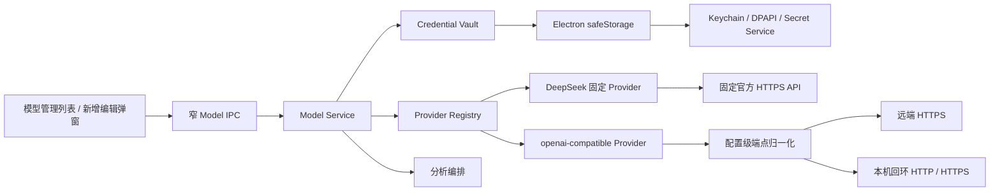
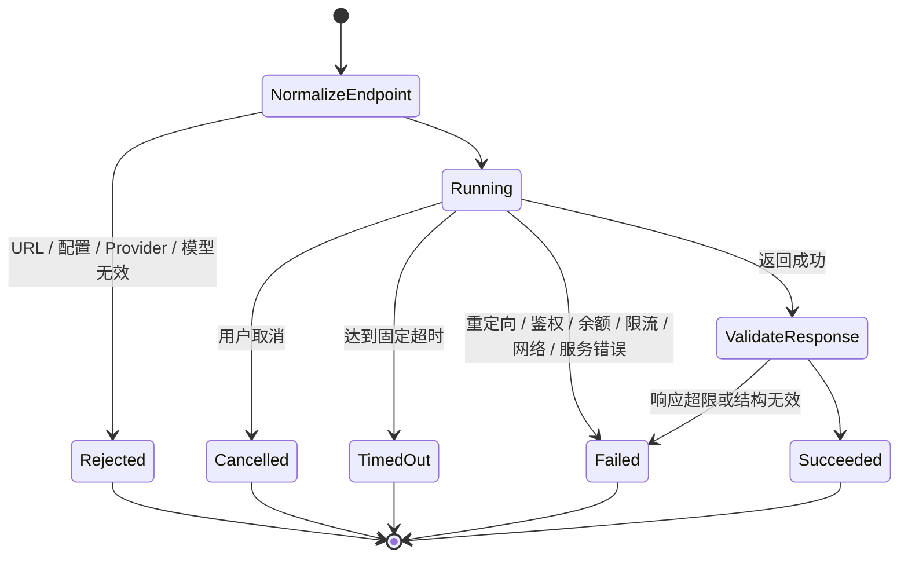

# 模型接入与安全存储-DEV-0010-v1.0

## 1. 文档信息

| 项目 | 内容 |
| --- | --- |
| 关联需求 | [单素材分析-REQ-0005-v1.0](../requirements/单素材分析-REQ-0005/单素材分析-REQ-0005-v1.0.md) |
| 关联任务 | `APP-0012`（固定 DeepSeek Provider）、`APP-0016`（用户自定义 OpenAI 兼容 API）、`APP-0017`（唯一入口与关键原型映射） |
| 首版接入 | DeepSeek 官方 API 固定地址；自定义 OpenAI 兼容 Bearer API 由用户填写端点和模型 ID |
| 发布单元 | macOS、Windows 共享 TypeScript 业务代码；Windows x64 系统安全存储、安装、升级和卸载仍需真机验收 |

## 2. 目标与非范围

`APP-0012` 建立 BYOK、Provider Registry、Model Service、系统安全存储和 DeepSeek 固定 Provider。`APP-0016` 在不改变这些安全不变量的前提下增加“模型管理”：用户可以在已保存配置列表中新增、编辑、测试刷新、选择默认模型和删除配置；新增 / 编辑通过弹窗完成。DeepSeek 地址继续由代码固定，自定义配置则要求用户明确填写 API Base URL 或完整 `/chat/completions` 地址、API Key 和模型 ID。

`APP-0017` 不新增模型协议或业务实现，只把入口与交互合同追踪到主 PRD 的两张关键原型：应用级模型管理入口唯一位于左侧栏底部并标注“模型管理 / BYOK”；新建分析因模型不可用时提示用户使用该入口，用户完成或取消操作后点击侧栏“新建分析”返回，App 顶层状态保留分析草稿。

自定义接入首版只支持 OpenAI 兼容的 Bearer API：`GET /models` 和 `POST /chat/completions`。不支持供应商大全或套餐预置、自动扫描 / 编辑本地 JSON 配置、任意协议、任意 Header、查询参数鉴权、非 Bearer 鉴权、分别填写模型列表与完成地址、代理中转、共享 Key、模型竞价 / 自动路由、静默重试 / 切换或原始图片、视频和音频直传。参考图只提供列表和弹窗的交互方向，不把其中的导航、供应商清单、本地路径或产品文案直接纳入本产品。

本工作包不修改分析模板、证据组装、报告 schema、记录保存、产品库或媒体解析。分析运行继续锁定用户显式选择的配置与模型；模型管理成功不等于第三方服务、完整分析链路或发布验收完成。

## 3. 架构与扩展边界

页面和分析编排只使用稳定的 Provider / Model Service 合同，不读取供应商私有响应，也不持有 API Key。DeepSeek 使用固定 Provider 信息和官方 OpenAI 兼容接口；`openai-compatible` 是一个通用 Provider 类型，其实际端点来自当前配置，而不是把每个用户地址注册为新供应商。每次模型调用必须同时给出 configuration ID 和 model ID，服务从该配置解析 Provider、凭据及规范化端点，避免页面或分析参数临时替换地址。

DeepSeek 官方接口参考：[模型列表](https://api-docs.deepseek.com/api/list-models/)、[Chat Completion](https://api-docs.deepseek.com/api/create-chat-completion)、[错误码](https://api-docs.deepseek.com/quick_start/error_codes/)。自定义端点是否真正兼容、是否可达以及数据处理规则由其运营方决定；通用合同不能等同于对该第三方的认证。

### 3.1 自定义 URL 归一化与网络策略

用户可输入下列两种形式，保存前都归一化为不带结尾 `/` 的 API Base URL：

- Base URL，例如 `https://example.test/v1`；
- 完整完成地址，例如 `https://example.test/v1/chat/completions`，仅剥离末尾 `/chat/completions`，保留 `/v1` 等路径前缀。

规范化后，模型列表固定请求 `{baseUrl}/models`，完成固定请求 `{baseUrl}/chat/completions`。首版不支持两个接口使用不同根路径；若供应商不满足该约定，需要后续新增受控 Adapter，而不是让用户拼接任意请求。

端点必须同时满足：

1. 远端主机只允许 `https:`；`http:` 只允许精确的 `127.0.0.1`、`localhost` 或 `::1` 回环主机，不能用局域网 IP、`0.0.0.0` 或相似域名代替。
2. 拒绝 URL 用户名 / 密码、query 和 hash，API Key 只进入 `Authorization: Bearer …`。
3. `/models` 与 `/chat/completions` 都设置 `redirect: error`，不把 Bearer 凭据跟随到跳转目标。
4. 解析、协议和路径校验在发起网络请求前完成；错误地址不保存为可调用配置，也不能靠关闭 TLS 校验或放宽 IPC 绕过。

## 4. 配置与系统安全存储

### 4.1 持久化内容

模型配置保存显示名、Provider ID、上次验证时间、连接状态、可用模型列表和默认模型。`APP-0016` 在密文信封 schema v1 中增加可选 `baseUrl` 与 `manualModelId`：旧 DeepSeek 配置缺少这两个字段时按 `null` 读取，无需迁移；自定义配置在服务层要求二者通过对应校验。API Base URL 与模型 ID 是可在设置页回显核对的非秘密配置，但普通日志和审计不记录完整地址。

API Key 明文只在用户输入、主进程 IPC 参数、`safeStorage` 加解密和单次供应商请求的短生命周期内存中存在，不进入 renderer 回读值、SQLite、报告、导出、日志、任务记录、测试快照或 Git。自定义 Provider 复用与 DeepSeek 完全相同的凭据路径，不另建明文配置文件。

客户端使用 Electron 异步 `safeStorage`。macOS 的加密密钥由 Keychain 保护，Windows 使用 DPAPI；应用数据目录只保存无法独立解密的密文信封，并收窄为当前用户读写权限。安全能力不可用时拒绝新建、读取和调用，不回退为明文。Linux 若报告 `basic_text` 或未知后端同样 fail closed。实现依据：[Electron safeStorage](https://www.electronjs.org/docs/latest/api/safe-storage)。

密文信封采用 schema v1 和原子替换；写入先创建随机临时文件，成功后替换正式文件。并发操作串行化，且编辑、默认模型变更、连接状态刷新和删除都校验递增的 `writeVersion`；旧窗口使用过期版本写入时明确返回配置已变更，不覆盖新内容。信封损坏时保留原文件并返回安全存储不可用，不自动重建空文件覆盖凭据。密钥轮换要求重新加密时，在同一受控操作中写回新密文。

### 4.2 配置生命周期与模型合并

1. 新建必须提供 Provider、显示名和 API Key；自定义 Provider 还必须提供端点与手填模型 ID。编辑时 Key 留空表示保留原凭据。
2. DeepSeek 端点不可编辑；自定义地址在保存前按 3.1 节归一化并展示给用户核对。
3. 保存先安全持久化，再用该配置执行一次 `GET /models`。保存和“测试并刷新”都不得自动调用可能产生模型生成费用的 `/chat/completions`。
4. `GET /models` 成功后，发现结果与 `manualModelId` 按模型 ID 精确去重合并，并显式选中手填项。手填项不因发现结果未列出它而被替换。
5. 首次发现失败时保留 `manualModelId` 和密文配置、把连接状态记为失败，但不把手填声明伪装成已验证的 `availableModels`，默认模型保持未选择。用户编辑后重试或再次“测试并刷新”；失败不删除配置，也不显示成连接正常。
6. 用户修改 Key、端点或手填模型时，旧连接状态和旧发现列表失效并重新验证。网络、鉴权或列表失败保留可恢复信息，允许用户重试或删除。
7. 用户显式选择默认模型；每次分析仍保存当次 configuration ID 和 model ID。已选配置被删除或已选模型不再可用时，要求用户重新决定，不按列表顺序静默替代。
8. 删除前显示准确配置名；确认后同时删除配置元数据与密文，新任务不可再用。历史报告只保存显示摘要，不依赖该 Key。

## 5. Model Service 与调用合同

`ModelService.complete` 是主进程内部能力，不通过 preload 暴露任意 Prompt 调用。调用输入包含配置 ID、模型 ID、角色消息、`text / json` 格式、最大输出、思考模式和可选温度；字符串数量、总字符、消息数、数值范围均有上限。服务读取明确配置，验证请求模型属于该配置最近一次成功的手填 / 发现合并结果，再只调用对应 Adapter 一次。

DeepSeek Adapter 可以映射其受控扩展参数；通用 `openai-compatible` Adapter 只发送首版共同字段，不发送 DeepSeek 专用 `thinking` 字段，也不允许用户注入任意 Header 或请求字段。模型响应只转换为正文、finish reason、实际模型 ID、Provider ID、system fingerprint 和 token 用量。供应商可能提供的 reasoning content 不进入正式合同，避免暴露或持久化内部推理。JSON 模式仍必须按固定业务 schema 校验，不能因为供应商声称兼容或返回 JSON 就直接信任内容。

调用审计只记录配置 ID 及写入版本、Provider、模型、Adapter 版本、时间、耗时、状态和安全错误码；不记录 API Key、完整自定义 URL、消息原文、Prompt、模型正文、HTTP Body、供应商原始错误正文或 Authorization Header。

## 6. 取消、超时、错误、外发与费用边界

错误映射区分端点无效 / 被策略拒绝、重定向、鉴权、余额、限流、网络、服务、超时、取消、响应无效、配置缺失、模型不可用和安全存储不可用。供应商原始错误正文不会返回页面。`/models` 使用受控超时；完成调用使用独立受控超时。后续如按模型能力调整，必须版本化并在运行前可见。

保存和刷新只向用户填写的端点发送 Bearer Key 并读取模型列表，不发送素材、Prompt 或报告内容，也不发起 completion。真正开始分析后，结构化文本证据、Prompt 和业务上下文会发送到用户当次选定的配置地址，供应商或自建端点运营方可能存储、处理或继续转移这些数据；客户端不能替第三方承诺留存、训练或地域政策。首版不上传原始媒体。

服务不自动重试，不更换配置，不切换模型，也不在失败后产生第二次完成调用。模型生成费用由用户自己的供应商账号承担；保存 / 刷新不主动产生生成费用，但不能替第三方保证模型列表请求、网络或账号完全免费。客户端不写死价格，也不把“连接正常”等同于余额、模型权限、费率或完成能力已验收。

## 7. UI 与失败恢复

### 7.1 唯一入口与顶层草稿保留

左侧栏底部是全应用唯一持久模型入口，按钮和页标题分别显示“模型管理 / BYOK”和“模型管理”。新建分析在没有可用模型时只显示原因和侧栏提示，不增加可点击深链或第二条设置路由；模型管理页也不增加页面级关闭按钮。页面显示系统安全存储状态、已保存配置列表和“添加模型”；配置项提供默认模型选择、“测试并刷新”、编辑和带确认的删除。

App 顶层状态在 `page` 切换期间继续持有素材会话、行业、产品、转化依据和当前模型选择，不把草稿写进模型配置或分析记录。配置保存、刷新、默认选择或删除成功后由模型管理页通知顶层刷新配置摘要，并以 configuration ID / model ID 重新校验当前模型；原选择已失效时只清空模型项，不能清空其他草稿字段，也不能自动开始分析。保存已落盘但 `/models` 验证失败时保留配置的失败状态，且不把它列为新建分析的可用模型。

用户完成或取消模型页内操作后，显式点击左侧栏“新建分析”返回；页面不自动跳转，也不依赖 `returnTarget`、浏览器历史或页面级关闭回调。切换到模型管理不得释放仍由顶层草稿引用的素材会话；真正移除素材或关闭应用时再按媒体生命周期释放。

### 7.2 列表与弹窗

新增 / 编辑使用可关闭的模态弹窗，包含 Provider、条件式 API 地址、配置名称、密码型 API Key 和条件式模型 ID。

DeepSeek 不显示可编辑端点；选择“自定义 OpenAI 兼容 API”时显示地址与模型 ID。API Key 可临时切换可见性，保存后立即清空，编辑时永不回显旧值。关闭、取消或校验失败不会暗中修改其他配置；保存成功但 `/models` 验证失败时关闭弹窗并在列表页保留配置和失败信息，用户可编辑后重试或点击“测试并刷新”。

页面覆盖加载、空列表、安全存储不可用、保存中、保存成功、验证失败、刷新、编辑、删除确认和删除失败。弹窗使用可识别标题、`aria-modal`、可关联表单标签、键盘关闭与合理的焦点返回；状态和错误使用可感知语义。最终 macOS / Windows 客户端仍需键盘、读屏和缩放人工复验。

### 7.3 原型与实现映射

| 原型 | 文件 | 技术映射 | 产品与验收追踪 |
| --- | --- | --- | --- |
| P-06 模型管理列表 | [prototype-model-management.png](../requirements/单素材分析-REQ-0005/assets/prototype-model-management.png) | 左侧栏底部唯一入口、经侧栏“新建分析”返回、App 顶层草稿、`ModelSettingsPage` 配置摘要、安全存储状态、刷新 / 编辑 / 默认模型 / 删除 | PRD 10.1～10.2、11.4；AC-14、AC-24、AC-29～AC-30、AC-51 |
| P-07 添加自定义模型弹窗 | [prototype-add-custom-model.png](../requirements/单素材分析-REQ-0005/assets/prototype-add-custom-model.png) | `aria-modal`、Provider 条件字段、Key 不回显、URL 本地校验、窄 IPC、`GET /models` 保存验证与错误恢复 | PRD 10.2、11.4；AC-29～AC-30、AC-51～AC-52 |

用户提供的参考图只作为模型列表、添加弹窗和字段分组的布局方向。原型采用当前 Material 客户端自己的侧栏、颜色、组件和安全文案；不复制参考图中的系统设置导航、供应商大全 / 套餐分类、本地 JSON 路径或其他产品的文档与品牌文案。原型中的 OpenAI 兼容限制来自 APP-0016 已确认协议边界，不是从参考产品推导的新要求。原型图表达布局和状态，不替代本文件的 URL、安全存储、数据外发、费用或失败恢复合同。

## 8. 验证要求与当前限制

自动化必须覆盖：

- schema v1 旧 DeepSeek 信封无迁移可读，以及新增可选字段往返不丢失；
- API Base URL / 完整 completion URL 等价归一化，保留 `/v1` 前缀；
- 远端 HTTP、非回环 HTTP、URL 凭据、query、hash、非 HTTP(S) 协议和重定向均在发送凭据前失败；
- `GET /models` 成功后与手填模型 ID 合并、精确去重、刷新变化及显式选择，失败时不伪造可用模型；
- 保存 / 刷新请求次数断言为仅模型列表请求、零 completion；
- 通用 Adapter 只发 Bearer 和共同请求字段，DeepSeek 专用字段不外泄；
- 密文持久化不含哨兵 Key、摘要不回传 Key、错误和审计不含 Key / 完整 URL / 请求正文；
- 并发保存、编辑留空保留凭据、修改连接字段使旧状态失效、删除立即失效、损坏信封 fail closed、无静默重试 / 切换。
- 左侧栏只有一个持久“模型管理 / BYOK”入口；新建分析只有不可用原因和侧栏提示，模型管理页没有页面级关闭按钮；
- 用户完成或取消操作后点击侧栏“新建分析”返回，往返前后素材会话、行业、产品和转化依据草稿一致；配置变化触发顶层刷新且只校验 / 清空失效模型项，不开始分析；
- 添加 / 编辑弹窗的取消、遮罩、Escape、输入错误和保存失败覆盖零误写、焦点恢复、Key 不回显和可继续恢复。

`APP-0012` 曾有一次范围受限的 DeepSeek 官方 HTTPS 开发验证；它不代表第三方服务、生产账号、分析质量或发布验收。`APP-0016` 不把模拟 HTTP 合同或本地回环测试声称为真实第三方自定义端点验收。`APP-0017` 增加的是原型和入口追踪，不能用图片或文档链接替代上述 UI 行为测试。当前仍未完成 Windows x64 真机 Credential Manager / DPAPI、真实安装包升级 / 卸载、Keychain 锁定 / 拒绝授权、离线启动、多窗口实际 UI、供应商流式响应和各类自定义供应商真机验证；共享测试与 Electron package 不能替代这些结果。

## 9. 兼容、回退与后续接入

schema v1 的 `baseUrl` 和 `manualModelId` 是可选字段，旧 DeepSeek 配置缺失时按 `null` 处理，现版本仍可直接使用。回退到只认识 APP-0012 的旧客户端时，`openai-compatible` 配置因 Provider / 字段未知而不可调用或应显示不可用，但密文信封和 API Key 必须原样保留；旧版不得为“修复”而删除、清空或重建配置。重新升级后可恢复读取。真正删除用户配置只能由用户在设置页确认。

若 Adapter 或自定义端点故障，只停用 / 标记对应配置，不删除凭据，不迁移或回写产品库、分析记录和素材引用。回退代码不处理用户数据，排障见 [模型连接与凭据-TRB-0007-v1.0](../troubleshooting/模型连接与凭据-TRB-0007-v1.0.md)。

后续若支持非标准模型列表路径、其他鉴权、额外 Header、不同 completion 协议或媒体能力，必须新增受控 Provider / Adapter 合同，单独核对官方域名、数据外发、价格 / 账号、错误、取消、上下文、许可和停服风险，不能把任意请求构造能力直接暴露给 renderer。
