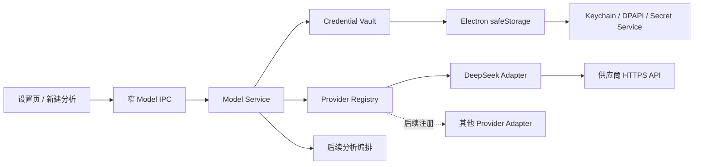
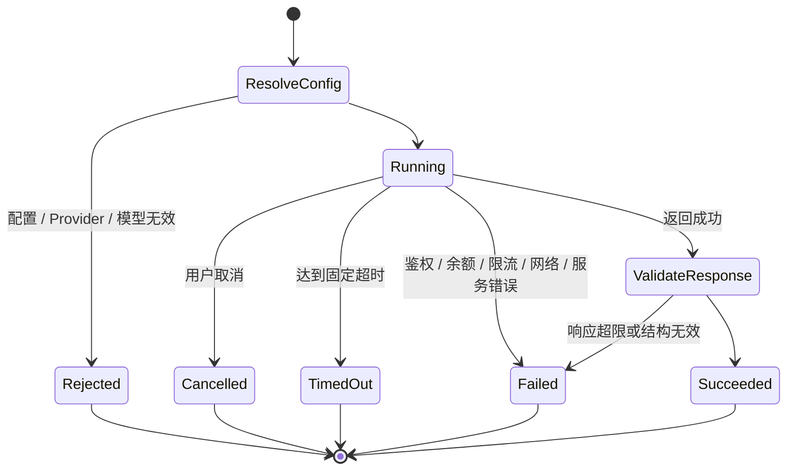

# 模型接入与安全存储-DEV-0010-v1.0

## 1. 文档信息

| 项目 | 内容 |
| --- | --- |
| 关联需求 | [单素材分析-REQ-0005-v1.0](../requirements/单素材分析-REQ-0005/单素材分析-REQ-0005-v1.0.md) |
| 关联任务 | `APP-0012` |
| 首个供应商 | DeepSeek 官方 API；后续供应商通过相同 Provider Adapter 合同增加 |
| 发布单元 | macOS、Windows 共享 TypeScript 业务代码；当前完成 macOS 开发机真实 API 验证，Windows 系统安全存储和安装包仍需真机验收 |

## 2. 目标与非范围

本工作包完成首个可用的用户自带 Key 模型接入：用户可以在“模型与工具设置”创建、编辑、验证、切换和删除 DeepSeek 配置；客户端动态读取当前可用模型，新建分析可以显式选择“配置 + 模型”。主进程提供可扩展 Provider Registry、Model Service、普通文本 / JSON 完成、取消、超时、统一错误、用量和不含原文的审计合同。

当前不实现分析 DAG、固定行业模板、媒体证据组装、报告生成、对话运行、运行中切换、报告确认保存、模型竞价 / 路由、静默重试、自动切换、图片直传、项目共享 Key、自建代理、费用代付或发布。即使素材、行业和模型都已就绪，“开始分析”仍准确保持不可运行，避免把配置成功伪装成报告链路完成。

## 3. 架构与扩展边界

供应商差异只存在于 `ModelProviderAdapter`。页面、后续编排和报告不读取 DeepSeek 私有响应，也不持有 API Key。新增供应商时注册一个稳定 ID、显示名、固定 HTTPS Base URL、Adapter 版本、模型列表和完成方法；不得在页面、模板或报告 schema 中增加供应商分支。

DeepSeek 当前使用官方 OpenAI 兼容的 `GET /models` 与 `POST /chat/completions`。模型列表运行时发现，不永久写死旧模型名；每次调用必须同时给出 configuration ID 和 model ID。首个适配只接受代码注册的固定 Base URL，不允许 renderer 输入任意地址，从而避免把 Bearer 凭据发送到不可信主机。官方接口参考：[模型列表](https://api-docs.deepseek.com/api/list-models/)、[Chat Completion](https://api-docs.deepseek.com/api/create-chat-completion)、[错误码](https://api-docs.deepseek.com/quick_start/error_codes/)。

## 4. 配置与系统安全存储

### 4.1 持久化内容

模型配置保存显示名、供应商 ID、上次验证时间、连接状态、动态模型列表和默认模型。API Key 明文只在用户输入、主进程 IPC 参数、`safeStorage` 加解密和单次供应商请求的短生命周期内存中存在，不进入 renderer 回读值、SQLite、报告、导出、日志、任务记录、测试快照或 Git。

客户端使用 Electron 异步 `safeStorage`。macOS 的加密密钥由 Keychain 保护，Windows 使用 DPAPI；应用数据目录只保存无法独立解密的密文信封，并收窄为当前用户读写权限。安全能力不可用时拒绝新建、读取和调用，不回退为明文。Linux 若报告 `basic_text` 或未知后端同样 fail closed。实现依据：[Electron safeStorage](https://www.electronjs.org/docs/latest/api/safe-storage)。

密文信封采用 schema v1 和原子替换；写入先创建随机临时文件，成功后替换正式文件。并发操作串行化，且编辑、默认模型变更、连接状态刷新和删除都校验递增的 `writeVersion`；旧窗口使用过期版本写入时明确返回配置已变更，不覆盖新内容。信封损坏时保留原文件并返回安全存储不可用，不自动重建空文件覆盖凭据。密钥轮换要求重新加密时，在同一受控操作中写回新密文。

### 4.2 配置生命周期

1. 新建必须提供供应商、显示名和 API Key；编辑时 Key 留空表示保留原凭据。
2. “保存并验证”先安全保存，再用该配置读取模型列表；联网失败不删除刚保存的凭据，配置显示失败状态并允许用户重试或删除。
3. 连接成功保存模型列表及默认模型；用户可以调整默认项，但每次分析仍显式保存当次模型选择。
4. 更换 Key 后清空旧连接状态和旧模型列表，重新验证前不可用于新调用。
5. 删除前显示准确配置名；确认后同时删除配置元数据与密文，新任务不可再用。历史报告只保存显示摘要，不依赖该 Key。

## 5. Model Service 与调用合同

`ModelService.complete` 是主进程内部能力，不通过 preload 暴露任意 Prompt 调用。调用输入包含配置 ID、模型 ID、角色消息、`text / json` 格式、最大输出、思考模式和可选温度；字符串数量、总字符、消息数、数值范围均有上限。服务先读取明确配置，再验证模型存在于该配置最近一次成功发现的列表中，只调用对应 Adapter 一次。

模型响应只转换为：正文、finish reason、实际模型 ID、供应商 ID、system fingerprint 和 token 用量。供应商可能提供的 reasoning content 不进入正式合同，避免暴露或持久化内部推理。JSON 模式由适配器映射为供应商的结构化输出参数，后续报告模块仍必须按固定业务 schema 校验，不能因为供应商声称 JSON 就直接信任内容。

调用审计只记录配置 ID 及写入版本、供应商、模型、Adapter 版本、时间、耗时、状态和安全错误码；不记录 API Key、消息原文、Prompt、模型正文、HTTP Body、响应错误正文或 Authorization Header。

## 6. 取消、超时、错误与费用边界

错误映射区分鉴权、余额、限流、网络、服务、超时、取消、响应无效、配置缺失、模型不可用和安全存储不可用。供应商原始错误正文不会返回页面，避免泄漏请求详情。`/models` 固定 30 秒超时，完成调用固定 180 秒超时；后续如按模型能力调整，必须版本化并在运行前可见。

服务不自动重试，不更换配置，不切换模型，也不在失败后产生第二次远程费用。用户可在界面明确重试或选择其他已配置模型。调用费用由用户自己的供应商账号承担；当前设置页只验证连接和模型列表，真实最小完成测试仅用于本工作包验收。供应商价格可能变化，客户端不写死金额。

## 7. UI 与状态

侧栏“模型与工具设置”成为可操作入口。设置页覆盖加载、空配置、安全存储不可用、保存中、保存成功、连接失败、刷新、编辑、删除确认和删除失败。API Key 输入使用密码字段，保存后立即清空，编辑时永不回显旧值。配置卡只显示安全状态、连接状态、最近检查时间、模型列表和操作。

新建分析从所有连接成功且有可用模型的配置生成选择项，显示“配置名 · 模型 ID”。已选配置被删除、Key 更换或模型下线后，选择自动清空并要求用户重新决定；不会按默认顺序静默替代。当前设置页面支持键盘焦点、原生表单标签、状态 role 和错误 role；最终 macOS / Windows 客户端仍需键盘、读屏和缩放人工复验。

## 8. 第三方配置文件使用边界

用户提供的配置文件仅作为本次开发验证输入。实现读取其中的 `KEY` 进行一次官方 `/models` 和最小 JSON 完成测试；测试 Prompt 不含素材、产品、对话或个人信息。文件中的文档链接只用于确认官方来源，`Tracking ID` 不是官方 Bearer 鉴权参数，因此不保存、不发送，也不成为产品字段。

产品代码没有硬编码该文件路径、用户名、KEY、Tracking ID 或配置名，也没有“扫描密码目录”或自动导入功能。正式使用由用户在设置页主动创建配置。若后续需要文件导入，必须另立需求定义格式、预览、去重、覆盖、删除和错误恢复，不能把一次性开发文件变成隐式产品接口。

## 9. 验证结果与限制

自动化覆盖：密文持久化不含哨兵 Key、配置摘要不回传 Key、并发保存不丢数据、编辑保留旧凭据、删除立即失效、损坏信封 fail closed、供应商注册、动态模型列表、显式单模型调用、无静默重试、错误脱敏、结构化完成和 token 用量。专用运行时测试覆盖完整 HTTP 请求 / 响应合同。

本工作包还使用用户提供的 DeepSeek Key 完成了真实官方 HTTPS 验证：动态模型列表成功返回，随后一个禁用思考、32 token 上限、无素材内容的 JSON 完成成功。测试输出未记录 KEY、Tracking ID、模型正文或原始 HTTP 内容。

当前没有完成 Windows x64 真机 Credential Manager / DPAPI、真实安装包升级 / 卸载、Keychain 锁定 / 拒绝授权、离线启动、多窗口实际 UI、超长真实分析、供应商流式响应或其他模型供应商验收。共享 TypeScript 测试与 Electron package 不能替代这些真机结果。

## 10. 兼容、回退与后续接入

配置文件 schema v1 遇到未知或损坏内容会停止使用，不静默降级。回退本代码不会删除密文配置；旧版本若不认识该文件应忽略。若 Adapter 故障，只停用对应配置，不删除凭据。真正删除用户配置只能由用户在设置页确认。

代码回退范围是 `apps/desktop/src/model/`、Model IPC / preload / UI 接线、样式和文档；不迁移或回写产品库、分析记录和素材引用。排障见 [模型连接与凭据-TRB-0007-v1.0](../troubleshooting/模型连接与凭据-TRB-0007-v1.0.md)。

后续增加供应商时单独注册 Adapter，核对官方域名、鉴权方式、中国大陆可达性、发送数据类型、模型能力、价格 / 账号、错误、取消、上下文限制和安全存储复用。分析实现再把固定模板、M01～M08 证据与 `ModelService.complete` 组装为明确 DAG；不能把模型配置工作包扩大成报告生成。
