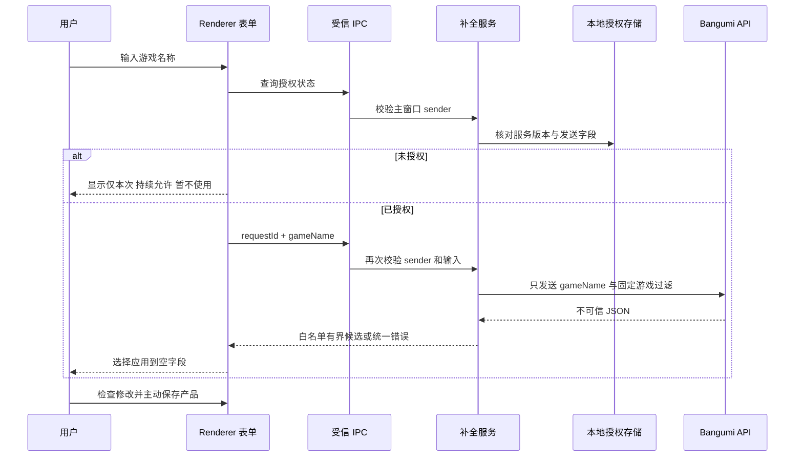

# 游戏产品联网补全-DEV-0023-v1.0

## 1. 文档信息

| 项目 | 内容 |
| --- | --- |
| 关联需求 | [产品库-REQ-0003-v1.0](../requirements/产品库-REQ-0003/产品库-REQ-0003-v1.0.md) |
| 关联任务 | `APP-0031`、`APP-0033` |
| 实现范围 | 游戏名称联网查询、授权、结构化候选和未保存表单回填 |
| 发布单元 | macOS、Windows 共享 TypeScript 业务代码；最终发布仍需单独决定 |

## 2. 实现结果与非范围

本工作包在现有产品库的新建与编辑表单中实现游戏联网补全。游戏名称达到 2 个字符后，在停顿 650 毫秒或输入框失焦时进入授权或查询；候选显示来源、获取时间、游戏类型、平台、发售日期和有界简介。用户点击“应用建议”后，仅填入当前草稿的空字段，仍需主动点击产品表单的“保存”才会进入产品库。

本工作包不实现自动建产品、自动保存、自动覆盖非空字段、自动合并重复产品、封面下载、外部链接打开、模型调用、项目共享密钥、自建搜索后端、付费搜索、批量补全或最终发布。

## 3. 首个可替换数据源

首个适配器使用 Bangumi 新公开 API 的固定 `POST /v0/search/subjects` 游戏搜索，发送体只包含规范化后的 `keyword` 和固定的 `type = 4`、`nsfw = false` 过滤条件。实现依据为 [Bangumi API 官方仓库](https://github.com/bangumi/api) 与其 [OpenAPI v0 定义](https://github.com/bangumi/api/blob/master/open-api/v0.yaml)。请求使用官方要求的可识别 `User-Agent`，规则见 [Bangumi User Agent 文档](https://github.com/bangumi/api/blob/master/docs-raw/user%20agent.md)。

该搜索接口被上游标记为实验性能力，因此 `BangumiGameSearchAdapter` 只是供应商适配层，不是产品数据真值。上游 schema、可达性或政策变化时，适配器明确返回统一失败，不允许把未知数据直接透传到表单；以后替换数据源不改变授权、候选和用户主动保存合同。

## 4. 数据流与信任边界

renderer 不能直接访问网络适配器或授权文件。主进程同时校验 Electron `webContents` 来源和授权状态，因此修改 renderer 状态不能绕过授权。每个请求使用独立 `requestId` 和 `AbortController`；名称变化、用户取消、窗口销毁或关闭授权都会终止当前 sender 的请求，过期响应不会改写当前表单。

## 5. 模块与合同

| 模块 | 职责 |
| --- | --- |
| `product-enrichment/types.ts` | 供应商无关的授权、候选、错误和 IPC 合同 |
| `bangumi-adapter.ts` | 固定域名、请求格式、HTTP 分类、响应限额和字段映射 |
| `consent-store.ts` | 仅当前 OS 用户的持续授权原子持久化 |
| `service.ts` | sender 隔离、一次授权消费、超时、取消和适配器编排 |
| `ipc.ts` | 主窗口 sender 校验、输入收窄和公共错误归一化 |
| `form-merge.ts` | 仅把候选写入游戏草稿的空白名单字段 |
| `query-scheduling.ts` | 抑制授权按钮已主动发起查询对应的单次自动重复调度 |
| `GameProductEnrichmentPanel.tsx` | 授权、加载、候选、空、失败、取消和关闭状态 |

候选不包含外部图片、外部 URL、原始标签、提示词或未识别 infobox。当前允许的候选字段只有显示名称、游戏类型、平台、发售日期和简介；候选源 ID 只用于当前渲染键与来源说明，不会自动形成产品身份。

## 6. 授权语义

- 授权合同绑定 `provider id + provider version + sentFields = [gameName]`。任一项变化都会失效并重新询问。
- “仅本次允许”只在当前 renderer 内存中存在，并在发出一次网络请求前消费；请求失败或取消也不会静默复用。
- 授权按钮会直接发起唯一一次强制查询；同一次授权状态更新不得再调度第二个自动查询。该抑制仅消费一次且只匹配当时的规范化名称，名称变化仍正常触发新查询。
- “持续允许”写入 `userData/game-product-enrichment/consent.json`，只保存非秘密的合同与授权时间，不保存游戏名称、搜索结果或凭据。
- “暂不使用”只关闭当前窗口会话的补全，本地产品增删改查和手工保存继续可用。
- 用户可在补全区关闭持续授权；操作会清除持久授权、取消当前请求并进入本次关闭状态。
- 窗口销毁时清理一次授权、拒绝状态和该 sender 的所有请求。

授权文件采用 4 KiB 上限、普通文件与非符号链接检查、临时文件原子替换和 `0600` 权限。文件缺失、损坏、超限或合同不匹配都失败关闭为“未授权”。它不是凭据，不进入系统安全存储；本实现也没有搜索 API Key。

## 7. 外部响应安全

- 请求固定为 `https://api.bgm.tv/v0/search/subjects?limit=5&offset=0`，禁止跟随重定向。
- 响应必须成功且为 JSON；声明或实际响应超过 512 KiB 时中止并拒绝。
- 只读取最多 5 个 `type = 4` 的 subject；ID、名称和字段类型不合法的条目被丢弃。
- 文本做 NFKC、控制字符与双向文本控制符清理、HTML 标签剥离、空白归一化和字段长度裁剪。
- 平台最多 8 项，简介最多 500 字符；不展示或打开上游图片、链接与用户标签。
- 401 / 403 等非成功响应归为不可识别响应；429 映射限流；5xx 映射服务不可用；网络失败映射离线；内部响应正文与异常不进入用户消息。

外部文本始终是可编辑建议。即使通过安全清理，也不能作为已经核实的产品事实自动保存。

## 8. UI 状态与恢复

| 状态 | 展示与操作 | 恢复 |
| --- | --- | --- |
| 名称不足 | 提示输入至少 2 个字符 | 继续输入或完整手填 |
| 未授权 | 服务方、用途、唯一发送字段；三种选择 | 授权一次、持续授权或暂不使用 |
| 查询中 | 当前查询名称、取消 | 取消后可重试或手填 |
| 有候选 | 来源、获取时间、结构化字段、应用按钮 | 用户选择；只填空字段 |
| 无候选 | 明确说明无可靠候选 | 调整名称、重试或手填 |
| 超时 / 离线 / 限流 / 服务失败 | 只在补全区显示统一消息 | 重试或手填，产品表单不丢失 |
| 持续授权 | 显示关闭入口 | 清除授权并取消当前请求 |
| 已应用 | 列出实际填入字段；说明保存前可编辑 | 修改、删除或正常保存 |

应用候选不会修改用户已输入的游戏名称，也不会覆盖任何非空字段。当前白名单回填目标是“游戏类型、平台、发售日期、游戏简介”；字段全部非空时明确显示“未自动覆盖”。

## 9. 错误、日志与隐私

公共错误码为 `CONSENT_REQUIRED`、`INVALID_INPUT`、`INVALID_RESPONSE`、`OFFLINE`、`PROVIDER_UNAVAILABLE`、`RATE_LIMITED`、`REQUEST_CANCELLED`、`TIMEOUT` 和 `UNKNOWN`。所有错误都只影响补全区；产品库本地保存仍按原有校验执行。

实现不记录完整游戏名称、请求体、响应正文、候选、文件路径或凭据。调试时只允许使用错误分类与不含内容的时序证据。本功能不把网络内容写入产品数据库；只有用户点击应用、检查表单并主动保存后，所选字段才作为普通产品内容持久化。

## 10. 验证

`npm --prefix apps/desktop run test:product-enrichment` 固定运行适配器、授权存储、服务、IPC 和表单合并测试，覆盖：

- 授权前与未受信 sender 的零请求；
- 一次授权只放行一次，持续授权可读回并可清除；
- 服务版本变化导致授权失效；
- 固定 HTTPS 端点、游戏过滤、无共享密钥和禁止重定向；
- 不可信 HTML、控制字符、标签、图片、链接和超大响应不被透传；
- 限流、服务错误、离线、取消与超时的稳定分类；
- 候选只填空字段，不改游戏名称和服饰草稿。
- 仅本次授权触发的强制查询与授权状态渲染不会形成重复请求；抑制只消费一次，且不会吞掉变化后的游戏名称。

完整实现由 `taskctl run-required APP-0031` 验证初始功能，`APP-0033` 对本地真实客户端发现的一次授权重复调度问题重新执行同等门禁。macOS 本地通过不能替代 Windows PR CI 与真机发布验收。

## 11. 回退与后续

代码回退可移除 `product-enrichment` 模块、preload API、主进程注册和表单面板，产品库 SQLite schema 不需要回退。授权文件是可删除的非秘密偏好；旧客户端不会读取，也不会影响产品数据。回退前不删除或改写用户产品数据库。

残余风险包括中国大陆不同网络环境的实时可达性、实验性上游 schema 变化和候选事实准确度。发布前需在目标网络与 macOS / Windows 安装包内验证一次真实查询；若不可达，保持手填降级并以新任务接入另一可替换适配器，不得静默切换供应商或复用旧授权。
