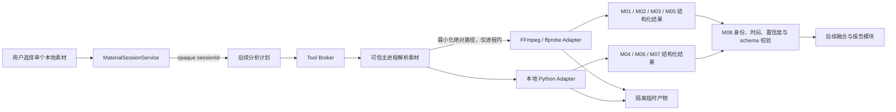
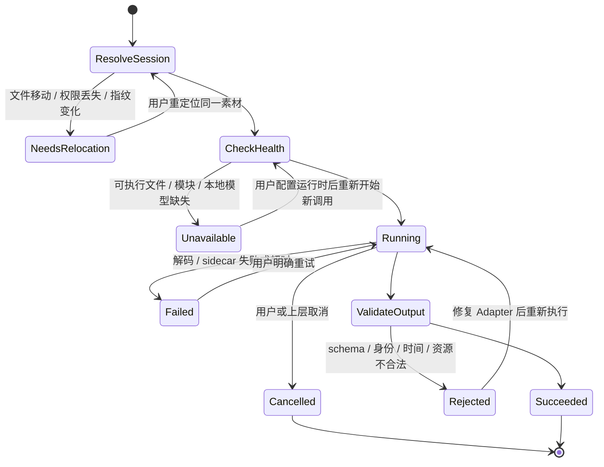

# 确定性媒体解析-DEV-0009-v1.0

## 1. 文档信息

| 项目 | 内容 |
| --- | --- |
| 关联需求 | [单素材分析-REQ-0005-v1.0](../requirements/单素材分析-REQ-0005/单素材分析-REQ-0005-v1.0.md) |
| 关联任务 | `APP-0011` |
| 依赖底座 | [工具执行底座-DEV-0008-v1.0](工具执行底座-DEV-0008-v1.0.md)、[本地素材会话-DEV-0007-v1.0](本地素材会话-DEV-0007-v1.0.md) |
| 发布单元 | macOS、Windows 共享 TypeScript / Python 合同；当前只完成 macOS 本机运行时验证 |
| 当前范围 | M01～M08 能力实现、版本化注册、真实媒体合同测试、健康检查和证据归一化；M04 / M06 / M07 的后续生产发行以 [DEV-0022](本地学习型媒体生产运行时-DEV-0022-v1.0.md) 为准 |

## 2. 目标、范围和非范围

本工作包把一个已授权的本地视频或图片转换成可复现、可定位、可校验的结构化媒体证据，供后续固定模板分析、模型融合和报告模块消费。八项能力均通过 Tool Registry 独立注册；分析编排可按媒体类型和能力健康状态选择节点，不需要把 FFmpeg、OCR、ASR 或声音模型写进报告和页面代码。

APP-0011 当时不实现模型厂商语义分析、报告、标签、评分、行业模板、分析记录保存、UI、运行时下载器、模型下载、安装包捆绑、云端解析或发布。M04 / M06 / M07 的版本锁、bundle 组装、逐文件完整性校验与安装包注入现由 [本地学习型媒体生产运行时-DEV-0022-v1.0](本地学习型媒体生产运行时-DEV-0022-v1.0.md) 承接；中国大陆下载源、后台更新和 Windows 最终发布仍需独立任务。缺少运行时或本地模型时必须显示能力不可用，不能伪造结果或隐式联网下载。

## 3. M01～M08 交付映射

| 编号 | Capability ID | 类型 / 必要性 | 稳定输出 |
| --- | --- | --- | --- |
| M01 Media Probe | `media.probe@1.0.0` | builtin / required | 格式、时长、起始时间、码率、视频 / 音频 / 字幕轨、codec、尺寸、旋转、帧率、采样率、声道、time base、运行时版本 |
| M02 Frame Extractor | `media.frame.extract@1.0.0` | builtin / required | 指定时间帧、等间隔代表帧或单张缩略图；临时 PNG 只返回受控相对路径、尺寸和时间点 |
| M03 Shot Detector | `media.shot.detect@1.0.0` | builtin / required | FFmpeg scene score 候选、镜头起止、候选关键帧时间、阈值和置信度；图片不调用 |
| M04 OCR Tool | `media.ocr@1.0.0` | script / optional | 画面文字、归一化区域、图片位置或视频时间点、语言、置信度、运行时版本 |
| M05 Audio Extractor | `media.audio.extract@1.0.0` | builtin / required | 16kHz 单声道临时 WAV、最多 400 点波形、均值 / 峰值音量、集成响度 LUFS、静音区间；无音轨时返回明确空结果 |
| M06 ASR Tool | `media.asr@1.0.0` | script / optional | 语音片段、词级时间、文本、语言和置信度；speaker 固定允许为 `null`，V1 不声称已做说话人分离 |
| M07 Audio Event Tool | `media.audio.event@1.0.0` | script / optional | 音乐、语音、音效和其他事件区间；另给出能量变化形成的节奏变化候选及其限制 |
| M08 Media Evidence Normalizer | `media.evidence.normalize@1.0.0` | builtin / required | 统一证据、shot / OCR / speech / audio 时间线、局限项、素材身份和各运行时 provenance |

M04、M06、M07 失败可以形成降级分析；是否继续由后续分析计划决定。M01、M02、M03、M05、M08 的 `required` 是能力调用合同，不表示每种媒体都必须调用全部节点，例如图片不调用 M03，图片和无音轨视频不会产生音频证据。

## 4. 分层与数据流

renderer 和普通调用方只持有 `sessionId`。主进程在每次工具调用前重新校验文件强指纹、大小和可读状态，再把绝对路径最小化传给固定本地进程。绝对路径不会进入能力输出、Broker 审计、报告或正式记录；工具输出统一携带不含文件名的 `MediaIdentity`，包括 SHA-256 全量指纹、媒体类型和字节数。

## 5. 稳定合同与确定性规则

### 5.1 素材身份与版本

M01～M07 的每份输出均绑定同一 `MediaIdentity`。M08 以 M01 的身份为基准，对所有输入逐一比对；指纹、类型或大小任一不同即以 `SOURCE_CHANGED` 拒绝整批结果，不能把不同素材的证据融合。M08 还输出参与能力的 runtime version 和 schema version；证据自己的 source version 使用稳定的 capability 语义化版本。

Tool schema 新增有界 `anyOf`，仅用于表达 `null` 或稳定类型等必要联合；分支数限制为 2～8，输入和输出仍拒绝未知字段、危险键、无界数组和无效数值。

### 5.2 时间、帧和镜头

- 指定取帧最多 32 个时间点，去重并排序；等于视频结束点时退回最后 1ms，超出时长的点被拒绝。
- 代表帧按 0 到“结束前安全余量”均匀采样，不冒充镜头切分；单张缩略图取中点。最大边限制为 64～4096，输出尺寸为确定的偶数缩放值。
- 镜头检测使用 `select=gt(scene,threshold)` 的场景分数，默认阈值 0.32、最短镜头 300ms。首段置信度为 1 只表示时间轴必有起点，其他段保留场景分数；结果是候选，不是语义镜头真值。
- M08 不截断越界证据。起止时间必须是安全整数且位于 M01 时长内；区间结束不得早于开始，零长度 OCR 结果转换为时间点。

### 5.3 音频基础特征

M05 将有音轨素材转成隔离工作区中的 PCM 16-bit、16kHz、单声道 WAV。波形以流式读取分桶，不把整个长音频载入 Node 内存；最大 400 点。静音默认使用 -35dB、持续至少 300ms 的候选，音量使用 `volumedetect`，集成响度使用 `ebur128` 的最终 LUFS 摘要。临时 WAV 由 Broker 生命周期管理，不保存为素材或分析记录。

### 5.4 本地 OCR、ASR 与声音事件

三个学习型能力使用固定 Python sidecar 的 stdin / stdout JSON 合同，但在 Registry 中仍分别注册、版本化和授权，不暴露通用命令入口。以下内容记录 APP-0011 的初始适配合同；生产依赖、PaddleOCR 3.x API、YAMNet SavedModel 加载和离线进程环境以 [DEV-0022](本地学习型媒体生产运行时-DEV-0022-v1.0.md) 为现行规则。

- OCR 生产适配使用 PaddleOCR 3.x `predict()`，本地模型根目录必须显式包含 `det/` 与 `rec/`；视频未指定时间点时默认对 8 张代表帧 OCR，指定时间点时只处理指定帧。没有模型目录就先失败，不提取帧、不触发默认下载。
- ASR 适配 faster-whisper，本地模型目录必须显式存在，默认 CPU `int8`、VAD 和词级时间。图片或无音轨素材返回 `not-applicable` 空结果，不调用模型。
- 声音事件适配本地 YAMNet SavedModel，通过 TensorFlow 直接加载，不使用运行时网络客户端；分类窗口保留原始置信度。节奏变化采用 480ms 窗、240ms hop 的 RMS 能量差候选，阈值为 6dB；它只能提示强弱变化，输出必须附带“不是 BPM 或节拍真值”的限制。

Python sidecar 的健康检查同时验证 Python、必要模块和本地模型目录。任一缺失均返回有限不可用状态；stderr、异常堆栈、绝对路径和原始文本不对外返回。当前不提供常驻进程、GPU 调度、说话人分离或隐式重试。

## 6. 执行状态、取消和恢复

同一调用中不静默切换运行时、模型或工具，也不自动重试。源素材需要重新定位时沿用本地素材会话的强指纹核验；运行时配置发生变化后创建新的调用和能力快照，不改写已经确认的历史结果。

## 7. 安全、隐私和资源边界

- 所有媒体字节、帧、音频、OCR / ASR 原文和模型输入默认只在本机处理；当前能力不声明 `network:access`。
- FFmpeg / Python 使用绝对可执行文件、参数数组、`shell: false` 和有界 stdout / stderr；调用方不能提供命令、环境变量或产物绝对路径。
- 帧和 WAV 只能写 Broker 分配的隔离目录并受数量、总字节、超时和取消限制。成功消费后显式释放，失败后清理；客户端崩溃只清扫严格命名的过期工作区。
- 运行时原始输出全部视为不可信；TypeScript 转换层限制文本、数组、坐标、置信度和时间，再由 Tool Broker 校验稳定 schema。
- M08 不提升置信度，不把缺失 OCR / ASR / 声音事件伪装为“没有相关内容”，而是给出明确 limitations。

## 8. 第三方许可与发行边界

[FFmpeg 官方法律说明](https://ffmpeg.org/legal.html)指出默认主要采用 LGPL 2.1+，启用 GPL 组件后整体构建受 GPL 约束；具体义务取决于实际构建参数。因此当前工作包只验证可替换路径和版本探测，不选择或分发生产构建。macOS 真实测试临时使用的 FFmpeg 4.4 构建报告含 `--enable-gpl` 与 `--enable-nonfree`，ffprobe 4.4 为经 Rosetta 运行的 x86_64 测试二进制；二者只位于系统临时目录，明确禁止进入安装包。

候选本地组件当前记录为 [PaddleOCR（Apache-2.0）](https://github.com/PaddlePaddle/PaddleOCR)、[faster-whisper（MIT）](https://github.com/SYSTRAN/faster-whisper) 和 [TensorFlow Models / YAMNet（Apache-2.0）](https://github.com/tensorflow/models)。APP-0030 已按 [DEV-0022](本地学习型媒体生产运行时-DEV-0022-v1.0.md) 固定依赖 lock、组件基线、构建输入与逐文件 hash；代码仓许可证仍不自动覆盖模型权重、字典、底层推理引擎或预编译二进制，实际发行必须归档每份输入的许可证据。

## 9. 验证矩阵与当前证据

| 能力面 | 自动化证据 | 当前结论 |
| --- | --- | --- |
| M01 / M02 / M03 / M05 / M08 视频 | 真实生成 2 秒黑白切换、两段正弦与中间静音的 MKV；执行探测、3 帧、镜头候选、WAV / 波形 / LUFS / 静音和归一化 | macOS 本机通过；输出不含素材绝对路径 |
| 图片分支 | 真实生成 PNG；执行探测、缩略图、无音轨结果和图片归一化 | macOS 本机通过；不生成视频时间线或音频证据 |
| M04 / M06 / M07 | APP-0011 的 TypeScript Adapter 单元测试、Python 语法和 sidecar 健康检查；后续证据见 DEV-0022 | 本文只证明初始合同；不得再用本行判断当前生产运行时完成度 |
| M08 Broker 合同 | 通过 Registry + Tool Broker 实际调用，严格校验输入输出 schema | 通过 |
| 身份与时间边界 | 不同 SHA-256 和超时长证据的拒绝测试 | 通过 |
| 共享回归 | `lint`、`typecheck`、普通 Vitest、专用 runtime Vitest、Electron package | 由 `taskctl run-required APP-0011` 统一记录最终结果 |

真实 FFmpeg 测试使用临时运行时描述文件或 `MATERIAL_FFMPEG_PATH` / `MATERIAL_FFPROBE_PATH`；普通单元测试明确排除 `*.runtime.test.ts`，专用 `test:media-runtime` 必须单独执行且缺运行时直接失败，不能以 skip 冒充通过。

当前未完成 Windows x64 真机、长视频 / VFR / 旋转手机视频、损坏媒体、HDR、非 ASCII 长路径、真实中文 OCR / ASR、复杂音乐和模型准确率验收。以上是运行时发行与验收任务，不应通过放宽 schema 或删除限制来掩盖。

## 10. 兼容、回退与后续工作

本工作包不新增 SQLite schema、不保存报告或素材、不修改 UI，也不改变现有分析记录。代码回退可移除 `apps/desktop/src/media-tools/`、可选 Python sidecar、`MaterialSessionService.resolveToolSource` 和 schema union；临时帧 / WAV 随工作区清理。已经确认的历史报告当前尚未接入这些能力，因此没有数据迁移。

运行时包选择、依赖锁、许可证基线、组装与 package 注入已拆分至 DEV-0022。其后仍需分别完成 macOS / Windows 安装与卸载、受控按需下载和中国大陆镜像、行业模型准确率样本集以及 UI 磁盘 / 更新状态。通用排障见 [确定性媒体解析-TRB-0006-v1.0](../troubleshooting/确定性媒体解析-TRB-0006-v1.0.md)，生产 bundle 排障见 [本地学习型媒体生产运行时-TRB-0019-v1.0](../troubleshooting/本地学习型媒体生产运行时-TRB-0019-v1.0.md)。
