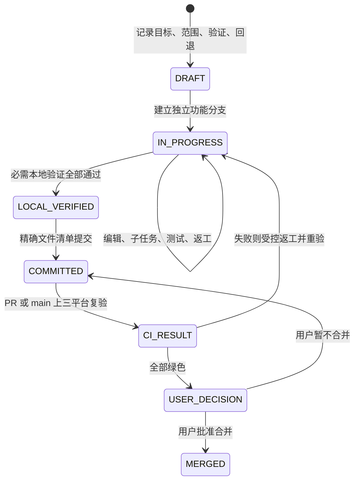

# 治理精简-GOV-0004-v1.0

## 目标

让一人维护的 `M + multi` 项目保持可追溯、可验证和可回退，同时不让用户充当日常流程操作员。本规则由任务 `GOV-0003` 引入，文档编号为 `GOV-0004`，作为普通任务的现行门禁；早期 G0 回执和故障链留在 Git 与任务历史中，不再成为日常步骤。

## 普通工作默认放行

用户给出的清晰需求就是范围决定。任务进入 `IN_PROGRESS` 且分支、路径和依赖无阻断后，Codex 可直接完成以下可逆工作：

- 创建、编辑和整理范围内文件；
- 查阅网络资料、调用官方生成器、安装常规依赖；
- 选择可逆技术默认值、运行测试和同范围返工；
- 创建并记录子 Agent/子任务；
- 精确提交、非强制推送功能分支和准备 PR。

这些动作不要求 scope、code 或逐文件对话回执。需求有会改变结果的实质歧义时，Codex 用人话说明差异后再询问。

## 仅保留的用户决定

以下节点必须取得用户明确决定，并由 `reviewctl` 记录需要机器绑定的关键回执：

1. 跳过或豁免任何必需验证；
2. 删除历史、强制覆盖、不可逆数据变更或其他破坏性操作；
3. 个人或敏感数据、显著安全风险、实质成本、不兼容迁移；
4. 最终合并、部署和发布。

普通依赖、联网、本地编辑、测试、提交、功能分支 push、PR 准备和子 Agent 创建均不在此清单内。

## 最小任务流程

任务可以保留兼容旧记录的中间状态，但普通工作不再以 scope/code 回执、GitHub Run 导入或本地 CI 状态推进为前置条件。

## 自动门禁职责

- `SessionStart`：只注入当前任务、状态、分支、允许路径、阻断项、未完成子任务和下一步。
- `PreToolUse`：阻止任务外写入、受保护记录直编、不安全 Git、错误分支和冻结阶段写入；普通只读、联网与范围内可逆动作不重复审批。
- `taskctl`：维护任务与子任务状态，执行受控验证和精确提交。
- `reviewctl`：只记录验证豁免、破坏性/不可逆、高影响边界和最终动作决定。
- `reconcile`：核对任务、分支、路径、文档和验证事实，不把可选回执或本地 GitHub 元数据当成普通阻断。
- GitHub Actions：在独立 Linux、macOS、Windows runner 上重跑检查并直接展示结果，不回写本地任务状态。

受保护的 `project-control/tasks/**`、`project-control/reviews/**` 和 `project-control/current-task.json` 仍只能由控制工具写入。

## 子 Agent 记录

创建子 Agent 或子任务前记录父任务、名称、目的、状态和开始时间，回收后记录结束时间与结果摘要。记录不包含提示词、内部推理、秘密、原始隐私数据或无关日志。子 Agent 不扩大父任务范围，最终结果由主 Agent 复核并进入统一验证。事实来源与字段规则见 [子任务协作-DEV-0002-v1.0](../development/子任务协作-DEV-0002-v1.0.md)。

## 验证与 CI

本地验证必须由 `taskctl run-validation` 或 `run-required` 真实执行；失败、超时、未运行和环境缺失不能记为通过。GitHub Actions 在 PR 与 `main` 上对当前 checkout 运行治理单测、Hook 契约测试、静态核对和任务声明的检查。

Actions 页面是 CI 结果来源。Codex 核对当前 PR 或 `main` 的必需检查并向用户报告，不要求用户发送 Run 链接、配置本地读取 Token、导入 Actions 元数据、抄写绿色结果或承担日常 CI 核对。CI 失败仍必须进入受控返工并重跑；验证豁免只能由用户决定，且显示为 `WAIVED`，不能伪装成 `PASS`。

治理 CI 的 Windows runner 只证明治理入口可跨平台执行，不能替代真实 Windows 客户端安装、升级、卸载和业务验收。

## 完成与回退

只有范围内文档与实现齐全、本地验证通过、GitHub CI 绿色、兼容与回退条件明确，并取得最终用户决定后，才能合并、部署或发布。普通可逆提交可通过独立任务提交回退；数据不兼容、跨单元依赖或不可逆点存在时使用协调回退或前滚修复。

## 变更历史

- `v1.0`，2026-08-21：移除普通 scope/code 逐步审批、GitHub Token/Run 回写和 G0 故障链的日常耦合；保留受控验证、关键风险决定、范围门禁、子任务记录及最终动作确认。
