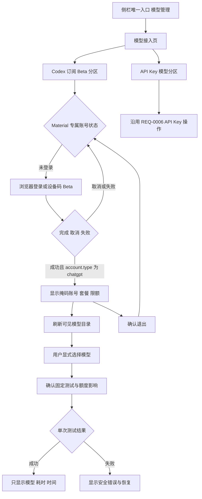
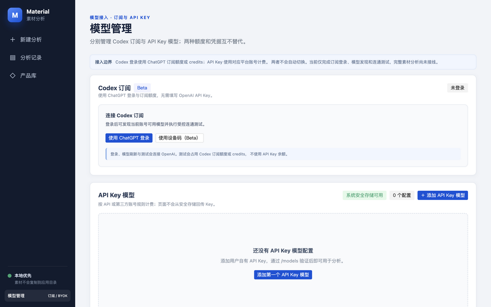
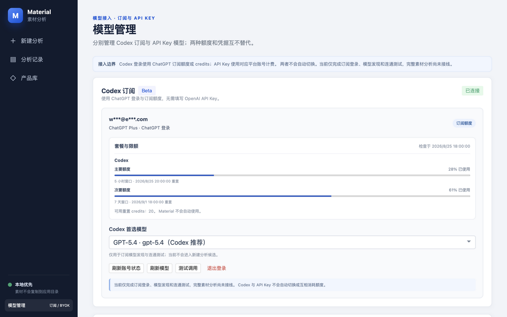
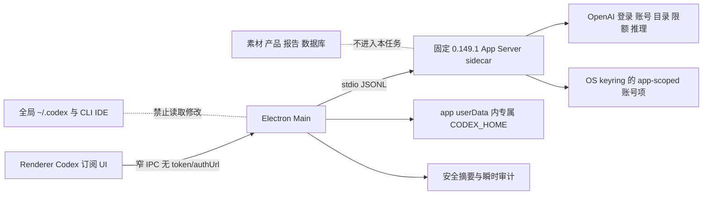
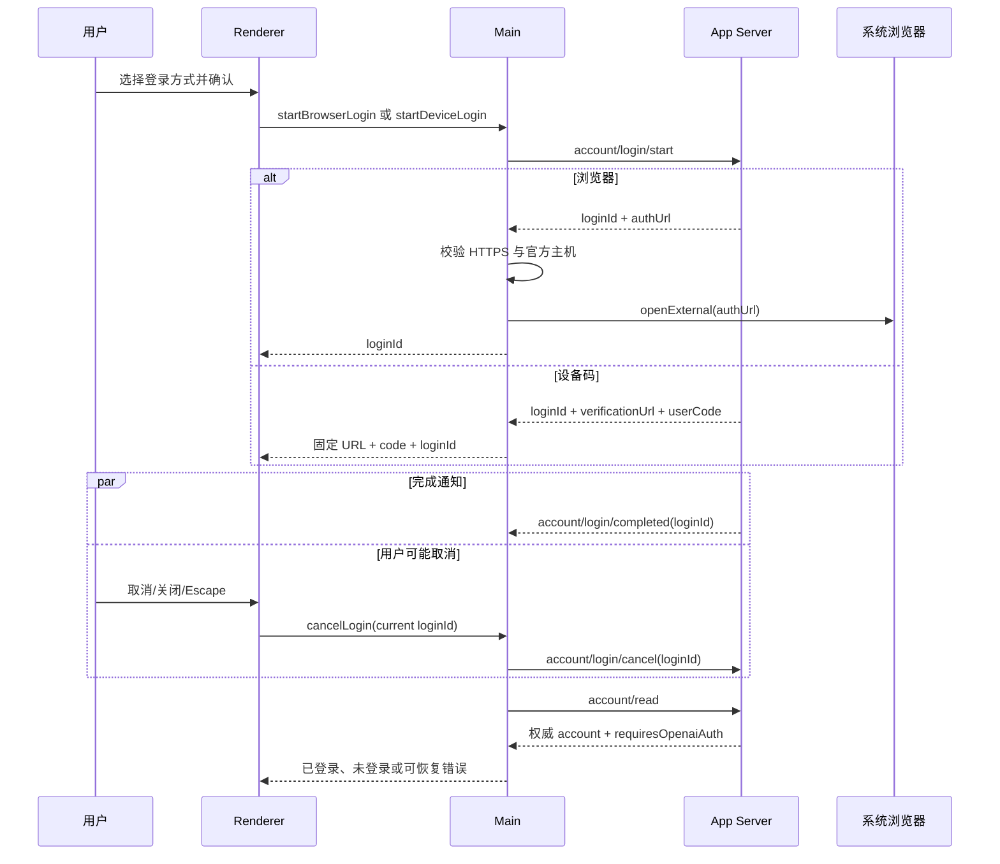
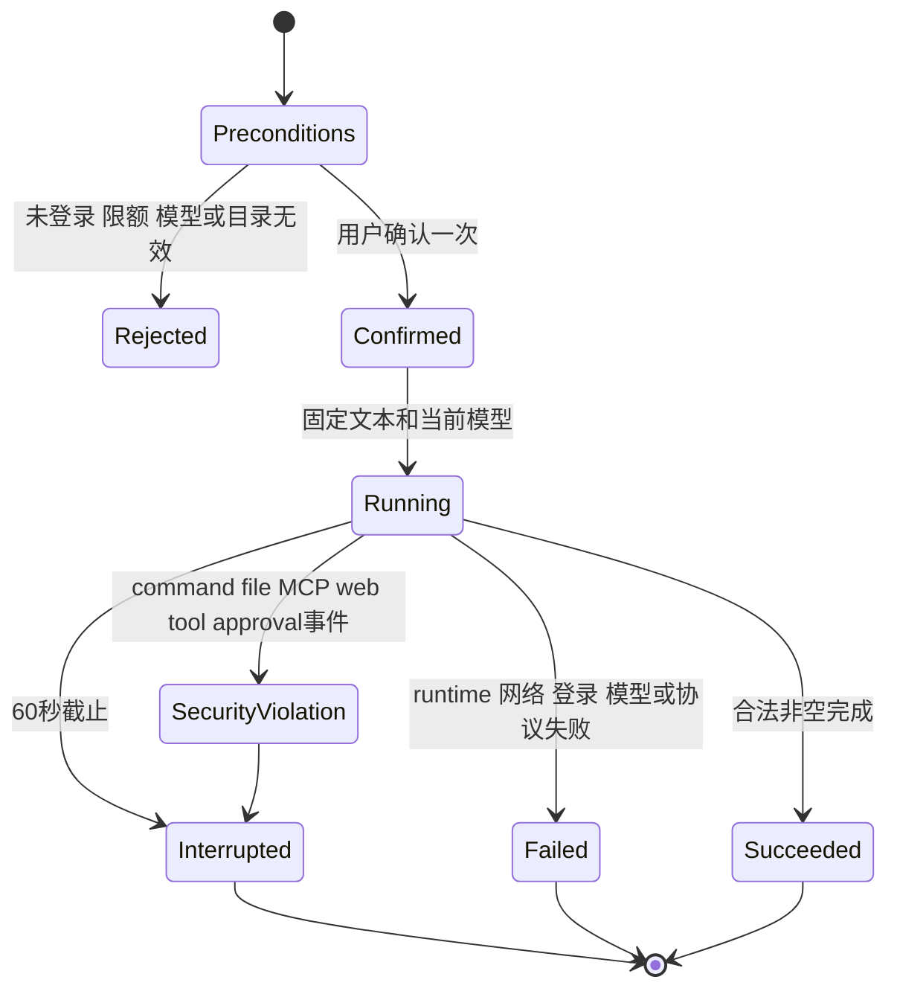

# Codex订阅接入-REQ-0007-v1.0

## 1. 文档信息

| 项目 | 内容 |
| --- | --- |
| 需求名称 / 编号 / 版本 | Codex SDK 与 ChatGPT 订阅接入 / Codex订阅接入-REQ-0007 / v1.0 |
| 文档状态 | DRAFT；需求完整，待产品负责人确认后转为 ACTIVE |
| 交互类型 | mixed |
| 提出人 | 产品负责人 |
| 编写负责人 | Codex |
| 审核人 | 产品负责人 |
| 创建 / 更新日期 | 2026-08-25 / 2026-08-25 |
| 关联产品需求 | [模型管理与自定义模型-REQ-0006-v1.0](../模型管理与自定义模型-REQ-0006/模型管理与自定义模型-REQ-0006-v1.0.md)；[单素材分析-REQ-0005-v1.0](../单素材分析-REQ-0005/单素材分析-REQ-0005-v1.0.md) |
| 关联技术设计 | [Codex-SDK订阅接入-DEV-0013-v1.0](../../development/Codex-SDK订阅接入-DEV-0013-v1.0.md) |
| 关联排障 | [Codex订阅登录与调用-TRB-0010-v1.0](../../troubleshooting/Codex订阅登录与调用-TRB-0010-v1.0.md) |
| 关联任务 | APP-0022 |
| 工作分支 | `codex/req-0007-app-0022-codex-subscription` |
| base branch | `codex/req-0006-app-0020-openai-model-connectivity`，基线提交 `8c469b96dd0f950c38812857d44649a06825a100` |
| 发布单元 | macOS 客户端、Windows 客户端；不新增项目自建 backend |
| 上一版本 | 无，首次形成 Codex 订阅独立需求 |
| 变更摘要 | 在既有 API Key 模型管理之外增加隔离的 ChatGPT 订阅登录、套餐与限额摘要、Codex 模型目录、显式固定测试和双平台运行时边界；不接入完整素材分析 |

本文档定义用户可观察的产品行为和验收边界。App Server、JSONL、sidecar、IPC、`CODEX_HOME`、keyring 和 SDK runtime 属于技术方案，不被提升为与“使用订阅模型”并列的产品目标。实现或 mock 通过不能替代本文档，也不能替代真实账号和双平台验收。

## 2. 一句话摘要

拥有可用 ChatGPT/Codex 订阅的本地客户端用户，可在唯一的模型管理入口内登录自己的订阅、查看账号套餐与当前限额、选择账号实际可用的 Codex 模型并显式完成一次受限连通性测试，同时继续独立使用原有 API Key 模型。

## 3. 背景与现状证据

REQ-0006 与 APP-0020 已建立 DeepSeek、官方 OpenAI API Key 和自定义 OpenAI 兼容 API 的模型配置、模型列表和显式固定测试。该路径属于 BYOK：API Key 的用量按对应 API 账号计费，不能直接消费用户的 ChatGPT 订阅权益。

OpenAI 官方文档明确区分两种登录方式：Sign in with ChatGPT 用于订阅访问，API Key 用于按量访问；两者受不同的账号、管理和数据处理策略约束，API Key 使用标准 API 计费，不能视为订阅额度的替代形式。依据见 [Codex Authentication](https://learn.chatgpt.com/docs/auth) 和 [Codex Pricing](https://learn.chatgpt.com/docs/pricing)。

官方 [Codex SDK](https://learn.chatgpt.com/docs/codex-sdk) 可在 Node.js 应用中启动和运行本地 Codex 线程，但账号登录、`model/list`、`account/rateLimits/read`、事件通知和退出等深度产品集成由 [Codex App Server](https://learn.chatgpt.com/docs/app-server) 提供。因此本需求以 App Server 为账号、目录、限额和测试的主接口，并精确锁定 `@openai/codex-sdk` `0.149.1` 所带官方 Codex runtime，避免依赖用户机器上另装或版本漂移的全局 CLI。

当前事实与声明边界如下：

- APP-0022 基于 APP-0020 已提交内容开发，API Key 路径必须保持可用且不被订阅状态影响。
- 当前任务只实现订阅登录、账号与限额摘要、模型目录、显式选择和固定非业务测试。
- 当前任务不把 Codex 订阅模型加入“新建分析”候选，不接收素材、分析证据、产品数据、报告草稿或任意业务 Prompt。
- mock App Server 只能证明客户端协议与状态机；没有完成 ChatGPT 登录的官方 runtime 只能证明 sidecar 可启动，二者都不能证明真实订阅已调通。
- 应用专属 `CODEX_HOME`、keyring 命名隔离和退出隔离有固定实现合同，但“绝不影响用户 CLI/IDE 登录”仍必须分别在 macOS 与 Windows 真机验证后才能对外声称。
- 用户提供的参考图片是交互方向，不是第三方产品文字、供应商目录、本地 JSON 路径或套餐分类的需求来源。

## 4. 使用者与使用场景

### 4.1 主要使用者

- 个人订阅用户：拥有支持 Codex 的 ChatGPT 账号，希望直接使用订阅权益而不是另购 API Key 用量。
- 工作区成员：其 Codex 可用性、模型、数据策略和限额可能受 ChatGPT 工作区管理员控制。
- API Key 用户：继续维护 DeepSeek、官方 OpenAI 或自定义 OpenAI 兼容配置，不应因新增订阅区域而退化。

V1 每个操作系统用户只维护一个 Material 专属 Codex 登录会话；不同时登录多个 ChatGPT 账号，不建设团队账号池或共享订阅。

### 4.2 典型场景

1. 用户从侧栏唯一“模型管理”入口进入页面，在“Codex 订阅 Beta”区域通过浏览器登录。
2. 浏览器回调不可用或被组织网络阻断时，用户改用设备码 Beta，复制一次性代码并在固定 OpenAI 页面完成授权。
3. 用户在登录等待期间取消、关闭弹窗或按 Escape；迟到的成功/失败通知不会造成页面与真实账号状态矛盾。
4. 登录成功后，用户看到掩码账号、`planType`、主/次限额窗口、重置时间和可用 credits 摘要；缺失字段显示“暂不可用”，不显示为零。
5. 用户刷新账号实际可见的模型目录，显式选择一个模型；目录更新后原模型下线时，系统阻止测试并要求重新选择，不静默替换。
6. 用户在看到账号、模型、固定非业务文本、不发送素材以及会消耗订阅额度/credits 的说明后，确认一次测试。
7. 用户离线、令牌过期、额度耗尽或管理员禁用 Codex 时，看到稳定状态和恢复动作，不自动切换到 API Key。
8. 用户退出订阅账号或切换账号；该操作不删除任何 API Key 配置，也不退出用户的全局 Codex CLI/IDE 会话。
9. 用户继续在第二独立区域使用既有 API Key 模型；订阅账号异常不阻止本地读取或维护 API Key 配置。

### 4.3 设备、频率和前置条件

- 目标平台为 macOS arm64/x64 和 Windows x64 桌面客户端；共享 TypeScript 规则，安装包和系统凭据分别验收。
- 登录与切换为低频操作；限额和模型刷新为按需操作；测试只由用户显式发起。
- 登录、账号刷新、模型目录、限额和测试需要网络与 OpenAI 服务可用。
- 用户必须拥有可登录的 ChatGPT 账号；账号计划、席位、地区、管理员策略和服务状态由 OpenAI/工作区决定，Material 不承诺一定可用。

## 5. 目标与成功指标

### 5.1 产品目标

| 目标 | 可观察指标 | 测量方式 |
| --- | --- | --- |
| 订阅与 API Key 清晰分离 | 页面有两个独立区域，登录、测试、退出和错误均不互相替代 | CS-AC-01～CS-AC-05 |
| 账号登录可恢复 | 浏览器、设备码、取消、超时、迟到通知和重启恢复均有确定状态 | CS-AC-06～CS-AC-16 |
| 账号信息诚实 | 只显示 App Server 返回的账号、套餐、限额和 credits 摘要；未知不伪装成零或无限 | CS-AC-17～CS-AC-22 |
| 模型选择确定 | 只从最新可见目录选择；下线、隐藏或账号切换后不静默替换 | CS-AC-23～CS-AC-29 |
| 测试受限且可核验 | 每次确认最多创建一个固定非业务 thread + turn，不发送素材、不由 Material 二次发起或切换 | CS-AC-30～CS-AC-38 |
| 本机能力最小化 | 测试不能读取业务文件、改文件、运行命令、调用 MCP/web/hook/skill/子 Agent | CS-AC-39～CS-AC-45 |
| 账号与秘密隔离 | 不读取、复制或退出全局 `~/.codex` 登录；renderer、日志和业务存储无 token | CS-AC-46～CS-AC-53 |
| 双平台可交付 | 固定 runtime 可打包、启动、升级和回退；真机凭据隔离结果单独记录 | CS-AC-54～CS-AC-60 |

### 5.2 成功声明层级

以下结论必须分开报告：

1. 文档、mock 协议和 UI 状态验证通过；
2. 固定 `0.149.1` runtime 在打包产物中可启动；
3. 专用测试账号完成一次真实浏览器或设备码登录；
4. `account/read`、`model/list`、`account/rateLimits/read` 和一次固定测试在同一真实会话中成功；
5. macOS 与 Windows 分别证明 Material 专属登录/退出不影响全局 CLI/IDE；
6. 完整素材分析可用。

APP-0022 最多交付前五项中的已实际运行证据，第六项明确不在本任务范围。任何 `SKIP`、未登录 runtime、mock 成功或单平台结果都不能升级为更高层结论。

## 6. 非目标

- 不把 Codex 订阅模型接入新建分析、分析编排、报告生成、分析记录或历史回放。
- 不发送图片、视频、音频、OCR/ASR 结果、产品资料、结构化证据或业务 Prompt。
- 不提供任意 Codex 对话、持续聊天、线程恢复、历史列表、云任务、代码审查或仓库操作。
- 不让用户配置工具、shell、文件目录、MCP、web search、hooks、skills、plugins、memory、子 Agent 或审批策略。
- 不读取、复制、迁移、导入或共享 `~/.codex/auth.json`、ChatGPT Desktop、Codex CLI 或 IDE 的现有 token。
- 不支持同时登录多个 ChatGPT 账号、共享订阅、团队账号池、服务账号或外部托管 token。
- 不自动购买、兑换、重置或代付 credits，不承诺无限用量、固定价格、固定模型目录或固定套餐权益。
- 不把 ChatGPT 订阅回退为 OpenAI API Key，不在订阅失败时自动选择任一 API Key 配置，反向亦然。
- 不开放任意 App Server JSON-RPC、任意 Prompt、任意 URL、任意模型 ID 或任意 sidecar 参数到 renderer。
- 不发布、不部署、不合并；最终合并、安装分发和发布仍由用户决定。

## 7. 范围

### 7.1 包含范围

- 在既有“模型管理”页面增加“Codex 订阅 Beta”和“API Key 模型”双分区，保留单一持久入口。
- Material 专属 ChatGPT 浏览器登录、设备码 Beta 登录、取消、退出和账号切换。
- 非秘密账号摘要、计划类型、主/次限额窗口、重置时间和可用 reset credits 摘要。
- `model/list` 可见模型目录、刷新、显式选择及模型下线恢复。
- 固定非业务测试、测试前确认、60 秒超时、单个逻辑 thread + turn、失败关闭和最小成功摘要。
- App Server sidecar、固定 `@openai/codex-sdk` `0.149.1` runtime、窄 IPC、环境白名单和双平台打包。
- mock、runtime、UI、秘密扫描、macOS/Windows 真机及真实订阅 smoke 的分层验证合同。
- REQ-0007、DEV-0013、TRB-0010、需求/开发/排障索引和两张原型截图映射。

### 7.2 排除范围

- REQ-0005 的完整分析工作区、Prompt/证据组装、报告与记录 schema。
- REQ-0006 的 API Key 凭据协议改造；仅要求其行为不退化。
- 项目 backend、账号数据库、云同步、远程代理和订阅代管。
- 用户全局 Codex 配置、CLI/IDE 登录或全局插件生态的修改。
- 第三方身份提供方、非 OpenAI 模型、API Key 模式 App Server 登录和 experimental `chatgptAuthTokens`。
- 任何自动续费、购买 credits、发送加额邮件或管理员操作。

### 7.3 允许路径和发布单元

APP-0022 的实现和文档范围以机器任务清单为准；本需求只概括 `apps/desktop/**`、REQ-0007、DEV-0013、TRB-0010 及对应索引。macOS 与 Windows 是两个独立验收单元；不新增 backend 发布单元。

## 8. 前置与后置依赖

### 8.1 前置依赖

- APP-0020 提供既有模型管理页面、API Key 双协议、Provider/Service/IPC 基线和显式测试语义。
- OpenAI ChatGPT 账号、Codex 权益、官方登录服务、App Server 协议和模型目录可用。
- `@openai/codex-sdk` 与其 `@openai/codex` runtime 精确锁定 `0.149.1`；不使用全局安装版本。
- Electron 主进程可启动受控 sidecar、使用系统外部浏览器并访问应用 `userData`。
- macOS Keychain 与 Windows Credential Manager/DPAPI 可用于 Codex keyring；不可用时失败关闭，不回退 `auth.json`。

### 8.2 后置依赖

- 后续完整分析任务只能消费已验证的订阅账号状态与显式选择模型，且必须另行定义业务 Prompt、输出 schema、数据外发、持久化和成本确认。
- runtime 或 App Server 升级必须先复跑协议、事件、安全、打包和真机隔离矩阵，不能使用浮动版本自动升级。
- 若真实 smoke 发现套餐、工作区或地区不支持，应保持功能可恢复，不反向放宽为 API Key 或全局 token 复用。

## 9. 假设和未决事项

### 9.1 已确认假设

| ID | 状态 | 影响类别 | 约定 | 风险与恢复 | 可逆性 / 确认依据 |
| --- | --- | --- | --- | --- | --- |
| CS-A-01 | 已确认 | 产品 / 账号 | 订阅登录与 API Key 是独立来源，不互相回退或静默切换 | 混用会造成计费和数据策略误解；始终分区显示 | 可逆；用户明确要求订阅接入，官方 Auth 文档明确两种路径 |
| CS-A-02 | 已确认 | 范围 | APP-0022 只交付登录、目录、限额、选择和固定测试 | 不完整分析属于预期，不把测试成功包装成业务完成 | 可逆；任务范围与用户要求拆分 |
| CS-A-03 | 已确认 | 安全 | 使用 Material 专属 `CODEX_HOME` 和 `keyring`，不读取全局 token/config | 真机实现若不隔离则停止发布并回退 | 可逆；安全评估与任务摘要 |
| CS-A-04 | 已确认 | 技术 / 兼容 | App Server 为账号、目录、限额和测试主接口；锁定 SDK/runtime `0.149.1` | 上游协议变化通过版本升级任务处理 | 可逆；官方 SDK 与 App Server 文档及任务范围 |
| CS-A-05 | 已确认 | 成本 | 固定测试会消耗订阅额度或 credits，内置 OpenAI Provider 可能在同一 turn 内执行不可由 Material 关闭的传输恢复 | 用户每次确认一个逻辑测试；不创建第二 turn、不自动购买 | 可逆；官方 Pricing、Config Reference 与上游已知限制 |
| CS-A-06 | 已确认 | 隐私 | 本任务测试只发送版本固定的非业务文本，不发送素材或分析上下文 | 任一业务接线另立需求 | 可逆；APP-0020 测试边界延续 |
| CS-A-07 | 已确认 | 成熟度 | Material 将本能力标为 Beta，直到真实账号、双平台和升级回退证据齐全 | Beta 不降低安全门禁或允许跳过验证 | 可逆；产品发布标识 |

### 9.2 未决事项与最迟确认点

当前没有阻断文档和范围内开发的产品未决事项。以下内容只能由运行时或真机证据回答，不允许以文案假设为已完成：

| ID | 待验证事项 | 推荐默认值 | 最迟确认阶段 | 未通过时处理 |
| --- | --- | --- | --- | --- |
| CS-Q-01 | macOS、Windows 的 app-scoped keyring 是否都与全局 CLI/IDE 完全隔离 | 固定 `CODEX_HOME` + `keyring`，禁止文件回退 | 各平台安装包验收前 | 对该平台停止发布；不读取全局缓存 |
| CS-Q-02 | 真实账号是否向 App Server 返回 plan、限额和 credits 全部字段 | 缺失显示“暂不可用”，不推断零或无限 | 真实 smoke | 保留登录与目录；隐藏缺失摘要 |
| CS-Q-03 | 当前工作区/地区/管理员策略是否允许设备码 | 浏览器为主，设备码明确 Beta | 真实 smoke | 提示管理员/安全设置；不绕过策略 |
| CS-Q-04 | 固定 runtime 升级后协议或模型目录字段是否变化 | 保持 `0.149.1`，不自动升级 | 后续依赖升级任务 | 回退 runtime 与客户端适配器 |

## 10. 功能明细与业务规则

### 10.1 唯一入口与双分区（CS-FR-01～CS-FR-02）

1. 全应用唯一持久入口仍为左侧栏“模型管理”；新建分析页不增加第二个设置入口、深链或登录按钮。
2. 页面标题为“模型接入”，副标题明确“订阅与 API Key”；同一页面按视觉和语义分成：
   - 第一分区“Codex 订阅 Beta”；
   - 第二分区“API Key 模型”。
3. Codex 分区不是 BYOK 表单，不显示 API Key、Base URL 或自定义模型 ID；API Key 分区继续遵循 REQ-0006，订阅状态不改变其保存、刷新、测试和删除。
4. 页面首次进入会创建/校验非秘密的 app-scoped home 与受管 config、启动固定 sidecar，并用 `account/read` 读取 Material 专属登录状态；未登录时到此停止，已有 ChatGPT 账号时继续刷新模型目录和限额摘要。任何情况都不自动打开浏览器、不发推理请求，也不消耗模型额度。
5. Codex 当前不能进入新建分析候选；分区内始终显示“当前仅支持登录、模型发现和连通测试，尚未接入素材分析”。

### 10.2 订阅状态合同（CS-FR-03）

公开状态只允许：

| 状态 | 含义 | 允许操作 |
| --- | --- | --- |
| `unavailable` | runtime、keyring 或协议不可用 | 查看说明、重试运行时检测、继续使用 API Key |
| `signedOut` | Material 专属 Codex 会话未登录 | 浏览器登录、设备码登录 |
| `loginPending` | 当前浏览器或设备码尝试等待完成 | 查看等待方式、取消、关闭弹窗 |
| `ready` | ChatGPT 登录有效且未报告限额耗尽 | 刷新目录/限额、选择模型、测试、退出 |
| `limited` | 登录仍有效但额度/限额阻止当前测试 | 刷新限额、退出；不自动换模型或 API Key |
| `testing` | 固定测试正在进行 | 等待；禁止第二次测试和账号切换。60 秒截止或安全违规由主进程中断 |
| `error` | 协议、网络、登录或测试出现安全归一化错误 | 根据错误恢复、重新读取权威账号状态 |

`models`、`rateLimits` 或 `planType` 缺失不单独等于 `signedOut`、`limited` 或免费；账号状态以 `account/read` 和 `account/updated` 为准。

### 10.3 浏览器登录（CS-FR-04）

1. 用户点击“使用浏览器登录”后，先显示真实确认弹窗：将打开 OpenAI 登录页、登录仅用于 Material 专属会话、后续测试会消耗订阅额度且本次尚不发送素材。
2. 主进程通过 `account/login/start` 的 `chatgpt` 类型取得 `loginId` 与 `authUrl`。
3. `authUrl` 只在主进程短暂存在；主进程先校验 HTTPS 与允许的 OpenAI/ChatGPT 官方主机，再自行调用系统浏览器。renderer 只收到 `loginId`，永不收到完整 `authUrl`、token 或回调参数。
4. 页面进入 `loginPending`，显示“请在浏览器完成登录”、取消和返回，不用无限 spinner 表达未知状态。
5. 只有当前 `loginId` 的完成事件可结束本次尝试；随后立即通过 `account/read` 校验 `account` 为 ChatGPT 账号对象（`account.type === "chatgpt"`，或固定协议适配器确认的等价字段），再读取目录和限额。renderer 只接收派生登录状态，不接收原始 account 对象。

### 10.4 设备码登录 Beta（CS-FR-05）

1. 设备码是浏览器回调脆弱时的次要入口，并明确标记 Beta；不在浏览器登录失败后自动开始。
2. 主进程调用 `account/login/start` 的 `chatgptDeviceCode` 类型，只向 renderer 返回当前 `loginId`、固定 `https://auth.openai.com/codex/device` 与一次性 `userCode`。
3. 设备码弹窗显示固定验证页面、代码、复制代码、打开页面、取消；复制仅在用户点击后发生，不自动写剪贴板。
4. 关闭、取消、成功或失败后，renderer 和主进程都清除本次 `userCode`；日志、通知、任务、截图和持久化不得保存代码。
5. 设备码未启用、被管理员禁用或过期时显示对应安全错误和恢复动作，不改用外部 token 或全局登录缓存。

### 10.5 登录取消与乱序竞态（CS-FR-06）

1. 同时最多一个登录尝试；已有 pending 时再次开始返回 `LOGIN_IN_PROGRESS`，不覆盖旧 `loginId`。
2. 取消只接受当前 pending 的 `loginId`；过期、未知或已结束 ID 返回输入无效且不得影响当前账号。
3. 弹窗的“取消”、关闭按钮和 Escape 都触发同一取消操作；UI 本地关闭不能替代向 App Server 发送取消。
4. 对匹配 `loginId` 的第一个终态事件结束“尝试状态”；随后重新读取 `account/read`，由权威账号快照决定最终页面：
   - `account` 是经固定协议适配器确认的 ChatGPT 账号对象时显示已登录，即使取消响应稍后到达；
   - `account === null` 时显示已取消/未登录；
   - 读取失败时显示可恢复错误，不猜测成功或取消。
5. 迟到的完成、取消或旧 sidecar 事件按 `loginId + runtime generation` 忽略，不把新尝试改回旧状态。
6. sidecar 崩溃时清除本地 pending；重启后必须先 `account/read`，不能仅凭旧 UI 状态恢复登录中。

### 10.6 Material 专属账号隔离（CS-FR-07）

1. `CODEX_HOME` 固定在 `app.getPath('userData')` 下的 Material 专属目录，使用规范化绝对路径、当前用户权限和稳定命名；不指向 `~/.codex`。
2. runtime 固定 `forced_login_method = "chatgpt"`、`cli_auth_credentials_store = "keyring"` 和 `history.persistence = "none"`。官方配置字段依据见 [Codex Config Reference](https://learn.chatgpt.com/docs/config-file/config-reference)。
3. 不读取、复制、导入或写入全局 `auth.json`、config、AGENTS、MCP、skills、plugins、hooks、memory、规则和历史。
4. pinned runtime 使用 canonical `CODEX_HOME` 派生 keyring 账号命名空间；实现必须固定路径并验证。该代码事实不等于双平台已经证明隔离，最终声明仍以真机验收为准。
5. keyring 不可用时登录与调用失败关闭；禁止降级为 `auth.json`、SQLite、普通 JSON、环境变量或 renderer 存储 token。
6. Material 退出只请求其 app-scoped runtime 清理当前 keyring 会话；不得调用全局 Codex CLI、修改 `~/.codex` 或使 IDE 退出。

### 10.7 账号、套餐、限额与 credits（CS-FR-08～CS-FR-09）

1. `account/read` 的原始结果只在主进程解析，协议字段为 `account` 与 `requiresOpenaiAuth`；renderer 只得到派生状态、掩码账号标签和 `planType`。原始 account 对象、email、account ID、access/refresh token 不进入 renderer。
2. 账号显示名由主进程掩码；无法安全掩码时显示“已登录 ChatGPT”，不返回原值。
3. `account/rateLimits/read` 的主/次窗口显示 usedPercent、窗口时长和重置时间；有限数值超出 0～100 时钳制到该显示区间，非数值/非有限数值或窗口结构无效时忽略该可选窗口并显示“暂不可用”。只有整体响应不是可解析对象等顶层合同破坏才返回协议错误。
4. 限额缺失、`null` 或请求失败显示“暂不可用”，不能写成 0%、无限或“仍有额度”。
5. `rateLimitReachedType` 表明当前不可测试时进入 `limited`；刷新成功后才能恢复，不因换小模型或 API Key 自动解除。
6. reset credits 只显示 App Server 返回的 `availableCount` 或“暂不可用”。APP-0022 不兑换 credits、不购买、不发送加额邮件、不硬编码价格或模型 credits 费率。
7. 页面说明 credits 和限额会受模型、上下文、推理、工具、套餐和 OpenAI 政策影响；展示值是快照，不保证下一次请求一定成功。价格与用量说明只链接官方 [Codex Pricing](https://learn.chatgpt.com/docs/pricing)。

### 10.8 模型目录与显式选择（CS-FR-10～CS-FR-11）

1. 登录校验成功后调用 `model/list`，固定 `includeHidden: false`，按游标读取可见目录并设置数量/字段上限；renderer 不能控制 `includeHidden` 或任意过滤参数。
2. 保存模型 ID、显示名、默认标志、推理强度摘要和输入模态等非秘密字段；未知字段忽略，非法/超限响应失败关闭。
3. 只显示支持文本输入的可见模型；服务标记 `isDefault` 仅用于“推荐”提示与排序，不自动替用户选择。
4. 用户必须显式选择模型；选择值必须精确来自最新成功目录。手填、历史残留或其他账号模型在联网前拒绝。
5. 选择只保存非秘密 `selectedModelId`；账号退出、账号身份变化或目录刷新后不再包含该 ID 时，旧 ID 失效并清空可调用选择，页面说明“原模型不可用，请重新选择”。
6. 模型下线、隐藏或服务推荐升级都不触发自动切换；用户重新选择前测试按钮禁用。
7. 目录失败时可保留上一份列表作为“上次快照”说明，但不得用于新选择或测试；恢复网络后由用户刷新。

### 10.9 显式固定连通性测试（CS-FR-12）

1. 测试仅在主进程确认 `account` 为 ChatGPT 账号对象、最新目录有效、用户已显式选择模型、未限额且无其他测试时可用。
2. 点击测试先显示确认弹窗：掩码账号、plan、模型、固定非业务文本、不发送素材/分析上下文、会消耗订阅额度或 credits、每次确认只创建一个逻辑测试。弹窗同时说明官方 runtime 的内置 OpenAI Provider 可能在该 turn 内执行不可由 Material 配置为零的传输恢复，因此实际网络尝试和额度消耗可能高于一次传输。
3. renderer 只能调用 `testSelectedModel()`，不能传 Prompt、消息、文件、目录、URL、模型 ID、工具、推理强度、温度、输出 schema 或任意 App Server 参数。
4. 主进程使用版本固定的短文本创建一个隔离、非持久的测试 thread，并且只为当前已验证模型创建一个 turn；Material 不在失败、断流或重连后创建第二个 turn，不续跑、不换模型、不回退 API Key。
5. 独立 60 秒客户端截止时间；到达截止或发生安全违规时，主进程发送一次 `turn/interrupt`，以先发生的受控终态结束，受控终态后不得再发 `turn/start`。V1 没有运行中手动取消测试 API。固定 `0.149.1` runtime 可能在这个 turn 内按内置策略恢复请求/流，Material 不承诺底层只有一次传输。
6. 成功只返回 checkedAt、duration、requestedModelId、runtime 返回模型 ID 和 plan 摘要；模型正文、reasoning、测试文本、thread/turn ID、原始 usage、JSONL 和 stderr 不进入 renderer 或持久化。
7. 成功只证明该账号/模型当次固定测试可达，不代表模型质量、剩余额度、完整素材分析或发布验收。

### 10.10 工具、文件和扩展能力禁用（CS-FR-13）

1. 测试工作目录是应用创建的空目录，不是仓库、素材目录、用户主目录、Desktop、Documents 或全局 Codex 目录。
2. 禁止附加目录；文件系统只允许测试所需的最小只读空目录，且不得把“read-only”描述成“不能读文件”。
3. 禁用 shell/command、file change/apply patch、computer use、view image、web search、network command、MCP、apps/connectors、dynamic tools、hooks、skills、plugins、memory、AGENTS、rules 和子 Agent。
4. `approvalPolicy = never` 不代表许可；任何 command/file/tool/MCP/web/server approval 事件都视为安全违规，立即拒绝、interrupt 并返回 `SECURITY_VIOLATION`。
5. App Server 自身访问 OpenAI 所需网络与 Agent 可请求的工具网络必须分开；不能为登录/推理放开任意 shell 网络。
6. sidecar 只继承固定名称的系统兼容环境白名单，不继承完整 `process.env`；`CODEX_HOME` 强制指向专属目录，可执行命令使用绝对路径。任何素材/数据库路径、API Key、业务凭据和用户 shell 配置都不得进入环境；白名单内的 HOME/PATH/APPDATA/代理等值不得进入 renderer 或日志。

### 10.11 退出、切换与本地删除（CS-FR-14）

1. 退出前显示确认弹窗，说明只退出 Material 的 Codex 订阅，不影响 API Key 配置，也不应影响全局 CLI/IDE。
2. 登录 pending 时先取消当前登录并读取权威状态；测试运行中不允许退出，也没有手动取消测试入口，只能等待受控终态或 60 秒截止。
3. `account/logout` 成功后必须等待/读取 `account === null`，清空账号摘要、限额、目录和选择，再显示未登录。
4. logout 请求失败或 sidecar 退出时不伪称成功；重启 sidecar 后先读账号状态并允许重试。
5. V1 的“切换账号”是退出成功后重新登录；不在同一 runtime 同时保存多账号，也不保留旧账号模型为可调用选择。
6. 删除 API Key 配置不触发 Codex logout；Codex logout 不删除 API Key 密文、配置或历史报告。

### 10.12 Beta 成熟度和升级提示（CS-FR-15）

1. 分区标题、设备码入口和支持说明显示 Beta；Beta 表示协议、目录和平台适配仍需持续验证，不代表允许暴露秘密或降低安全门禁。
2. runtime 版本固定，不在应用启动时自动更新。官方文档或服务支持更新不等于客户端已兼容。
3. 协议版本、未知必需字段、sidecar 版本不一致或安全能力缺失时失败关闭，并保留 API Key 分区可用。
4. 去除 Beta 必须至少具备真实订阅 smoke、macOS/Windows 安装包、登录/退出全局隔离、升级/回退和管理员禁用恢复证据，由产品负责人另行决定。

## 11. 用户流程与交互（UI 必填）

### 11.1 主流程

用户完成或取消 Codex 操作后仍停留在模型管理页；通过侧栏“新建分析”返回。当前新建分析不展示 Codex 订阅模型，也不会因测试成功自动开始分析。

### 11.2 原型截图与证据边界

*图 1：P-CS-01，Codex 订阅未登录静态布局。该图由实际 UI 收口后生成 1280×800 截图，只证明入口、双分区、按钮层级和可见范围说明；图中账号、模型、套餐、额度与状态值（如出现）均为原型示例数据，不代表任何真实账号事实，也不能证明浏览器跳转、取消、token 安全、额度或离线行为。*

*图 2：P-CS-02，Codex 订阅已连接静态布局。图中账号、模型、套餐、额度、credits 与状态值全部是原型示例数据，不代表任何真实账号或权益事实；该图只证明这些信息以及测试、退出的可见位置，不能证明真实订阅调通、数值准确、模型可用性、工具禁用、超时或跨平台隔离。*

| 原型 | 可直接证明 | 仍需独立行为证据 | 对应验收 |
| --- | --- | --- | --- |
| P-CS-01 | 唯一入口、双分区、主次登录按钮、Beta 与当前范围文案 | 登录、设备码、取消竞态、外部浏览器、安全存储、无障碍 | CS-AC-01～CS-AC-16、CS-AC-49 |
| P-CS-02 | 掩码账号/plan/限额、模型、测试和退出的布局 | 真实账号、额度准确性、目录刷新、单次测试、工具禁用、退出隔离 | CS-AC-17～CS-AC-45、CS-AC-50～CS-AC-60 |

### 11.3 交互状态矩阵

| 状态 | 展示 | 可执行操作 | 数据是否保留 | 恢复方式 | 验收 |
| --- | --- | --- | --- | --- | --- |
| 初始加载 | 页面骨架和“正在检查 Codex runtime” | 返回新建分析、使用 API Key 区 | API Key 配置与草稿保留 | 完成或显示错误 | CS-AC-01、CS-AC-03 |
| `unavailable` | runtime/keyring/协议的安全错误和 Beta 说明 | 重试检测、使用 API Key | 不创建 token 或订阅配置 | 修复安装/系统凭据后重试 | CS-AC-04、CS-AC-46 |
| `signedOut` | 两种登录入口、数据与额度说明 | 浏览器登录、设备码、返回 | 无订阅账号数据 | 选择登录方式 | CS-AC-06～CS-AC-09 |
| 浏览器 `loginPending` | 已打开浏览器、等待、取消 | 取消、关闭/Escape | 只保留当前 loginId 内存态 | 完成、取消或超时 | CS-AC-10～CS-AC-14 |
| 设备码 `loginPending` | 固定 URL、一次性代码、复制/打开/取消 | 用户触发复制或打开、取消 | 代码仅当前弹窗内存 | 完成、过期或取消 | CS-AC-08～CS-AC-15 |
| `ready` | 掩码账号、plan、限额、目录和选择 | 刷新、选择、测试、退出 | 非秘密快照按合同保存 | 正常使用 | CS-AC-17～CS-AC-31 |
| 限额未知 | “暂不可用”，不显示零/无限 | 刷新、退出；测试按账号状态门禁 | 上次摘要标记过期 | 恢复网络后刷新 | CS-AC-19～CS-AC-22 |
| `limited` | 达限类型、重置摘要和无自动切换说明 | 刷新限额、退出 | API Key 配置不变 | 等待重置或处理账号 | CS-AC-21、CS-AC-33 |
| 无模型 | 账号已登录但没有可见文本模型 | 刷新、退出 | 不伪造模型 | 等待服务/管理员恢复 | CS-AC-24、CS-AC-28 |
| 模型下线 | 原选择不可用和重新选择说明 | 从新目录选择 | 旧 ID 不再可调用 | 显式新选 | CS-AC-26～CS-AC-29 |
| 测试确认 | 账号、模型、固定文本边界和额度说明 | 取消或确认一次 | 不写业务数据 | 用户决定 | CS-AC-30～CS-AC-32 |
| `testing` | 忙碌、目标模型和 60 秒截止说明 | 只等待；禁用重复和退出，无运行中手动取消入口 | 不持久化正文/线程 | 完成、60 秒截止 interrupt 或安全违规中断 | CS-AC-34～CS-AC-36 |
| 测试成功 | requested/returned 模型、耗时、时间；无正文 | 关闭、再次显式测试 | 只保留当前 UI 摘要 | 无需恢复 | CS-AC-37～CS-AC-38 |
| 测试失败 | 稳定错误、无原始正文 | 根据原因重试或退出 | 账号/目录按权威快照处理 | 网络、登录、限额或模型恢复 | CS-AC-33～CS-AC-38 |
| 退出确认/处理中 | 影响范围、进度和失败恢复 | 取消或确认；处理中禁重复 | API Key 配置保留 | 读取 account 是否为 null 后定态 | CS-AC-51～CS-AC-53 |
| 无障碍 | 可见焦点、状态文本、进度文本、禁用原因 | 键盘/读屏完成全流程 | 与鼠标流程一致 | 焦点返回触发点 | CS-AC-61～CS-AC-64 |

空状态包括未登录、无额度摘要、无可见文本模型和未选择模型；页面必须给出下一步，不伪造默认值。权限不足或管理员禁用时显示可恢复说明，禁止把它包装成普通网络失败或自动切换到 API Key。

### 11.4 无障碍与响应式要求

- 浏览器登录确认、设备码、测试确认和退出确认是四个具有标题关联的真实 dialog；焦点圈定，Escape 遵守各自取消规则，关闭后返回触发按钮。
- 状态变化使用 `aria-live`，错误使用 `role="alert"`；不得用 toast 作为唯一信息源。
- 限额同时提供数字/文本和可访问 progress 语义，不能只依赖颜色、环图或进度条。
- 禁用测试、退出或登录按钮时，常驻显示可读原因，不能只用 hover tooltip。
- 设备码按可读分组显示并支持键盘复制；成功/取消后不可再从 DOM 或无障碍树读取旧代码。
- 360 CSS 像素宽度、200% 缩放、高对比度、减少动画和完整键盘路径下，双分区、弹窗和底部操作均可达。

## 12. 非 UI 流程图

非 UI 边界以主进程、固定 sidecar、app-scoped CODEX_HOME 和 OpenAI 服务为限；失败时立即关闭当前登录或测试状态，不让旧 generation 继续生效。网络、keyring 或 runtime 恢复后只允许用户显式重试，并从新的 `initialize` 与权威 `account/read` 重新收敛。

### 12.1 账号与运行时数据流

App Server 使用默认 stdio 的 newline-delimited JSON（JSONL）传输；WebSocket 属于 experimental/unsupported，不进入本需求。主进程是唯一协议客户端，renderer 不能直接连接 sidecar。

### 12.2 浏览器/设备码登录与取消竞态

### 12.3 固定测试失败关闭

安全违规的事件监听是防御纵深，不是权限隔离的替代：工作目录、环境、配置和工具面必须在事件出现前就被限制。

## 13. 数据与生命周期

### 13.1 数据分类

| 数据 | 来源 | 敏感等级 | 允许位置 | 生命周期与删除 |
| --- | --- | --- | --- | --- |
| Codex access/refresh token | OpenAI 登录 | 高敏感 | OS keyring，由 app-scoped runtime 管理 | 登录创建/刷新；用户退出后由 runtime 删除对应项；不进入 renderer、SQLite、普通文件或日志 |
| 浏览器 `authUrl` 与回调参数 | App Server | 高敏感短期 | 主进程内存 | 校验并打开后释放；从不进入 renderer/日志/剪贴板 |
| `loginId` | App Server | 内部标识 | 主进程与当前 renderer 内存 | 当前尝试结束、取消或 runtime generation 变化后清除 |
| `userCode` | 设备码登录 | 敏感短期 | 当前登录弹窗与主进程内存 | 用户可主动复制；完成、取消、过期或关闭后清除，不持久化 |
| 原始账号/email/account ID | App Server | 个人信息 | 主进程短期内存 | 仅用于生成掩码标签；原值不进入 renderer或持久化 |
| 掩码账号标签、`planType` | App Server / 主进程 | 本地私有 | 当前 renderer 状态 | 账号更新或退出即替换/清空；V1 不持久化 |
| 限额与 credits 摘要 | App Server | 本地私有、时效数据 | 当前内存快照 | 刷新替换；退出/重启清空；不作为账单记录 |
| 模型目录 | App Server | 非秘密、时效数据 | 当前内存快照 | 每次成功刷新替换；失败快照仅可显示不可调用 |
| `selectedModelId` | 用户 | 非秘密本地偏好 | 应用专属非秘密状态 | 显式选择更新；退出、账号变化或模型下线时失效/清空；不进入 API Key 配置 |
| 固定测试文本 | 客户端版本 | 非业务 | 代码常量与单个逻辑 turn 内存 | 不由 renderer 传入；不写日志、审计或历史 |
| 模型正文/reasoning | OpenAI | 生成内容 | 主进程单次校验内存 | 校验后立即丢弃；不进入 renderer、JSONL 日志、SQLite、报告或导出 |
| 测试结果摘要 | 主进程 | 本地私有 | 当前页面内存 | 页面刷新/退出清除；不形成正式分析记录 |
| runtime config | 客户端 | 非秘密安全配置 | app-scoped `CODEX_HOME` | 版本化生成；升级前备份/校验；不含 token、账号或业务数据 |
| sidecar JSONL | App Server / 主进程 | 可能含敏感事件 | stdio 管道内存 | 逐行解析并最小化；不得原样落盘或输出到日志 |

### 13.2 存储与持久化不变量

1. ChatGPT 凭据不进入现有 `model-credentials.secure.json`、产品库 SQLite、分析记录、报告、导出、任务控制文件或 Git。
2. `history.persistence = "none"` 与非持久测试线程必须同时使用；测试后扫描 app-scoped `CODEX_HOME`，不得存在包含固定测试文本、回复正文或推理的 `history.jsonl`、session rollout 或其他明文记录。
3. “没有发现 prompt”必须覆盖正常、失败、取消、超时和 sidecar 崩溃路径；仅在成功路径清理文件不算满足。
4. 不通过事后删除 session 文件来替代不落盘合同；若 pinned runtime 仍持久化测试内容，功能应失败关闭并阻断真实测试。
5. 模型目录和限额是时效快照；离线时可显示“上次快照”的非调用参考，但不得伪装为当前有效。

### 13.3 创建、读取、更新、退出与卸载

- 首次进入模型管理会创建/校验非秘密 app-scoped home/config、启动 bundled runtime 并执行 `account/read`；未登录时停止，已有 app-scoped ChatGPT 账号时继续刷新模型目录与限额摘要。这不会自动登录、推理或消耗模型额度；新的 keyring 凭据只在用户显式开始并完成登录后由 runtime 产生。
- 账号读取与刷新由 App Server 完成；Material 不解析、刷新或复制 token。
- 退出清除 Material 专属账号会话及所有内存账号/目录/限额/选择；API Key 配置保持不变。
- 普通应用卸载不能被描述为安全退出或凭据擦除。用户应先在应用内退出；安装器若保留 userData/keyring，同用户重装可能恢复 app-scoped 会话，必须在平台验收和帮助文案中如实说明。
- 显式清理 app-scoped home/keyring 属于破坏性凭据删除，需用户明确操作；不得通过删除整个 userData 清理，因为其中还有产品库、记录和 API Key 配置。
- V1 不导入、导出、备份、云同步或跨设备迁移 Codex 登录。

## 14. 登录、权限、安全与隐私

### 14.1 身份和账号边界

- 身份提供方为 OpenAI ChatGPT；只支持 App Server `chatgpt` 和 `chatgptDeviceCode` 两种托管登录。
- 禁止 API Key 登录、外部 token 注入、复制浏览器 cookie、读取 ChatGPT Desktop 会话或 experimental `chatgptAuthTokens`。
- 登录方式决定工作区权限和数据处理策略；Material 只显示 App Server 返回的 plan/状态，不替 OpenAI 或管理员承诺模型、保留期、地域或权益。
- 管理员撤销席位、禁用 Codex、强制工作区或账号失效时，下一次账号读取/调用应进入登录或权限错误，不绕过组织策略。

### 14.2 最小权限与进程隔离

- sidecar 由主进程以 `shell: false`、固定可执行路径、固定 argv、stdio pipes 和环境白名单启动；renderer 无进程句柄、stdin/stdout 或 JSON-RPC 访问。
- 可执行文件必须来自签名/校验后的应用资源，不从 PATH、全局 npm、ChatGPT.app、用户下载目录或可写配置解析。
- `CODEX_HOME` 和空测试工作区不能是符号链接到用户目录；路径创建、权限和真实路径在 spawn 前校验。
- runtime 配置关闭更新检查、遥测/反馈、apps、MCP、hooks、skills、memory、subagents、web 和其他非测试能力；缺少有效关闭方式时不能用“没有配置”替代 fail-closed 验证。
- 任何权限、工具或用户输入请求一律拒绝；不得显示“允许本次”或“总是允许”。

### 14.3 秘密禁入与错误净化

禁止进入 renderer、console、文件日志、crash breadcrumb、任务记录、测试快照、Git、剪贴板自动写入和错误文案的内容包括：

- access/refresh token、authorization header、cookie、原始账号 ID/email；
- 完整 `authUrl`、回调 query/hash、设备码；
- App Server 原始错误、stdout/stderr、JSONL、Prompt、回复、reasoning；
- app-scoped home、keyring 项、空工作区或用户目录的绝对路径；
- 任何 API Key 或现有模型凭据。

错误只返回稳定代码、安全文案、阶段、非秘密模型 ID、耗时和时间。主进程掩码失败时宁可省略账号标签，也不返回原值。

### 14.4 数据外发与额度确认

| 操作 | 外发目标 | 发送内容 | 明确不发送 | 成本/额度 |
| --- | --- | --- | --- | --- |
| 打开模型管理 | 本地 App Server；runtime 按 app-scoped 账号状态访问 OpenAI | initialize、`account/read`；若已登录则读取 `model/list` 与 `account/rateLimits/read` | 素材、业务 Prompt、API Key、模型推理 | 不发推理，不消耗模型额度；目录/账号读取仍可能产生网络流量 |
| 开始登录 | OpenAI 登录服务 | 托管登录协议所需字段 | API Key、素材、业务数据 | 登录本身不由 Material 承诺免费或收费 |
| 读取账号/目录/限额 | OpenAI Codex 服务 | 当前 runtime 会话和对应请求 | 素材、产品、报告、业务 Prompt | 只展示服务返回结果；不承诺不计流量/额度 |
| 固定测试 | OpenAI Codex 服务与当前模型 | 固定非业务文本、模型和最小运行参数 | 素材、分析证据、历史、文件、API Key | 会消耗订阅额度或 credits；每次确认一个 thread + turn，runtime 可能在 turn 内传输恢复 |
| 退出 | OpenAI/runtime 本地账号管理 | 当前 app-scoped 会话退出请求 | API Key、业务数据 | 无生成调用 |
| 完整分析 | **本任务不存在** | 无 | 全部素材与业务数据 | 不得声称已支持 |

官方 Pricing 说明用量会受模型、上下文、推理和工具等因素影响；Material 不把快照转换为金额或剩余“次数”，不硬编码会变化的 rate card。

## 15. 接口与兼容性

### 15.1 Renderer 到主进程的窄 IPC

| 逻辑方法 | renderer 可传入 | 成功返回 | 禁止返回/传入 |
| --- | --- | --- | --- |
| `getState` | 无 | 安全订阅状态 | token、authUrl、原始 email、sidecar 状态体 |
| `startBrowserLogin` | 无 | `loginId` | 完整 authUrl、登录参数 |
| `startDeviceLogin` | 无 | `loginId`、固定 verification URL、userCode | token、任意 URL |
| `openDeviceVerificationPage` | 无 | 空 | renderer 自定义 URL |
| `cancelLogin` | 当前 `loginId` | 空 | 任意 sidecar request ID |
| `refreshModels` | 无 | 安全模型摘要 | includeHidden、cursor、Provider 参数 |
| `selectModel` | 最新目录中的 model ID 或清空 | 安全状态 | 手填模型、账号或 endpoint |
| `getRateLimits` | 无 | 安全限额摘要或 null | 购买、兑换、重置参数 |
| `testSelectedModel` | 无 | 最小测试摘要 | Prompt、文件、模型覆盖、工具/权限参数 |
| `logout` | 无 | 空 | 全局退出路径或凭据 |

所有 handler 必须校验 trusted sender、输入类型/长度、当前状态和并发；状态事件订阅返回清理函数，窗口销毁后不得继续泄漏监听器。

### 15.2 App Server RPC 白名单

| 功能 | 允许方法/通知 | 关键约束 |
| --- | --- | --- |
| 握手 | `initialize`、`initialized` | 每连接一次，固定客户端元数据和能力 |
| 账号 | `account/read`、`account/updated` | 只接受 `chatgpt` 或 null；原始账号先在主进程净化 |
| 登录 | `account/login/start`、`account/login/cancel`、`account/login/completed` | 仅 `chatgpt` / `chatgptDeviceCode`；按 loginId 与 generation 关联 |
| 退出 | `account/logout` | 必须随后确认 `account/read.account === null` |
| 限额 | `account/rateLimits/read`、对应变更通知 | 只读，不兑换、不购买、不发邮件 |
| 模型 | `model/list` | `includeHidden: false`，游标/数量/字段上限 |
| 测试 | 受控 `thread/start` / `turn/start` / `turn/interrupt` 及生命周期通知 | 固定空 cwd、当前模型、never、非持久；renderer 不控制参数 |

未在白名单中的客户端发起方法禁止调用。sidecar 发来的 approval、tool、command、file、MCP、web、dynamic tool、user input、image view 或 collab 事件必须拒绝并中断测试。

### 15.3 JSONL 和 sidecar 合同

- 传输只用本地 stdio JSONL，一行一个 JSON-RPC 消息；不启用实验 WebSocket、Unix socket 或监听端口。
- 每行设定 1 MiB 上限、合法 UTF-8、对象顶层、受控 `id/method/params/result/error`；空行、超长、非法 JSON、重复不一致 ID 或未知必需结构均为 `PROTOCOL_ERROR`。
- JSON-RPC request ID 在单 runtime generation 内唯一；sidecar 重启后旧 pending 全部失败，不跨 generation 匹配。
- stderr 只保留受限内存诊断并净化，不原样输出；child exit、信号、stdin 关闭和部分行都产生稳定运行时错误。
- 启动时核对 bundled runtime 版本为 `0.149.1`；不一致时标记不可用，不从 PATH 寻找替代版本。

### 15.4 超时、并发、幂等与传输恢复

| 操作 | 客户端截止时间 | 并发 | Material 客户端的重复发起策略 |
| --- | --- | --- | --- |
| sidecar 启动与 initialize | 15 秒 | 单实例 | 截止后不自动启动第二 generation；用户可重试能力检查 |
| account/model/rate-limit RPC | 30 秒 | 同类各一 | 失败后不自动发第二个 RPC；用户显式刷新 |
| 浏览器/设备码登录等待 | 最长 10 分钟或服务更早终态 | 全局一个 pending | 超时后取消并重读账号，不自动开始新登录 |
| 固定测试 | 60 秒 | 全局一个 testing | 每次确认一个 thread + turn；受控终态后不续跑或新建第二 turn |
| logout | 30 秒 | 单个退出 | 失败后重读账号，不自动再次 logout；用户决定是否重试 |

`cancelLogin` 仅对当前 `loginId` 幂等；同一 ID 重复取消不得取消新尝试。测试没有客户端幂等重放：超时或连接断开后结果未知，必须显示失败并等待用户再次确认，不能后台补发 thread/turn。

上述约束只控制 Material 到 App Server 的逻辑请求数。Codex 内置 OpenAI Provider 的 `request_max_retries` / `stream_max_retries` 有上游默认值，固定 runtime 可能在同一个 turn 内执行传输恢复；官方当前不支持用 `model_providers.openai` 覆盖内置 Provider 以把它们设为 0。实现和验收因此只承诺“一次确认对应一个 thread + 一个 turn、客户端不二次发起”，不承诺单次 HTTP 尝试。依据见 [Config Reference](https://learn.chatgpt.com/docs/config-file/config-reference) 与 [openai/codex#3026](https://github.com/openai/codex/issues/3026)。该行为必须进入测试前额度披露、Beta 风险和每次 runtime 升级门禁。

### 15.5 稳定错误类别

稳定代码至少包括：输入无效、runtime 不可用、协议错误、未登录、登录中、登录失败、未选模型、模型不可用、限额、测试失败、测试超时、安全违规和未知错误。页面不依赖原始 JSON-RPC code 或 OpenAI 错误正文；管理员禁用、账号过期和网络失败可以映射到稳定类别并给出不同恢复文案，但不得暴露供应商内容。

### 15.6 平台兼容矩阵

| 平台 | runtime | 凭据 | 打包 | 必需真机证据 |
| --- | --- | --- | --- | --- |
| macOS arm64 | 对应 `0.149.1` darwin-arm64 | Keychain keyring | ASAR 外可执行、签名/公证 | 登录、重启、过期、退出、全局 CLI/IDE 保持、升级/回退 |
| macOS x64 | 对应 `0.149.1` darwin-x64 | Keychain keyring | ASAR 外可执行、签名/公证 | 至少安装/启动/登录/退出与架构正确性 |
| Windows x64 | 对应 `0.149.1` win32-x64 | Windows Credential Manager/DPAPI 支持的 keyring | Squirrel/资源路径/可执行 | 登录、重启、过期、退出、全局 CLI/IDE 保持、升级/卸载 |

Linux 与 Windows arm64 runtime 可能存在于上游依赖树，但不是本需求发布单元，也不能仅因 lockfile 存在就宣称支持。

## 16. 性能、可靠性与成本

### 16.1 性能与容量

- 页面读取本地初始状态目标为 2 秒内可见；外部账号/目录/限额受各自 30 秒截止时间约束并分区加载，不能阻塞 API Key 区域。
- 本地按钮、分区切换、弹窗和选择反馈目标为 100 毫秒内可感知。
- 目录最多接收和展示 200 个可见模型；超限失败关闭，不截断后伪装为完整目录。
- 同一应用实例最多一个 App Server sidecar、一个 pending 登录和一个测试；窗口复用服务状态，不为每个 renderer 启动进程。
- 应用退出时先结束 pending/turn 并正常关闭 sidecar；5 秒内未退出可终止固定子进程，不能遗留后台进程。

### 16.2 可靠性

- API Key 区与订阅区故障隔离；sidecar 崩溃不应导致产品库、记录、素材会话或 API Key 配置不可用。
- sidecar 重启后所有旧 request/login/thread/turn ID 失效，重新 `initialize` 和 `account/read`。
- 网络恢复、限额重置、模型重新上线和重新登录都需用户显式刷新或操作；Material 无后台轮询、第二次逻辑请求或模型切换。固定 turn 内的上游传输恢复按第 15.4 节披露，不能描述成单次底层传输。
- 当前页面可以显示瞬时成功摘要，但测试成功不持久化为长期健康状态。

### 16.3 成本与外部约束

- ChatGPT 订阅并非无限使用；达到计划限额后可能需要等待、购买 credits 或由工作区管理员处理，具体以 OpenAI 当时政策为准。
- Material 不承诺每条消息的 credits、价格、重置时间、模型可用期或计划权益，不基于静态表计算费用。
- APP-0022 自动化不消耗真实订阅；真实 smoke 需要用户/测试负责人明确登录和触发，每次只运行一条固定测试。
- runtime 增加安装包大小、签名和更新成本；必须测量各平台产物，不用开发机现有 ChatGPT/Codex 安装大小代替。

### 16.4 非功能需求（CS-NFR-01～CS-NFR-06）

| ID | 要求 | 可验证边界 |
| --- | --- | --- |
| CS-NFR-01 安全与秘密禁入 | token、原始账号、auth URL、设备码、Prompt/回复/reasoning 不进入 renderer、日志或业务存储；全局 Codex 状态不读取 | 秘密哨兵、IPC/DOM/日志/产物扫描和双平台真机隔离 |
| CS-NFR-02 可靠性与失败关闭 | 协议、权限、工具、文件、持久化和未知终态均安全失败；API Key 分区继续可用 | 乱序/崩溃/非法 JSONL/安全事件 mock 与 runtime 验证 |
| CS-NFR-03 性能与容量 | 本地反馈、外部截止时间、单 sidecar/登录/测试和 200 模型上限符合第 16.1 节 | 计时、并发和边界数据测试；不把第三方响应时间包装成本地性能 |
| CS-NFR-04 双平台兼容与回退 | macOS arm64/x64、Windows x64 使用准确 runtime/凭据路径并可按第 18 章回退 | 打包检查加各平台真机；一平台或 CI 不能替代另一平台 |
| CS-NFR-05 成本与证据真实性 | 每次测试前披露订阅额度/credits 与 turn 内传输恢复；mock、无登录 runtime、live、双平台结论分层 | 逻辑 thread/turn 计数、无客户端二次请求、真实 smoke 与证据标签 |
| CS-NFR-06 无障碍 | dialog、状态、错误、限额、禁用原因和操作在键盘、读屏、缩放与高对比度下可达 | CS-AC-61～CS-AC-64 的人工和自动辅助检查 |

## 17. 运维、可观察性和问题排查

### 17.1 允许观察的摘要

允许记录或内存统计：runtime 版本、generation、RPC 方法类别、受控 request ID、开始/结束时间、耗时、结果状态、稳定错误码、模型数量、requested/returned model ID、sidecar exit code 和是否发生安全事件。

禁止记录第 14.3 节秘密、账号原值、完整路径、JSONL、Prompt/回复、限额原始响应或 stderr 原文。生产默认关闭 Codex 自身 telemetry、feedback 和更新检查；项目不把账号或用量发送到自建 backend。

### 17.2 健康检查与支持入口

- 页面能力检查依次确认：bundled runtime 存在且版本正确 → app-scoped home 可安全创建 → keyring 策略有效 → sidecar 初始化成功 → `account/read` 可解析。
- 登录、模型、限额和测试分别显示状态；一个失败不能笼统改成“Codex 不可用”。
- sidecar 协议错误或安全事件使当前 generation 失效；停止接受新请求，清理 pending，用户修复/升级后重新启动。
- 排障按 [Codex订阅登录与调用-TRB-0010-v1.0](../../troubleshooting/Codex订阅登录与调用-TRB-0010-v1.0.md) 执行；不得要求用户提供 token、完整 auth URL、设备码或 `auth.json`。
- OpenAI 服务异常需核对官方状态/账号/管理员策略；Material 不把第三方停服转写为本地数据损坏。

### 17.3 Beta 运营边界

- 分区可因 runtime 不兼容而 fail closed，但不能远程静默改用 API Key。
- 未完成真实 smoke 的构建只可标记“协议/UI 已验证”，不得在发布说明写“支持直接使用订阅”。
- 发现 token 泄漏、全局账号被退出、工具执行、文件访问或测试内容落盘时，立即停止 Codex 分区发布；保留 API Key 和用户业务数据。

## 18. 发布、迁移与回退

### 18.1 首次发布与迁移

1. APP-0022 不修改 API Key Vault schema，不解密、迁移或重写现有 Key。
2. 新版本首次进入模型管理时即创建/校验非秘密的 Material 专属 Codex 运行目录与 config、启动 sidecar 并执行 `account/read`；若已有 ChatGPT 账号则继续刷新目录/限额，但不自动打开登录、不发推理、不消耗模型额度。app-scoped keyring 凭据只在用户显式完成登录后由 runtime 产生或更新。
3. bundled runtime 必须在 ASAR 外使用准确平台包、保留执行权限，并进入 macOS 签名/公证和 Windows 安装包检查。
4. local、PR CI 和 `main` CI 只能证明对应提交的自动化与打包；真实登录、系统 keyring 和全局 CLI/IDE 隔离由准确安装包真机证据证明。
5. macOS 与 Windows 分别验收后，是否合并、发布和移除 Beta 由用户决定。

### 18.2 升级

- runtime 继续精确锁定 `0.149.1`，除非独立依赖升级任务验证新版本的账号、JSONL、事件、工具禁用、持久化、打包和真机隔离。
- 应用升级保留 app-scoped home/keyring 和非秘密选择，但升级后必须重新读取账号和目录；不沿用旧“ready”判断。
- config schema 或 runtime 行为未知时保留原目录、不清空 token，停止 Codex 能力并提示升级/回退；不得生成弱化配置覆盖旧文件。

### 18.3 回退

| 触发条件 | 回退动作 | 数据处理 | 恢复验证 |
| --- | --- | --- | --- |
| runtime/协议不兼容 | 回退到上一已验证客户端/runtime | 保留 app-scoped home/keyring，不读取全局状态 | 上一版 API Key 功能正常；Codex 区按兼容情况禁用 |
| token/账号泄漏风险 | 停用 Codex 区并要求用户从可用版本显式退出 | 不删除整个 userData；必要时单独撤销 app-scoped 登录 | keyring/token 哨兵扫描、账号状态和全局 CLI/IDE 复核 |
| 工具/文件访问或内容落盘 | 中断测试、停用功能、保留证据摘要 | 不继续真实调用，不用事后清理冒充通过 | canary 与持久化测试全部重验 |
| 打包架构或签名失败 | 停止对应平台分发 | 不触碰本机账号/API Key | 修正包后在同平台重装验收 |
| UI/无障碍严重退化 | 回退页面接入，保留底层非活跃状态 | API Key 配置与订阅 keyring 不变 | 入口、焦点、状态和回退路径复验 |

回退到不认识订阅能力的旧客户端时，旧版不得扫描或删除 app-scoped Codex 数据；该会话可能保持休眠而非自动退出。若用户希望删除，必须先在支持该能力的版本显式退出或使用经确认的专用清理流程。普通卸载、回退和显式退出是三个不同结论。

## 19. 验收标准

### 19.1 功能与安全验收

| ID | 前置条件与操作 | 可观察结果 |
| --- | --- | --- |
| CS-AC-01 | 从任意主页面检查持久导航 | 只有侧栏“模型管理”一个持久入口；没有订阅专属第二路由 |
| CS-AC-02 | 打开模型管理 | 页面依次显示“Codex 订阅 Beta”和“API Key 模型”两个语义独立区域 |
| CS-AC-03 | 在 API Key 区执行既有新增、刷新、测试和删除 | REQ-0006 行为不退化；订阅状态不参与其鉴权、模型或错误 |
| CS-AC-04 | 移除/损坏 bundled runtime 或令 keyring 不可用 | Codex 区显示 `unavailable` 和恢复动作；API Key 区仍可用且无文件凭据回退 |
| CS-AC-05 | Codex 测试成功后打开新建分析 | 订阅模型不出现在候选，页面仍说明完整分析未接线且不会自动开始 |
| CS-AC-06 | 未登录时点击浏览器登录 | 先显示真实确认弹窗，明确官方页面、专属会话、额度和不发送素材 |
| CS-AC-07 | mock 返回合法与恶意 `authUrl` | 只有经主进程校验的官方 HTTPS URL被打开；renderer 从未收到完整 URL |
| CS-AC-08 | 启动设备码登录 | 仅显示固定验证 URL、当前一次性 code、复制/打开/取消；明确 Beta |
| CS-AC-09 | 不点击复制并完成/取消设备码登录 | 不自动写剪贴板；终态后 DOM、内存快照、日志和持久化无 code |
| CS-AC-10 | 登录 pending 时再次点击任一登录入口 | 返回 `LOGIN_IN_PROGRESS`，旧 loginId 和页面保持一致，不启动第二请求 |
| CS-AC-11 | 分别用正确、旧、伪造 loginId 取消 | 只有当前 ID 调用取消；旧/伪造值不影响当前尝试 |
| CS-AC-12 | 在浏览器/设备码等待态分别点取消、关闭和 Escape | 三种操作都触发同一取消合同，焦点返回触发按钮 |
| CS-AC-13 | 制造成功通知与取消响应的两种到达顺序 | 尝试按匹配 ID 终止；最终页面由随后 `account/read.account` 是否为 ChatGPT 账号对象决定，不误报取消或成功 |
| CS-AC-14 | 完成旧尝试后启动新尝试，再注入旧事件 | 旧 loginId/generation 事件被忽略，新尝试状态不被覆盖 |
| CS-AC-15 | 登录中杀死并重启 sidecar | pending 失败并清除；重启先读账号状态，不恢复虚假“登录中” |
| CS-AC-16 | 登录超过 10 分钟或服务更早报告过期 | 客户端取消/结束等待并重读账号；显示超时/过期恢复，不无限加载 |
| CS-AC-17 | 真实/假账号返回 plan 与账号 | 页面显示主进程掩码标签和 plan；不承诺 plan 对应的固定权益 |
| CS-AC-18 | 用哨兵 email/account ID 检查 IPC、DOM、日志和存储 | renderer 只得到掩码标签；原始个人标识命中数为 0 |
| CS-AC-19 | 返回主/次限额窗口和重置时间 | 数值、窗口、时间和进度语义准确显示，checkedAt 可见 |
| CS-AC-20 | 限额窗口为 null/缺失/非数值/非有限值，usedPercent 为有限越界值，或整体响应/请求失败 | 可选窗口无效显示“暂不可用”；有限越界值钳制到 0～100；整体响应不可解析才为协议错误；任何情况都不把未知显示成零或无限 |
| CS-AC-21 | 返回 `rateLimitReachedType`，之后刷新为恢复 | 先进入 `limited` 并禁用测试；成功刷新后按权威快照恢复，不自动切换 |
| CS-AC-22 | 返回 reset credits count 或 null | 只显示可用数量/暂不可用，不提供购买、兑换、重置或固定价格 |
| CS-AC-23 | `model/list` 返回多页合法目录 | 客户端固定 `includeHidden:false`、按 cursor 合并去重，并在上限内完整展示 |
| CS-AC-24 | 返回 hidden、无 text 模态、非法项、空目录或超过 200 个唯一有效项 | hidden、不支持文本和非法项不展示；过滤后为空进入“无模型”空状态；超过 200 个唯一有效项失败关闭；任何情况都不伪造模型 |
| CS-AC-25 | 首次目录成功但用户未选模型 | `isDefault` 只作推荐，测试禁用且要求用户显式选择 |
| CS-AC-26 | 选择目录内/目录外模型 | 目录内精确 ID 保存；手填或旧账号 ID 在联网前拒绝 |
| CS-AC-27 | 刷新后原模型下线、隐藏或出现 upgrade 建议 | 原选择失效，测试禁用，用户必须重选；不自动采用推荐/升级模型 |
| CS-AC-28 | 目录刷新失败但存在旧快照 | 旧快照标记过期，只可说明，不可新选或测试；账号和 API Key 配置保留 |
| CS-AC-29 | 退出后用另一账号登录 | 旧账号目录、限额和选择已清空；新目录重新加载并要求选择 |
| CS-AC-30 | 已就绪时点击测试 | 确认弹窗准确显示账号、plan、模型、固定测试边界、额度/credits 和同 turn 内可能发生的 runtime 传输恢复；点取消只关闭确认且不启动测试 |
| CS-AC-31 | 检查 renderer 调用和 IPC payload | 只有无参数 `testSelectedModel`；无 Prompt、model override、URL、文件、工具或权限字段 |
| CS-AC-32 | 在 UI/配置/IPC 注入素材、业务 Prompt 或额外参数 | 输入不可达或在主进程拒绝；sidecar 只收到版本固定非业务文本 |
| CS-AC-33 | 未登录、限额、无选择、目录过期或模型下线时测试 | 全部在启动 turn 前拒绝，不回退 API Key、不换模型、不产生额度调用 |
| CS-AC-34 | 一次点击期间重复点击、网络失败、断流或模型失败 | App Server 侧观察到最多一次 `thread/start` 与一次 `turn/start`，Material 不发第二 turn、不续跑或切换；允许固定 runtime 在该 turn 内执行其内置传输恢复，按钮忙碌且原因可读 |
| CS-AC-35 | 触发 60 秒截止并制造 turn 终态同时到达 | 主进程最多发送一次 interrupt，以先发生的受控终态结束，不产生第二个 turn；页面没有运行中手动取消入口 |
| CS-AC-36 | 成功返回正文、reasoning、usage、thread/turn ID和模型 ID | 页面只得到时间、耗时、requested/returned 模型和 plan 摘要；其他命中数为 0 |
| CS-AC-37 | runtime 返回相同和不同模型 ID | 同时显示 requested/returned 值；差异提示核对，不覆盖、不称为自动切换 |
| CS-AC-38 | 测试成功前后检查账号、目录、限额和新建分析 | 成功仅为瞬时摘要，不改目录/选择、不自动刷新额度、不授权完整分析 |
| CS-AC-39 | 给 runtime 进程设置 repo、用户目录和空工作区 canary | cwd 仅为受控空目录，无 additionalDirectories，repo/素材/用户哨兵不可读 |
| CS-AC-40 | 在父进程放置非白名单秘密/业务环境变量并检查 sidecar，同时放置白名单值哨兵 | sidecar 不收到 API Key、业务/素材/数据库路径或 shell 配置；HOME/PATH/APPDATA/代理等允许值仅供 child 使用，不进入 renderer、console 或文件日志 |
| CS-AC-41 | mock/runtime 发出 commandExecution、fileChange 或 permission approval | 客户端拒绝、interrupt 并返回 `SECURITY_VIOLATION`；无命令/文件副作用 |
| CS-AC-42 | 发出 MCP、dynamic tool、webSearch、imageView、collab、skill/hook相关事件 | 同样失败关闭；不显示批准入口、不执行、不返回事件正文 |
| CS-AC-43 | 正常、失败、超时、安全违规和崩溃后扫描 app-scoped home | 无固定测试文本、回复、reasoning、history/rollout 明文；不是靠事后清理获得 |
| CS-AC-44 | sidecar 输出恶意/含哨兵 stderr、超长或非法 JSONL | 只得到稳定错误；renderer、console、文件日志和产物无原始内容 |
| CS-AC-45 | 登录/推理需要 OpenAI 网络，同时尝试工具网络请求 | App Server核心网络可用；Agent command/web/MCP 网络仍不可用并触发失败关闭 |
| CS-AC-46 | 全局 `~/.codex` 含独立 config/auth/AGENTS/MCP/skills，再启动 Material | Material 不读取、加载、修改或在诊断中暴露这些内容 |
| CS-AC-47 | 检查 runtime env/config | 使用固定 app-scoped `CODEX_HOME`、`forced_login_method=chatgpt`、`keyring`、`history none` 与禁用项 |
| CS-AC-48 | 模拟 keyring 不可用或拒绝 | 登录/读取/测试失败关闭，不生成 auth.json、SQLite token、JSON token 或环境回退 |
| CS-AC-49 | 对 token/authUrl/callback/device code 哨兵扫描 IPC、DOM、日志、崩溃和存储 | 所有禁止位置命中数为 0；设备码只在当前弹窗短时可见 |
| CS-AC-50 | 登录、刷新账号/限额/目录后重启应用 | 原始账号、限额和目录不从业务存储恢复；重新通过 App Server 读取，token 仍只由 keyring 管理 |
| CS-AC-51 | 已登录时取消/确认退出，并模拟失败 | 取消零变化；确认后只有 `account/read.account=null` 才显示成功；失败保留权威状态和重试 |
| CS-AC-52 | Codex 退出前后检查 API Key 区；再删除 API Key 配置 | 两类操作互不删除、退出或改写；API Key 与订阅无静默切换 |
| CS-AC-53 | 分别在 macOS/Windows 先登录全局 CLI/IDE，再登录和退出 Material | Material 使用/退出只影响 app-scoped 会话；全局 CLI/IDE 保持登录。未完成真机时不得宣称通过 |
| CS-AC-54 | 打包 macOS arm64/x64 | 各自包含准确架构 `0.149.1` runtime，ASAR 外可执行，进入签名/公证验证 |
| CS-AC-55 | 打包 Windows x64 | 包含 win32-x64 `0.149.1` runtime，安装后可执行，资源路径不依赖开发机或 PATH |
| CS-AC-56 | 在安装产物运行版本/sidecar握手 | 报告准确 `0.149.1`，错误架构/版本失败关闭，不搜索全局 Codex 替代 |
| CS-AC-57 | 从无订阅能力版本升级并重启 | API Key 配置保持；Codex 重新读账号/目录，不沿用旧 ready 或自动测试 |
| CS-AC-58 | 回退到上一版本再升级回来 | API Key 和业务数据不丢；旧版不删除 app-scoped Codex 数据；恢复后可读取/显式退出 |
| CS-AC-59 | 普通卸载/重装与显式退出分别验证 | 准确说明普通卸载不等于退出/擦除；显式退出只删 app-scoped 会话，不删 userData 其他内容 |
| CS-AC-60 | 运行 APP-0020 模型回归 | DeepSeek、官方 OpenAI API Key、自定义兼容配置和固定测试全部保持原合同 |
| CS-AC-61 | 仅键盘完成四类 dialog、登录取消、选择、测试和退出 | 焦点顺序/圈定/Escape/返回准确，无键盘陷阱或不可达操作 |
| CS-AC-62 | 使用读屏检查状态、错误和限额 | 标题、标签、live/alert、progress 数值与禁用原因可感知，不依赖颜色/tooltip |
| CS-AC-63 | 360 CSS px、200% 缩放检查两张原型状态 | 双分区、账号/限额、模型和底部按钮不遮挡、截断或溢出到不可操作 |
| CS-AC-64 | 高对比度、减少动画和无颜色模式 | 登录/限额/错误/成功仍可辨识，busy 与焦点不依赖动画 |
| CS-AC-65 | 离线启动、登录中断网、目录/限额/测试中断网后恢复 | 各阶段准确失败且 Material 不自动开始第二个逻辑操作；本地/API Key 数据不丢，联网后由用户重试 |
| CS-AC-66 | 模拟 token 过期、账号撤销和管理员禁用 Codex | 账号/权限状态收敛为未登录或安全错误，清除可调用选择，不绕过策略或使用全局 token |
| CS-AC-67 | 检查分区、设备码和帮助文案 | Beta 与当前范围可见；没有“无限”“免费”“已接完整分析”或固定权益承诺 |
| CS-AC-68 | 依次执行 mock、无登录 runtime 和真实专用账号 smoke | 三类证据分开：mock/无登录不算真实调通；真实 smoke 同会话验证账号、目录、限额和一次测试且只证明当次可达 |

### 19.2 需求到验收追踪

| 需求 | 验收 |
| --- | --- |
| CS-FR-01～02 唯一入口与双分区 | CS-AC-01～05、CS-AC-60 |
| CS-FR-03 状态合同 | CS-AC-04、CS-AC-15～22、CS-AC-33、CS-AC-65～66 |
| CS-FR-04 浏览器登录 | CS-AC-06～07、CS-AC-10～16、CS-AC-49 |
| CS-FR-05 设备码 | CS-AC-08～16、CS-AC-49、CS-AC-66 |
| CS-FR-06 取消竞态 | CS-AC-10～16、CS-AC-51 |
| CS-FR-07 账号隔离 | CS-AC-46～53、CS-AC-57～59 |
| CS-FR-08～09 套餐/限额/credits | CS-AC-17～22、CS-AC-65～68 |
| CS-FR-10～11 目录与选择 | CS-AC-23～29、CS-AC-33、CS-AC-66 |
| CS-FR-12 固定测试 | CS-AC-30～38、CS-AC-43～45、CS-AC-68 |
| CS-FR-13 工具/文件禁用 | CS-AC-39～49 |
| CS-FR-14 退出/切换 | CS-AC-29、CS-AC-51～53、CS-AC-58～59 |
| CS-FR-15 Beta | CS-AC-54～59、CS-AC-67～68 |
| CS-NFR-01 安全与秘密禁入 | CS-AC-07～09、CS-AC-39～53 |
| CS-NFR-02 可靠性与失败关闭 | CS-AC-10～16、CS-AC-27～28、CS-AC-33～45、CS-AC-65～66 |
| CS-NFR-03 性能与容量 | CS-AC-23～24、CS-AC-34、验证计划性能检查 |
| CS-NFR-04 双平台兼容与回退 | CS-AC-53～60 |
| CS-NFR-05 成本与证据真实性 | CS-AC-19～22、CS-AC-30、CS-AC-67～68 |
| CS-NFR-06 无障碍 | CS-AC-61～64 |

## 20. 验证计划与证据

### 20.1 自动化层级

| 层级 | 主要 argv / 入口 | 覆盖 | 证据声明 |
| --- | --- | --- | --- |
| 文档与治理 | `python3 tools/governance/reconcile.py docs --json`、`python3 tools/governance/reconcile.py static --json` | 24 章、链接、范围、任务一致性 | 只证明当前工作区文档/治理 |
| Lint / 类型 | `npm --prefix apps/desktop run lint`、`npm --prefix apps/desktop run typecheck` | TS/React/IPC/sidecar 静态合同 | 不证明 runtime 或账号可用 |
| 普通单元/UI | `npm --prefix apps/desktop run test` | 状态机、IPC、UI、秘密净化、API Key 回归 | mock 证据，不是 OpenAI 可达 |
| Model runtime | `npm --prefix apps/desktop run test:model-runtime` | APP-0020 Provider 回归 | 不证明 Codex 订阅 |
| Codex runtime | `npm --prefix apps/desktop run test:codex-runtime` | JSONL、sidecar、无登录 runtime、固定测试安全合同 | 无 app-scoped ChatGPT 登录时必须报告未登录边界 |
| Package | `npm --prefix apps/desktop run package` | 当前平台 runtime 资源、ASAR 外路径、版本/架构、Electron 打包 | 不替代安装、签名、公证或其他平台真机 |
| 受控汇总 | `python3 tools/governance/taskctl.py run-required APP-0022 --phase local --environment controlled-local --json` | 任务声明的全部 required checks | 只有实际退出码/结果可生成 PASS；本子任务不代运行 |

所有超时、失败、取消、不可用和 `skipped` 都不能写为通过；验证豁免必须有用户明确回执。PR 和 `main` 的 Ubuntu/macOS/Windows CI 在准确提交上重跑治理/共享自动化，但 Windows runner 不能替代 Windows 安装包、keyring 或业务真机验收。

### 20.2 mock App Server / sidecar 合同测试

至少覆盖：

- initialize 顺序、JSONL 分帧、并发 ID、通知/响应、超长行、非法 JSON、部分行、未知消息、child exit 和 generation 隔离；
- account 未登录/已登录、浏览器/设备码、完成/取消双顺序、旧 loginId、超时、token 过期、管理员禁用和 logout 失败；
- 原始 auth URL 只在 main、设备码固定 URL、剪贴板用户触发、secret/error/stderr 净化；
- plan/null、主次限额、credits/null、达限/恢复；
- model/list 游标、hidden、text modality、默认推荐、非法项过滤、空目录状态、超限失败、选择下线和账号切换；
- 固定测试 gate、单 thread/turn、60 秒截止 interrupt、无运行中手动取消 API、无客户端二次 `turn/start`、同 turn 内传输恢复披露、requested/returned 模型、正文/reasoning 禁返；
- command/file/permission/MCP/web/dynamic tool/image/collab 事件 fail closed；
- app-scoped home、环境白名单、空 cwd、无额外目录、全局配置 canary 和无持久 prompt/rollout；
- API Key 原功能和两个 UI 分区互不影响。

mock 中使用合成账号、模型、code 和 token 哨兵，绝不使用真实 token 形状或用户账号。mock 通过只能证明客户端合同。

### 20.3 bundled runtime 无登录验证

安装/打包产物至少执行：准确 runtime 文件存在、架构和执行位正确、`--version` 为 `0.149.1`、App Server initialize、未登录 `account/read` 和安全退出。该层不读取全局 `~/.codex`，也不自动开始登录。

“官方 runtime 可启动”不等于“真实订阅调通”。未登录时测试必须返回 `SIGNED_OUT` 或等价安全状态，不能计入 CS-AC-68 的 live 部分。

### 20.4 真实订阅 smoke

真实 smoke 仅在用户于应用内明确登录专用测试账号并确认固定测试时执行，且：

1. 先证明 `CODEX_HOME` 指向 Material 专属路径，凭据策略为 keyring，不读取全局缓存；
2. 同一 runtime 会话依次核对 `account/read.account` 是 ChatGPT 账号对象、`model/list`、`account/rateLimits/read` 和一个用户显式选择模型的固定测试；
3. 测试前后只记录掩码计划/模型/耗时/状态，不记录账号、token、auth URL、设备码、Prompt、回复或完整限额原文；
4. 明确报告本次可能消费订阅额度/credits，且 runtime 可能在同一 turn 内执行传输恢复；Material 不自动创建第二个逻辑测试；
5. 缺少真实登录、账号无权益、管理员禁用、模型不可用、离线或用户未确认时记 `SKIP`/失败原因，不能由 mock 或无登录 runtime 补成 PASS；
6. 成功只证明该账号、模型、平台和时间点的固定请求可达，不证明无限额度、模型质量、完整分析或另一平台。

### 20.5 macOS / Windows 真机矩阵

- macOS arm64/x64：安装、签名/公证、首次登录、Keychain 可用/锁定/拒绝、重启、离线、过期、退出、普通卸载/重装、升级/回退；建立全局 CLI/IDE 登录 canary，证明 Material 登录/退出不影响它。
- Windows x64：Squirrel 安装、runtime 架构/路径、Credential Manager/DPAPI 可用/拒绝、重启、离线、过期、退出、卸载/重装、升级/回退；同样证明全局 CLI/IDE 不受影响。
- 任一平台未运行时只能报告该平台未验收；macOS 结果、Windows CI 或 mock 不能替代 Windows 真机，反向亦然。

### 20.6 原型与视觉验证

P-CS-01/02 在 UI 收口后由实际实现生成 1280×800 PNG，逐图核对唯一入口、双分区、状态和文案；图中的账号、模型、套餐、额度与状态值全部按原型示例数据处理，不作为真实账号证据。再以浏览器/设备码/测试/退出真实 dialog、360px、200% 缩放、高对比度和键盘/读屏检查补齐静态图不可证明的行为。图片存在、分辨率正确或肉眼相似都不能替代 AC。

## 21. 文档更新清单

| 文档 | 本任务动作 |
| --- | --- |
| 本 REQ-0007 | 新增 24 章产品主合同、两张原型映射、AC 与证据层级 |
| `docs/requirements/README.md` | 增加 REQ-0007 索引 |
| [Codex-SDK订阅接入-DEV-0013-v1.0](../../development/Codex-SDK订阅接入-DEV-0013-v1.0.md) | 新增 App Server/JSONL/sidecar/IPC/隔离/测试分层设计 |
| `docs/development/README.md` | 增加 DEV-0013 索引，保持既有 DEV 编号唯一 |
| [Codex订阅登录与调用-TRB-0010-v1.0](../../troubleshooting/Codex订阅登录与调用-TRB-0010-v1.0.md) | 新增登录、设备码、keyring、runtime、额度、模型、测试与退出恢复 |
| `docs/troubleshooting/README.md` | 增加 TRB-0010 索引，保留既有 TRB 编号唯一 |
| REQ-0005 / REQ-0006 / DEV-0010 / TRB-0007 | 本任务不改写；订阅是独立合同，API Key 和完整分析边界通过链接衔接 |
| 发布说明 / 隐私说明 | 发布前另行更新真实 Beta 支持平台、数据外发、额度和卸载残留事实；当前不伪造发布结论 |

## 22. 风险与影响分析

| 风险 | 最坏后果 | 控制 | 剩余风险 / 决定 |
| --- | --- | --- | --- |
| 复用全局 Codex 登录 | Material 退出导致 CLI/IDE 退出，或加载用户工具配置 | app-scoped home/keyring、全局 canary、禁止 auth 导入 | 只有双平台真机后才能声称隔离；失败停止平台发布 |
| token/auth URL/device code 泄漏 | 账号被冒用 | main-only auth URL、keyring、短期 code、秘密扫描、错误净化 | 已解锁本机/恶意软件仍可能观察用户操作，需安全说明 |
| 工具/文件能力误启用 | 读取/修改用户文件、执行命令或外发数据 | 空 cwd、环境白名单、禁用扩展、never、事件 fail closed、canary | Agent runtime 本身复杂；任何事件即停用，不依赖提示词 |
| 测试历史落盘 | 固定文本/回复形成不受控记录，未来业务接线会泄露数据 | history none、非持久线程、全路径扫描、失败关闭 | pinned runtime 行为变化需升级回归，不能事后清理代替 |
| 登录取消竞态 | UI 说已取消但实际已登录，或相反 | loginId/generation、首终态、account/read 权威收敛 | sidecar/网络异常时短时未知，必须显示未知而非猜测 |
| 限额/credits 误导 | 用户误以为免费、无限或有确定余额 | 原样摘要、null 未知、官方 Pricing 链接、不换算金额/次数 | OpenAI 政策随时变化，快照不保证下一次成功 |
| 模型目录变化 | 下线模型导致失败或被静默替换 | 最新目录、显式选择、下线清空、无自动升级 | 服务可在选择后到调用前变化，测试失败由用户恢复 |
| 管理员/计划禁用 | 工作区成员无法使用 | 权威账号状态、稳定错误、无绕过/全局复用 | Material 无法恢复第三方权限，只能说明外部处理 |
| bundled runtime 供应链/体积 | 安装包膨胀、签名失败或可执行被替换 | 精确 lock、平台包、ASAR 外固定路径、签名/哈希/版本检查 | 上游停服或版本 EOL 需独立升级/替代决定 |
| 内置 Provider 传输恢复不能由 Material 关闭 | 一次逻辑测试可能产生多于一次底层网络尝试和额外额度消耗，断流终态更难解释 | UI 披露、每次确认仅一个 thread + turn、客户端不二次发起、记录上游版本 | 固定 runtime 的内部策略仍由上游控制；每次升级复核默认值和可配置性 |
| 回退/卸载残留登录 | 用户误以为凭据已删除 | 区分退出、卸载、回退；专用清理，不删整个 userData | 安装器未必能删除 keyring，需各平台真实说明 |
| Beta 被当成生产完成 | 用户发送真实业务数据或依赖不稳定能力 | 范围常驻说明、分析候选隔离、证据层级、发布门禁 | 移除 Beta 必须另行决定，不能由单次 smoke 自动触发 |

本需求新增账号、外部数据处理与可能额度消耗，但用户已明确要求使用自己的 Codex 订阅。该范围决定不等于授权读取全局 token、自动消耗真实额度、完整素材外发、最终合并、部署或发布。

## 23. 审核与回执

- 用户在当前对话明确提出“支持接入 Codex SDK，支持直接使用我的 Codex 订阅”，构成 APP-0022 产品范围决定；无需为普通可逆文档、依赖、实现和测试重复确认。
- 用户此前要求“测试模型是否能够调通”支持本需求设计显式固定 smoke，但实际 ChatGPT 登录和每一次真实额度调用仍必须由用户在应用界面主动完成；不得复用其全局登录自动测试。
- APP-0022 任务摘要已确认：订阅与 API Key 独立、app-scoped home、固定测试不发送素材、界面不承诺无限用量。
- 本文没有伪造 `reviewctl` 回执，也没有记录验证豁免。任何 skipped/未运行检查仍是未完成。
- 最终合并、部署、发布、破坏性清理和移除 Beta 必须由用户另行决定。

## 24. 变更历史

| 版本 | 日期 | 变更摘要 | 原因 | 关联任务 |
| --- | --- | --- | --- | --- |
| v1.0 | 2026-08-25 | 新增 Codex 订阅双分区、浏览器/设备码登录及取消竞态、app-scoped home/keyring、账号/限额/credits、模型目录与下线、固定测试、工具/文件禁用、双平台打包回退、Beta 和 68 条验收 | 用户要求接入 Codex SDK 并直接使用其 Codex 订阅 | APP-0022 |
