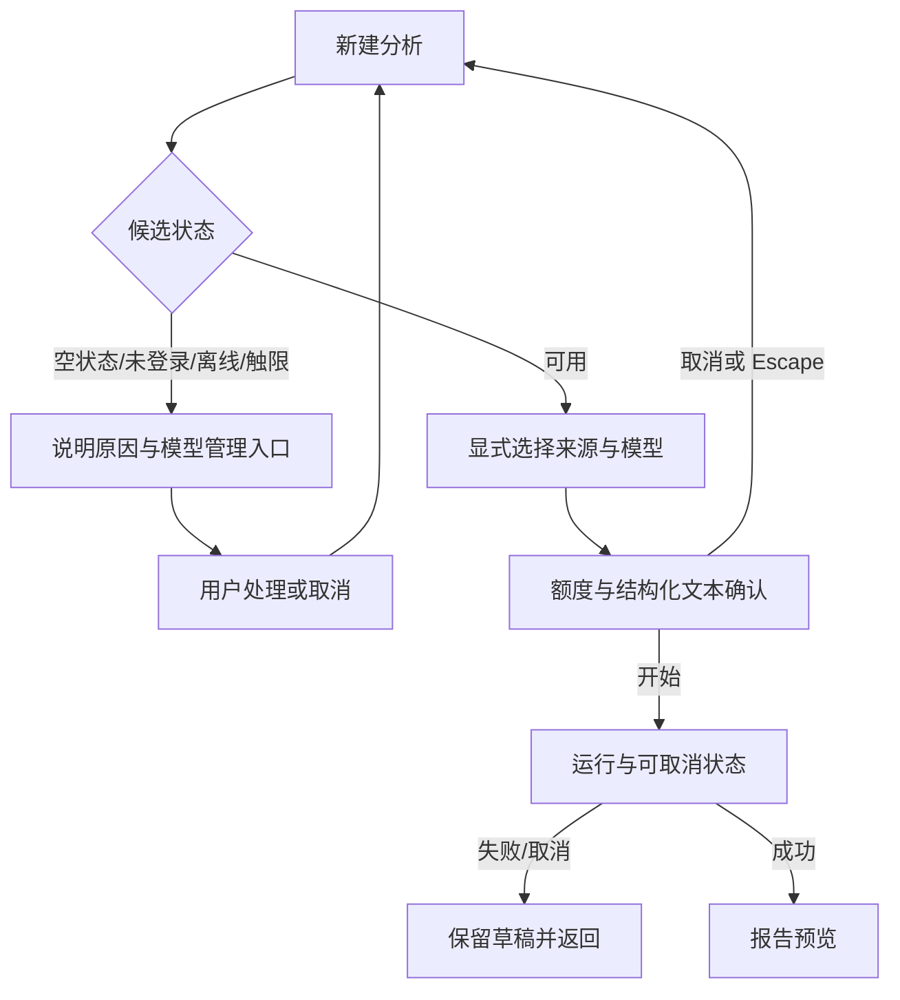
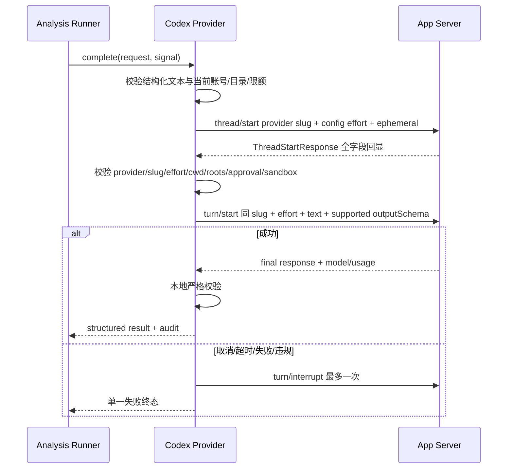

# Codex订阅模型分析-REQ-0008-v1.1

## 1. 文档信息

| 项目 | 内容 |
| --- | --- |
| 需求名称 / 编号 / 版本 | Codex 订阅模型分析 / Codex订阅模型分析-REQ-0008 / v1.1 |
| 文档状态 | DRAFT；需求合同完整，真实订阅、签名安装包和双平台证据待执行 |
| 交互类型 | mixed |
| 提出人 / 审核人 | 产品负责人 / 产品负责人 |
| 编写负责人 | Codex |
| 创建 / 更新日期 | 2026-08-26 / 2026-08-30 |
| 关联前置需求 | [Codex订阅接入-REQ-0007-v1.0](../Codex订阅接入-REQ-0007/Codex订阅接入-REQ-0007-v1.0.md) |
| 关联基础需求 | [单素材分析-REQ-0005-v1.0](../单素材分析-REQ-0005/单素材分析-REQ-0005-v1.0.md) |
| 关联技术设计 | [Codex订阅模型分析-DEV-0020-v1.0](../../development/Codex订阅模型分析-DEV-0020-v1.0.md) |
| 关联排障 | [Codex订阅模型分析-TRB-0017-v1.0](../../troubleshooting/Codex订阅模型分析-TRB-0017-v1.0.md) |
| 关联任务 / 分支 | APP-0027、APP-0036 / codex/req-0008-app-0036-codex-visual-frames |
| 发布单元 | macOS 客户端、Windows 客户端；不新增 Material 自建后端 |

本文档定义“把用户自己登录的 ChatGPT/Codex 订阅作为一次单素材分析的显式模型来源”的产品合同。它不把订阅、API Key、模型名称、账号权益或调用成功视为同一事实，也不把 mock、静态原型或未登录 runtime 结果包装成真实订阅证据。

## 2. 一句话摘要

用户可在新建分析时显式选择“Codex 订阅（Beta）”中的文本模型；当所选目录项同时声明 image 能力时，应用除受限结构化文本外，只发送当前素材本地生成并再次校验的最多 8 个 JPEG 代表帧，不上传原始视频、原始音频或用户素材路径。一次分析仍只使用一个新临时线程和一个逻辑 turn；订阅失败、限额、离线、视觉校验失败或取消均失败关闭，不自动重试、切换模型或回退 API Key。

## 3. 背景与现状证据

既有单素材分析已支持 API Key 模型。REQ-0007 定义了独立的 ChatGPT 登录、账号摘要、限额、模型目录和固定连通性测试，但明确没有接入业务分析。用户进一步要求直接使用自己的 Codex 订阅完成分析，因此本需求只连接“已就绪订阅模型”和“单素材分析”两个既有边界。

官方事实必须按以下层级表达：

- [Codex Authentication](https://learn.chatgpt.com/docs/auth) 将 Sign in with ChatGPT 的订阅访问与 API Key 的按量访问区分开；两者不是同一凭据或同一计费来源。
- [Codex App Server](https://learn.chatgpt.com/docs/app-server) 提供账号、模型、限额、线程、turn 和事件接口；其 `model/list.inputModalities` 可声明 image 能力，`turn/start.input` 支持 `localImage`。App Server 整体及部分传输/方法存在 Experimental 边界，不承诺生产稳定，实际发布仍以锁定 0.149.1 `generate-ts --experimental` 与运行时测试为准。
- [Codex SDK](https://learn.chatgpt.com/docs/codex-sdk) 可嵌入 Node.js 应用并运行 Codex 线程，但官方将其定位为用于“coding-focused Codex threads”。Material 的素材分析是非代码工作流，技术可接不等于已确认产品/条款适用性；官方页面也不被本需求引申为禁止。真实账号 smoke 与 OpenAI 产品/条款适配确认前，本来源只是 Beta，不作为默认或稳定来源，API Key 通路必须保留。
- [Feature maturity](https://learn.chatgpt.com/docs/feature-maturity) 要求对实验能力使用清晰成熟度标记；产品界面统一展示“Codex 订阅（Beta）”。
- [Codex Pricing](https://learn.chatgpt.com/docs/pricing) 说明订阅内使用受计划与限额影响；Material 不承诺免费、无限、固定次数或固定模型。

App Server 可用不等于账号可用；账号可用不等于某模型可见；模型可见不等于有剩余额度；一次真实调用成功也不等于签名安装包或另一操作系统可用。

## 4. 使用者与使用场景

### 4.1 使用者

- 已拥有支持 Codex 的 ChatGPT 订阅并愿意主动登录的个人用户。
- 受组织工作区席位、管理员策略、地区或限额约束的成员。
- 同时维护 API Key 模型、但希望逐次决定费用来源的用户。

### 4.2 典型场景

1. 用户在“模型管理”连接订阅，在“新建分析”显式选择“Codex 订阅（Beta） · 模型名”。
2. 用户确认本次会消耗订阅额度；若所选模型支持视觉，确认只外发结构化文本与受控代表帧、绝不外发原始视频后开始分析。
3. 分析中用户看到稳定阶段并可取消；取消只作用于本次 generation。
4. 订阅过期、触限、离线、模型下线或返回结构非法时，用户看到明确原因和恢复入口。
5. 用户下一次可显式选择 API Key 模型，但系统不会替用户自动切换。

### 4.3 前置条件

- 素材已由本地受控解析流程形成结构化文本证据；需要视觉分析时，同一素材的 M02 代表帧已在主进程内编码为受限 JPEG。
- REQ-0007 的账号状态为 ready，目录中仍存在所选文本目录项，其 `id`、`model` slug 和 `defaultReasoningEffort` 均合法，且没有已知 limited 状态。
- 用户在本次分析开始前完成显式来源与目录项选择；V1 不另行选择 reasoning effort。
- 需要网络访问 OpenAI 服务；离线浏览、本地预览和 API Key 配置维护不受订阅状态阻塞。

## 5. 目标与成功指标

| 目标 | 用户可观察结果 | 追踪 |
| --- | --- | --- |
| 来源可解释 | API Key 与 Codex 订阅分组展示；每次运行前可见选择或严格匹配预填均须用户审阅并显式启动 | CA-FR-01～CA-FR-05，CA-AC-01～CA-AC-08 |
| 外发最小化 | 只外发结构化文本与最多 8 个受控 JPEG 代表帧；不发送原始视频、音频或素材路径 | CA-FR-10～CA-FR-13，CA-AC-17～CA-AC-24 |
| 调用确定 | 一次新临时线程、一次逻辑 turn，无应用层重试或回退 | CA-FR-11～CA-FR-17，CA-AC-21～CA-AC-32 |
| 状态可恢复 | 空、加载、离线、触限、运行、取消、失败、成功均有动作 | CA-FR-06～CA-FR-09，CA-AC-09～CA-AC-16 |
| 报告诚实 | 同时记录 catalog selection ID、provider requested/returned slug、冻结 effort 和可用 usage | CA-FR-18～CA-FR-21，CA-AC-33～CA-AC-40 |
| 证据分级 | mock、runtime、真实订阅、签名包、双平台不混报 | CA-FR-24，CA-AC-45～CA-AC-48 |

本需求的成功不是“页面出现 Codex”，而是边界内的真实执行结果可被复核、失败不扩权、报告不误导。

## 6. 非目标

- 不发送原始图片、视频、音频、波形、任意缩略图、媒体 URL 或用户素材绝对/相对路径；唯一允许的媒体字节是当前素材由 M02 生成、最多 8 个且符合本需求限制的 JPEG 代表帧。
- 不让 Codex 读取素材目录、产品库目录、仓库、用户主目录或任意文件。
- 不提供任意聊天、连续会话、线程历史、云任务、代码编辑、shell、MCP、web search、skills、hooks、plugins、memory 或子 Agent。
- 不允许用户输入任意系统 Prompt、工作目录、审批策略、工具参数或 App Server JSON-RPC。
- 不自动重试、续写、创建第二个 turn、切换模型、改用默认模型或回退到 API Key。
- V1 不提供 reasoning effort 切换器，不允许用户或 renderer 改写目录项的默认 effort。
- 不推断订阅余额、价格、剩余次数或 token 单价，不购买或兑换 credits。
- 不声称 ChatGPT 订阅可用于通用 OpenAI API；API Key 继续按独立协议与计费路径运行。
- 不以静态原型、mock、开发机全局 CLI 登录、未签名开发包或单平台结果替代交付证据。

## 7. 范围与发布单元

### 7.1 包含

- “模型管理”中的订阅前置能力和“新建分析”模型来源选择接线。
- Codex 文本模型候选、image 能力标记、显式选择、启动确认、状态、取消、超时、失败和成功。
- 受限结构化证据 envelope、当前素材受控代表帧、严格结构化输出 schema、报告与历史记录字段。
- 应用专属登录、固定 runtime、分析专用临时工作目录、只读 sandbox、无工具网络和秘密隔离。
- 单元、集成、mock、runtime、真实订阅 smoke、签名产物及 macOS/Windows 证据合同。

### 7.2 排除

- Material 自建代理、云端 token 托管、多人共享订阅或服务账号。
- 多素材、持续对话、任意文档问答和通用 coding agent。
- 订阅购买、席位管理、管理员策略修改和服务可用性承诺。
- 对既有 API Key 凭据 schema、费用归属和自动化测试策略的改造。

### 7.3 发布单元

macOS 与 Windows 客户端分别打包和验证。共享 TypeScript 测试只能证明共享逻辑，不能证明 Keychain/Credential Manager、签名、公证、SmartScreen、资源路径或架构正确。

## 8. 前置与后置依赖

### 8.1 前置依赖

- REQ-0005 的本地素材、确定性解析、EvidencePacket、分析编排、报告预览和历史读取可用。
- REQ-0007 的 app-scoped 登录、account/read、model/list、rate limits、固定 runtime 和系统凭据隔离可用。
- 至少存在一个 ready API Key 模型，或一个 ready、未已知触限且目录仍包含所选文本模型的 Codex 订阅账号。
- 启动订阅分析需要 OpenAI 服务网络可达；本地解析、草稿和历史读取不依赖该网络。

### 8.2 后置依赖

- 成功且通过两层 schema/语义校验的结果才能进入既有报告预览。
- 用户确认后，报告和运行摘要按 REQ-0005 保存；失败、取消和超时默认不形成正式记录。
- PDF 导出、历史重放与重新分析消费扩展后的来源/模型/usage 摘要，但不能恢复临时 Codex thread。
- 签名安装包、真实订阅 smoke、双平台凭据隔离和发布决定是后置交付证据，不由 mock 或本文档替代。

## 9. 假设和未决事项

### 9.1 假设和未决事项清单

| 编号 | 类型 / 状态 | 内容 | 处理 |
| --- | --- | --- | --- |
| CA-A-01 | 已确认 | V1 候选必须支持 text；同时声明 image 时可接收受控代表帧 | 非文本目录项不进入候选；无 image 能力时保持纯文本证据 |
| CA-A-02 | 已确认 | 每次由用户审阅来源与模型并显式启动；现代历史记录严格匹配时可预填草稿 | 只按 configurationId + providerId + source + catalog preset ID 四元精确匹配；不持久化为自动默认，不静默升级 |
| CA-A-03 | 已确认 | 只发送本地结构化文本和当前素材的受控 JPEG 代表帧 | 原始媒体、其他文件、远程 URL 和用户素材路径在 App Server 请求前拒绝 |
| CA-A-04 | 已确认 | 一次分析只创建一个新临时线程和一个逻辑 turn | 不恢复旧线程，不追加第二 turn |
| CA-A-05 | 已确认 | Material 层不自动重试或回退 | 上游 runtime 内部传输行为不被夸大为单次 HTTP |
| CA-A-06 | 已确认 | App Server 是 Experimental，产品标 Beta | UI、文档和日志不移除成熟度提示 |
| CA-A-07 | 已确认 | `model/list.id` 是目录/预设选项 ID，`model/list.model` 是 provider 请求 slug；V1 冻结所选项的 `defaultReasoningEffort` | 同 slug 多 ID 不折叠；无用户 effort 切换器；缺必需字段失败关闭 |
| CA-Q-01 | 外部待证 | 实际账号可见模型和限额 | 每次以 account/model/rate-limit 返回为准 |
| CA-Q-02 | 外部待证 | usage 字段在所有模型/套餐是否完整 | 可为空，不据此推断费用 |
| CA-Q-03 | 交付待证 | 签名安装包内 runtime、keyring 和双平台隔离 | 按证据层级分别执行 |
| CA-Q-04 | 产品待证 | coding-focused Codex SDK/App Server 用于非代码素材分析的产品/条款适配性 | 真实账号 smoke 与发布审核前仅 Beta、不默认/不标稳定，保留 API Key；不声称条款禁止 |

任何未决外部事实都不能通过硬编码、示例数据或默认零值“解决”。

### 9.2 信息架构影响

唯一长期入口为侧栏“模型管理 / API Key / Codex”。设置页分为“Codex 订阅（Beta）”和“API Key 模型”两个独立区域。新建分析只消费两个区域发布的 ready 候选，不在分析弹窗内复制登录或 Key 表单。

模型选择器按来源分组：

| 来源 | 显示格式 | 可选条件 | 不可选后的动作 |
| --- | --- | --- | --- |
| Codex 订阅 | Codex 订阅（Beta） · 目录展示名（同名/同 slug 时辅以默认 effort 等非秘密摘要区分） | 账号 ready、目录已加载、所选 `id` 及其 `model`/`defaultReasoningEffort` 合法、支持文本、非 limited | 清空本次选择，提供“前往模型管理” |
| API Key | API Key · 配置名 · 模型名 | 既有配置 ready 且模型可用 | 沿用既有恢复动作 |

候选值必须编码来源、配置标识和目录选项 `id`，不能只按显示名或 provider slug 区分。同 slug 的多个预设必须分别保留；开始时从权威目录项解析并冻结 provider slug 与 `defaultReasoningEffort`。全新分析须由用户显式选择目录项。只有从现代历史记录重新分析，且历史的 configurationId、providerId、source 与 catalog preset ID 同当前候选四元精确匹配时，才可把该候选作为可见草稿预填；用户仍须在配置页审阅，并显式点击开始及完成额度确认。legacy、任一不匹配或目录项下线都清空选择并要求重选，不按显示名、slug、isDefault、recommended、upgrade 或相近项猜测/回退；V1 也不提供 effort 切换。

## 10. 功能明细与业务规则

~~~mermaid
flowchart TD
    A[进入新建分析] --> B[加载 API Key 与 Codex 独立候选]
    B --> C{Codex 是否 ready 且模型可用}
    C -->|否| D[显示状态与模型管理恢复入口]
    C -->|是| E[用户显式选择 Codex 订阅（Beta）模型]
    E --> F[确认额度提示与结构化文本外发范围]
    F -->|取消| G[留在新建分析，不创建 thread]
    F -->|开始| H[冻结 source/catalog id/provider slug/default effort/account generation]
    H --> I[创建一个 ephemeral thread]
    I --> J[启动一个逻辑 turn]
    J --> K{结果}
    K -->|成功且 schema 合法| L[记录 catalog/requested/returned/effort 与 usage]
    K -->|取消/超时/失败/非法| M[失败关闭，不重试不回退]
    L --> N[进入报告预览]
    M --> O[保留草稿并给出恢复动作]
~~~

取消边界：

1. 确认前取消：不创建线程、不消耗调用。
2. 运行中取消：UI 的 cancelling 是“取消请求已发出”而不是最终 CANCELLED；主进程对当前 generation 最多发送一次 interrupt。
3. 首个受控终态胜出：若 CANCELLED/TIMEOUT 先确立，迟到进度和成功结果全部丢弃，不保存成功报告；若模型成功已先确立，后到的取消请求不得把 succeeded 改写为 cancelled。
4. 取消失败或 runtime 无响应：达到客户端截止时间后终止本次受控会话，仍不启动第二次调用。

## 11. 用户流程与交互

### 11.1 主要流程

主要流程包含进入、取消、返回和恢复。空状态、加载、权限/登录、离线、触限、失败与成功必须分开；权限不足只给安全恢复入口，不扩大文件或账号权限。无障碍要求覆盖键盘顺序、可见焦点、Escape、Tab trap、读屏名称、aria-live、200% 缩放和高对比度。

### 11.2 原型映射与静态证据边界

设置入口沿用 REQ-0007 的两张 1280×800 原型：

- [P-CS-01 未登录设置入口](../Codex订阅接入-REQ-0007/assets/P-CS-01-codex-subscription-signed-out.png)
- [P-CS-02 已连接设置入口](../Codex订阅接入-REQ-0007/assets/P-CS-02-codex-subscription-connected.png)

这些图片只证明入口、分区、状态摘要和操作位置，不证明账号登录、订阅权益、模型可用、真实分析、额度消耗、取消、安全隔离或跨平台打包。新建分析的行为以第 9、10、13、19 章和实际可访问性检查为准。

UI 必须覆盖：

- 空候选：说明没有可用模型，提供模型管理入口。
- 加载：保持草稿，模型控件显示 busy，开始按钮禁用。
- 登录缺失：显示“需要登录 Codex 订阅”，不显示 API Key 提示为替代。
- 离线：说明连接恢复后刷新，不循环重试。
- 触限：说明限额来源和已知重置摘要；未知显示“暂不可用”。
- 运行：显示稳定阶段、所选来源和模型，可取消。
- 取消中：防止重复取消和重复开始。
- 失败：保留素材与表单草稿，显示可执行恢复动作。
- 成功：进入既有报告预览，并可检查实际模型与 usage 摘要。

## 12. 非 UI 流程图与功能需求

### 12.1 非 UI 调用时序

该时序只表示 Material 的一个逻辑 thread/turn 责任，不声称上游只进行一次 HTTP 传输。

### 12.2 功能需求

| 编号 | 需求 |
| --- | --- |
| CA-FR-01 | 系统只保留一个模型管理入口，并把“Codex 订阅（Beta）”与“API Key 模型”作为独立来源展示。 |
| CA-FR-02 | 新建分析从两个来源读取候选，但登录、凭据、限额、错误和删除互不替代。 |
| CA-FR-03 | 只有 account ready、目录已加载、非 limited，且 `id`、provider `model` slug、`defaultReasoningEffort` 和 text modality 均合法的目录项可成为 Codex 候选；目录项同时声明 image 时标记为“视觉”并允许本次受控代表帧，无 image 时只使用结构化文本。缺任一必需字段失败关闭。 |
| CA-FR-04 | 每次分析开始前，用户必须审阅可见的来源与目录项 `id` 并显式点击开始；全新分析要求手动选择，重新分析仅允许 configurationId + providerId + source + catalog preset ID 四元精确匹配的现代记录预填草稿。legacy、任一不匹配或下线时清空；同 provider slug 多预设不得折叠，也不得按默认、推荐、显示名、slug、历史相似项或升级字段猜测。V1 不允许用户切换 reasoning effort。 |
| CA-FR-05 | 开始时从同一次权威目录预检冻结 source、catalog selection ID、provider requested model slug、该项 `defaultReasoningEffort`、runtime generation 和 account epoch；不声称存在实现中没有的独立 catalog generation。运行中刷新不得改写本次组合。 |
| CA-FR-06 | 页面必须呈现 empty、loading、needs-login、limited、offline、running、cancelling、failed、success 状态。 |
| CA-FR-07 | 每个非成功状态必须提供安全恢复动作；错误不得只显示技术码。 |
| CA-FR-08 | 已知限额显示服务返回的窗口与重置摘要；未知不得显示为零、无限或免费。 |
| CA-FR-09 | 离线时禁用订阅启动，保留草稿，不自动轮询、重试或切换 API Key。 |
| CA-FR-10 | 启动前必须再次说明“会消耗订阅额度”；纯文本模型说明只发送结构化文本，视觉模型说明还会发送最多 8 个本地生成的 JPEG 代表帧、不会发送原始视频。用户可取消。 |
| CA-FR-11 | 一次分析创建一个新的 ephemeral thread：`thread/start` 发 provider slug，通过 config 发冻结 effort，`allowProviderModelFallback=false`；唯一 `turn/start` 再发同一 slug 和 effort。不得恢复/复用旧 thread，不得更换预设、slug 或 effort。 |
| CA-FR-12 | thread 使用应用新建的分析专用临时 cwd、read-only sandbox 和 app-scoped strict config；纯文本调用保持目录为空，视觉调用只物化匿名 `representative-frame-NN.jpg`。锁定 runtime 协议尚不能证明按 readableRoots 强制文件根，因此 V1 以禁止全部文件/命令工具、仅允许请求中精确列出的 `localImage` 路径、无其他业务文件和意外请求同 generation 失败关闭实现边界。 |
| CA-FR-13 | 文本输入只能是有版本、有限长、可验证的结构化 envelope。视觉输入只能来自同一素材 M02 代表帧，最多 8 个、JPEG、最长边 1280、单帧不超过 1 MiB、总计不超过 6 MiB；主进程必须复验数量、标准 Base64、尺寸、唯一 evidenceId、JPEG 头尾、单帧和总字节后，以 `localImage` 提交匿名临时路径。原始视频/音频、远程 image URL、data URL、任意本地路径和未知字段失败关闭。 |
| CA-FR-14 | `Turn.items` 与 item 生命周期只在锁定协议必填字段、类型和长度严格合法后识别 `userMessage`、`reasoning`、`agentMessage` 三类非工具 item；视觉调用的 `userMessage.content` 只额外允许与本次匿名帧路径集合精确匹配的 `localImage`。只有合法 `agentMessage` 可作为最终正文候选，且仍须符合固定 JSON Schema。自由文本、工具结果、代码块包裹、缺字段或超限结果不得进入报告。 |
| CA-FR-15 | 合法 `userMessage`（含本次精确 `localImage`）与 `reasoning` 仅作协议兼容并立即丢弃，路径、图像字节和内容绝不进入 renderer、报告、日志或存储；进度只暴露 Material 定义的稳定阶段。任一允许类型的畸形必填字段、未知 item，或 tool/command/file/web/MCP/remote-image/collab item 都使当前 generation 失败关闭。 |
| CA-FR-16 | 用户取消只针对当前 generation；主进程最多发送一次 interrupt，首个受控终态胜出。CANCELLED/TIMEOUT 已先确立时忽略迟到成功；成功已先确立时后到取消不改写 succeeded。 |
| CA-FR-17 | 超时、断线、触限、模型拒绝、schema 失败、安全违规和合法 `ErrorNotification` 都结束本次调用；`willRetry=true` 与 `willRetry=false` 均是锁定 schema 允许值，但 Material 对两者都立即终止本次，不等待重试、不追加 turn、不换模型、不回退 API Key。 |
| CA-FR-18 | audit、报告、确认后记录和 PDF 必须保留 sourceType=codexSubscription、catalogSelectionId、providerRequestedModelSlug、frozenReasoningEffort、运行时/能力版本和完成状态。 |
| CA-FR-19 | runtime 返回实际 slug 时记录 providerReturnedModelSlug；与 providerRequestedModelSlug 不同必须保留两者并使当前 generation 失败关闭，不得把偏差解释为允许的自动切换。 |
| CA-FR-20 | usage 仅记录 runtime 实际返回的结构化计数；缺失时为空并显示“暂不可用”。旧记录缺 catalog/slug/effort/usage 扩展字段时保持可读，不伪造默认值。 |
| CA-FR-21 | 成功结果进入既有报告预览、保存、历史回放和重新分析；四元精确匹配的现代记录可见预填原候选，但不自动运行，用户仍须审阅、显式点击开始并完成额度确认；legacy、不匹配或下线时清空并重新选择。 |
| CA-FR-22 | 所有选择器、确认框、状态与错误支持键盘、焦点管理、Escape、读屏名称和 aria-live。 |
| CA-FR-23 | API Key 新增、测试、分析、报告和凭据安全合同保持独立且不退化。 |
| CA-FR-24 | 所有 UI、文档和证据将能力标为“Codex 订阅（Beta）”，并区分 App Server Experimental 与稳定 API Key 路径。 |

## 13. 数据与生命周期

Codex 分析数据生命周期为：草稿选择 → 冻结 generation/source/catalog ID/provider slug/default effort → 临时 thread/turn → 本地校验 → 报告预览 → 用户确认后保存；失败、取消和超时在临时阶段结束。下表的状态与该生命周期一一对应，任何迟到事件不得把终态改回运行或成功。

| 状态 | 进入条件 | 用户看到 | 允许动作 | 禁止行为 |
| --- | --- | --- | --- | --- |
| empty | 两个来源均无候选 | 无可用模型及原因 | 前往模型管理 | 猜测默认模型 |
| loading | 正在读账号/目录 | 加载提示 | 取消弹窗 | 开始分析 |
| needs-login | Codex 未登录 | 需要登录 | 前往模型管理 | 暗示 API Key 是订阅 |
| limited | 已知触限 | 限额与重置摘要 | 刷新、换成用户显式选择的其他来源 | 自动回退 |
| offline | 网络不可用 | 离线提示 | 保留草稿、稍后手动重试 | 后台循环调用 |
| running | thread/turn 已开始 | 稳定阶段和当前模型 | 取消 | 改模型、重复开始 |
| cancelling | 已请求取消 | 正在取消 | 等待终态 | 重复 interrupt |
| failed | 调用或校验失败 | 用户可理解原因 | 手动重试、重新选模型 | 自动重试 |
| success | schema 合法 | 报告预览 | 保存、继续编辑 | 隐藏模型差异 |

runtime generation、account epoch 与分析 generation 分别承担进程、账号和本次调用的隔离；目录在开始前通过当次权威 `model/list` 预检并冻结选项值，不定义独立 catalog generation。任何事件仅能更新匹配 generation/epoch 的状态；账号退出、换号、模型下线或 runtime 重启会使旧候选失效，但不会把已运行 turn 静默迁移到新账号或模型。

错误分类至少包括：AUTH_REQUIRED、ACCOUNT_CHANGED、MODEL_UNAVAILABLE、RATE_LIMITED、OFFLINE、RUNTIME_UNAVAILABLE、START_FAILED、CANCELLED、TIMEOUT、INVALID_OUTPUT、SECURITY_VIOLATION。日志使用类别与 correlation id，不包含 token、一次性 `userCode`、动态 auth URL、完整账号、prompt、证据正文或路径。

## 14. 登录、权限、安全与隐私

登录、账号、模型目录和限额遵循 REQ-0007：ChatGPT 托管登录只存在于 Material 专属 CODEX_HOME/keyring，API Key 走独立存储合同；renderer 不接收任何 token、动态 auth URL 或通用 RPC。唯一例外是设备码登录当前尝试的固定验证 URL 与一次性 `userCode` 可在当前 dialog 瞬时展示，只允许用户主动复制，并在尝试终态、取消或 dialog 关闭后清除；不得进入其他 renderer 状态或留下 DOM 残留。分析运行没有 shell、任意文件、工具或额外网络批准入口。视觉模型唯一可读输入是主进程在本次临时目录内写入并通过 `turn/start.localImage` 明确列出的匿名代表帧；这不是通用文件访问能力。

### 14.1 允许外发

只允许由本地确定性解析与规则层形成的结构化文本，以及视觉模型调用中的受控代表帧：

- 素材类型、时长、尺寸等无路径元数据；
- 采样时间点及其结构化视觉标签；
- OCR/ASR 的必要文本摘录；
- 已确认的产品字段、模板标识和评分规则摘要；
- 明确的 schemaVersion、locale、evidenceId 和边界计数。
- 当前素材由 M02 产生并经 VisualInputPreparer 编码、服务层二次校验的 JPEG；最多 8 个、最长边 1280、单帧不超过 1 MiB、总计不超过 6 MiB。外发语义只代表离散采样点，不等于完整视频逐帧理解。

### 14.2 禁止外发

- 原始视频、原始音频、原始图片、波形、任意缩略图、非 M02 帧或其他二进制；
- sourcePath、relocatedPath、file URL、产品库根、仓库根、用户名、主目录；
- API Key、ChatGPT token、auth URL、设备码、cookie、CODEX_HOME 内容；
- 未知 envelope 字段、调试 dump、异常堆栈中的本地路径；
- 其他分析记录、对话、报告正文或不属于当前素材的数据。

### 14.3 保存与删除

报告、确认后记录与 PDF 只保存业务结果、来源类型、catalog selection ID、provider requested/returned slug、冻结 reasoning effort、非秘密 runtime 版本、usage、代表帧数量/覆盖局限和追踪 ID；不保存帧字节或临时路径。临时 thread id 仅在本次主进程生命周期内用于取消/关联，不作为可恢复聊天保存；临时 cwd 和匿名代表帧在成功、失败、取消、超时及协议/安全终态后统一按本次精确目录递归清理。清理失败只记录非秘密类别告警，不扩大删除目标。旧记录上述新字段可缺失；阅读器显示“暂不可用”而不猜测。

## 15. 接口与兼容性

稳定应用接口是 source/config/catalog-selection 判别选择、ModelCompletionRequest、ModelInvocationResult、AbortSignal、公开状态 DTO 和报告运行摘要。App Server JSONL、experimental 字段与事件都封装在主进程适配器内；锁定协议变化由适配器和 runtime 测试吸收，renderer 与历史报告不依赖原始 RPC。

每次调用由主进程创建独立会话：

- 从最新权威 `model/list` 按目录 `id` 解析唯一选项；不按 `model` slug 去重。缺 `model` 或 `defaultReasoningEffort` 时不发请求。
- `thread/start.model` 发 provider slug，`thread/start.config.model_reasoning_effort` 发冻结默认 effort，并固定 `allowProviderModelFallback=false`、ephemeral、cwd、roots、approval 与 read-only/network-off 边界；`turn/start` 再显式发同一 slug 和 effort。有效 provider 由 `ThreadStartResponse.modelProvider === "openai"` 反向确认，不允许 provider fallback。
- 必须逐字段校验 `ThreadStartResponse`：`modelProvider === "openai"`、返回 `model` 等于冻结 provider slug、`reasoningEffort` 等于冻结 effort、`cwd` 和 `runtimeWorkspaceRoots` 等于本次分析专用临时目录、`approvalPolicy === "never"`，且 `sandbox.type === "readOnly"` 与 `networkAccess === false`。任一偏差都保留非秘密请求/返回摘要并使当前 generation 失败关闭。
- cwd 指向新建分析专用临时目录，不指向素材目录、仓库或用户目录；纯文本调用保持为空，视觉调用仅含固定匿名名的 JPEG 代表帧。
- 结构化文本证据作为 text input 提交；视觉模型只追加本次匿名代表帧的 `localImage` 输入。目录内不落原始视频、原始音频、素材路径映射、其他证据文件或凭据。
- 锁定 0.149.1 runtime 的生成协议与实时官网存在版本差异，尚不支持官网新版本描述的 restricted access/readableRoots；本文不声称已由协议强制“可读根”。
- app-scoped strict config 和请求参数共同禁用 shell、unified_exec、view_image、文件写入、MCP、web search、network tool、apps、plugins、hooks、skills、memory 和协作 Agent；read-only、approval never、dynamicTools 为空、network off。pinned 0.149.1 实测只接受 `[features] view_image=false` 与根级 `web_search="disabled"`，并会拒绝实时官网新式 `[tools] view_image=false`；生产配置服从锁定 strict schema，同时保留意外工具事件失败关闭。
- `Turn.items`、`item/started` 与 `item/completed` 共用严格 item 合同：只识别合法 `userMessage`、`reasoning`、`agentMessage`；`userMessage` 中的 `localImage.path` 必须精确属于本次匿名帧集合，remote image URL、其他路径或其他 input 类型均失败关闭。前两类验证后立即丢弃，只有 `agentMessage` 是最终正文候选。允许类型缺少或畸形必填字段按协议失败关闭；tool/command/file/web/MCP/remote-image/collab/未知 item 按安全边界使同一 generation 失败关闭。
- `ErrorNotification` 必须含布尔 `willRetry`；`true` 与 `false` 都通过 schema 校验，但 Material 无论何值都结束本次 generation，不等待 runtime 重试结果，也不创建第二个 turn。
- 任何意外工具事件或 server request 都使同一 runtime generation 失败关闭；不得请求用户批准 shell 或文件扩权。
- “无工具网络”指 Codex 不能通过工具访问任意网络目标；本次模型传输到 OpenAI 服务本身仍需要网络，不能误写成完全离线。
- 一旦收到工具调用、文件读取、命令或额外网络意图事件，立即标记 SECURITY_VIOLATION、取消当前 turn，并拒绝结果。

外部 chatgptAuthTokens 属实验能力，V1 禁止使用。Material 不复制用户全局 Codex CLI/IDE token，不从全局 CODEX_HOME 启动。

## 16. 性能、可靠性与成本

### 16.1 性能、可靠性与成本约束

- 候选加载和外部账号刷新不得阻塞本地素材解析或历史查看；UI 只消费稳定阶段，不转发 token 级高频流。
- 单一 generation 只能产生一个受控终态；超时、取消、runtime close 和迟到成功按首次终态处理。
- 每次开始前提示可能消耗订阅额度；Material 不自动重试、追加 turn、换模型、购买 credits 或把 usage 换算金额。
- 外部服务延迟与价格不设虚假固定 SLA；客户端使用有上限的控制请求和分析截止时间，并向用户显示可恢复状态。

### 16.2 输入与输出合同

输入 envelope 采用固定版本并进行大小、字段、字符和数组上限校验。示意字段为：

| 字段 | 必需 | 说明 |
| --- | --- | --- |
| schemaVersion | 是 | 当前输入合同版本 |
| mediaKind | 是 | image / video / audio 之一 |
| technicalFacts | 是 | 无路径技术事实 |
| evidenceItems | 是 | 结构化文本证据，含 evidenceId 与时间点 |
| productSnapshot | 否 | 用户已确认的结构化产品字段 |
| templateAndRules | 是 | 固定模板与规则摘要 |
| locale | 是 | 输出语言 |

发送给 App Server 的 outputSchema 只使用锁定 runtime generate-ts 实际支持的 JSON Schema 子集，不使用 oneOf、uniqueItems 等当前 locked schema 不支持的关键字；完整业务约束由返回后的本地严格校验补齐。输出至少包括 summary、findings、scores、evidenceRefs、risks、recommendations。evidenceRefs 只能引用输入 evidenceId；未知引用、重复越界、NaN、自由 HTML、隐藏 prompt 或超长文本均拒绝。两层校验都发生在任何业务保存前。

“一个逻辑 turn”描述 Material 的调用责任：应用只发送一次 turn/start。上游 runtime 可能在内部进行流式传输或恢复网络请求，本文不声称只有一个 HTTP 请求；但 Material 不发第二个 turn/start，也不根据失败再创建线程。

## 17. 运维、可观察性和问题排查

运行期只记录 correlation id、阶段、版本、耗时、catalog selection ID、provider requested/returned slug、冻结 effort、usage 是否存在、受控状态和安全错误类别；不记录账号原值、token、prompt、证据正文或路径。异常按 [TRB-0017](../../troubleshooting/Codex订阅模型分析-TRB-0017-v1.0.md) 处理，runtime 升级前必须重跑锁定协议、真实订阅和平台证据矩阵。

报告模型摘要至少包含：

| 字段 | 行为 |
| --- | --- |
| sourceType | 固定为 codexSubscription |
| sourceDisplayName | 固定为 Codex 订阅（Beta） |
| catalogSelectionId | 用户开始时冻结的 `model/list.id`，作为目录/预设身份，不当作 provider slug |
| providerRequestedModelSlug | 从所选目录项 `model` 冻结并发送的 provider slug |
| providerReturnedModelSlug | runtime 明确返回的实际 slug；偏差时仍记录并失败关闭 |
| frozenReasoningEffort | 所选目录项的 `defaultReasoningEffort`；thread config、turn 与返回校验均必须一致 |
| runtimeVersion | 实际握手版本 |
| capabilityVersion | Material 适配器/输入输出合同版本 |
| usage | 仅真实返回的计数；允许为空 |
| correlationId | 非秘密本地追踪 ID |

provider requested/returned slug 不同不是可以隐藏的展示细节：报告和诊断均保留 catalog selection ID、两个 slug 和冻结 effort，并将当前 generation 标为失败，不作为允许的自动 reroute。usage 缺失不等于零；token 计数不自动换算金额、credits 或剩余次数。旧报告缺 catalog/slug/effort 字段时保持可读并显示未知。

历史打开不需要订阅在线。重新分析必须重新读取当前账号和目录：仅当现代记录的 configurationId、providerId、source 与 catalog preset ID 四元同当前候选精确匹配时可见预填；用户仍须审阅并显式点击开始、再次确认额度。legacy、任一不匹配或下线时清空并重新选择，绝不按历史 slug、显示名或相近项猜测/回退。旧报告不因模型下线而改写。

## 18. 发布、迁移与回退

### 18.1 非功能发布门槛

| 编号 | 需求 |
| --- | --- |
| CA-NFR-01 | 安全：renderer 不接收 token、动态 auth URL、原始 App Server RPC、代表帧字节/临时路径或证据全文日志。仅设备码登录当前尝试的一次性 `userCode` 可在当前 dialog 瞬时展示并由用户主动复制；终态后清除，且不得进入其他 renderer 状态、DOM 残留、日志、持久化、报告或崩溃信息。 |
| CA-NFR-02 | 最小权限：主进程只暴露固定 DTO 和动作白名单；严格合法的 `userMessage`/`reasoning` 仅在主进程瞬时校验后丢弃，本次 `localImage` 只允许精确匿名帧路径，所有未知/畸形 item、其他路径与工具请求失败关闭。 |
| CA-NFR-03 | 隔离：Material 专属 CODEX_HOME、keyring service/account 名和 runtime，不读取或退出全局 CLI/IDE 会话。 |
| CA-NFR-04 | 确定性：同一 generation 只能产生一个受控终态，取消和结果竞态以首次受控终态为准。 |
| CA-NFR-05 | 可用性：失败保留表单草稿；离线、本地历史和 API Key 配置维护不被 Codex 阻塞。 |
| CA-NFR-06 | 性能：候选加载不阻塞素材本地解析；UI 状态更新不依赖转发高频 token 流。 |
| CA-NFR-07 | 可访问性：键盘顺序、可见焦点、Escape、Tab trap、读屏标签、状态播报、200% 缩放和高对比度可用。 |
| CA-NFR-08 | 可观测性：只记录类别、阶段、版本、耗时和 correlation id；默认脱敏且不记录正文。 |
| CA-NFR-09 | 兼容性：macOS arm64/x64 与 Windows x64 分别验证 runtime 架构、资源路径、系统凭据和签名安装包。 |
| CA-NFR-10 | 成熟度：App Server Experimental 和产品 Beta 在界面、需求、技术、排障及发布说明中一致；真实账号 smoke 与 OpenAI 产品/条款适配确认前，Codex 不得作为默认/稳定来源，API Key 必须保留。 |

### 18.2 迁移与回退

旧草稿没有 sourceType 时要求用户重新选择，不能按 configurationId 猜测。旧报告缺少 catalog selection ID、provider requested/returned slug、冻结 effort 或 usage 时保持可读并显示“暂不可用”。回退时停止新 Codex 分析、取消当前 turn、保留历史报告和 API Key 配置；不得删除全局 Codex 登录。最终合并、签名分发、发布和移除 Beta 由产品负责人决定。

## 19. 验收标准

| 编号 | 操作 / 条件 | 预期结果 |
| --- | --- | --- |
| CA-AC-01 | 打开模型管理 | 只有一个入口，出现“Codex 订阅（Beta）”和“API Key 模型”独立分区 |
| CA-AC-02 | 同时存在两类 ready 模型，且 Codex 目录有多个 ID 共享同一 provider slug | 新建分析按来源标注列出，同 slug 的不同预设分别保留，不折叠/覆盖 |
| CA-AC-03 | 查看候选内部值 | 同时包含 source/config/catalog selection ID，主进程可从权威项解析 provider slug 与 default effort；不能只靠 display name 或 slug |
| CA-AC-04 | 新建分析首次打开 | 没有自动选 Codex 默认、推荐、历史或升级项；V1 没有 reasoning effort 切换器 |
| CA-AC-05 | 用户显式选 Codex 目录项 | 启动前清楚显示来源、目录项/模型和目录默认 effort 摘要 |
| CA-AC-06 | 运行中刷新目录 | 本次冻结的 catalog ID、provider slug 和 default effort 不被静默替换 |
| CA-AC-07 | 运行前目录项下线、换 slug/default effort、账号换代，或缺 `model`/`defaultReasoningEffort` | 清空选择或失败关闭，要求重新选择；不伪造值 |
| CA-AC-08 | 订阅失败但 API Key 可用 | 不自动回退；用户可手动显式选择 API Key |
| CA-AC-09 | 两类来源都无候选 | empty 状态说明原因并提供模型管理入口 |
| CA-AC-10 | 账号未登录 | needs-login 状态，开始按钮禁用 |
| CA-AC-11 | 模型/限额加载中 | 显示 busy，保留草稿且禁止开始 |
| CA-AC-12 | 已知触限 | 显示服务返回的窗口/重置摘要，不显示为永久零或无限 |
| CA-AC-13 | 限额字段缺失 | 显示“暂不可用”，不伪造数值 |
| CA-AC-14 | 离线 | 保留草稿，不自动轮询、重试或切换来源 |
| CA-AC-15 | 失败 | 显示人话原因和手动恢复动作，不泄露内部错误正文 |
| CA-AC-16 | 键盘/读屏/200%缩放 | 入口、选择、确认、取消、错误和状态均可完成 |
| CA-AC-17 | 点击开始 | 先显示订阅额度和外发提示；视觉模型明确“结构化文本 + 最多 8 个受控代表帧、原始视频不上传”，纯文本模型不声称发送图片 |
| CA-AC-18 | 在确认框取消或按 Escape | 不创建 thread，不启动 turn |
| CA-AC-19 | 检查输入 envelope 与视觉批次 | 文本只有允许字段与有限长度；视觉批次为同一素材、1～8 个 JPEG、最长边 1280、单帧≤1 MiB、总计≤6 MiB、标准 Base64、唯一 evidenceId 和合法 JPEG 头尾 |
| CA-AC-20 | 注入原始视频/音频、远程 image URL、data URL、任意路径、非 JPEG、超量/超限/重复帧或无 image 能力模型 | 在 `thread/start` 或 `turn/start` 前失败关闭；原始素材与任意路径不进入 App Server |
| CA-AC-21 | 成功开始一次视觉分析 | 创建一个新 ephemeral thread 和一个逻辑 turn；thread/start 发 provider slug + config effort + `allowProviderModelFallback=false`，turn/start 发同 slug + effort、1 条 text 和最多 8 条 `localImage`；不发送第二 turn |
| CA-AC-22 | 检查 `ThreadStartResponse`、cwd、strict config 与锁定协议 | 逐字段等于 `modelProvider=openai`、冻结 slug/effort、分析专用 cwd/roots、approval never、readOnly + network false；视觉 cwd 仅含 `representative-frame-NN.jpg`，纯文本 cwd 为空，任一偏差失败关闭。工具全禁用，不虚构 locked schema 尚无的 readableRoots 强制 |
| CA-AC-23 | 模型尝试文件/命令/MCP/web/network tool | 立即安全失败并取消，不展示或保存结果 |
| CA-AC-24 | 检查分析主进程到 renderer DTO、报告、SQLite、PDF 与日志 | 无 token、动态 auth URL、设备码 `userCode`、代表帧字节/临时路径、原始 RPC 或证据正文；登录 DTO 的瞬时 `userCode` 例外严格受 CA-NFR-01 限制 |
| CA-AC-25 | 分别在 `Turn.items`、`item/started`、`item/completed` 注入严格合法的 `userMessage`、`reasoning`、`agentMessage`，以及本次/非本次 `localImage` | 本次精确路径可协议兼容，其他路径/remote image 失败关闭；`userMessage`/`reasoning` 连同图像路径立即丢弃，renderer/报告/日志/存储均无命中；只有 `agentMessage` 可作为最终正文候选 |
| CA-AC-26 | 运行中点击取消 | 进入 cancelling，并对本 generation 最多发送一次 interrupt |
| CA-AC-27 | 分别制造 CANCELLED/TIMEOUT 先确立后成功迟到，以及成功先确立后取消请求迟到 | 前者丢弃迟到成功且不创建报告成功态；后者保持 succeeded，不改写为 cancelled |
| CA-AC-28 | 达到客户端超时 | 结束本次会话，不创建第二 thread/turn |
| CA-AC-29 | 认证失败、断线、触限，或分别收到 `ErrorNotification.willRetry=true/false` | 两种布尔值都视为合法通知并终止本次；Material 不等待重试、不自动重试且不创建第二 turn |
| CA-AC-30 | 模型拒绝、返回非法 schema、允许类型 item 的必填字段畸形，或返回 tool/command/file/web/MCP/remote-image/collab/未知 item | 当前 generation 失败关闭，不追加修复 turn，不保存部分报告；工具/未知 item 无执行或副作用 |
| CA-AC-31 | 所选预设/模型/effort 失败 | 不切到其他 Codex 目录项、slug 或 effort |
| CA-AC-32 | Codex 失败且存在 API Key | 不回退 API Key |
| CA-AC-33 | 输出符合 schema | 才可进入报告预览 |
| CA-AC-34 | 保存成功报告并导出 PDF | sourceType、catalog selection ID、provider requested slug、冻结 effort、runtime/capability 版本在 audit/报告/记录/PDF 齐全 |
| CA-AC-35 | runtime 返回 provider returned slug | audit/报告/记录/PDF 记录并展示；不覆盖 catalog ID 或 requested slug |
| CA-AC-36 | provider requested 与 returned slug 不同，或返回 effort 不同 | 保留 catalog ID、两个 slug 与冻结 effort，当前 generation 失败关闭；不自动切换/回退 |
| CA-AC-37 | runtime 返回 usage | 只记录返回的结构化计数 |
| CA-AC-38 | runtime 不返回 usage | 显示“暂不可用”，不写零或价格 |
| CA-AC-39 | 离线打开新/旧历史报告 | 无需登录即可读取已保存结果；旧记录缺 catalog/slug/effort/usage 时显示“暂不可用”而不伪造 |
| CA-AC-40 | 从现代精确匹配、legacy、任一不匹配或已下线的历史记录分别发起重新分析 | 仅 configurationId + providerId + source + catalog preset ID 四元精确匹配时可见预填当前候选；用户审阅后显式点击开始并再次确认额度，运行仍从当前权威目录解析 slug/default effort。其余情况清空并要求重新选择，不按历史 slug/显示名猜测或回退 |
| CA-AC-41 | API Key 模型新增/测试/分析 | 既有路径与错误不受 Codex 状态影响 |
| CA-AC-42 | 订阅登录/退出 | 不解密、迁移、删除或重写 API Key |
| CA-AC-43 | 检查 app-scoped home/keyring | 不读取、复制或退出全局 Codex CLI/IDE 登录 |
| CA-AC-44 | 扫描业务存储和日志 | 无 token、设备码、auth URL、原始媒体路径、匿名帧临时路径/字节、prompt 或证据正文；成功/失败/取消/超时后本次临时帧均删除 |
| CA-AC-45 | 仅 mock 测试通过 | 结论只写“协议/状态机通过”，不写真实订阅可用 |
| CA-AC-46 | 固定 runtime 未登录启动成功 | 结论只写“runtime 可启动”，不写订阅已调通 |
| CA-AC-47 | 专用账号完成纯文本与视觉 smoke | 记录账号类型、catalog selection ID、provider requested/returned slug、冻结 effort、usage/缺失、代表帧数与覆盖局限、一次 thread/turn、tool/unexpected server request 计数均为 0 和时间；验证原始视频未上传与临时帧已删除，不扩大为签名包证据 |
| CA-AC-48 | macOS/Windows 签名安装包分别完成测试，并在发布前审核非代码工作流适配性 | 分平台记录 runtime、系统凭据、全局会话隔离和真实 smoke；完成 OpenAI 产品/条款适配确认前仍只是 Beta、不是默认/稳定来源，API Key 保留；一方结果不代表另一方 |

## 20. 验证计划与证据

### 20.1 FR / NFR / AC 追踪

| 需求 | 验收 |
| --- | --- |
| CA-FR-01～CA-FR-05 | CA-AC-01～CA-AC-08 |
| CA-FR-06～CA-FR-09 | CA-AC-09～CA-AC-16 |
| CA-FR-10～CA-FR-13 | CA-AC-17～CA-AC-24 |
| CA-FR-14～CA-FR-17 | CA-AC-25～CA-AC-32 |
| CA-FR-18～CA-FR-21 | CA-AC-33～CA-AC-40 |
| CA-FR-22～CA-FR-24 | CA-AC-16、CA-AC-41～CA-AC-48 |
| CA-NFR-01～CA-NFR-03 | CA-AC-20～CA-AC-24、CA-AC-42～CA-AC-44 |
| CA-NFR-04～CA-NFR-06 | CA-AC-06～CA-AC-15、CA-AC-25～CA-AC-32 |
| CA-NFR-07～CA-NFR-08 | CA-AC-16、CA-AC-24～CA-AC-25、CA-AC-44 |
| CA-NFR-09～CA-NFR-10 | CA-AC-45～CA-AC-48 |

连续性合同：FR 为 CA-FR-01～24，NFR 为 CA-NFR-01～10，AC 为 CA-AC-01～48；不得在实现或测试中创建未追踪的隐式例外。

### 20.2 验证计划

| 检查面 | 最低执行 | 关键证据 |
| --- | --- | --- |
| 文档 | docs reconcile、链接、24 章、FR/NFR/AC 连续性、原型尺寸 | 实际命令退出码与报告 |
| 共享逻辑 | lint、typecheck、单元与集成测试 | request/schema/router/cancel/report 断言 |
| runtime | 固定版本未登录握手与 locked protocol tests | 版本、架构、strict config、一次 thread/turn |
| 安全 | 原始媒体/任意路径拒绝、受控帧数量/尺寸/Base64/JPEG/字节复验、临时目录全终态清理、三类非工具 item 严格校验与丢弃边界、工具/未知 item/server request fail-close、`ErrorNotification.willRetry` 双值终止、秘密扫描 | 零原视频上传、零路径/帧持久化、零副作用和零第二 turn |
| 真实订阅 | 用户主动执行纯文本与视觉 smoke | catalog selection ID、provider requested/returned slug、冻结 effort、代表帧数/覆盖局限、usage/缺失、当时限额和结果 |
| 发布单元 | macOS 与 Windows 签名安装包分别执行 | 平台、签名、keyring、全局会话隔离和回退 |

## 21. 文档更新清单

### 21.1 文档更新

| 文档 | 更新 |
| --- | --- |
| REQ-0007 + P-CS-01/P-CS-02 | 导入订阅前置合同和两张 1280×800 原型，校正追踪编号与 locked protocol 边界 |
| REQ-0008 | 新增本需求 24 章、24 FR、10 NFR、48 AC |
| REQ-0005 | 增加 API Key/Codex 独立显式来源与结构化文本外发交叉追踪 |
| DEV-0020 | 新增 provider、runtime、schema、取消、审计、打包和验证设计 |
| TRB-0017 | 新增登录、限额、模型、调用、安全、usage 和真实 smoke 排障 |
| requirements/development/troubleshooting README | 增加对应索引，保持现有 DEV-0013/TRB-0010 含义不变 |

### 21.2 证据分级

| 层级 | 验证 | 能证明 | 不能证明 |
| --- | --- | --- | --- |
| L1 | DTO/schema/策略单元测试 | 字段白名单、连续状态、路径与媒体拒绝 | runtime 或账号可用 |
| L2 | mock App Server 集成 | RPC 顺序、generation、取消竞态、无重试/回退 | 真实订阅、真实额度 |
| L3 | 固定 runtime 未登录测试 | 架构、资源路径、initialize、可控退出 | 登录与模型调用 |
| L4 | 专用真实订阅 smoke | 同一会话 account/model/rate-limit 与一次受限分析 | 签名包、另一平台 |
| L5 | 签名安装包 smoke | 安装环境 runtime、系统凭据和真实调用 | 另一平台 |
| L6 | macOS + Windows 独立证据 | 双平台安装、隔离、调用与回退 | 未来版本稳定性 |

真实 smoke 必须由用户或授权测试负责人主动登录和触发，不由普通自动化消耗订阅。记录最少包括平台、包版本、runtime 版本、时间、账号计划类别（不得记录完整账号）、catalog selection ID、provider requested/returned slug、冻结 effort、usage 或缺失、结果、全局 CLI/IDE 会话前后状态。不得记录 token、auth URL、设备码、prompt、证据正文或媒体路径。

静态原型只进入 UI 映射证据；不进入 L4～L6。

## 22. 风险与影响分析

| 风险 | 影响 | 控制与剩余边界 |
| --- | --- | --- |
| App Server Experimental / schema 漂移 | 升级后协议或安全字段变化 | 固定版本、locked generate-ts、协议测试；Beta 风险仍存在 |
| 订阅/模型/限额变化 | 候选消失或调用失败 | 每次预检、可见审阅与显式启动；仅四元精确匹配可预填，未知不伪造；外部权益不可承诺 |
| 文件/工具能力误启 | 本地数据读取或副作用 | 分析专用 cwd 仅含本次匿名帧、精确 `localImage` 路径 allowlist、strict config、read-only、工具全禁、意外请求 fail-close；locked schema 无 readableRoots 强制 |
| 自动重试/回退 | 额外消耗、来源不透明 | 一个逻辑 thread/turn、无应用层重试/换模/API Key fallback |
| usage 缺失或模型 reroute | 报告误导 | 同时保留 requested/returned；usage unknown 不写零或金额 |
| token/路径/媒体泄露 | 账号与隐私受损 | app-scoped auth、窄 IPC、结构化文本白名单、秘密扫描和事件停用 |
| 单平台/开发包冒充交付 | 用户安装失败 | 真实订阅、签名包、macOS、Windows 证据分开记录 |
| SDK 的 coding-focused 官方定位与素材分析适配性未确认 | 非代码工作流后续与产品或条款要求不一致 | 仅 Beta，不设默认/稳定来源，保留 API Key；真实账号 smoke 和发布审核确认适配性，不引申为官方条款禁止 |

- API Key 是独立稳定路径，不是订阅的自动 fallback。回退 Codex 功能时隐藏/禁用订阅候选，保留 API Key 数据和历史报告可读。
- App Server 或 SDK/runtime 升级必须独立验证账号、目录、限额、线程、turn、事件、schema、工具禁用、取消、打包和双平台隔离，不自动浮动版本。
- 旧报告字段缺少 sourceType/catalog selection ID/provider requested-or-returned slug/frozen effort/usage 时按旧 schema 兼容读取，不伪造值。
- 新版本失败可回退客户端和适配器；不得删除用户 API Key、历史记录或全局 Codex 登录。
- 移除“Beta”、最终合并、签名分发、部署和发布必须由产品负责人另行决定。

发布前至少满足：范围内本地 required validations 实际通过、PR CI 绿色、真实订阅证据结论不越级、目标平台签名产物证据分别记录、秘密扫描无命中、完成非代码工作流的 OpenAI 产品/条款适配确认、用户批准最终合并/发布。在此之前 Codex 仍仅 Beta 且不得标成默认/稳定来源，API Key 通路保留。任何 SKIP、超时或未执行项仍为未完成。

## 23. 审核与回执

### 23.1 已确认决策

- 用户要求支持 Codex SDK 并直接使用自己的订阅，构成产品范围决定。
- V1 为显式模型切换；订阅和 API Key 保持独立，不自动选择、重试、切换或回退。
- V1 的用户选择单元是 `model/list.id` 目录/预设项；实际请求使用该项 `model` slug，并冻结 `defaultReasoningEffort`。同 slug 多 ID 不折叠，V1 无 effort 切换器。
- V1 发送结构化文本；只有所选目录项声明 image 时才追加最多 8 个受控 JPEG 代表帧，不发送原始视频、音频或素材路径。
- 一次分析使用一个新 ephemeral thread 和一个逻辑 turn；分析专用临时 cwd 纯文本时为空、视觉时仅含匿名代表帧，保持 read-only、strict app-scoped config、无工具和无工具网络；锁定协议不声称具有 readableRoots 强制。
- 展示名称统一为“Codex 订阅（Beta）”；App Server 明确为 Experimental。
- Codex SDK 官方主要面向 coding-focused threads；本项目非代码分析的适配性待真实账号 smoke 和发布审核确认，在此之前不得作为默认/稳定来源，且不将官方文档误述为条款禁止。

### 23.2 官方来源

- [Codex Authentication](https://learn.chatgpt.com/docs/auth)
- [Codex App Server](https://learn.chatgpt.com/docs/app-server)
- [Codex SDK](https://learn.chatgpt.com/docs/codex-sdk)
- [Codex Pricing](https://learn.chatgpt.com/docs/pricing)
- [Feature maturity](https://learn.chatgpt.com/docs/feature-maturity)
- [Enterprise access tokens](https://learn.chatgpt.com/docs/enterprise/access-tokens)

若未来作为企业广泛分发客户端，按 App Server 文档设置唯一 clientInfo.name，并在需要进入 OpenAI known client 列表时联系 OpenAI；V1 不使用外部 token 注入。来源 DEV-0013/TRB-0010 不导入，因为这些编号在当前产品栈已有其他含义；当前设计与排障使用 DEV-0020/TRB-0017。

## 24. 变更历史

| 版本 | 日期 | 变更摘要 | 原因 | 关联任务 |
| --- | --- | --- | --- | --- |
| v1.1 | 2026-08-30 | 视觉能力目录项可发送最多 8 个受控 JPEG 代表帧；新增 M02 来源绑定、数量/尺寸/Base64/JPEG/字节复验、`localImage` 精确路径、匿名临时目录全终态清理、原始视频不上传及视觉 smoke/隐私验收 | 用户要求支持将受控代表帧发送给支持视觉的 Codex 模型，不上传原始视频 | APP-0036 |
| v1.0 | 2026-08-26 | 新增 Codex 订阅显式分析来源、完整状态/入口/取消/失败/限额/离线/无障碍、catalog ID/provider slug/默认 effort 冻结、`ThreadStartResponse` fail-close、一次临时 thread+turn、结构化文本证据、空 cwd/read-only/strict config 无工具边界、报告模型/usage、无重试回退及真实订阅/签名/双平台证据边界；形成 24 章、24 FR、10 NFR、48 AC 连续追踪 | 用户要求直接使用 Codex 订阅进行模型分析，并保持 API Key 兼容 | APP-0027 |
