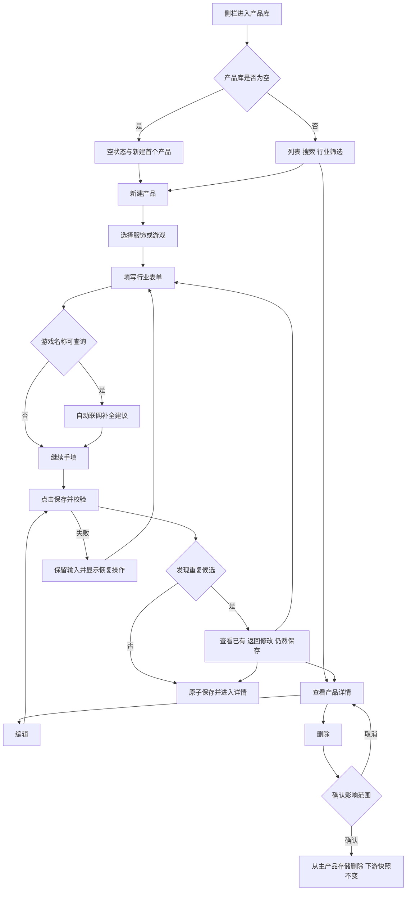
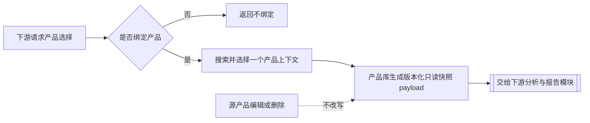
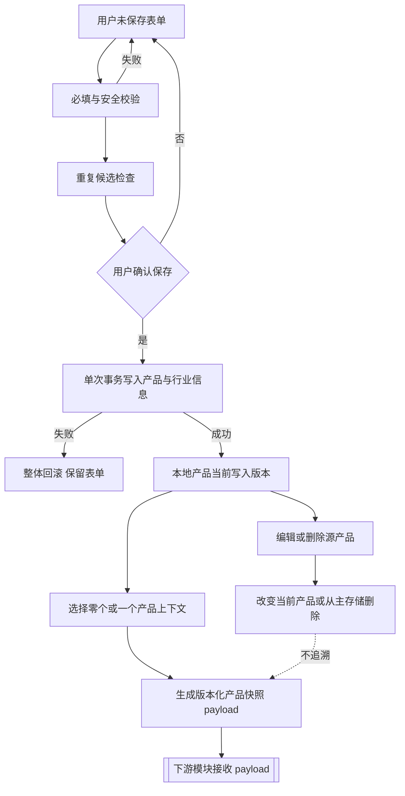

# 产品库-REQ-0003-v1.0

## 1. 文档信息

| 项目 | 内容 |
| --- | --- |
| 需求名称 / 编号 / 版本 | 产品库 / 产品库-REQ-0003 / v1.0 |
| 文档状态 | `DRAFT`；内容完整，产品负责人确认后转为 `ACTIVE` |
| 交互类型 | `ui` |
| 提出人 | 产品负责人 |
| 编写负责人 | Codex |
| 审核人 | 产品负责人 |
| 创建 / 更新日期 | 2026-08-21 / 2026-08-21 |
| 关联任务 | APP-0003 |
| 工作分支 | `codex/req-0003-app-0003-product-library-prd` |
| base branch | `codex/req-0004-gov-0003-minimal-governance` |
| 发布单元 | macOS 客户端、Windows 客户端；本需求不增加 backend 发布单元 |
| 上一版本 | 无，首次形成产品库主需求 |
| 变更摘要 | 将已确认的产品库方向整理为可实现、可验收的 V1 PRD；当前任务不实现业务代码 |

相关基线见[项目初始化-REQ-0002-v1.0](../项目初始化-REQ-0002/项目初始化-REQ-0002-v1.0.md)、[项目基线-PROJ-0001-v1.0](../../project/项目基线-PROJ-0001-v1.0.md)和[发布与回退-OPS-0001-v1.0](../../operations/发布与回退-OPS-0001-v1.0.md)。

## 2. 一句话摘要

广告素材制作者和广告优化师可以在本地桌面客户端中主动建立、查找和维护服饰或游戏产品，并在后续单素材分析中选择是否绑定一个产品，而不会因产品后续变化而改写已经确认的历史报告。

## 3. 背景与现状证据

当前仓库已有 Electron Forge + TypeScript 桌面框架和治理工具，但没有产品库业务页面、产品数据模型或 SQLite 业务 schema。后续素材分析需要知道素材所推广的标的物；如果直接把产品信息散落在每次分析中，会产生以下问题：

- 同一产品被反复录入，名称和信息逐渐不一致。
- 游戏在不同版本、渠道中的内容差异无法表达，例如新版本新增角色或玩法。
- 产品被修改后，旧报告可能失去当时分析依据。
- 从素材、联网结果或模型输出自动建库会制造重复产品，并削弱用户对正式数据的控制。
- 过早固定大量行业字段，会让验证版本难以迭代；完全自由文本又会削弱检索、校验和后续分析能力。

现有证据来自产品负责人在当前需求讨论中逐项确认的业务规则，以及仓库中“客户端本地 SQLite、macOS/Windows 共享业务代码但分别验收”的项目基线。本需求尚无真实用户行为数据，因此不把推测的使用频率或转化提升写成事实。

## 4. 使用者与使用场景

### 4.1 主要使用者

- 广告素材制作者：在分析素材前维护所推广的服饰或游戏基础信息。
- 广告优化师：查找已有产品，核对版本或渠道上下文，并在后续分析入口中选择是否绑定。

V1 是单用户、本地客户端能力，不定义多人协作、组织权限或云端共享。

### 4.2 典型场景

1. 用户首次进入产品库，创建一个服饰产品。
2. 用户输入游戏名称，系统联网判断游戏类型并返回自动补全建议；用户检查、修改并主动保存。
3. 用户发现同名候选，打开已有产品补充版本或渠道，而不是被系统自动合并。
4. 用户通过名称和行业查找产品，查看详情或继续编辑。
5. 用户在后续“新建分析”中选择一个产品，也可以明确保持“不绑定产品”。
6. 用户删除产品、游戏版本或渠道；产品库不再提供该项，但历史报告仍展示当时快照。

### 4.3 环境与频率

- macOS 和 Windows 桌面客户端，业务能力一致。
- 中国大陆网络环境优先；核心增删改查必须离线可用。
- 产品库可能在每次新建分析前被访问，也会被用户独立维护。
- V1 不要求登录；本地操作系统用户是数据访问边界。

## 5. 目标与成功指标

### 5.1 产品目标

- 用最少必填信息完成正式产品创建。
- 用提醒而非自动决策降低重复创建。
- 正确表达游戏的版本、渠道和两者组合下的内容差异。
- 让产品数据可扩展，但不把 V1 表单样例固化成永久封闭 schema。
- 为后续单素材分析提供可选绑定和不可变产品快照合同。
- 保证 macOS、Windows 的业务规则、搜索和重复判断一致。

### 5.2 V1 可验证指标

| 指标 | 目标 | 测量方式 |
| --- | --- | --- |
| 最小创建路径 | 服饰只填产品名称和服饰类别可保存；游戏只填游戏名称可保存 | 功能验收 AC-02、AC-03 |
| 用户控制 | 0 个产品由素材、搜索或分析结果静默创建、覆盖或合并 | 审计创建入口与端到端验收 |
| 离线可用 | 本地列表、搜索、查看、新建、编辑、删除均不依赖联网补全 | 离线端到端验收 |
| 历史稳定 | 产品编辑或删除后，既有确认报告快照变化数为 0 | 下游集成验收 |
| 原子保存 | 保存失败产生的半条产品、孤立版本或渠道数量为 0 | 故障注入和数据库集成测试 |
| 跨平台一致 | macOS、Windows 对同一测试数据给出一致的业务结果 | 两个平台独立功能验收 |

V1 不接入产品使用遥测，不用埋点数量代替功能与数据正确性证据。

## 6. 非目标

V1 不解决以下事项：

- 素材导入、素材库、素材分析、组图、时间轴、标签、评分、问题诊断和优化建议。
- 分析报告页面、报告反馈、重新分析和分析记录的具体实现。
- 项目、广告账户、广告计划、广告组、预算、消耗、归因或投放管理。
- 从素材、报告、搜索结果或模型输出自动创建、自动更新产品。
- AI 对话式建产品、批量产品处理、产品对比、自动合并重复产品。
- 产品图片、视频、文件、文档、网址或其他附件管理。
- 云同步、多设备同步、多人协作、账号角色和产品共享。
- 用户自定义行业 schema 的管理后台。
- 产品库导入、导出和永久清除历史报告快照。
- 把电商分析目标做成产品字段；服饰下游分析目标固定为下单 / 转化。
- 把游戏拉新 / 拉活做成固定产品字段；该目标由后续单素材分析结合场景判断。

## 7. 范围

### 7.1 包含范围

- 桌面客户端一级导航中的“产品库”入口；V1 不设首页或仪表盘。
- 产品列表、空状态、本地搜索、行业筛选、详情、新建、编辑和删除。
- 服饰与游戏两类行业表单；服饰范围只覆盖成衣，不包含鞋、箱包、珠宝、美妆等相邻类目。
- 游戏覆盖所有游戏类型，不使用类型白名单限制创建。
- 游戏名称输入后的联网类型判断和自动补全建议。
- 可扩展的行业推荐分组与用户补充信息。
- 游戏版本、渠道和版本 × 渠道内容上下文的可选维护。
- 重复候选提示、查看已有产品、返回修改和明确继续保存。
- 后续新建分析使用的单产品选择器合同；绑定始终可选。
- 分析输入产品快照与确认报告快照的生命周期合同。
- 删除产品、版本或渠道前的影响说明，以及历史报告快照保持规则。
- 本地 SQLite 数据边界、迁移备份、恢复和跨平台要求。

### 7.2 当前 APP-0003 文档任务范围

当前任务只允许编写本 PRD和更新 `project-control` 机器记录，不实现 `apps/desktop`、SQLite schema、搜索适配器或测试代码。后续实现必须建立独立任务、分支和精确允许路径。

### 7.3 排除范围

除第 7.1 节列出的产品库合同外，第 6 节的所有非目标均排除。任何 backend、新模型、第三方付费服务、登录能力或业务 schema 实现都必须进入后续独立任务；不能借本 PRD 顺带修改。

## 8. 前置与后置依赖

### 8.1 前置依赖

- APP-0001 已形成可工作的 Electron Forge + TypeScript 桌面框架；本任务只复用其结构，不宣称上游已最终合并或发布。
- GOV-0003 已在独立治理分支完成本地验证、提交和非强制推送，提供最小任务入口和受控验证。
- 操作系统提供本地应用数据目录和文件访问权限。

### 8.2 外部与可替换依赖

- 游戏联网补全需要中国大陆可达的信息搜索能力。
- 搜索能力必须通过可替换适配层接入，可以选择经过许可、维护和安全核验的开源服务；PRD 不绑定供应商。
- 搜索服务故障、被替换或尚未配置时，用户仍可完整手工创建和编辑产品。
- V1 只能采用无需项目共享秘密的客户端安全方案，或由用户提供自己的凭据；项目共享密钥、代理服务和自建搜索均会新增 backend、成本与安全边界，必须另立任务。
- 若用户自有凭据需要本地保存，只能存入 macOS Keychain、Windows Credential Manager 或经审核的等价系统安全存储。
- 服务选择必须核验许可证、中国大陆可达性、查询日志、保留期限、训练用途、跨境处理和第三方共享政策。

### 8.3 后置依赖

- 后续产品库实现任务据此定义 SQLite schema、迁移和 UI 自动化测试。
- 后续单素材分析需求复用产品选择器、单产品绑定和快照合同。
- 后续标签库、素材库和分析模板不得反向改变本需求的产品身份或历史快照规则。

## 9. 假设和未决事项

以下结构化登记包含已确认假设和未决事项。未决事项均有不阻断 PRD 定稿的推荐默认值；涉及安全或实质成本时，必须在受影响的实现或发布阶段由产品负责人决定。

| ID | 类型 | 内容 | 影响与推荐默认值 | 可逆性 / 决定阶段 |
| --- | --- | --- | --- | --- |
| A-01 | 已确认假设 | 产品只能由用户通过表单主动保存 | 搜索、素材和分析不能自动建库 | 已确认 |
| A-02 | 已确认假设 | 服饰只要求产品名称、服饰类别；游戏只要求游戏名称 | 任何选填信息缺失都不阻断保存或后续绑定 | 已确认 |
| A-03 | 已确认假设 | 重复检查只提供候选 | 不自动合并、覆盖或删除；用户可明确继续保存 | 已确认 |
| A-04 | 已确认假设 | 产品绑定始终可选且一次最多一个 | 不绑定不阻断后续分析 | 已确认 |
| A-05 | 已确认假设 | 确认报告保存不可变产品快照 | 产品后续编辑或删除不追溯旧报告 | 已确认 |
| A-06 | 已确认假设 | V1 单用户、本地优先，中国大陆优先 | 无云同步；核心操作离线可用 | 已确认 |
| A-07 | 已确认假设 | macOS 可先作为开发验证环境，但不能分叉业务代码 | Windows 未真实验收前不能宣称跨平台完成 | 已确认 |
| O-01 | 未决事项 | 联网搜索的具体开源组件或服务 | 使用供应商无关适配层；选择时核验许可证、中国大陆可达性、维护状态和返回内容安全 | 可替换；搜索实现任务开始前决定 |
| O-02 | 未决事项 | 产品 SQLite 是否需要应用层静态加密 | 本 PRD 不宣称 SQLite 天然加密；V1 最低边界为操作系统用户与应用数据目录权限，若产品信息按高敏感数据处理则另立安全需求 | 高影响；业务 schema 实现前由产品负责人决定 |
| O-03 | 未决事项 | 联网补全查询的默认超时是否需要按服务调优 | V1 产品默认 10 秒后显示超时并允许重试、取消或继续手填 | 可逆；实现测试后可调 |
| O-04 | 推荐默认值 | 首次保存后行业锁定 | 避免跨行业转换静默丢字段；选错时新建正确产品 | 可逆；随本 PRD 确认 |
| O-05 | 推荐默认值 | 未保存草稿只保留当前页面会话 | V1 不做持久草稿；离开前必须提醒，异常退出不会形成正式产品 | 可逆；随本 PRD 确认 |
| O-06 | 推荐默认值 | 删除从主产品存储移除正文且无回收站 | 可仅保留稳定 ID、删除状态和删除时间的最小 tombstone；报告快照独立保留 | 破坏性；随本 PRD 确认，实际删除仍逐次确认 |
| O-07 | 推荐默认值 | 重复检查失败后允许继续 | 明确显示“未完成重复检查”，用户再次确认后才保存 | 可逆；随本 PRD 确认 |
| O-08 | 未决事项 | 单字段和单产品载荷的安全上限 | 实现任务必须给出版本化、可测上限；超限明确拒绝，不静默截断，不把安全上限解释为封闭字段清单 | 可逆；业务 schema 实现前决定 |
| O-09 | 工程假设 | 10,000 条和 P95 1 秒是验证版本性能基线 | 按第 16 节固定数据集和测量方式执行，不代表业务容量上限 | 可逆；实现测试后凭证据调优 |
| O-10 | 推荐默认值 | 自动联网按服务方授权 | 首次发送前支持允许一次、持续允许或暂不使用；服务方或发送字段变化时重新询问 | 隐私影响；随本 PRD 确认 |

当前没有阻断 PRD 编写和文档验证的未决事项。O-01、O-02、O-08 会约束后续实现范围，不能被开发者静默决定。

## 10. 功能明细与业务规则

### 10.1 入口、列表、搜索与详情

1. 桌面客户端一级侧栏提供“产品库”，直接进入列表；不先经过首页。
2. 列表提供“新建产品”、本地关键词搜索和“全部 / 服饰 / 游戏”筛选。
3. 列表只固定展示名称、行业、关键摘要和更新时间；扩展字段不展开成大量固定列。
4. 搜索覆盖产品名称以及标记为可检索的用户填写文本，允许与行业筛选叠加。
5. “产品库为空”和“当前条件无结果”必须是不同状态；清空条件恢复完整列表。
6. 本地产品搜索与联网游戏补全是两种能力，入口、数据来源和失败状态必须分开。
7. 产品详情只读展示基础信息、行业分组和游戏版本 / 渠道上下文，并提供编辑、删除。

### 10.2 新建产品与表单样例

新建流程先选择行业，再显示对应完整页面表单。行业在首次保存后锁定，避免跨行业转换静默丢失数据；选错行业时新建正确产品，再决定是否删除错误记录。

以下字段是 V1 表单样例和推荐信息架构，不是封闭数据库字段合同。除明确标注的必填项外，产品团队可在后续版本增减推荐分组；V1 允许用户填写补充说明，但不提供任意 key/value 字段编辑器或用户管理 schema 的后台。

| 行业 | 必填项 | 可选结构与示例 | 边界 |
| --- | --- | --- | --- |
| 服饰 | 产品名称、服饰类别 | 品牌、面料、适用季节、目标人群、价格带、款式、卖点、转化依据、补充说明 | 只覆盖成衣；颜色、尺码、SKU、库存不在 V1 强制建模 |
| 游戏 | 游戏名称 | 游戏类型、核心玩法、角色、目标玩家、内容更新、版本、渠道、版本 × 渠道差异、补充说明 | 覆盖所有游戏；版本、渠道和其他内容均选填 |

“转化依据”是服饰可选上下文，不是创建条件；用户未填时，后续分析可以从素材中判断。服饰下游目标固定为下单 / 转化，不显示可编辑目标字段。游戏拉新 / 拉活由后续分析场景判断，不保存在基础产品中。

用户点击保存后按以下顺序处理：

1. 校验最小必填项和输入安全。
2. 执行重复候选检查。
3. 没有候选时原子保存。
4. 有候选时显示差异和“查看已有产品 / 返回修改 / 仍然保存”。
5. 只有用户明确选择保存，才创建正式产品。
6. 保存成功后读回并进入详情；保存失败保留全部输入，不能留下半条记录。

### 10.3 游戏版本、渠道与内容上下文

- 一个基础游戏可维护零个或多个版本和渠道。
- 版本表示游戏内容版本，不是产品修订号或数据库 schema 版本。
- 渠道表示可能影响游戏内容的发行、运行或渠道服环境，不是广告平台、广告账户或广告项目。
- 版本与渠道是独立维度；只有存在实际差异时才创建组合上下文，不预生成笛卡尔积。
- 新版本增加的角色、玩法或活动可以记录在对应上下文；V1 不自动继承、覆盖或智能合并不同上下文。
- 同名游戏不同版本或渠道优先引导用户在已有基础游戏下补充上下文，而不是创建第二个基础游戏。
- 后续分析选择器允许选择基础游戏、版本、渠道或明确的组合；没有选择时只使用基础信息。

### 10.4 游戏联网判断与自动补全

1. 首次向某个服务方发送查询前，界面说明服务方、用途、将发送的字段、服务方的数据使用摘要和关闭方式，并提供“允许一次 / 持续允许 / 暂不使用”。
2. 未授权时不因失焦或停顿发送网络请求；用户可点击“联网补全”进入同一授权流程。
3. 授权后，游戏名称达到可查询条件并失焦或短暂停顿时自动发起查询；持续授权可在设置中删除，服务方或发送字段变化时重新询问。
4. 补全区域显示联网状态、来源、获取时间、取消和重试。
5. 返回内容只形成可见的建议值，必须可编辑；用户选择或修改后进入未保存表单。
6. 联网结果绝不自动创建产品、自动保存表单、覆盖已保存字段或自动合并产品。
7. 用户继续输入时取消过期请求，较旧响应不得覆盖较新名称对应的建议。
8. 超时、离线、无结果或服务失败时，只影响补全区域，手工保存路径保持可用。
9. 默认只发送游戏名称；只有用户主动要求查询特定版本或渠道上下文时，才附带对应关键词。任何请求都不发送素材、备注、报告、设备路径、其他产品或凭据。
10. 外部返回内容按不可信纯文本处理，不执行链接、脚本、Markdown、富文本、控制指令或提示词。

### 10.5 重复候选

- 服饰至少以同一行业内的规范化名称和服饰类别产生候选。
- 游戏先以规范化游戏名称产生候选，再展示已有版本和渠道。
- 明确重复使用更强提醒；疑似重复展示可比较的关键差异。
- 检查失败不能伪装为“无重复”，必须提示“暂时无法检查”，允许重试或明确继续保存。
- 重复判断不是唯一性约束；用户可明确继续创建独立产品。
- 算法升级不反向合并、修改或删除既有产品。
- V1 不提供产品合并。

### 10.6 编辑、并发与取消

- 编辑保存时重复检查排除当前产品自身。
- 每次成功保存递增写入版本或 etag，用于阻止过期窗口覆盖；V1 不保留可浏览、可恢复的完整产品修订历史。
- 另一窗口已经保存新修订时，当前窗口不能静默覆盖，必须提示刷新后重新编辑。
- 编辑只影响未来选择和未来分析；已经开始的分析输入快照和既有确认报告保持不变。
- 游戏版本、渠道和组合上下文可增、改、删；删除从属项同样展示影响说明。
- 无修改时取消直接返回；有修改时提供“继续编辑 / 放弃修改”。
- V1 草稿只存在于当前页面会话，放弃或应用异常退出不会形成正式产品，也不把草稿伪装成已保存记录。

### 10.7 删除

- 删除前显示准确的产品、版本或渠道名称、将删除的从属信息数量和依赖组合数量。尚未接入下游报告时，引用数量显示“不适用”；已接入但查询失败时阻止删除并允许重试，不显示虚假的 0。
- 确认文案说明：当前正文及从属上下文会从主产品存储删除且 V1 无回收站；已确认报告由下游保留当时快照并标记“源产品已删除”。
- 取消删除时零变化；删除事务失败时全部回滚并允许重试。
- 删除基础游戏同时删除其版本、渠道和组合上下文；删除单个版本时，同一事务删除所有引用该版本的组合上下文；删除渠道时同理。不得留下孤立上下文。
- 主产品存储不得以“列表隐藏”代替删除产品正文。若实现需要 tombstone，只能保留稳定 ID、删除状态和删除时间，不保留产品正文。
- V1 不提供批量删除、回收站或产品恢复；重新创建会获得新的稳定身份。
- 删除不等于清除迁移备份或历史报告副本，界面必须说明这一边界。

### 10.8 可选绑定与报告快照合同

- 后续“新建分析”默认允许“不绑定产品”，不绑定不阻断分析。
- 产品选择器支持本地搜索、行业筛选、选择、替换和清除，一次最多绑定一个产品。
- 没有合适产品时可前往产品库新建；返回后恢复下游草稿。V1 不在选择器内快速建产品，以免绕过去重与完整表单。
- 产品库根据当前选择生成版本化、自包含、只读的产品快照 payload，包含行业、产品识别信息和所选游戏版本 / 渠道上下文。
- 产品库只负责生成 payload，不执行分析、不保存报告、不处理反馈或重新分析。下游分析模块决定何时请求新 payload，报告模块只在用户确认报告后持久化它。
- 已生成的 payload 不被源产品编辑或删除反向改写；下游展示源产品删除状态，但读取历史快照不依赖源产品仍存在。

本节只定义产品选择与快照 payload 合同，APP-0003 不实现分析页面、报告、反馈、重新分析或分析记录。

## 11. 用户流程与交互（UI 必填）

### 11.1 主流程

### 11.2 后续绑定流程合同

下游模块决定何时请求新的 payload，并在用户确认报告后负责持久化；产品库不执行分析、不处理反馈或重新分析，也不写报告存储。

### 11.3 页面与组件

- 产品列表页：标题、新建按钮、本地搜索、行业筛选、产品列表和状态反馈。
- 空状态：产品库没有任何产品时展示用途说明和“新建首个产品”；有产品但搜索无结果时展示当前条件和清空入口，两者不得混淆。
- 产品详情页：只读基础信息、行业分组、游戏上下文、编辑和删除。
- 新建 / 编辑页：完整页面，页头固定“取消 / 保存”，不使用容纳不了扩展信息的小弹窗。
- 复用组件：行业选择器、版本 / 渠道编辑器、重复候选提醒、删除确认框、未保存离开确认框、联网补全区和后续产品选择器。

### 11.4 状态表

| 状态 | 展示 | 可执行操作 | 数据是否保留 | 恢复方式 | 验收条件 |
| --- | --- | --- | --- | --- | --- |
| 初始 / 默认 | 列表、搜索、筛选、新建 | 搜索、筛选、查看、新建 | 已保存数据保留 | 不适用 | 首个焦点与主操作明确 |
| 产品库为空 | 用途说明与“新建首个产品” | 新建 | 不适用 | 创建后进入详情 | 不误显示为加载失败 |
| 搜索无结果 | 当前关键词、筛选和清空入口 | 修改或清空条件 | 条件保留 | 清空后恢复列表 | 与库为空明确区分 |
| 加载 / 处理中 | 列表骨架或当前动作进度 | 允许取消联网请求；防重复保存 / 删除 | 旧列表或表单保留 | 完成、取消或超时 | 不重复提交，不提前显示成功 |
| 成功 | 页内反馈或 toast，读回最新内容 | 查看、继续编辑、返回列表 | 已持久化 | 重启后仍可读 | UI 成功与数据库读回一致 |
| 校验失败 | 字段旁错误和顶部摘要 | 修正、聚焦首错 | 全部输入保留 | 修正后再次保存 | 错误与字段程序化关联 |
| 重复候选 | 候选及关键差异 | 查看已有、返回修改、仍然保存 | 表单保留 | 用户明确选择 | 不自动合并或覆盖 |
| 系统 / 存储失败 | 人话原因、错误编号、重试 / 返回 | 重试、取消、复制诊断编号 | 输入、查询和原产品保留 | 故障解除后重试 | 不显示内部堆栈，不产生半记录 |
| 联网授权 | 服务方、用途、发送字段和关闭方式 | 允许一次、持续允许、暂不使用 | 未授权时不发送 | 用户授权或继续手填 | 授权前请求数为 0，服务变化重新询问 |
| 联网失败 / 超时 | 仅补全区提示无结果、超时或失败 | 重试、取消、继续手填 | 表单保留 | 恢复网络或手填 | 不阻断本地保存 |
| 离线 / 重连 | 轻量离线提示；联网补全不可用 | 本地增删改查；联网后重试 | 本地数据保留 | 联网后重新补全 | 核心功能离线可用 |
| 权限不足 / 只读 | 本地存储不可写说明 | 查看、搜索、复制；禁用写操作 | 已有数据不变 | 修复 OS / 文件权限后重试 | 不伪装保存成功 |
| 返回 / 取消 / 关闭 | 脏表单离开确认 | 继续编辑、放弃修改 | 继续编辑时完整保留 | 返回表单或放弃 | Esc 不静默丢失内容 |
| 删除确认 | 准确名称、从属 / 组合数量、无回收站和下游快照边界 | 取消、确认删除 | 确认前全部保留 | 取消返回详情 | 默认焦点不放在破坏性按钮 |
| 无障碍 / 键盘 | 可见焦点、语义标签、状态播报 | Tab、Shift+Tab、Enter / Space、Esc | 与鼠标操作一致 | 焦点返回触发点 | 错误不只靠颜色，弹窗焦点圈闭 |

macOS 和 Windows 都使用平台可理解的快捷键文案，不能只写 Cmd 或只写 Ctrl。

## 12. 非 UI 流程图（非 UI 需求必填）

本需求的交互类型为 `ui`，但包含本地数据和下游快照边界，因此补充数据流图；它不代表 APP-0003 已获准实现数据库。

产品库流程到输出 payload 为止；下游只有在用户确认报告时才持久化该 payload。失败、超时、数据库占用、磁盘不足或进程异常都不能留下半迁移、半产品或孤立上下文；恢复后重试完整事务。

## 13. 数据与生命周期

### 13.1 概念数据模型

下表只定义业务概念和关系，不规定 SQLite 表名、字段拆分、JSON / EAV 方案或最终 schema。

| 概念 | 业务职责 | 关键约束 |
| --- | --- | --- |
| 产品条目 | 用户管理的一个投放标的物 | 稳定本地身份；只属于服饰或游戏一个行业 |
| 基础信息 | 识别、查找和选择产品 | 只锁定行业最小必填项，其余可扩展 |
| 行业信息 | 保存服饰或游戏特有内容 | 行业隔离，不要求共享封闭字段集合 |
| 游戏内容上下文 | 表示版本、渠道或两者组合下的差异 | 两个独立维度，均可为空；不自动新建基础游戏 |
| 产品写入版本 | 当前产品的 etag 或递增写入标识 | 用于阻止过期窗口静默覆盖；V1 不保留可浏览历史 |
| 重复候选 | 新建或编辑时的疑似相同产品 | 临时建议，不自动改变数据 |
| 产品快照 payload | 当前选择对应的版本化、自包含产品状态 | 产品库负责生成；下游负责使用与持久化，不依赖源产品继续存在 |

不能把全部行业内容固化为一个永久通用表单，也不能把所有内容退化为无法检索和校验的任意文本。

### 13.2 创建、读取、更新与删除

1. 未点击保存前只有页面输入，不生成正式产品。
2. 保存以单次事务创建产品、行业信息和实际填写的游戏上下文。
3. 读取只返回主产品存储中的现有正文；已删除正文不通过列表过滤伪装成删除。
4. 编辑递增写入版本并检测过期写入，不保存可浏览历史。
5. 删除产品正文及其从属上下文；删除版本或渠道时在同一事务删除所有依赖组合，不能留下孤立上下文。
6. 可选 tombstone 只保留稳定 ID、删除状态和删除时间；删除失败整体回滚，V1 不承诺产品恢复。
7. 已输出的产品快照 payload 不被回写；下游报告快照的保留期由报告需求定义。

### 13.3 来源、存储与敏感等级

| 数据 | 来源 | 位置 | 等级与规则 |
| --- | --- | --- | --- |
| 产品表单内容 | 用户输入、用户确认的联网建议 | 客户端本地 SQLite | 用户业务数据，默认按机密本地数据处理 |
| 游戏补全临时建议 | 外部搜索服务 | 仅当前表单会话；用户确认后成为表单内容 | 不可信外部文本，不自动持久化 |
| 产品写入版本与状态 | 客户端事务 | 客户端本地 SQLite | 不进入日志，不构成完整历史版本 |
| 产品快照 payload | 产品选择结果 | 由产品库生成并交给下游 | 自包含、只读；产品库不写报告存储 |
| 迁移前备份 | 客户端迁移工具 | 平台标准应用数据目录 | 与主数据库同级保护 |
| 凭据 | 用户或未来服务配置 | 系统安全存储 | 禁止进入 SQLite、备份、日志、报告和导出 |

产品库数据不自动上传、同步或备份到后端。V1 不保存产品附件，也不提供产品导入 / 导出或云备份。

### 13.4 备份、保留与清理

- V1 备份只保证 schema 升级前的本地恢复，不等于用户产品导出或跨设备备份。
- 每次改变 schema 或持久化数据形态前，都必须创建一致备份，不能复制正在写入的数据库制造伪备份。
- 只有备份可以打开、完整性检查通过，并且来源 schema 与创建时间可识别后，才允许修改主库；备份失败时主库零修改。
- V1 自动迁移备份只保留最近一次已验证副本；新副本验证成功后再清理更早的自动备份，清理不能影响当前数据库。
- 迁移失败时不得打开半迁移库；保留原库和已验证备份并进入可重试安全状态。恢复失败不得覆盖唯一可用原库。
- 用户删除产品时需说明：报告快照和尚未清理的迁移备份仍可能保留历史副本。
- 卸载时是否保留或删除本地数据必须在客户端发布需求中明确展示，不能静默承诺；本 PRD 不把卸载等同于永久清除。

## 14. 登录、权限、安全与隐私

- V1 产品库不要求产品账号登录或云端鉴权，使用本地操作系统用户和应用数据目录权限作为访问边界。
- 没有账号角色；“权限不足”只表示数据库目录不可读写、磁盘只读或系统策略阻止访问。
- API Key、登录令牌、密码、私钥和服务凭据不得进入产品 SQLite、迁移备份、日志、任务记录、报告或导出文件。
- 联网补全首次发送前必须完成第 10.4 节授权；未授权或用户关闭后网络请求数为 0。
- V1 不嵌入项目共享搜索密钥。用户自有凭据只能使用系统安全存储，并支持用户删除。
- 日志和崩溃诊断只记录操作类型、耗时、错误分类和不含内容的本地标识摘要；不得记录完整产品名称、描述、备注、搜索返回正文或报告快照。
- 游戏补全默认只发送游戏名称；特定版本 / 渠道关键词必须由用户主动要求。不发送素材、备注、其他产品、文件路径、设备信息或模型 Key。
- 外部返回内容经过长度、字符和纯文本安全处理，不执行其中的 HTML、脚本、Markdown 链接、命令、控制字符或提示词。
- 产品数据库、迁移备份使用平台标准应用数据目录和仅当前 OS 用户可访问的权限。
- 本 PRD 不宣称普通 SQLite 文件已经应用层加密；O-02 必须在业务 schema 实现前处理。
- V1 不接入行为追踪或远程诊断上传；以后引入时必须单独说明采集、用途、保留和关闭方式。

## 15. 接口与兼容性

### 15.1 产品内部合同

实现至少提供以下供应商无关的业务能力，但本 PRD 不规定 TypeScript 函数名：

- 查询活动产品和详情。
- 创建、编辑、删除产品及游戏上下文。
- 生成重复候选。
- 获取游戏信息补全建议并取消过期请求。
- 选择零个或一个产品上下文。
- 生成版本化、自包含的产品快照 payload；不持久化报告。

### 15.2 搜索适配

搜索适配器的输入是用户已授权的最小查询上下文，输出是带来源和获取时间的结构化候选或明确失败。供应商错误、超时和限流必须映射为统一可恢复状态；更换开源或第三方服务必须重新核对授权，且不能改变“建议值由用户确认、不会自动建档”的产品规则。

### 15.3 数据与平台兼容

- macOS、Windows 共享概念模型、schema 版本序列、校验、Unicode 规范化、搜索和重复规则。
- 平台路径、文件权限、文件锁、安装、升级和安全存储分别实现和验收。
- 产品名称中的中文标点、Emoji、大小写和 Unicode 等价形式在两平台产生一致的搜索和候选结果，不依赖操作系统默认排序。
- 时间保存为可跨时区解释的值，展示时转换为本地时间。
- 稳定身份不得依赖文件路径、文件名大小写或平台专属 ID。
- 产品快照 payload 必须自包含并具有可演进版本；新客户端可以读取旧 payload，未知扩展信息不得导致整个 payload 不可读。
- V1 没有公开 HTTP API、导入文件格式或 backend 数据合同。

## 16. 性能、可靠性与成本

以下是 V1 验收基线，不是产品数量硬上限：

| 项目 | 基线 |
| --- | --- |
| 本地列表与搜索 | 使用第 16.1 节数据集，P95 不超过 1 秒 |
| 本地新建、编辑、删除、重复检查 | 使用第 16.1 节测量方式，P95 不超过 1 秒 |
| 联网补全 | 默认 10 秒显示超时；允许取消、重试或继续手填 |
| 持久性 | 已显示“保存成功”的本地事务在立即强制结束进程后仍存在，RPO 为 0 |
| 原子性 | 任一失败都不产生半产品、孤立上下文或缺少主体的快照 |
| 离线降级 | 只关闭联网补全，核心增删改查和本地搜索继续工作 |

### 16.1 可复现性能口径

- 参考环境：发布构建、至少 4 核 CPU、8 GB 可用内存和 SSD；macOS、Windows 分别记录实际机型与系统版本。
- 数据集：10,000 个产品，服饰与游戏各半；游戏包含零到多个版本 / 渠道；名称和说明覆盖中文、英文、数字、Emoji 和不同长度。
- 冷启动列表测量 10 次；完成一次预热后，本地搜索和写操作各测量 30 次。
- P95 使用 nearest-rank 计算，记录原始耗时；测试时不并行运行其他重负载。
- 若真实目标设备或数据分布不同，实施任务用证据调整 O-09，不能静默降低门槛。

大数据量列表不得一次渲染全部记录，但 PRD 不限定分页或虚拟列表实现。实现任务还必须为单字段、外部响应和单产品总载荷设置 O-08 安全上限；超限明确拒绝并保留表单，不能静默截断。数据库被占用、磁盘空间不足或完整性失败时停止写入，保留现有数据并提供恢复入口。

产品库核心能力没有云计算成本。引入付费搜索、托管服务或需要持续运维的自建服务属于实质成本，必须在实现任务中单独说明并由产品负责人决定；优先评估许可清晰、可替换且中国大陆可达的开源方案。

## 17. 运维、可观察性和问题排查

- 日常健康信号包括数据库可读写、schema 版本、最近迁移结果、列表 / 搜索耗时和联网补全错误分类。
- 产品日志不记录完整业务内容；用户界面显示可复制的诊断编号，不暴露堆栈或本地绝对路径。
- 常见故障分类：应用数据目录权限、磁盘不足、数据库占用 / 损坏、迁移失败、重复检查失败、搜索超时 / 限流、过期窗口冲突。
- 本地故障先停止写入，再保留原库和表单；恢复权限、空间或数据库后重试完整事务。
- 联网故障只降级补全区；恢复联网后由用户重试，不自动重放已过期查询。
- 后续实现任务需要补充产品库排障 runbook，至少覆盖备份恢复、迁移失败、数据库只读、完整性检查和搜索服务不可达。
- V1 不建设远程监控后台或上传产品诊断数据。

## 18. 发布、迁移与回退

### 18.1 当前文档任务

APP-0003 只发布 PRD 文档，不发布产品代码、数据库或客户端版本。回退方式是回退本需求文档提交和任务记录；没有业务数据迁移。

### 18.2 后续产品实现

- macOS、Windows 使用共享业务代码和同一 schema 序列，不建立平台分叉实现。
- 可以先在 macOS 开发和功能验证，但这不等于 Windows 已完成；两个平台分别验证安装、升级、迁移、异常恢复、卸载边界和核心业务。
- 每次改变 schema 或持久化形态前，先创建并验证一致备份；备份失败时主库零修改，再按版本顺序执行幂等迁移。
- 迁移成功后验证数据库完整性、目标 schema、产品数据和产品快照 payload 兼容性；验证成功后才清理更早的自动备份。
- 迁移失败、崩溃、断电或空间不足时，不打开半迁移数据库；保留原库和最近一次已验证备份进入安全失败状态。
- 恢复失败不得覆盖唯一可用原库；恢复成功后再次核对完整性和 schema，并说明可能丢失的保存时间范围。
- 旧客户端遇到更新 schema 时停止写入并提示升级或恢复兼容备份，不能静默重建。
- 回退应用版本前先判断 schema 兼容；不兼容时恢复升级前备份，并明确可能丢失的保存时间范围。
- 联网补全可以独立降级关闭，不影响本地产品库。
- 最终合并、客户端部署和发布均由产品负责人决定。

## 19. 验收标准

| ID | 前置与操作 | 可观察结果 |
| --- | --- | --- |
| AC-01 | 启动客户端并进入产品库 | 侧栏可直接进入列表，不出现首页前置；空库和有数据状态正确 |
| AC-02 | 新建服饰，仅填产品名称和服饰类别 | 成功保存；分别缺少任一项时阻止保存并聚焦对应错误 |
| AC-03 | 新建游戏，仅填游戏名称 | 成功保存；版本、渠道和其他选填项为空不报错 |
| AC-04 | 填写产品团队提供的选填分组和补充说明，保存并重启 | 已填写内容完整读回；V1 不出现任意 key/value 字段编辑器 |
| AC-05 | 未授权时输入可查询游戏名，再分别选择允许一次、持续允许、暂不使用 | 授权前网络请求为 0；允许后才自动查询；页面展示服务方、字段、用途和关闭方式 |
| AC-06 | 删除持续授权或更换服务方 / 发送字段后再次输入 | 删除授权后请求为 0；服务或字段变化时重新询问，不沿用旧授权 |
| AC-07 | 联网补全超时、离线、无结果或被取消 | 表单完整保留，用户可手填并成功保存 |
| AC-08 | 创建同一行业的明确或疑似重复产品 | 展示候选和差异；可查看、返回修改或明确继续；不自动合并 / 覆盖 |
| AC-09 | 已有游戏下新增不同版本、渠道或组合上下文 | 信息归属于同一基础游戏并可区分选择；不强制新建基础产品 |
| AC-10 | 用关键词和行业筛选查找，再清空条件 | 结果正确；“库为空”与“无匹配”不同；清空后恢复列表 |
| AC-11 | 两个窗口编辑同一产品，先后保存 | 后保存的过期窗口被写入版本阻止静默覆盖，并提示刷新；无可浏览修订历史 |
| AC-12 | 修改表单后返回、关闭或按 Esc | 显示继续编辑 / 放弃修改；继续时所有输入保留，放弃后不形成正式产品 |
| AC-13 | 删除产品，检查主产品存储和可选 tombstone | 正文及从属上下文被删除，不再列表 / 搜索 / 选择；tombstone 不含正文；尚未接入报告时引用数显示“不适用” |
| AC-14 | 删除一个被组合上下文引用的游戏版本或渠道 | 确认框显示依赖组合数；同一事务删除该维度及所有依赖组合，无孤立上下文 |
| AC-15 | 选择零个或一个产品并生成快照 payload，再编辑或删除源产品 | 不绑定返回空选择；绑定只返回一个版本化、自包含 payload；已生成 payload 字节不被改写 |
| AC-16 | 下游用 payload 发起分析、确认报告后保存，再编辑 / 删除源产品 | 仅确认报告持久化快照；历史快照完整并标记源产品状态；该项由单素材分析任务复验 |
| AC-17 | 保存 / 删除期间注入磁盘满、占用或进程失败 | 操作整体回滚，无半记录；表单或原产品保持可恢复 |
| AC-18 | 将应用数据目录改为只读 | 允许查看 / 搜索，禁用写操作并说明恢复方式，不显示虚假成功 |
| AC-19 | 仅用键盘完成搜索、新建、校验修复、保存和取消 | 焦点顺序、弹窗圈闭、状态播报和错误关联正确；不只靠颜色表达 |
| AC-20 | 在双平台使用 NFC / NFD、全半角、前后空格、大小写、中文标点和 Emoji 固定语料 | 每项搜索、重复候选、保存和读回结果符合统一预期 |
| AC-21 | 检查所有正式产品创建来源 | 只有用户主动保存表单能创建；素材、搜索、建议和报告均无静默入库 |
| AC-22 | 按第 16.1 节执行性能测量 | 列表、搜索和本地写操作满足 P95 基线，并保留原始耗时与环境记录 |
| AC-23 | 在迁移备份创建或完整性验证时注入失败 | 主库零修改，应用进入可重试安全状态 |
| AC-24 | 在迁移写入中途强制结束进程 | 半迁移库不被打开；原库和最近一次已验证备份保持可用 |
| AC-25 | 从已验证备份恢复 | 完整性、schema、产品和快照 payload 兼容性通过，并显示恢复结果和数据时间点 |
| AC-26 | 在恢复过程中注入失败 | 唯一可用原库不被覆盖，已验证备份仍可再次使用 |
| AC-27 | 旧客户端打开更新 schema | 停止写入并提示升级或恢复兼容备份，不静默降级或重建 |
| AC-28 | 搜索返回恶意 HTML、脚本、Markdown 链接、控制字符、提示词和超大响应 | 只按安全纯文本处理；不执行、不跳转、不覆盖已保存字段、不自动保存 |
| AC-29 | 为搜索适配器配置哨兵测试凭据并执行全部路径 | SQLite、迁移备份、日志、任务记录和测试报告文件中的哨兵命中数为 0 |
| AC-30 | UI 显示保存成功后立即强制结束进程并重启 | 已确认事务仍存在；若数据库异常则安全失败，不能静默丢失 |
| AC-31 | 输入超过实现任务固定的字段、响应或产品总载荷上限 | 明确拒绝并说明限制，原输入保留；不静默截断、不生成半记录 |

AC-16 属于后续单素材分析集成验收；APP-0003 及产品库单独实现只验证 AC-15 的选择与快照 payload 合同，不能据此宣称分析或报告闭环已经完成。

## 20. 验证计划与证据

### 20.1 APP-0003 文档任务

本地验证由受控 runner 从任务记录中的固定 argv 实际执行：

| 检查 | argv | 超时 | 环境 / 发布单元 | 预期与证据 |
| --- | --- | --- | --- | --- |
| docs_reconcile | `python3 tools/governance/reconcile.py docs --json` | 120 秒 | controlled-local / mac、win | 24 节、流程、假设 / 未决、链接和需求绑定通过；结果写入 APP-0003 任务 |
| repository_reconcile | `python3 tools/governance/reconcile.py static --json` | 120 秒 | controlled-local / mac、win | 仓库静态核对通过；结果写入 APP-0003 任务 |
| governance_unit_tests | `python3 -m unittest discover -s tools/governance/tests -p test_*.py -v` | 1200 秒 | controlled-local / mac、win | 治理单测实际运行且非空；结果写入 APP-0003 任务 |

未运行、失败、超时或跳过均不是通过。工作区变化后必须重跑；PR 和 `main` 的 GitHub Actions 结果绑定准确提交，不能用本地结果替代。

### 20.2 后续实现任务

实现任务必须在自己的任务记录中固定真实 argv，至少覆盖：

- 产品领域规则单测：必填、行业锁定、版本 / 渠道、重复候选、写入版本和快照 payload。
- SQLite 集成测试：原子事务、过期写入、正文删除、组合级联、tombstone、迁移、备份和恢复。
- UI 自动化：全部交互状态、取消恢复、键盘和无障碍。
- 搜索适配器契约：授权前 / 关闭后零请求、一次 / 持续授权、服务变化、取消过期请求、超时、无结果和不可信文本。
- 固定 Unicode 语料、载荷上限、哨兵凭据扫描和成功后强制结束进程测试。
- 按第 16.1 节执行至少 10,000 条数据的可复现性能验证。
- 分别复现备份失败、迁移中断、恢复成功、恢复失败和旧客户端打开新 schema。
- 真实 macOS、Windows 的新装、升级、迁移失败、回退、离线和核心业务验收。
- 产品负责人自行执行核心用户路径验收；不以开发者自报代替。

Windows CI runner 不能替代真实 Windows 客户端验收。产品库验证不能替代后续素材分析、报告或快照集成的端到端验证。

## 21. 文档更新清单

### 21.1 当前任务

- 新增本文件：产品库-REQ-0003-v1.0。
- `project-control` 任务与验证记录由 `taskctl` 维护。
- 项目、开发、运维、排障和决策文档当前无需改变，因为 APP-0003 不实现业务 schema 或发布产品。

### 21.2 后续实现

- 开发文档：产品模块边界、搜索适配合同和客户端状态管理。
- 数据文档：SQLite schema、迁移序列、备份与恢复。
- 运维文档：macOS / Windows 数据目录、升级、卸载和回退。
- 排障文档：数据库只读 / 损坏、迁移失败、搜索不可达和冲突编辑。
- 决策文档：若选择应用层加密、托管搜索或不可兼容迁移，记录独立 ADR。
- 后续单素材分析 PRD：绑定、快照、确认报告保存和重新分析的端到端规则。

## 22. 风险与影响分析

| 风险 | 最坏影响 | V1 控制 | 决定状态 |
| --- | --- | --- | --- |
| 模型过度具体 | 新增字段需要频繁破坏性迁移 | 只锁定最小必填项，行业分组和补充信息可演进 | 已纳入 |
| 模型过度通用 | 无法检索、校验和形成稳定快照 | 保留稳定身份、行业边界和结构化游戏上下文 | 已纳入 |
| 重复误判 | 用户误建或误认为同一产品 | 只提醒、展示差异、允许继续，不自动合并 | 已确认 |
| 游戏版本 / 渠道组合膨胀 | 维护和选择复杂 | 两个独立维度，只建立实际差异组合 | 已纳入 |
| 产品编辑污染历史 | 报告无法解释当时依据 | 分析输入和确认报告使用不可变快照 | 已确认 |
| 删除理解偏差 | 用户误以为全部副本消失 | 删除前说明报告快照和迁移备份保留边界 | 已纳入 |
| SQLite 损坏 / 迁移失败 | 本地产品和快照 payload 无法生成 | 原子事务、已验证备份、完整性检查和安全回退 | 已纳入 |
| 未加密本地库 | 同一设备上具备文件访问权的人可能读取产品信息 | OS 用户权限为最低边界；O-02 在实现前决定 | 未决安全项 |
| 未授权自动联网 | 机密本地输入被第三方接收 | 按服务方一次 / 持续授权、最小字段、可关闭、变更重问 | 推荐默认值 |
| 联网结果错误或恶意 | 错误信息入库或触发内容注入 | 不可信文本处理、显示来源、用户确认、绝不自动保存 | 已纳入 |
| 搜索共享密钥被提取 | 凭据泄露和服务滥用 | V1 不嵌入项目共享密钥；用户自有凭据进系统安全存储 | 已纳入 |
| 搜索服务在中国大陆不可达 | 补全不可用 | 可替换适配器、超时、手工路径不受阻 | 已纳入 |
| 跨平台规范化差异 | 搜索和去重结果不一致 | 应用层统一规则，真实双平台验收 | 已纳入 |
| 无云同步 | 设备损坏后无法跨设备恢复 | 明确本地边界；迁移备份不是云备份 | 已确认延期 |
| mac 优先演变为代码分叉 | Windows 成本和维护负担增加 | 共享业务代码、同 schema、两个平台独立验收 | 已确认 |

本需求不执行不可逆数据库迁移、付费采购或发布。相关高影响决定进入后续任务时仍需由产品负责人确认。

## 23. 审核与回执

产品负责人已在当前对话明确决定以下范围：

- 产品由用户通过表单主动创建；允许联网辅助，但不能自动入库或重复创建。
- 服饰只要求产品名称和服饰类别，游戏只要求游戏名称。
- 游戏必须支持版本和渠道差异。
- 重复检测只提示，不自动合并或覆盖。
- 产品绑定不强制，一次最多一个。
- 确认报告保存产品快照，产品编辑或删除不追溯旧报告。
- 产品库只覆盖产品本身，不扩展广告项目维度。
- V1 中国大陆优先、本地优先；macOS 可以先开发，但不得增加业务代码分叉和维护成本。
- 治理完成后可直接生产 PRD，不再重复确认普通可逆步骤。

APP-0003 的文档编写、只读子任务、验证、提交、功能分支非强制 push 和 PR 准备属于已明确范围，不另造 scope / code 回执。O-04 至 O-07、O-09、O-10 是本 PRD 新提出的推荐默认值，不伪装成此前已确认要求；产品负责人审核本 `DRAFT` 时可采纳或修订。O-01、O-02、O-08、实质成本、不兼容迁移、验证豁免以及最终合并、部署和发布仍需产品负责人决定。需求正文不伪造机器回执，关键决定如需留证只能由 `reviewctl` 从当前对话和治理状态生成。

## 24. 变更历史

| 版本 | 日期 | 变更摘要 | 原因 | 关联任务 |
| --- | --- | --- | --- | --- |
| v1.0 | 2026-08-21 | 首次定义产品库 V1，并经范围与风险审计收紧联网授权、真正删除、组合级联、快照 payload 所有权、迁移备份和可复现验收 | 在业务代码开工前把已确认方向整理为完整 PRD | APP-0003 |
