# 单素材分析-REQ-0005-v1.0

## 1. 文档信息

| 项目 | 内容 |
| --- | --- |
| 需求名称 / 编号 / 版本 | 单素材分析 / 单素材分析-REQ-0005 / v1.0 |
| 文档状态 | `DRAFT`；内容完整，产品负责人确认后转为 `ACTIVE` |
| 交互类型 | `mixed` |
| 提出人 | 产品负责人 |
| 编写负责人 | Codex |
| 审核人 | 产品负责人 |
| 创建 / 更新日期 | 2026-08-23 / 2026-08-26 |
| 关联任务 | APP-0004（初版 PRD 与五张原型）、APP-0017（模型管理入口与两张原型补充）、APP-0027（Codex 订阅分析来源）、APP-0029（OpenAI 兼容视觉模型整合；来源实现 APP-0028） |
| 工作分支 | `codex/req-0005-app-0029-vision-analysis-integration` |
| base branch | `codex/req-0005-app-0025-record-backup-restore` 基线 `146a897b8f6fc46aaab1a7201c0b4ca7e1766fee` |
| 发布单元 | macOS 客户端、Windows 客户端；本需求不新增项目自建 backend |
| 上一版本 | 无，首次形成单素材分析主需求 |
| 变更摘要 | 在独立 API Key 与“Codex 订阅（Beta）”显式来源上整合视觉能力：只有已启用视觉的 API Key 配置接收受控图片或 M02 代表帧；Codex 仍只接收结构化文本证据，原视频、音频、路径和视觉字节不持久化 |

本需求与[产品库-REQ-0003-v1.0](../产品库-REQ-0003/产品库-REQ-0003-v1.0.md)并列：产品库负责正式产品资料、选择和快照合同，本需求负责单个本地素材从导入到报告确认、保存、反馈和重新分析的闭环。项目与发布基线见[项目基线-PROJ-0001-v1.0](../../project/项目基线-PROJ-0001-v1.0.md)和[发布与回退-OPS-0001-v1.0](../../operations/发布与回退-OPS-0001-v1.0.md)。

## 2. 一句话摘要

广告素材制作者和优化人员可以在本地桌面客户端中选择一个视频或一张图片，结合行业、产品和自己显式选择的模型来源（API Key 或“Codex 订阅（Beta）”）完成结构化分析，在播放器、对话和时间轴中复核结果，并只在确认后保存可查看、可反馈和可导出的分析报告。

## 3. 背景与现状证据

当前仓库只有桌面脚手架、治理能力和产品库 PRD，没有素材分析业务实现。产品负责人已明确首个验证版本优先解决素材本身的分析，不扩展到广告账户、计划、项目、预算、消耗和归因等投放维度。已确认的核心问题包括：

- 人工逐帧观看视频并拆脚本、镜头、字幕、口播、声音、卖点、情绪和 CTA，耗时且难以形成一致结构。
- 单纯调用大模型容易遗漏精确媒体结构；只用脚本解析又无法完成语义、情绪、卖点和优化判断。
- 分析结论没有源素材播放、时间点和时间段证据时，用户难以快速复核。
- 模型和工具可能变化，若把供应商、脚本、Skill 或内部流程写死，验证版本很快失去可调能力。
- 模板、标签和评分规则若跨行业混用，会让服饰与游戏的结论不可解释。
- 未经用户确认即保存模型结果，会把不可用报告写入正式记录；完全依赖人工逐项复核又会削弱提效价值。

当前七张关键交互原型已经覆盖“新建分析”入口、行业下拉选择、本地单文件导入、可选产品绑定、明确模型选择、播放器、对话分析、分析进度、可拖拽布局、深色多轨时间轴、情绪变化曲线、模型管理列表和添加自定义模型弹窗。原型用于表达交互，本文档是业务规则、数据边界和验收依据；两者冲突时以最新确认的本文档为准。

本需求尚无真实用户时长、准确率或商业转化数据，因此不把“提升多少效率”写成已发生事实。V1 先验证链路、报告可用性、证据可追溯性和动态调整能力。

## 4. 使用者与使用场景

### 4.1 主要使用者

- 广告素材制作者：理解一个素材的结构、表达、问题和可修改方向。
- 广告优化人员：判断素材卖点、情绪、CTA 和转化目标是否匹配，形成下一轮优化建议。
- 产品维护人员：维护行业模板、固定标签和评分规则版本，不直接参与每次素材分析。

V1 是单用户、本地客户端能力，不定义团队协作、账号角色、云端共享或审核组织。

### 4.2 典型场景

1. 用户从一级导航进入“新建分析”，选择本地服饰视频，选择或不选择一个产品，并指定已配置模型。
2. 系统并行提取媒体结构并调用用户选择的大模型，生成一份融合结果；用户不需要理解内部工具拓扑。
3. 分析过程中，用户播放源视频、点击多轨时间轴片段，引用当前时间段向 AI 补充关注点。
4. 用户查看全片情绪变化曲线，点击情绪节点跳转到对应时间，核对焦虑、信任或紧迫感变化是否合理。
5. 报告生成后先显示预览；用户确认则保存为分析记录，认为不可用则指出问题并重新分析。
6. 用户在客户端查看已确认报告，提交可信程度和调权方向反馈，或导出可读报告。
7. 用户分析游戏素材，系统结合内容判断拉新或拉活场景，并按游戏模板分析玩法、角色、版本内容、卖点和 CTA。

### 4.3 环境与频率

- macOS 和 Windows 桌面客户端，业务规则和报告结构一致。
- 中国大陆网络和模型服务可达性优先；本地文件选择、播放器、已保存报告查看和导出不依赖联网。
- 模型分析需要与来源匹配的用户授权和网络：API Key 使用对应 API 账号，Codex 使用独立 ChatGPT 订阅登录；两者不共享凭据、额度或自动回退。
- V1 不要求产品账号登录；本地操作系统用户是数据访问边界。

## 5. 目标与成功指标

### 5.1 产品目标

- 走通“选择本地素材—设置上下文—分析—证据复核—报告预览—确认保存—反馈 / 导出”的完整闭环。
- 视频同时利用可复现的媒体脚本解析和大模型内容理解，向用户提供一份融合报告。
- 报告的时间性结论能回到源素材的时间点或时间段，而不是只给脱离证据的文字。
- 让模型、工具、模板、标签和评分规则可替换、可版本化和可按行业隔离。
- 把正式记录的决定权交给用户，同时保留 AI 主分析的效率价值。
- 不复制或上传素材到产品库或应用自己的素材存储。

### 5.2 V1 可验证指标

| 指标 | V1 目标 | 测量方式 |
| --- | --- | --- |
| 单素材闭环 | 视频和图片各至少一条固定样例完成导入、分析、预览、确认保存和客户端读回 | AC-01～AC-05 |
| 时间证据覆盖 | 视频报告中所有需要时间定位的镜头、字幕、口播、声音、情绪、CTA 结论均有合法时间点或时间段 | AC-10、AC-11、AC-18 |
| 用户控制 | 未确认的报告预览写入正式分析记录的数量为 0；同一任务自动切换模型次数为 0；模型管理往返后的新建分析草稿丢失数为 0 | AC-20～AC-24、AC-51～AC-52 |
| 记录可找回 | 用户能在本地从已确认记录中按素材名称搜索并组合行业、媒体类型、素材状态、反馈状态和确认时间筛选；空库、无结果和查询失败可区分 | AC-41～AC-43 |
| 素材不入库 | 应用业务数据库、报告、日志和导出中存储的完整素材字节数为 0 | AC-06、AC-31 |
| 凭据安全 | SQLite、日志、报告、导出和任务记录中测试 API Key 哨兵命中数为 0 | AC-29 |
| 规则可调 | 更新某行业模板或评分版本后，新报告使用新版本，旧报告内容与版本快照变化数为 0 | AC-25～AC-27 |
| 可恢复性 | 模型、工具、解析或保存失败时不产生半条正式记录，用户可重试、换模型后显式重开或安全退出 | AC-13～AC-17 |
| 跨平台一致 | macOS、Windows 对同一固定输入给出相同业务状态、模板选择和数据合同 | AC-33 |

模型结论存在概率性，本需求不以单次文案完全相同作为跨平台或回归通过条件；结构、证据、规则版本、错误语义和固定确定性步骤必须一致。

## 6. 非目标

V1 不解决以下事项：

- 素材库、批量素材、组图、多素材对比、历史素材自动扫描或云端素材存储。
- 项目、广告账户、广告计划、广告组、预算、消耗、投放平台和归因分析。
- 自动生成或直接修改视频、图片、脚本成片和投放配置。
- 标签库管理、跨报告标签沉淀、标签检索或用标签组织素材。
- 用户自定义分析模板编辑器、页面权重滑杆、评分公式设计器或行业 schema 管理后台。
- 同一任务自动路由、静默切换或竞价选择模型。
- 把内部提示词、思维过程、工具调用拓扑、脚本源码或 Skill 内容展示在报告中。
- 模型厂商账号代购、项目共享 API Key、项目承担模型调用费用或自建代理 backend。
- 强制人工逐项复核、多人审批、发布审核或报告对外公开分享链接。
- 根据分析结果自动创建、修改或合并产品；产品仍由用户按产品库规则主动维护。
- 让用户逐项修正识别事实并自动影响未来分析；V1 只收集报告可信度和调权方向反馈，事实修正能力后续独立设计。
- 首页和经营仪表盘；V1 先走通核心链路。

## 7. 范围

### 7.1 包含范围

- 主业务导航提供“新建分析”“分析记录”和“产品库”；左侧栏底部提供全应用唯一的“模型管理 / API Key / Codex”入口，不增加首页、第二套模型设置入口或新建分析页内的模型管理深链。
- 单次选择一个本地视频文件或一张本地图片。
- 导入时选择“服饰 / 游戏”，可选绑定零个或一个产品及其适用上下文。
- 从 ready 的 API Key 模型或“Codex 订阅（Beta）”目录中显式选择一个来源和模型；没有候选时给出明确设置入口。
- 视频脚本解析与大模型解析形成融合报告；图片使用对应行业图片模板。
- 可替换的第三方工具、自研 Tool、脚本和 Skill 调用合同。
- 播放器 / 图片预览、对话分析、分析进度、可拖拽布局和布局本地记忆。
- 视频多轨时间轴：镜头、画面、字幕、口播 / 声音、分析标签和情绪变化大时间线。
- 行业固定模板、固定标签加动态标签、行业评分体系和规则版本快照。
- 脚本结构、镜头拆解、画面、字幕、口播、声音、商品 / 玩法、卖点、情绪、CTA、标签、问题诊断、优化建议和评分。
- 报告先预览，确认后保存；拒绝时填写问题并重新分析。
- 已确认分析记录的客户端列表、详情、可信程度反馈、调权方向反馈、删除和导出。
- 本地素材关联丢失后的重新定位，不复制素材本体。
- macOS、Windows 共享业务代码并分别进行真实客户端验收。

### 7.2 当前 APP-0028 实现任务范围

当前任务在桌面客户端增加用户显式启用的 OpenAI 兼容视觉模型能力：图片使用 M02 当前素材代表帧的受控 JPEG 副本，视频最多使用 8 个同素材指纹的 M02 代表帧；补齐 Model Service、Provider、主进程临时产物读取、分析运行、设置 UI、自动化、开发和排障文档。当前任务不上传原视频或音频，不增加远程图片 URL、任意文件、模型自动探测 / 路由 / 重试、图像持久缓存、SQLite 报告字段、backend、部署、发布或最终合并。

### 7.3 排除范围

第 6 节全部排除。产品库正文不在本任务重写；本需求只引用其产品选择和快照合同。任何需要项目共享密钥、云同步、自建搜索 / 模型代理、付费第三方服务或不可兼容数据库迁移的方案都必须另立任务并在成本、安全或迁移决定点询问用户。

## 8. 前置与后置依赖

### 8.1 前置依赖

- Electron Forge + React / TypeScript 客户端基线可被后续实现复用，但本 PRD 不宣称其已最终合并或发布。
- 产品库 PRD 已定义零或一个产品选择和版本化快照 payload；本需求在产品库实现不可用时仍允许“不绑定产品”分析。
- 本机具备素材文件读取权限、视频解码能力和可用磁盘空间。
- 至少一个 API Key 模型配置已通过连接校验，或“Codex 订阅（Beta）”账号为 ready 且所选文本模型仍在最新目录并未已知触限；否则只能从左侧栏底部进入“模型管理 / API Key / Codex”，不能开始远端分析。完成或取消模型操作后点击侧栏“新建分析”返回，原草稿仍保留。

### 8.2 外部与可替换依赖

- 模型厂商由用户配置，V1 不绑定唯一供应商。模型适配器必须声明文本 / 图片能力、上下文限制、超时和错误语义；APP-0028 只支持受控图片和视频代表帧，不支持原视频直传。
- 媒体解析可使用经过许可证和维护状态核验的开源组件；具体组件由实现任务选型，不能把组件私有输出直接当产品数据合同。
- Tool、脚本和 Skill 通过注册表与版本化输入 / 输出 schema 接入；执行器可以替换，报告合同不随执行器名称变化。
- 中国大陆网络可达性优先；模型或联网工具不可达不影响本地历史报告查看、删除和导出。

### 8.3 后置依赖

- 后续素材库可复用本需求的素材引用和分析记录，但不能反向把素材字节静默导入库。
- 后续标签库可从确认报告显式导入标签；V1 报告标签不会自动沉淀。
- 后续事实修正、批量分析、组图、报告比较和自动内容生产另立需求。
- 后续实现任务必须补齐媒体适配、模型管理与工具能力、SQLite、导出和双平台安装验收。

## 9. 假设和未决事项

以下结构化登记同时包含已确认假设、推荐默认值和未决事项。当前无阻断 PRD 编写的问题；涉及成本、安全、具体供应商和不可兼容迁移时，仍需在相应实现任务中由用户决定。

| ID | 类型 | 内容 | 影响与推荐默认值 | 可逆性 / 最迟决定阶段 |
| --- | --- | --- | --- | --- |
| A-01 | 已确认假设 | 单次只分析一个视频或一张图片 | 组图、批量和比较均排除 | 已确认 |
| A-02 | 已确认假设 | 覆盖服饰和所有游戏 | 服饰目标固定下单；游戏判断拉新 / 拉活 | 已确认 |
| A-03 | 已确认假设 | 视频采用脚本解析加大模型解析 | 用户只看融合报告，不公开内部拓扑 | 已确认 |
| A-04 | 已确认假设 | 报告先预览、确认后保存 | 不采纳时指出问题并重新分析；预览不是正式记录 | 已确认 |
| A-05 | 已确认假设 | 模型来源为用户自己的 API Key 或独立 ChatGPT/Codex 订阅 | 每次显式选择来源和模型；两类凭据、费用、限额和错误独立；同一任务不自动切换或回退 | 已确认 |
| A-06 | 已确认假设 | 模板、标签和评分按行业隔离 | 固定模板由产品维护，版本更新只影响新分析 | 已确认 |
| A-07 | 已确认假设 | 素材本体不进入应用存储 | 只保存必要引用、指纹、报告和记录 | 已确认 |
| A-08 | 已确认假设 | V1 不强制人工复核每个事实 | 可信度反馈不阻断保存，用户确认仍是正式保存门槛 | 已确认 |
| A-09 | 已确认假设 | OpenAI 兼容视觉能力只外发受控图片 | 图片发送当前素材的压缩副本；视频只发送 M02 代表帧；原视频和音频不外发 | 已确认 |
| O-01 | 工程未决 | 具体媒体解码组件与最低格式集 | 产品层不承诺无限格式；验收最低覆盖 MP4(H.264/AAC)、MOV(H.264)、JPG、PNG、WebP，额外格式由适配器声明 | 可替换；媒体实现开始前 |
| O-02 | 工程未决 | 文件大小、时长和像素安全上限 | 用户已确认业务上不主动限制；实现必须按本机资源和模型限制给出版本化安全上限、预检与明确错误，不可无界加载或静默截断 | 可调；媒体实现开始前 |
| O-03 | 推荐默认值 | 时间轴精度 | 内部以毫秒存储，UI 常态显示 `mm:ss`，放大或精确定位时显示毫秒；图片不显示时间轴 | 可逆；随本 PRD 确认 |
| O-04 | 推荐默认值 | 报告可信程度反馈 | 使用 1～5 分加可选文字原因；非必填，不与素材评分混为一项 | 可逆；随本 PRD 确认 |
| O-05 | 推荐默认值 | 导出格式 | V1 先支持 PDF 可读报告；结构化 JSON 导出后续评估，导出默认不包含本地绝对路径和对话内部信息 | 可逆；导出实现前 |
| O-06 | 推荐默认值 | 布局记忆 | 侧栏、播放器 / 对话和上方 / 时间轴比例只按当前操作系统用户本地保存，可一键恢复默认 | 可逆；UI 实现前 |
| O-07 | 未决事项 | 首批可用模型厂商 | 由用户现有 Key 和中国大陆可达性决定；每个适配器都通过同一能力探测合同，不把供应商写进报告 schema | 可替换；模型实现开始前 |
| O-08 | 未决事项 | 分析记录保留上限 | V1 默认不限记录条数，但必须显示本地占用；达到实现安全阈值时先提示清理，不自动删旧报告 | 可调；数据实现前 |
| O-09 | 推荐默认值 | 已保存报告的重新分析 | 重新分析生成新记录并关联来源，不覆盖旧记录；预览阶段重试可替换当前未保存预览 | 可逆；随本 PRD 确认 |
| O-10 | 工程假设 | 情绪曲线含义 | 表示模型对素材呈现情绪强度和变化的解释，不宣称观众真实生理或心理测量；报告需显示为分析判断 | 可调；模板实现前 |

## 10. 功能明细与业务规则

### 10.1 入口与新建分析

1. 左侧栏主业务导航提供“新建分析”“分析记录”“产品库”；V1 不显示首页或 1—2—3 步骤条。模型配置不混入主业务导航，左侧栏底部固定且只提供一个“模型管理 / API Key / Codex”应用级入口。
2. “新建分析”直接进入单页设置，包含本地素材、行业、可选产品、模型和可选转化依据。
3. 单次文件选择成功后显示文件名、类型、大小、视频时长 / 分辨率或图片尺寸，并允许移除重选。
4. 行业使用下拉交互，必须由用户明确选择或确认默认值；行业改变时重置不兼容产品选择并提示模板变化。
5. 产品绑定可为空；绑定时只选一个产品或具体游戏上下文，并在分析启动时生成不可变快照。
6. “转化依据”选填。服饰未填时仍以“下单 / 转化”为目标；游戏未填时由素材判断拉新或拉活，报告说明判断依据。
7. 文件不可读、格式不支持、资源不足或权限丢失时不能开始，保留其他设置并提供重选或重试。

### 10.2 模型选择与授权

1. 页面按来源列出 ready 的 API Key 模型，以及账号 ready、最新目录仍存在、支持文本输入且未已知触限的“Codex 订阅（Beta）”目录项；Codex 以 `model/list.id` 为选择身份，同 provider slug 的多个预设项不折叠。候选明确标注来源，V1 不另行切换 reasoning effort。
2. 没有可用模型时显示分来源原因，并提示用户使用侧栏底部“模型管理 / API Key / Codex”；新建分析页不再提供第二套配置入口。用户从侧栏进入模型管理，完成或取消操作后点击侧栏“新建分析”返回；App 顶层状态保留素材、行业、产品和转化依据草稿。
3. API Key 只写入 macOS Keychain、Windows Credential Manager 或经审核的等价系统安全存储；SQLite 只保存不含秘密的配置 ID、厂商、模型名和能力元数据。
4. 用户在每次分析启动前明确选择一个来源和模型。同一任务运行期间系统不得因价格、失败、超时、限额或历史成功率自动切换到另一模型或另一来源。
5. 运行条件变化时失败关闭；只有用户主动选择其他模型并重新开始才能改变来源或模型。V1 不提供全局静默切换规则。
6. 模型配置可长期使用、手动切换和删除；删除 Key 后对应配置立即不可用于新任务。
7. 模型管理页显示系统安全存储状态、已保存配置列表和“添加模型”，每条配置提供连接状态、默认模型、测试刷新、编辑和删除。页面不回显 API Key，不展示第二套本地 JSON 编辑入口。
8. 新增 / 编辑使用可关闭弹窗。弹窗按 Provider 显示 API 地址和模型 ID 等条件字段；API Key 使用密码输入，编辑留空表示保留原 Key，关闭或取消不保存未提交内容。
9. DeepSeek 使用固定官方端点；自定义模型首版仅支持 OpenAI 兼容 Bearer API。远端地址必须 HTTPS，本机回环可用 HTTP；URL 凭据、query、hash 和重定向均拒绝。安全存储、端点归一化和回退合同见[模型接入与安全存储-DEV-0010-v1.0](../../development/模型接入与安全存储-DEV-0010-v1.0.md)。
10. API Key 配置的保存和“测试并刷新”只请求 `/models` 并合并成功发现的模型与用户手填模型 ID，不自动调用可能计费的 completion。只有验证成功的模型进入新建分析选择；配置发生变化后刷新顶层模型列表，保存失败或验证失败不影响已保留的新建分析草稿。Codex 连通测试按 REQ-0007 另行由用户确认并可能消耗订阅额度。
11. 只有声明图片能力的 Provider 才显示“启用视觉输入”；开关按配置持久化，默认关闭。启用表示用户允许该配置在真正开始分析时接收受控压缩图片或视频代表帧，不表示 `/models` 已证明具体模型具备视觉能力。
12. 新建分析的模型选项和辅助文案必须区分“视觉”和“仅文本证据”。运行开始后固定该配置、模型与发送范围；配置不一致时停止，不静默扩大外发范围。
13. OpenAI 兼容视觉请求使用 Chat Completions 的文本与 `image_url` 内容块；每张图前标明对应 `evidenceId` 和可选毫秒时间。远程 URL、renderer 提供的 data URL、任意本地路径和用户未选择的文件均不接受。
14. 保存 / 刷新仍只有 `/models`、零 completion；启用视觉输入不会自动执行能力探测或产生生成调用。

API Key 的凭据、端点、目录、视觉开关和连接测试继续由 [DEV-0010](../../development/模型接入与安全存储-DEV-0010-v1.0.md) 与 [DEV-0021](../../development/OpenAI兼容视觉模型分析-DEV-0021-v1.0.md) 定义。“Codex 订阅（Beta）”的登录、目录和限额前置合同见 [REQ-0007](../Codex订阅接入-REQ-0007/Codex订阅接入-REQ-0007-v1.0.md)，完整分析的输入、一次 thread/turn、取消、无工具、报告模型/usage 和证据分级见 [REQ-0008](../Codex订阅模型分析-REQ-0008/Codex订阅模型分析-REQ-0008-v1.0.md) 与 [DEV-0020](../../development/Codex订阅模型分析-DEV-0020-v1.0.md)。

### 10.3 分析引擎与工具合同

1. 视频至少包含两类输入：可复现脚本解析结果和所选大模型内容理解结果；图片只使用适用的图像与文本工具。
2. 脚本解析负责媒体元数据、镜头候选、关键帧、OCR、ASR、音轨基础特征和时间对齐；具体工具可以增减，但输出进入稳定中间 schema。
3. 大模型负责结合行业、产品快照、用户关注点和结构化证据完成语义分析。
4. 融合层处理证据冲突、缺失和置信不足，生成一份用户报告；不得把不同工具的原始结果未经说明直接拼接。
5. 工具范围包括第三方工具和自研 Tool、脚本、Skill。每个能力声明 ID、版本、输入 schema、输出 schema、超时、取消、权限、资源和错误语义。
6. 工具注册、替换和停用不改写已保存报告；报告保存使用过的模板、评分和能力版本摘要，但用户界面不公开内部提示词、脚本源码或执行拓扑。
7. 工具返回的文本、文件名、字幕和模型内容均按不可信输入处理，不能执行其中的链接、命令、脚本、提示词或富文本。
8. 视觉输入在 Electron 主进程内准备。图片和视频均复用 M02 已注册临时产物，先核对调用、产物和素材证据关系，再转换为 JPEG；不得从 renderer 接收图片字节或读取其他路径。
9. 单次最多 8 张，单边不超过 1280 像素，JPEG 最高质量 80，单张不超过 1 MiB且解码后图片负载合计不超过 6 MiB。总预算按本次帧数分配，越限继续受控压缩；仍不能满足时整批拒绝且不调用模型。
10. 每张视觉输入必须绑定本次已发送的代表帧 `evidenceId`；视频同时绑定 `timeMs`。模型只能引用已发送帧，不得把代表帧结论写成完整视频逐帧事实。
11. 视觉字节和 data URL 只存在于当前主进程请求与短期重新分析上下文内；临时工具产物在运行结束后释放。报告只保留合法证据 ID、时间、结论和“代表帧覆盖”局限。
12. 视觉模型失败不自动切换、回退为文本、重试或保存半报告；界面显示画面、镜头、卖点和情绪等受影响维度，用户决定重试或改选模型后新开运行。

### 10.4 分析期间的播放器与预览

- 视频显示播放器，支持播放 / 暂停、拖动进度、点击时间轴定位、当前时间 / 总时长和基础音量控制。
- 图片显示自适应预览，支持缩放和还原；图片模式隐藏时间轴、情绪曲线和视频专属轨道。
- 播放器使用源素材本地读取，不创建应用托管副本。
- 文件在分析期间被移动、删除或权限失效时暂停需要素材的能力，保留已完成的临时结果，允许重新定位同一文件后继续；指纹不匹配时要求重新开始。

### 10.5 对话分析

1. 对话区是分析页面核心区域，默认与分析进度作为页签并列，默认打开“对话分析”。
2. 用户可在运行中补充本次关注点，例如“重点关注前 5 秒”“加强情绪转化判断”。补充只影响当前用户和当前分析。
3. 点击时间轴片段或情绪节点后，对话输入显示被引用的时间点 / 时间段和内容标签；用户可移除引用。
4. AI 回复说明已接收关注点及其对当前分析的影响，不承诺未完成结论。
5. 对话不允许直接修改已保存报告；报告确认前的补充触发当前分析增量处理或重新生成预览。
6. 正式记录只保存用户可见且理解报告所需的分析要求和可见回复摘要；内部提示词、推理和工具日志不保存到报告或导出。

### 10.6 分析进度、取消和重试

- 进度页签展示用户可理解阶段：读取素材、拆解内容、内容理解、生成融合报告。
- 进度允许“不确定”，不能用虚假线性百分比掩盖模型等待；可提供已完成项和当前项。
- 用户取消时停止可取消的本地工具和远端请求，不保存正式记录；当前页面设置保留，可重新开始。
- 单个可选工具失败时，若报告仍可生成，明确标注缺失维度和影响；必要维度失败则任务进入可重试失败状态。
- 模型失败不自动换模型；用户可以用同一模型重试，或显式选择另一个模型后创建新运行。

### 10.7 可调整工作区布局

1. 左侧导航默认保持紧凑，不超过桌面内容区的约 20%；可拖动调整，并提供折叠或恢复默认。
2. 分析上半区由播放器 / 图片预览和对话 / 进度组成，默认约为 62% / 38%；中间分隔线可拖动。
3. 上半区与时间轴之间提供水平分隔线，可拖动分配高度；时间轴必须能获得足够高度展示情绪曲线和多条轨道。
4. 分隔线具有明显悬停和拖动状态，并支持键盘方向键调整、焦点可见和可读的当前比例。
5. 比例按当前本地用户保存；窗口过小时进入安全最小值或纵向布局，不能把关键操作挤出可见区域。

### 10.8 视频多轨时间轴

时间轴采用独立的深色剪辑工作区，不使用大面积白色表格。顶部提供统一刻度、当前时间、当前片段和缩放；内容超出时横向滚动，轨道名称保持可见。

| 轨道 | 内容 | 交互 |
| --- | --- | --- |
| 情绪变化 | 贯穿全片的波浪曲线、关键转折和文字解释 | 点击节点定位播放器并引用到对话；缩放时与统一时间轴同步 |
| 镜头 | 镜头编号、缩略预览、起止时间和镜头类型 | 点击选择区间，定位并显示当前镜头 |
| 画面内容 | 主体、商品 / 玩法、动作、场景和重要视觉变化 | 点击引用区间；与镜头可交叠但时间合法 |
| 字幕 | OCR 文本及起止时间 | 点击定位；低置信文本标明不确定 |
| 口播 / 声音 | ASR 文本、说话角色、BGM / 音效事件和波形摘要 | 点击定位并回放；无音轨时显示明确空状态 |
| 分析标签 | 卖点、情绪、CTA、商品 / 玩法等报告标签 | 只显示本次结果，不写入独立标签库 |

时间轴统一使用素材时基；所有区间满足 `0 ≤ start < end ≤ duration`。片段选中、播放器定位、对话引用和报告证据跳转必须双向同步。缩放只改变显示密度，不改变存储时间或分析结果。

### 10.9 情绪变化大时间线

1. 情绪曲线以波浪线表现相对强度随时间的变化，可在同一横轴标记焦虑切入、信任建立、期待、紧迫感等行业模板允许的解释。
2. 曲线不是用户真实情绪或生理测量；报告明确它是对素材情绪表达的模型判断。
3. 每个关键节点包含时间、情绪标签、变化方向、依据和不确定性；点击节点跳转播放器并可加入对话引用。
4. 曲线缺少可靠证据时显示“证据不足”，不能伪造平滑波形或精确数值。
5. 图片报告不显示伪时间曲线，只呈现单图情绪表达和证据区域。

### 10.10 行业模板

V1 使用四个固定产品模板，不提供用户编辑器：

| 模板 | 固定目标与侧重点 |
| --- | --- |
| 服饰视频 | 下单转化；脚本、镜头、商品展示、面料 / 版型 / 场景卖点、字幕口播、情绪、CTA、时间轴 |
| 服饰图片 | 下单转化；构图、商品主体、款式 / 面料 / 人群 / 价格信息、文字、情绪、CTA、视觉层级 |
| 游戏视频 | 判断拉新 / 拉活；玩法、角色、版本 / 渠道内容、脚本、镜头、字幕口播、情绪、CTA、时间轴 |
| 游戏图片 | 判断拉新 / 拉活；角色 / 玩法 / 福利 / 版本信息、构图、文字、情绪、CTA、视觉层级 |

模板由产品维护并版本化。行业之间的提示、维度、权重和固定标签隔离；媒体类型之间只复用稳定通用合同。模板升级只影响之后的新运行，不追溯旧报告。

### 10.11 标签体系

- 标签优先按行业划分，每个模板包含产品维护的固定标签和模型生成的动态标签。
- 固定标签用于稳定维度，例如服饰的商品展示 / 价格 / 面料 / 人群，游戏的玩法 / 角色 / 福利 / 版本内容。
- 动态标签补充素材特有内容，但必须带行业、来源、证据和规范化文本，不得覆盖固定标签定义。
- V1 标签只显示在报告和时间轴本次结果中；不建立标签库、不用于跨报告检索、不自动保留为独立资产。

### 10.12 评分体系

1. 每个行业和媒体模板拥有独立评分 schema，包含维度、权重、计算规则、适用条件和版本。
2. 报告展示总分、维度分、关键扣分 / 加分依据和证据，不只显示一个无法解释的数字。
3. 建议通用维度为：开场 / 视觉吸引、信息清晰、商品或玩法表达、卖点可信、情绪推动、CTA 与目标匹配；各行业可增减，不要求永久固定。
4. 缺少证据的维度标记“不适用 / 证据不足”，按版本化规则处理，不能直接当 0 分。
5. 评分机制支持产品维护人员动态调整并发布新版本；旧报告保留当时规则快照，不重新计算。
6. 用户不能在报告页直接拖动权重。用户反馈“应加强情绪转化”等调权方向，产品维护人员决定是否形成后续规则版本。
7. 素材评分与用户对报告的可信程度评分是两个不同概念、不同字段和不同用途。

### 10.13 报告结构

确认前的报告预览至少包含：

1. 素材与上下文摘要：行业、媒体类型、可选产品快照摘要、目标判断、模型配置显示名、分析时间。
2. 总览：一句话判断、优势、主要问题、素材评分和可信度提示。
3. 脚本结构：开场、展开、证明、转化等结构；图片模板改为视觉叙事结构。
4. 视频时间证据：镜头、画面、字幕、口播、声音、商品 / 玩法、情绪、CTA；图片改为区域证据。
5. 标签：固定标签和动态标签分组显示。
6. 问题诊断：问题、影响、证据、严重程度和相关评分维度。
7. 优化建议：针对问题的可执行方向、预期影响和优先级；不直接承诺商业结果。
8. 分析局限：失败工具、缺失音轨、低置信 OCR / ASR、模型或素材限制。

用户不需要看到内部调用顺序、模型提示词、脚本源码、Skill 内容或工具日志。用户可从报告中的时间证据跳回播放器 / 时间轴。

### 10.14 确认、反馈和重新分析

1. 报告生成后状态为“待确认预览”，先向用户完整展示，不自动保存正式记录。
2. 用户选择“确认并保存”后，在一个原子事务中保存报告、分析记录、规则版本、产品快照和必要素材引用。
3. 用户选择“不采纳 / 重新分析”时填写问题或关注点；原预览保留在当前页面会话供比较，但不进入正式记录。
4. 重新分析继续使用原模型，除非用户在启动前显式改变选择；改变模型会显示为新的运行。
5. V1 不强制逐项事实复核。保存后可选提交 1～5 分报告可信程度、可用性原因和调权方向。
6. 用户反馈只影响当前用户；V1 不自动修改模板或评分规则。产品维护人员可聚合人工查看后的反馈形成新版本。

### 10.15 分析记录与导出

#### 10.15.1 记录准入与边界

1. “分析记录”只包含用户点击“确认并保存”且原子写入成功的报告。未确认预览、失败、取消和保存中断均不进入列表，也不占用正式记录编号。
2. 每条记录拥有稳定 `record_id` 和确认时间；报告正文、证据、素材评分、规则快照、可选产品快照及当次可见对话摘要按确认时版本保存，不因后续模板、评分、产品或模型配置变化而改写。
3. 分析记录只描述素材本身和当次分析上下文，不增加广告账户、项目、计划、广告组、投放预算、消耗、曝光、点击、归因或跨素材对比字段。
4. 标签只保存在报告正文中展示；V1 不将标签拆成独立标签库，也不以标签作为记录列表筛选条件。
5. 应用不为了记录列表复制源视频、图片或生成持久化素材缩略图。源文件可用时可即时读取预览；不可用时使用媒体类型图标和已保存的文字摘要。

#### 10.15.2 入口、列表、搜索与筛选

1. 一级导航“分析记录”直接进入本地记录列表；默认按确认时间从新到旧排列。V1 支持切换从旧到新，不做自定义多字段排序。
2. 每行 / 卡片固定显示：素材显示文件名、行业、媒体类型、可选产品快照摘要、素材总评分、报告可信反馈状态、确认时间、源素材可用状态，以及存在时的“由历史记录重新分析”标识。
3. 本地搜索覆盖素材显示文件名和产品快照显示名；搜索不访问网络，不扫描源素材目录，也不搜索广告项目字段。
4. 筛选支持行业、媒体类型、源素材状态、可信反馈状态和确认日期范围；筛选可组合，清空后恢复全部记录。
5. 进入详情再返回列表时，保留关键词、筛选、排序和滚动位置。列表刷新不得清空用户当前条件。
6. 必须区分“尚无任何分析记录”和“当前条件无匹配结果”：前者引导新建分析，后者提供清空条件；两者都不能显示成加载或系统错误。
7. 列表查询、筛选或分页失败时保留已有结果和查询条件，显示可重试错误；不得把失败误报为零记录。V1 不提供批量选择、批量删除或批量导出。

#### 10.15.3 记录详情与素材证据

1. 详情页展示确认时的完整报告、评分、标签、诊断、建议、分析局限、规则版本、可选产品快照、可信反馈和可见对话；内部调用拓扑、提示词、推理、脚本源码和工具日志不公开。
2. 源素材可用时，视频记录继续提供播放器、时间轴和报告证据跳转；图片记录提供图片与区域证据定位。详情页不重新运行模型即可查看已保存内容。
3. 打开详情时按需检查本地访问权限和素材指纹，并把状态区分为“可用”“需重新授权 / 重新定位”“文件不匹配”。列表只显示简化状态，详情给出准确原因和恢复操作。
4. 源素材丢失、移动、离线或暂时无权限时，报告、反馈和 PDF 导出仍可用；播放、区域定位和重新分析不可用并说明原因，不能让证据跳转静默无响应。
5. 用户重新定位到同一指纹文件后恢复播放和证据定位；文件指纹不一致时拒绝替换旧引用，并可引导把新文件作为一次新的分析启动。

#### 10.15.4 重新分析与前后关系

1. 从记录详情选择“重新分析”只创建新的分析草稿，不立即运行，也不修改原记录。草稿预填行业、可复用的转化依据、关注点和原模型配置引用，用户启动前可调整。
2. 原产品仍存在时，重新分析使用其当前信息生成新的产品快照；原产品已删除时默认不绑定并提示用户重新选择。原模型配置已删除或失效时要求用户显式选择，不自动切换。
3. 只有新报告再次被用户确认保存后，才创建新记录并写入 `source_record_id`；被拒绝、失败或取消的新运行不形成关系。
4. 原记录和新记录都独立可见，不自动折叠、不覆盖、不重新计算。详情显示“来源记录”和“后续重新分析记录”入口，便于用户理解迭代关系。
5. 删除来源记录不级联删除后续记录；后续记录保留自身完整快照，并将无法打开的来源标记为“来源记录已删除”。

#### 10.15.5 反馈、导出与删除

1. 用户可在详情提交、修改或删除报告可信程度 1～5 分、可用性原因和调权方向；反馈变化更新列表中的“未评价 / 已评价”状态，但不修改素材评分、报告正文或规则版本。
2. V1 对单条记录导出 PDF。即使源素材不可用，也能从已保存报告导出；默认不包含绝对路径、API Key、内部提示词、工具日志或未确认预览。
3. 导出失败不修改记录；界面保留目标选择并允许重试，不把不完整文件报告为成功。应用不跟踪、覆盖或回收用户已经导出的副本。
4. 删除仅支持单条记录，确认框准确显示素材文件名、确认时间，以及“源素材、其他记录和已导出 PDF 不会被删除”。取消或删除失败时零变化。
5. 删除成功移除本地报告、证据、规则 / 产品快照副本、可见对话和反馈；V1 客户端不提供恢复入口。删除不触碰源素材，不级联删除重新分析记录。

## 11. 用户流程与交互（UI 必填）

### 11.1 主流程

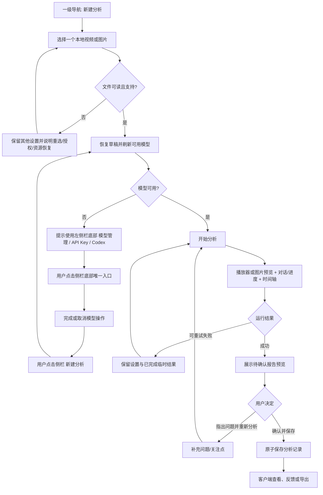

#### 11.1.1 关键原型：新建分析

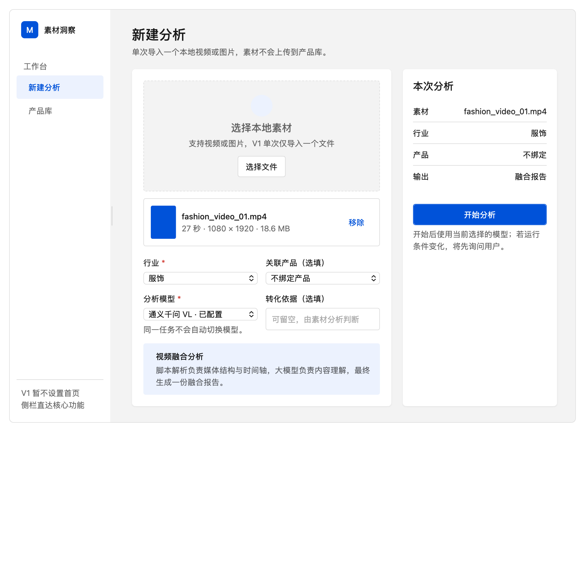

图 1：新建分析关键状态。行业使用下拉选择；单次只导入一个本地视频或图片；产品与转化依据可留空；模型由用户显式选择。右侧摘要在开始前集中复核本次输入，页面不显示 1—2—3 步骤条。

### 11.2 分析页面联动

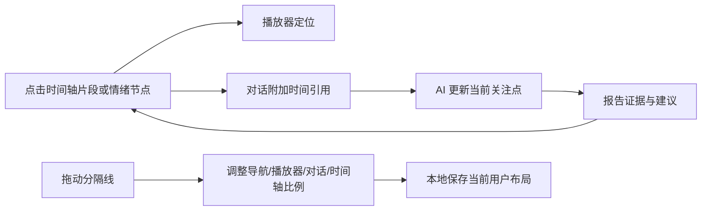

#### 11.2.1 关键原型：播放器、对话分析与时间轴

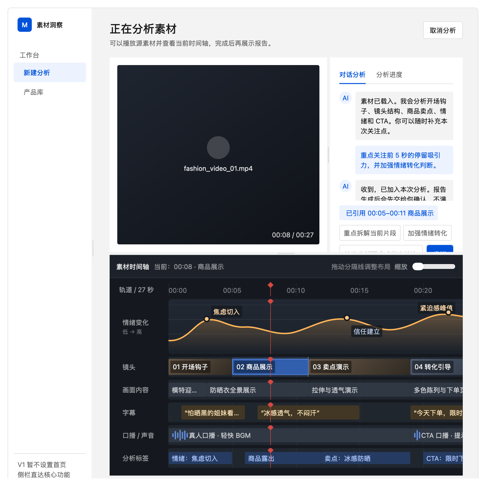

图 2：分析工作区关键状态。播放器、对话分析和独立时间轴同时可见；导航栏、播放器 / 对话区域以及时间轴高度均可通过分隔线调整。时间轴以深色多轨图表承载镜头、画面、字幕、口播 / 声音、标签和播放头，情绪变化以贯穿全片的曲线呈现，而不是使用大白表格。

#### 11.2.2 关键原型：报告预览与用户确认

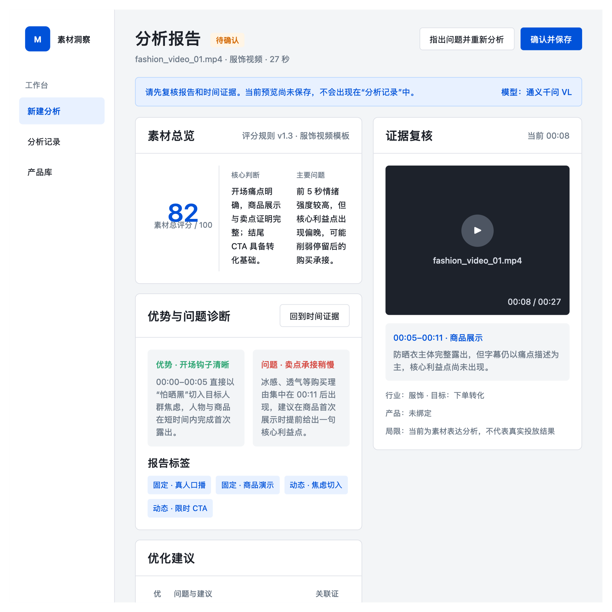

图 3：报告生成后的待确认状态。用户可先查看融合结论、素材评分、问题诊断、优化建议及时间证据，并通过播放器复核对应片段；只有点击“确认并保存”且原子写入成功后才形成正式分析记录。用户不采纳时可指出问题并重新分析，原预览不进入分析记录。

### 11.3 分析记录流程

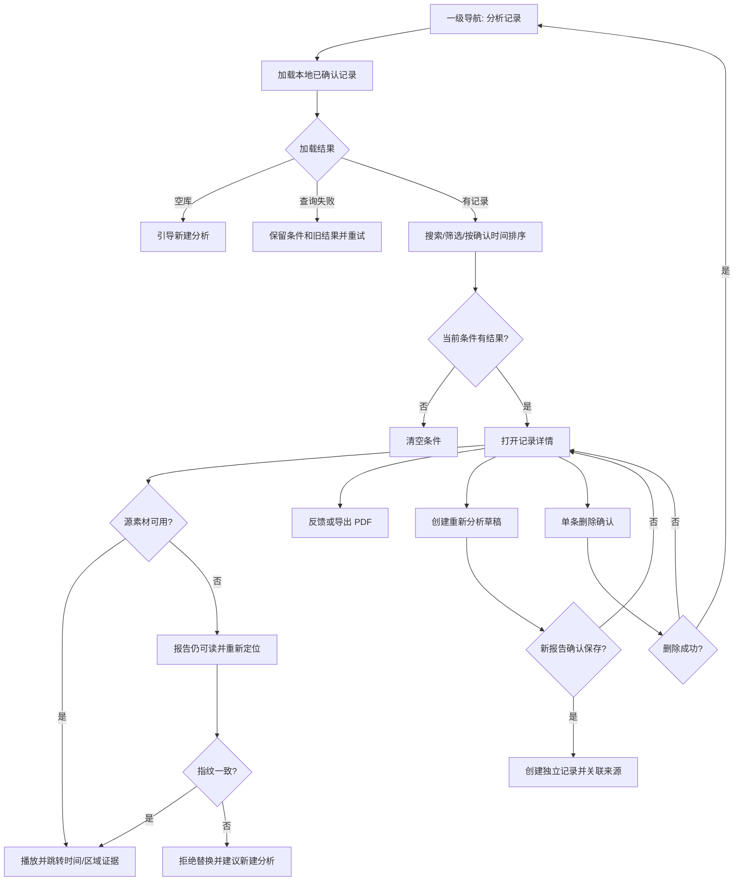

#### 11.3.1 关键原型：分析记录列表

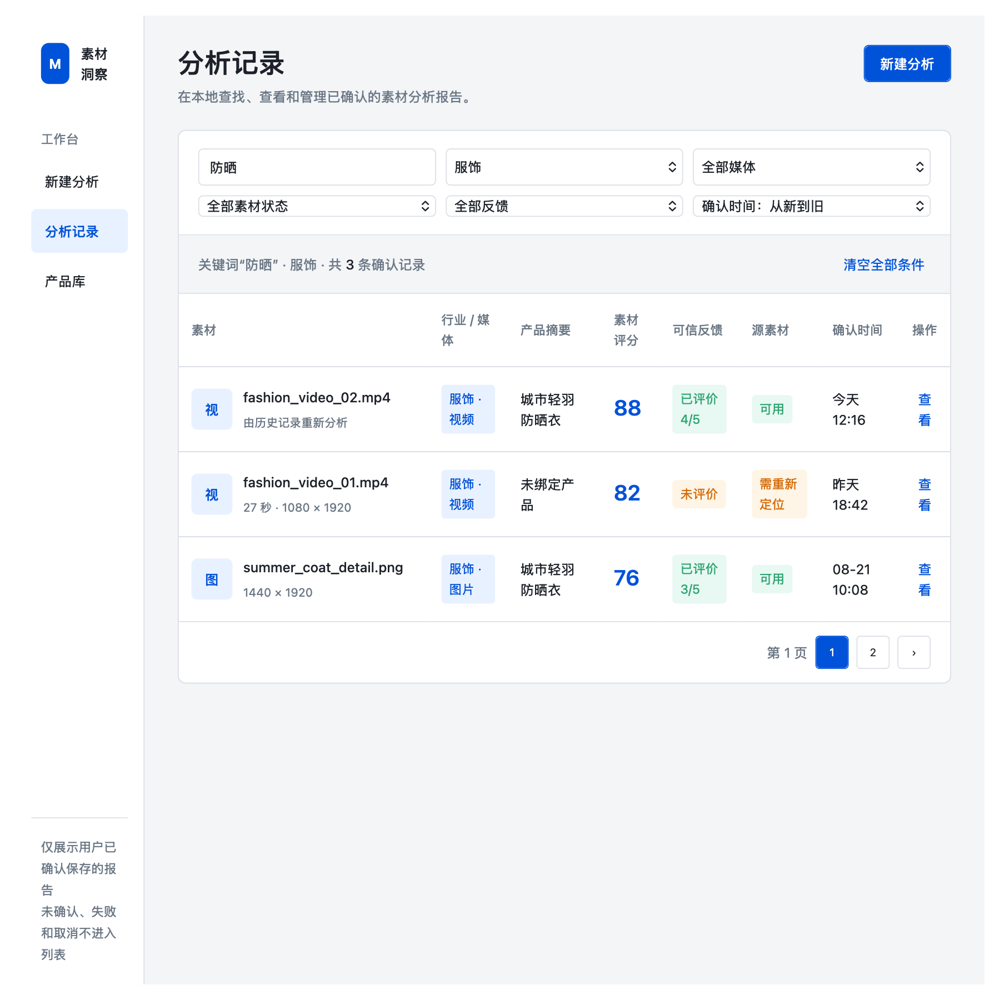

图 4：分析记录列表只收录已确认并保存成功的报告，默认按确认时间从新到旧排列。列表支持本地搜索及行业、媒体类型、源素材、反馈和日期筛选；固定展示素材级信息，不引入广告账户、项目、计划、广告组或投放指标。空库、无匹配结果和查询失败使用不同状态。

#### 11.3.2 关键原型：记录详情与素材恢复

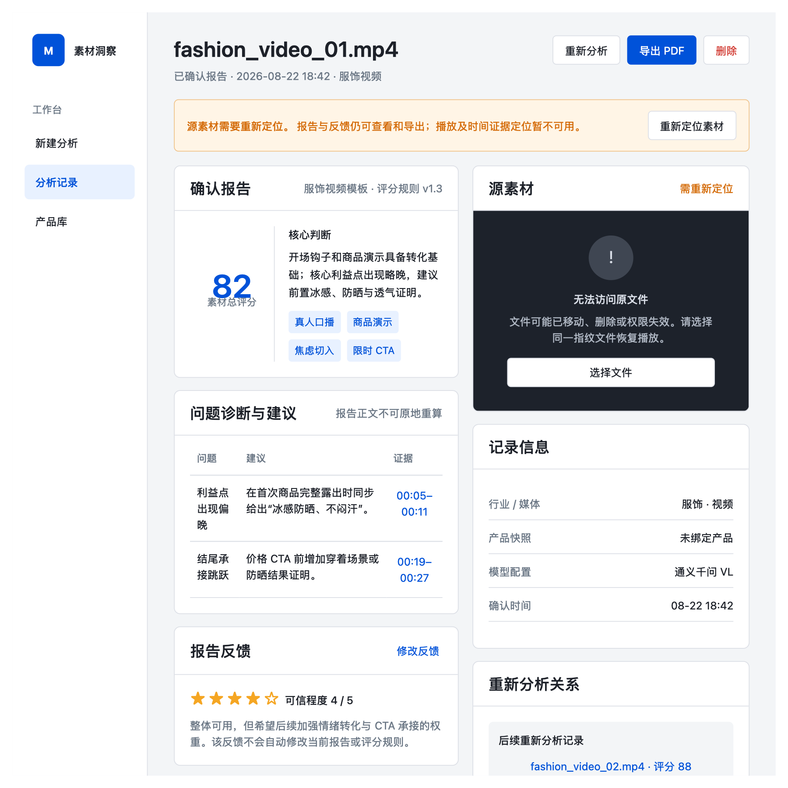

图 5：记录详情以确认时快照展示完整报告。源素材移动、离线或权限失效时，报告、反馈和 PDF 导出仍可用；播放和证据定位明确暂停，用户重新定位到指纹一致的文件后恢复。可信反馈可更新但不改变素材评分或报告正文；重新分析创建独立草稿和新记录，不覆盖原记录。

### 11.4 模型管理与新建分析返回路径

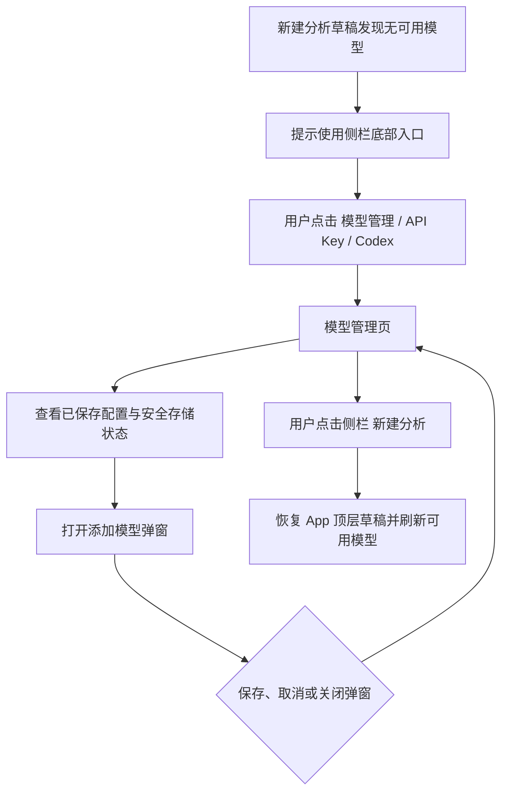

左侧栏底部“模型管理 / API Key / Codex”是唯一模型管理入口。新建分析缺少可用模型时只显示分来源原因并提示该入口，不增加第二套配置入口；模型管理页也不增加页面级关闭按钮。用户完成或取消模型操作后点击侧栏“新建分析”返回，App 顶层状态恢复素材、行业、产品和转化依据，并在来源状态变化后刷新可用模型。保存 / 验证失败仍不影响草稿，也不自动开始分析。

#### 11.4.1 关键原型：模型管理列表

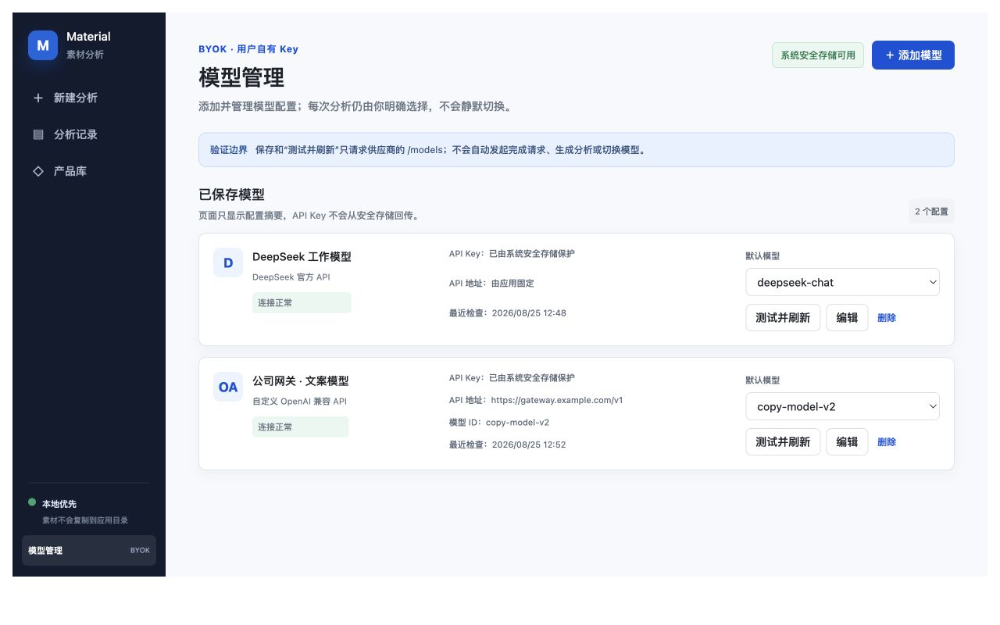

图 6：模型管理列表沿用当前 Material 客户端侧栏和内容区。唯一入口固定在左侧栏底部并标注“BYOK”；页面只展示安全配置摘要，API Key 不回显。用户可添加模型、测试并刷新、编辑、显式选择默认模型或确认删除，随后通过侧栏“新建分析”返回；保存验证不发起 completion。

#### 11.4.2 关键原型：添加自定义模型弹窗

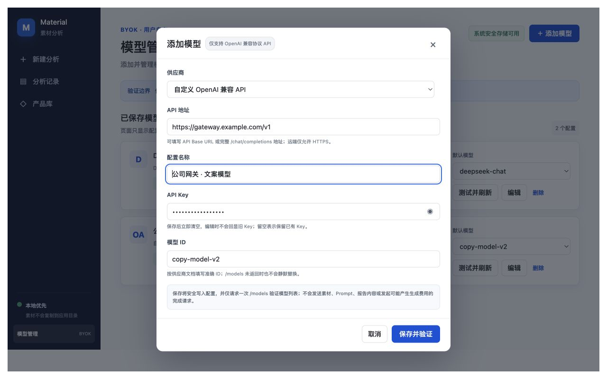

图 7：添加模型在当前页面上方以模态弹窗完成。选择自定义 OpenAI 兼容 API 时显示地址和模型 ID，API Key 使用密码字段；取消或关闭只退出弹窗并返回模型列表，输入错误和保存验证失败有明确恢复路径。弹窗布局可参考用户提供图片，但不复制其中的系统设置导航、供应商大全、套餐分类、本地 JSON 路径或外部产品文案。

### 11.5 原型与需求追踪

| 原型 | 覆盖的核心产品规则 | 主要验收标准 |
| --- | --- | --- |
| P-01 新建分析 | 10.1～10.5：单一本地素材、行业下拉、可选产品、用户显式选模型、可选转化依据 | AC-01～AC-09、AC-14、AC-24 |
| P-02 分析工作区 | 10.6～10.11：播放器 / 图片、双路径融合、对话、可调布局、多轨时间轴、情绪曲线和标签 | AC-10～AC-19、AC-34～AC-35 |
| P-03 报告预览 | 10.12～10.14：评分、完整报告、证据复核、用户确认、不采纳与重新分析 | AC-20～AC-31、AC-36 |
| P-04 分析记录列表 | 10.15.1～10.15.2：确认准入、素材级边界、本地搜索筛选、排序和异常状态 | AC-41～AC-43、AC-49～AC-50 |
| P-05 分析记录详情 | 10.15.3～10.15.5：不可变报告、素材恢复、重新分析关系、反馈、导出和删除 | AC-32、AC-36～AC-38、AC-44～AC-50 |
| P-06 模型管理列表 | 10.1～10.2：侧栏底部唯一 BYOK 入口、安全存储状态、配置摘要、显式默认模型、刷新 / 编辑 / 删除，以及经侧栏返回时顶层草稿保留 | AC-14、AC-24、AC-29～AC-30、AC-51 |
| P-07 添加自定义模型弹窗 | 10.2：条件字段、Key 不回显、弹窗取消 / 关闭零写入、端点安全、仅 `/models` 保存验证和失败恢复 | AC-29～AC-30、AC-51～AC-52 |

七张关键原型用于确认信息架构、关键状态、主要交互和区域关系；字段规则、异常恢复、数据合同和验收条件仍以正文为准。后续视觉微调不得删除原型所表达的唯一模型管理入口、用户选择权、草稿恢复、凭据安全、证据联动、确认后保存、记录边界和可调布局能力。

### 11.6 页面与组件

- 左侧栏：主业务导航为新建分析、分析记录、产品库；底部固定一个“模型管理 / API Key / Codex”应用级入口。侧栏紧凑、可拖动调宽或折叠。
- 新建分析页：本地单文件选择、行业下拉、可选产品、模型选择、可选转化依据、本次分析摘要和开始按钮。
- 分析工作区：播放器 / 图片预览、对话分析 / 分析进度页签、可拖动分隔线、独立深色时间轴。
- 时间轴：缩放、统一刻度、情绪曲线、镜头、画面、字幕、口播 / 声音、分析标签和播放头。
- 报告预览：完整报告、返回证据、确认保存、不采纳并重新分析。
- 分析记录列表：本地搜索、行业 / 媒体 / 源素材 / 反馈 / 日期筛选、确认时间排序、空库与无结果状态、记录行及来源关系标识。
- 分析记录详情：只读报告、即时播放器 / 图片证据、素材状态与重新定位、可信反馈、调权方向、重新分析、PDF 导出和单条删除确认。
- 模型管理页：系统安全存储状态、已保存配置列表、连接状态、默认模型、“添加模型”、测试刷新、编辑和删除确认；页面没有单独关闭按钮，用户通过左侧栏“新建分析”返回。
- 添加 / 编辑模型弹窗：Provider、条件式 API 地址、配置名称、密码型 API Key、条件式模型 ID、取消、关闭和保存；关闭时恢复焦点，不回显已存 Key。

### 11.7 交互状态表

| 状态 | 展示 | 可执行操作 | 数据是否保留 | 恢复方式 | 验收条件 |
| --- | --- | --- | --- | --- | --- |
| 初始 / 默认 | 新建分析表单，行业下拉和未选择素材 | 选择文件、行业、产品和模型 | 页面设置仅当前会话 | 继续填写 | 无 1—2—3 步骤条，首焦点合理 |
| 素材未选择 | 明确支持视频 / 图片且单次一个 | 打开系统文件选择 | 其他设置保留 | 选择文件 | 开始按钮不可用且原因可读 |
| 文件加载中 | 读取元数据 / 首帧进度 | 取消读取 | 其他设置保留 | 重选或重试 | UI 不冻结，不提前显示可分析 |
| 文件不可读 / 不支持 | 原因、格式 / 权限 / 资源建议 | 重选、重新授权、重试 | 行业、产品、模型、转化依据保留 | 完成对应恢复 | 不产生分析运行或半记录 |
| 模型未配置 / 已失效 | 缺少配置、登录、限额或连接失败原因，并提示侧栏底部入口 | 点击侧栏底部“模型管理 / API Key / Codex”，由用户显式选择可用来源与模型 | 文件和完整表单草稿由 App 顶层状态保留 | 完成 / 取消操作后点击侧栏“新建分析” | 无第二套配置入口，API Key 与订阅 token 均不回显 |
| 模型管理列表 | 底部 BYOK 入口、安全存储状态、配置摘要与连接状态 | 添加、刷新、编辑、选默认、删除，或点击侧栏其他页面 | 新建分析草稿和其他配置保留 | 点击侧栏“新建分析”返回，配置变化后刷新模型列表 | 全应用只有一个持久模型入口，无页面级关闭，不自动开始分析 |
| 添加 / 编辑模型弹窗 | Provider 与条件字段、密码型 Key、费用 / 验证边界 | 保存、取消、关闭、修正错误 | 取消 / 关闭零写入；编辑留空保留旧 Key | 保存成功刷新列表；失败就地恢复或返回列表 | 保存 / 刷新只有 `/models`、零 completion，焦点可恢复 |
| 视觉配置启用 / 关闭 | 支持图片的 Provider 显示视觉开关和准确外发说明；其他 Provider 不显示可用开关 | 显式启用或关闭后保存 | 只保存布尔能力声明，不保存图片 | 重新编辑配置 | 默认关闭；模型选项和分析页显示“视觉”或“仅文本证据” |
| 分析进行中 | 播放器、对话、阶段进度、可用时间轴结果 | 播放、补充关注点、调整布局、取消 | 当前临时结果保留于会话 | 等待、取消或失败后重试 | 不自动切模型 |
| 时间轴暂无结果 | 轨道骨架或“尚未识别” | 播放源素材、等待 | 已完成结果保留 | 解析完成后增量显示 | 不用虚构片段填充 |
| 无音轨 / 无字幕 | 对应轨道明确空状态 | 继续分析其他维度 | 其他结果保留 | 不需要恢复 | 报告说明缺失维度 |
| 模型 / 工具超时 | 失败阶段、影响、同模型重试和显式换模型入口 | 重试、换模型后重开、退出 | 表单和可复用临时结果保留 | 用户选择 | 不自动换模型、不保存正式记录 |
| 视觉准备失败 / 超限 | 明确未发送素材、受影响维度和限制原因 | 同配置重试、关闭视觉或显式改选模型后重开 | 表单和本地素材会话保留；视觉字节不持久化 | 用户选择 | 零 completion、零半报告、临时产物可清理 |
| 离线 | 本地播放与历史报告可用；远端分析暂停 / 失败 | 重连、取消 | 页面设置和本地临时结果保留 | 网络恢复后用户重试 | 无虚假完成 |
| 报告预览成功 | 完整报告和证据跳转，状态“待确认” | 确认保存、不采纳 / 重新分析 | 仅当前会话预览 | 用户决定 | 未确认前正式记录数不变 |
| 保存中 / 成功 | 防重复提交；成功后进入报告详情 | 查看、反馈、导出 | 原子持久化 | 读回验证 | 成功提示后强制退出仍可读 |
| 保存失败 | 人话原因、重试 / 返回预览 | 重试或退出 | 预览和输入完整保留 | 存储恢复后重试 | 无半条记录 |
| 记录列表加载中 | 保留旧结果并显示局部加载状态 | 取消查询或等待 | 查询条件和旧结果保留 | 完成或重试 | 不闪成空库，不阻塞全窗口 |
| 记录库为空 | 说明只有确认保存的报告才会出现 | 新建分析 | 无正式记录 | 完成并确认一次分析 | 与“无搜索结果”明确区分 |
| 记录搜索无结果 | 显示当前关键词和筛选摘要 | 清空单项或全部条件 | 查询条件保留 | 调整条件 | 不误报数据被删除 |
| 记录查询失败 | 人话原因、旧结果和当前条件 | 重试、查看仍可用旧结果 | 已有记录不变 | 查询恢复 | 不把失败显示为零记录 |
| 记录详情 / 素材可用 | 完整报告、即时播放器或图片、证据和反馈 | 定位证据、反馈、重新分析、导出、删除 | 报告不可变，反馈可更新 | 无需恢复 | 查看详情不触发模型分析 |
| 素材丢失 / 需授权 | 报告可读、播放不可用、显示原文件摘要和原因 | 重新定位、反馈、导出或仅查看 | 报告保留 | 选择同一指纹文件 | 指纹不符不静默替换 |
| 素材指纹不符 | 显示旧 / 新文件摘要不匹配 | 返回重选、把新文件作为新分析 | 原引用和报告不变 | 选择正确文件 | 不覆盖旧证据关系 |
| 重新分析草稿 | 预填可复用设置并标出失效产品 / 模型 / 素材 | 调整、开始或取消 | 原记录不变 | 用户显式启动 | 新报告确认前不出现新记录关系 |
| 导出失败 | 失败原因、原目标和重试入口 | 重试、改选位置、取消 | 记录不变 | 存储 / 权限恢复 | 不报告不完整文件成功 |
| 返回 / 取消 / 关闭 | 有进行中任务或未确认预览时提示影响 | 继续、取消任务、放弃预览 | 按选择保留 | 返回原页面 | Esc 不静默丢预览 |
| 删除记录 | 准确文件名、时间、不影响源素材 / 其他记录 / 导出副本说明 | 确认 / 取消 | 取消或失败零变化 | 失败可重试 | 成功后不级联删除重新分析记录 |
| 只读 / 存储权限不足 | 允许查看和导出，禁用保存 / 删除 | 修复权限、另存导出 | 已有记录不变 | 权限恢复 | 不显示保存成功 |
| 键盘 / 无障碍 | 可见焦点、语义页签、分隔线、状态播报和非颜色标识 | Tab、Enter / Space、Esc、方向键 | 与鼠标一致 | 继续操作 | 分隔线可键盘调节，时间节点有文本名称 |

## 12. 非 UI 流程图（非 UI 需求必填）

### 12.1 分析任务状态

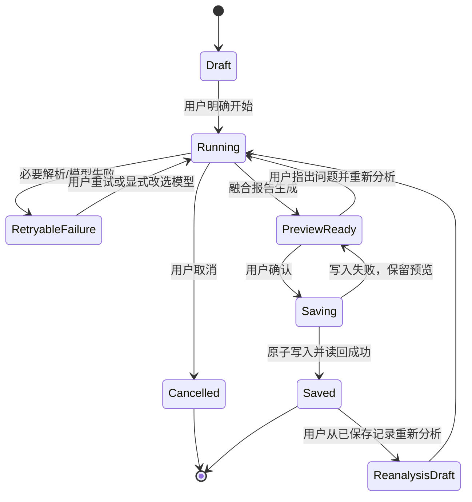

任何失败都必须落到明确可恢复状态。不得把取消或失败记为成功；不得在 `PreviewReady` 前创建正式分析记录；保存失败返回预览后允许返工并重试。

### 12.2 数据流

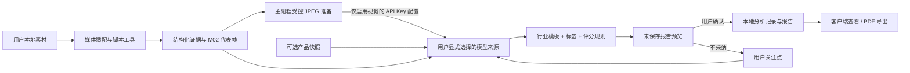

模型和工具只接收其能力所需最少数据。Codex 订阅只接收本地形成的结构化文本证据和必要业务上下文，不接收任何媒体字节。启用视觉的 API Key 模型不直接接收原素材：图片接收当前素材的受控 JPEG 副本，视频只接收 M02 代表帧；原视频、音频和本地路径不外发。模型管理和新建分析必须说明当前发送范围，项目不通过自建 backend 中转。

## 13. 数据与生命周期

### 13.1 概念数据对象

| 对象 | 关键内容 | 来源 | 正式存储 | 生命周期 |
| --- | --- | --- | --- | --- |
| AnalysisDraft | 文件临时引用、行业、产品选择、模型、转化依据、关注点 | 用户 | 当前会话 | 取消 / 关闭后清理，不是正式记录 |
| MaterialReference | 稳定指纹、显示文件名、媒体类型、大小、时长 / 尺寸、受控本地访问句柄 | 本地文件 | 本地 SQLite + OS 访问机制 | 随记录保存；不含素材字节 |
| ProductSnapshot | 零或一个版本化、自包含产品 payload | 产品库 | 确认报告内 | 不随源产品变化 |
| AnalysisRun | 运行 ID、状态、来源类型、所选配置 ID；Codex 额外保留 catalog selection ID、provider requested/returned slug、frozen reasoning effort；可用 usage、能力/runtime 版本、开始 / 结束、错误摘要 | 系统 | 仅确认时保存必要摘要，并传递到历史详情/PDF | 失败 / 取消默认不进正式列表；旧记录扩展字段可缺，未知不伪造 slug/effort/零 usage |
| Evidence | 时间点 / 区间或图片区域、类型、文本 / 标签、置信与来源类型 | 工具和模型 | 确认报告内 | 与报告不可变保存 |
| VisualRequestPayload | JPEG 字节、尺寸、证据 ID 和可选时间 | M02 临时产物经主进程压缩 | 不正式存储 | 仅当前模型请求与短期重新分析内存；运行上下文释放后清理 |
| Report | 行业模板输出、评分、标签、诊断、建议和局限 | 融合层 | 用户确认后本地保存 | 版本快照，不追溯更新 |
| AnalysisRecord | 稳定记录 ID、确认时间、Report / MaterialReference 引用、列表检索字段、可选来源记录 ID | 确认保存事务 | 本地 SQLite | 正式记录聚合根；删除后不可在 V1 客户端恢复 |
| RuleSnapshot | 模板、标签 schema、评分 schema 和版本摘要 | 产品维护 | 确认报告内 | 永久解释该报告，不自动升级 |
| VisibleConversation | 用户关注点、时间引用和必要可见回复摘要 | 用户与 AI | 用户确认后可随记录保存 | 删除记录时删除；不含内部提示词 / 推理 |
| UserFeedback | 报告可信度 1～5、可选原因、调权方向、时间 | 用户 | 本地 SQLite | 可修改或删除；不自动改规则 |
| Export | PDF 文件 | 用户主动导出 | 用户选择位置 | 由用户管理，删除记录不回收导出 |

### 13.2 素材引用与隐私

- 应用不把完整视频或图片复制到业务数据库、产品库、报告、日志或应用托管素材目录。
- 视觉请求的 JPEG 字节和 data URL 不进入 renderer、SQLite、报告、导出、普通日志、审计或任务记录；工具临时帧也不成为素材库或持久缓存。
- 本地绝对路径属于潜在隐私信息，客户端显示必要文件名即可；导出默认不包含绝对路径。
- 为识别移动后的同一文件，可保存版本化强指纹或分块指纹；算法和计算成本由实现任务确定。
- 重新定位时先核对媒体类型、大小、时长 / 尺寸和指纹；不匹配时要求重新分析，不能把旧报告证据绑定到新素材。

### 13.3 创建、更新与删除

- 报告预览在确认前只存在当前会话临时存储；异常退出后不伪装成已保存记录。
- 确认保存使用单一事务写入 MaterialReference、Report、RuleSnapshot、ProductSnapshot 和 AnalysisRecord；任一部分失败则全部回滚。
- 已确认报告正文不可原地重算或覆盖；用户反馈可单独更新，重新分析生成新记录。
- 重新分析的新记录通过可选 `source_record_id` 指向来源；查询所得的后续记录关系不是级联所有权。来源被删除后，新记录仍自包含可读。
- 删除记录删除本地报告、证据、规则 / 产品快照副本、对话摘要和反馈，不触碰源素材、其他记录或外部导出。
- 数据库 schema 变化必须先创建并验证备份；迁移失败恢复原库，不能打开半迁移库继续写入。

### 13.4 导入、导出、备份与恢复

- V1 没有报告批量导入；PDF 导出不作为可恢复数据库备份。
- 应用升级备份包含分析记录和报告，不包含系统安全存储中的 API Key，也不复制源素材。
- 恢复后素材引用可能因路径或权限变化失效；报告仍可读，用户可重新定位。
- 卸载是否保留本地数据遵循客户端发布与卸载规则，不能静默删除用户记录。

## 14. 登录、权限、安全与隐私

- V1 不要求产品账号登录；操作系统账户、应用数据目录权限和系统安全存储构成本地边界。
- 文件只在用户通过系统选择器明确选择后读取；不扫描其他目录，不扩大访问范围。
- API Key 由既有 API Key 安全存储合同管理，不进入 SQLite、报告、日志、导出、任务记录、崩溃报告或诊断包；ChatGPT/Codex token 使用独立 app-scoped 登录和 keyring，也不进入上述位置或 renderer。
- 模型配置页说明厂商、模型、发送的数据类型和删除方式；V1 不在每次分析重复冗长声明，但更换厂商或发送范围扩大时必须重新提示。
- 模型或 Tool 输入遵循最小化：默认只发送结构化文本证据和必要业务上下文，不发送原始媒体、无关文件、其他产品、其他报告、本地路径或凭据。
- 视觉能力默认按 API Key 配置关闭；只有用户在支持图片能力的 OpenAI 兼容配置中显式启用后才发送受控图片。模型设置和新建分析都显示当前发送范围；Codex 订阅不接收视觉字节。
- 第三方和自研工具均按最小权限运行；文件写入、网络访问、子进程、超时和资源限制由 Tool Broker 控制。
- 外部结果按不可信输入处理；报告渲染禁止执行脚本、命令、活动内容和未授权外链。
- 用户可删除模型配置和分析记录；删除模型配置不改写历史报告，只使其不可用于新任务。
- 日志使用运行 ID、能力 ID 和错误类别；文件路径、原始字幕 / 口播、对话正文和模型响应默认不进入普通日志。

## 15. 接口与兼容性

### 15.1 稳定合同

- `MaterialAdapter`：读取元数据、首帧 / 预览、时间基、可取消解码和能力错误。
- `ModelAdapter`：显式文本 / 图片能力、用户配置引用、结构化请求 / 响应、可选视觉证据、取消、超时和厂商错误映射；不通过 completion 隐式探测视觉能力。
- `ModelVisualInput`：仅主进程使用的 JPEG Base64、证据 ID、尺寸和可选毫秒时间；最多 8 张，不能跨 IPC 或持久化。
- `ToolContract`：能力 ID、版本、schema、权限、资源、可取消性和错误等级。
- `EvidenceSchema`：媒体类型、时间点 / 区间或图片区域、证据类型、文本、置信、来源类型和版本。
- `TemplateSchema`、`TagSchema`、`ScoringSchema`：行业、媒体类型、版本、维度和适用条件。
- `ProductSnapshot`：复用产品库版本化 payload；分析端只读，不反写产品。
- `ReportSchema`：稳定章节、证据引用、评分、标签、诊断、建议、局限和规则快照。
- `AnalysisRecordSchema`：稳定记录 ID、确认时间、报告与素材引用、行业 / 媒体 / 产品显示摘要、素材评分、反馈状态和可选来源记录 ID；不包含广告项目维度。
- `RecordQuery`：本地关键词、行业、媒体类型、素材状态、反馈状态、确认日期范围、时间排序和分页游标；查询失败与零结果使用不同结果状态。

### 15.2 媒体和导出兼容

- V1 最低验收格式为 MP4(H.264/AAC)、MOV(H.264)、JPG、PNG 和 WebP；其他格式按适配器能力显示。
- 不支持的编码要在分析前失败，不进入模型调用后才模糊报错。
- 视频旋转、可变帧率、无音轨、竖屏和横屏进入固定兼容样例。
- PDF 导出使用版本化版式，必须包含报告正文和可读时间证据，不嵌入完整源素材。

### 15.3 跨版本和跨平台

| 能力 | macOS | Windows | 兼容要求 |
| --- | --- | --- | --- |
| 本地文件选择 / 访问 | 系统选择器与安全访问机制 | 系统选择器与文件权限 | 相同业务状态，平台实现可不同 |
| API Key | Keychain | Credential Manager | 配置 ID 合同一致，秘密不可迁移进 SQLite |
| 媒体解析 | 共享业务合同，平台解码可不同 | 共享业务合同，平台解码可不同 | 固定样例时间证据在容差内一致 |
| 报告 / 记录 | 本地 SQLite | 本地 SQLite | schema 与迁移一致 |
| PDF 导出 | 原生保存位置 | 原生保存位置 | 内容结构一致，系统字体允许视觉差异 |

旧客户端遇到新 schema 时停止写入并提示升级或恢复兼容备份，不静默重建。模板、标签和评分新版本不要求旧客户端重算历史报告。

## 16. 性能、可靠性与成本

### 16.1 性能基线

以下为验证版本工程基线，不代表业务上限：

- 文件选择后 2 秒内显示读取状态，不能出现无反馈等待；元数据读取与首个可播放画面按固定 1 分钟 1080p 样例记录 P95。
- 进度、取消、对话输入、页签切换和布局拖动不能被长时间媒体 / 模型任务阻塞。
- 时间轴在 30 分钟固定样例、六条轨道和 1,000 个片段下保持可交互；实现任务给出可复现帧率或响应时间阈值。
- 已确认报告列表和详情在 10,000 条固定记录下进行 P95 测量；目标基线为本地列表 / 搜索 1 秒内可见结果。
- 模型总耗时不设伪固定 SLA；界面显示已完成阶段、当前等待和可取消状态。

### 16.2 可靠性

- 分析运行、保存和导出分别有明确状态，不能用导出成功代替保存成功。
- 远端请求可取消、有超时；V1 不自动重试视觉 completion，避免重复计费、重复外发或改变模型。
- 保存采用原子事务；显示成功后强制结束进程再启动，记录仍应存在。
- 媒体、模型和可选工具分别降级；缺少必要证据时不生成看似完整的报告。

### 16.3 成本

- 模型费用由用户自己的账号承担；项目 V1 不代付、不共享 Key、不自建付费代理。
- 能获取估算时，在开始前显示模型厂商可提供的用量估算；无法可靠估算时明确“费用由厂商按实际调用计算”，不编造金额。
- 任何新增付费组件、托管服务、模型代理或持续运维成本必须单独询问用户。

## 17. 运维、可观察性和问题排查

### 17.1 本地可观察性

- 用户界面记录运行 ID、阶段、开始 / 结束、所选配置显示名、模板 / 评分版本、错误类别和重试次数。
- 诊断日志使用结构化事件，默认不含 Key、完整路径、素材字节、原始对话、原始模型响应和内部提示词。
- 可选诊断包在导出前展示包含范围并二次脱敏；用户主动选择保存位置。

### 17.2 主要问题分类

| 问题 | 用户可见信息 | 恢复 |
| --- | --- | --- |
| 文件无权限 / 被移动 | 文件摘要和失效原因 | 重新授权或重新定位同一文件 |
| 解码失败 / 资源不足 | 失败阶段、编码 / 资源建议 | 重选、关闭占用、调整安全配置后重试 |
| 模型凭据失效 | 配置失效，不显示 Key | 更新或删除配置，再显式开始 |
| 模型限流 / 超时 | 厂商错误类别和是否可能计费 | 同模型重试或用户显式换模型 |
| Tool 失败 | 受影响维度和是否可降级 | 重试、停用可选 Tool 或重新分析 |
| 时间对齐异常 | 证据暂不可定位 | 重跑确定性解析；必要时阻止报告确认 |
| SQLite 只读 / 损坏 | 只读模式或安全失败 | 修复权限、验证备份、恢复后重试 |
| 导出失败 | 目标路径 / 权限 / 空间类别 | 换位置或释放空间；已保存记录不受影响 |

后续实现需更新排障文档，提供不泄漏素材和凭据的诊断步骤。

## 18. 发布、迁移与回退

### 18.1 发布顺序

1. 在 macOS 开发环境完成业务实现和自动验证。
2. 在真实 macOS 安装包验证文件访问、安全存储、模型、媒体、保存和导出。
3. 构建 Windows 安装包，在真实 Windows x64 环境验证相同闭环。
4. 两个平台均未通过前，不宣称跨平台完成；本需求不发布独立 backend。

### 18.2 数据迁移

- 首次实现新增分析记录 schema 时记录版本；升级前创建并验证本地备份。
- 迁移包含报告、规则快照、素材引用和用户反馈，不搬移素材本体或系统安全存储秘密。
- 迁移中断时保持原库和最近已验证备份可用；半迁移库不能继续写入。
- 模板 / 评分内容更新使用业务版本，不通过破坏性改写旧报告完成。

### 18.3 回退

- UI 或分析能力回退可关闭新建分析入口，但已保存报告仍应以只读方式访问和导出。
- 数据 schema 不兼容时回退到升级前已验证备份；回退会丢失升级后新记录，执行前必须展示准确时间点并由用户决定。
- 模型或 Tool 适配器故障可停用对应配置，不删除用户 Key 或历史报告。
- 卸载 / 重装不得作为常规数据恢复方案；执行真实删除前遵循发布与卸载确认边界。

## 19. 验收标准

| AC | 前置与操作 | 可观察结果 |
| --- | --- | --- |
| AC-01 | 导入 MP4 服饰视频，选择行业、模型，不绑定产品并开始 | 进入视频分析工作区，设置摘要正确，不绑定不阻断 |
| AC-02 | 导入 JPG 服饰图片并分析 | 使用服饰图片模板，无播放器时间轴和情绪伪曲线，报告完整 |
| AC-03 | 导入游戏视频，未填转化依据 | 报告判断拉新或拉活并给证据，不把目标写回产品 |
| AC-04 | 分别绑定服饰产品和游戏版本 / 渠道上下文 | 每次只生成一个不可变产品快照；源产品后续变化不改旧报告 |
| AC-05 | 不绑定产品完成分析 | 报告明确“未绑定产品”，其余流程完整 |
| AC-06 | 检查数据库、应用目录、报告和导出 | 不含完整素材字节；源文件仍只在用户位置 |
| AC-07 | 导入无权限、损坏和不支持编码文件 | 分析前明确失败，保留其他设置，无模型调用和半记录 |
| AC-08 | 导入无音轨视频 | 口播 / 声音轨为空并说明，其他维度继续，不伪造声音结论 |
| AC-09 | 分析竖屏、横屏、旋转元数据和可变帧率固定样例 | 播放方向正确，时间不越界，报告证据可定位 |
| AC-10 | 点击镜头、字幕、口播和标签片段 | 播放器定位、片段选中、当前信息和对话引用同步 |
| AC-11 | 缩放 / 滚动时间轴并播放 | 统一刻度、播放头和所有轨道对齐；缩放不改存储时间 |
| AC-12 | 点击三个情绪曲线节点 | 播放器跳转、对话引用情绪节点，报告可返回相同时间 |
| AC-13 | 情绪证据不足样例 | 显示证据不足，不生成无依据的精确曲线或数值 |
| AC-14 | 模型超时、限流或凭据失效 | 不自动切模型；可同模型重试或用户显式改选后重开 |
| AC-15 | 可选 Tool 失败 | 报告标明受影响维度并可降级；必要 Tool 失败则阻止完整报告 |
| AC-16 | 运行中取消 | 请求和可取消工具停止，无正式记录；表单设置可再次使用 |
| AC-17 | 离线开始远端分析 | 明确不可用并保留设置；历史报告和本地播放仍可用 |
| AC-18 | 扫描视频报告时间证据 | 每个时间点 / 区间合法，且不超过素材总时长 |
| AC-19 | 在运行中发送关注点并引用时间段 | 当前分析接收要求，AI 可见回复确认范围，其他任务不受影响 |
| AC-20 | 报告生成后关闭而不确认 | 正式分析记录数量不变；不会伪装保存 |
| AC-21 | 报告生成后确认保存 | 单一事务保存并读回，进入报告详情 |
| AC-22 | 保存期间注入磁盘满或进程失败 | 返回预览并保留内容，无半条正式记录，可恢复后重试 |
| AC-23 | 不采纳预览，填写问题并重新分析 | 原预览不进记录；新运行使用问题并要求用户再次显式确认来源与模型，不套用隐式默认 |
| AC-24 | 用户在运行前改选另一个来源或目录/模型项 | 明确创建新运行；Codex 报告记录来源、catalog selection ID、provider requested/returned slug、frozen effort 和可用 usage，无自动调度/切换 |
| AC-25 | 更新服饰评分权重并分析新素材 | 新报告使用新版本；游戏规则和旧报告不变 |
| AC-26 | 更新游戏模板并读取旧报告 | 旧报告结构、分数和版本快照不变，不自动重算 |
| AC-27 | 检查四类模板 | 服饰 / 游戏、视频 / 图片正确隔离，维度和目标不串用 |
| AC-28 | 生成固定 + 动态标签 | 两类标签在报告分组显示，不写入独立标签库 |
| AC-29 | 用哨兵 API Key 执行配置、分析、失败、导出和诊断 | SQLite、日志、报告、导出、任务记录中哨兵命中为 0 |
| AC-30 | 删除模型配置 | Key 从系统安全存储移除，新任务不可用；历史报告仍可读 |
| AC-31 | 导出 PDF | 内容可读，含必要时间证据；不含绝对路径、Key、内部提示词和工具日志 |
| AC-32 | 移动源素材后打开报告并重新定位 | 报告可读；同一文件可恢复播放，不同指纹被拒绝静默替换 |
| AC-33 | 在真实 macOS 和 Windows 对固定样例执行核心路径 | 业务状态、模板、数据合同和时间证据一致；平台差异有记录 |
| AC-34 | 拖动三处分隔线并重启客户端 | 比例在安全范围内变化并按本地用户恢复；可一键恢复默认 |
| AC-35 | 仅用键盘完成页签、分隔线、时间节点、对话、确认和取消 | 焦点可见、状态播报、方向键和 Esc 行为正确，不只靠颜色 |
| AC-36 | 对确认报告提交 1～5 分可信度和调权建议 | 反馈与素材评分分离保存，不自动改模板或评分规则 |
| AC-37 | 删除分析记录，并分别注入取消和存储失败 | 明确确认后记录不可见；取消 / 失败零变化；源素材、其他记录和已有 PDF 不被删除 |
| AC-38 | 已保存报告发起重新分析，再分别取消、失败和确认新报告 | 仅确认成功时生成独立新记录并关联来源，不覆盖或折叠旧记录 |
| AC-39 | 返回恶意字幕、模型文本、链接、脚本和控制指令 | 只作为不可信文本展示或拒绝，不执行、不跳转、不扩权 |
| AC-40 | 在安全上限边界和超限样例上分析 | 边界内可运行；超限明确拒绝或给降级选择，不无界加载、不静默截断 |
| AC-41 | 创建多条已确认记录，并保留若干未确认、失败和取消运行 | 列表只出现已确认记录，默认确认时间从新到旧；字段不含广告账户、项目、计划、广告组或投放指标 |
| AC-42 | 按素材名搜索，组合行业、媒体、素材、反馈、日期筛选，切换时间排序后进入详情再返回 | 结果正确，查询不联网；关键词、筛选、排序和滚动位置恢复 |
| AC-43 | 分别打开无记录、无匹配结果和查询失败状态 | 三种状态文案和操作不同；失败保留条件与旧结果，不伪装成空库 |
| AC-44 | 在源素材可用时打开视频和图片记录详情 | 不重新调用模型即可读报告；视频可播放 / 跳转时间证据，图片可定位区域证据 |
| AC-45 | 移动或取消源素材权限后打开记录、反馈并导出 | 报告和反馈可读写，PDF 可导出；播放 / 定位明确不可用且提供恢复入口 |
| AC-46 | 重新定位到相同指纹和不同指纹文件 | 相同文件恢复证据；不同文件被拒绝覆盖，并可作为新分析启动 |
| AC-47 | 原产品更新、删除或原模型来源失效后从旧记录重新分析 | 草稿明确预填和失效项；新产品快照取当前信息，来源与目录/模型由用户重新显式选择。Codex 旧记录不用历史 slug 反推当前 catalog ID/default effort，不自动切换来源/预设/slug/effort |
| AC-48 | 对存在后续重新分析记录的来源记录执行删除 | 后续记录完整可读，显示“来源记录已删除”，不发生级联删除 |
| AC-49 | 新增、修改和删除可信反馈 | 列表反馈状态同步，素材评分、报告正文和规则版本保持不变 |
| AC-50 | 检查记录列表应用数据，再注入 PDF 导出失败 | 不存在源素材副本或持久缩略图；导出失败不改记录、不报告不完整文件成功且可重试 |
| AC-51 | 在新建分析填写素材、行业、产品和转化依据且无可用模型，检查页面后点击侧栏底部“模型管理 / API Key / Codex”，分别取消操作或形成可用来源，再点击侧栏“新建分析” | 新建分析页只有分来源不可用原因和侧栏提示，没有第二套配置入口；模型管理页没有页面级关闭；两次返回后原草稿完整，来源变化后模型列表刷新，不自动开始分析 |
| AC-52 | 打开添加自定义模型弹窗，分别执行取消、关闭、非法 URL、保存验证失败和成功，并检查网络请求与持久化摘要 | 条件字段、错误和焦点恢复可感知；取消 / 关闭零写入，Key 不回显或进入日志；保存 / 刷新只有 `/models`、零 completion，失败保留安全配置与恢复入口 |
| AC-53 | 新建 OpenAI 兼容配置，分别关闭和启用视觉输入后重开应用 | 布尔能力声明持久化；关闭时模型选项标记仅文本且请求无图片，启用时标记视觉；Key 仍不回显 |
| AC-54 | 用 JPG / PNG 图片和已启用视觉的配置运行分析并检查请求、报告、SQLite、日志与导出 | 只发送当前素材产生的 JPEG，单边不超过 1280、单张不超过 1 MiB；原图、路径、Base64 / data URL 不进入持久数据或审计 |
| AC-55 | 用视频和已启用视觉的配置运行分析 | 只发送同一素材 M02 产出的最多 8 个代表帧，每帧绑定已发送 `evidenceId` 与合法 `timeMs`；请求不含原视频或音频 |
| AC-56 | 使用 1、8 张边界样例、缺失 / 替换临时产物和不可压缩超限样例 | 总图片负载不超过 6 MiB；产物不匹配或仍超限时整批拒绝、零 completion，错误不含路径或字节 |
| AC-57 | 注入视觉 completion 超时、限流、无效响应和模型不支持图片 | 只调用用户选择的配置和模型一次；不自动重试、切换或静默回退文本，显示受影响视觉维度且不形成待确认报告 |
| AC-58 | 视觉报告生成后通过对话指出问题并重新分析 | 当前会话复用内存中的同一组受控视觉证据与同一模型，不再次扩大读取范围；结果仍经过证据校验，报告和记录不保存视觉字节 |

AC-01～AC-52 继续验收单素材分析主闭环。新增“Codex 订阅（Beta）”来源不在本表复制验收编号：入口、登录、目录 ID/slug/default effort 和限额追踪 REQ-0007 的 CS-AC-01～68；显式来源、同 slug 多预设、结构化文本、ThreadStartResponse fail-close、一次 ephemeral thread/turn、取消、无重试/回退、audit/报告/记录/PDF 模型/effort/usage、真实订阅和双平台证据追踪 REQ-0008 的 CA-AC-01～48。

## 20. 验证计划与证据

### 20.1 APP-0004 初版文档任务

本地验证由受控 runner 从任务记录中的固定 argv 实际执行：

| 检查 | argv | 超时 | 环境 / 发布单元 | 预期与证据 |
| --- | --- | --- | --- | --- |
| docs_reconcile | `python3 tools/governance/reconcile.py docs --json` | 120 秒 | controlled-local / mac、win | 24 节、流程、假设 / 未决、链接、状态和需求绑定通过；结果写入 APP-0004 |
| repository_reconcile | `python3 tools/governance/reconcile.py static --json` | 120 秒 | controlled-local / mac、win | 任务、分支、范围和仓库静态核对通过 |
| governance_unit_tests | `python3 -m unittest discover -s tools/governance/tests -p test_*.py -v` | 1200 秒 | controlled-local / mac、win | 治理单测实际运行且非空 |

未运行、失败、超时或跳过均不是通过。文档或工作区变化后重新验证；本地结果不能替代 PR 和 `main` 准确提交上的 GitHub Actions。

### 20.2 APP-0017 模型原型与入口文档任务

APP-0017 必须从当前任务记录执行以下固定验证；本节只定义预期，不把未运行检查写成通过：

| 检查 | argv | 超时 | 环境 / 发布单元 | 预期与证据 |
| --- | --- | --- | --- | --- |
| docs_reconcile | `python3 tools/governance/reconcile.py docs --json` | 120 秒 | controlled-local / mac、win | 七张关键原型存在且链接可读，P-06 / P-07、AC-51 / AC-52、入口和草稿恢复追踪完整；结果写入 APP-0017 |
| repository_reconcile | `python3 tools/governance/reconcile.py static --json` | 120 秒 | controlled-local / mac、win | APP-0017 任务、分支、允许路径和静态仓库状态一致 |
| governance_unit_tests | `python3 -m unittest discover -s tools/governance/tests -p test_*.py -v` | 1200 秒 | controlled-local / mac、win | 治理单测实际运行且非空 |

原型像素存在或 Markdown 能渲染不等于交互功能、API 安全或真实第三方模型已经验收；功能证据仍以对应实现任务和真实平台验证为准。

### 20.3 后续实现任务

实现任务必须固定真实 argv，并至少覆盖：

- 领域与 schema 单测：任务状态、模板选择、产品快照、证据时间合法性、标签、评分版本、报告确认和反馈分离。
- 媒体集成：MP4 / MOV / JPG / PNG / WebP、无音轨、旋转、可变帧率、损坏、超限、取消和资源不足。
- Tool / Model 契约：能力探测、结构化 schema、超时、取消、失败降级、显式模型选择和禁止自动切换。
- SQLite 集成：原子确认、保存失败、记录查询 / 筛选 / 排序、反馈更新、单条删除、非级联重新分析关系、迁移、备份和恢复。
- UI 自动化：表单、播放器、对话、进度、时间轴、情绪曲线、三处分隔线、报告预览、记录空库 / 无结果 / 失败 / 详情 / 重定位和导出。
- 安全：哨兵 Key 扫描、路径脱敏、恶意外部文本、权限最小化和诊断包检查。
- 性能：固定视频长度、轨道 / 片段数和记录数数据集，记录原始耗时、资源和环境。
- 真实 macOS、Windows：安装、升级、卸载、文件访问、安全存储、媒体、模型、保存、导出和回退。
- 产品负责人自行执行核心路径验收；不以开发者自报或假数据演示代替。

Windows CI runner 不能替代真实 Windows 客户端验收。假模型可以验证错误和结构，但不能代替至少一个用户自有 Key 的真实模型集成证据。

### 20.4 APP-0028 OpenAI 兼容视觉模型分析

APP-0028 从任务记录执行文档 / 静态核对、desktop lint、typecheck、普通测试、模型 runtime 测试、Electron package 和治理单测。专用自动化至少覆盖：旧模型配置默认关闭视觉、仅图片 Provider 可启用、视觉请求与配置双重门禁、官方文本加 `image_url` 内容块形状、临时产物精确读取 / 释放、帧与证据 ID / 时间绑定、8 张 / 1280 像素 / 单张 1 MiB / 总计 6 MiB 限额、原视频音频零上传、错误与审计零字节泄漏、失败零重试 / 零切换，以及对话重新分析只复用当前内存视觉证据。

模拟 HTTP 与合成 JPEG 能验证协议、安全和恢复合同，不能证明任意第三方模型的视觉质量、隐私政策、中国大陆可达性或费用。至少一个用户自有视觉模型的固定图片 / 视频样例仍需产品负责人自行验证；macOS 与 Windows 安装包也需分别复验 Electron 图像解码、系统安全存储、请求取消和临时文件清理。

## 21. 文档更新清单

### 21.1 历史 APP-0017 任务

- 保留新建分析、分析工作区 / 多轨时间轴、报告预览、分析记录列表和记录详情五张既有关键原型。
- 新增模型管理列表和添加自定义模型弹窗两张关键原型，使本需求共包含七张关键原型，并在第 11 节建立 P-01～P-07 到产品规则及 AC 的追踪。
- 更新本 PRD 和[模型接入与安全存储-DEV-0010-v1.0](../../development/模型接入与安全存储-DEV-0010-v1.0.md)中的唯一入口、经侧栏返回、App 顶层草稿保留和参考图使用边界。
- 不修改客户端代码、模型服务、IPC、凭据、分析编排或产品库 PRD；不把原型补充宣称为功能、第三方服务、双平台或发布验收。
- `project-control` 的任务、范围和验证结果只由受控工具维护，不通过本文档反向改写。

### 21.2 后续实现

- 开发文档：客户端分析模块、媒体 sidecar、Model Adapter、Tool Broker、模板 / 评分注册表和状态管理。
- 数据文档：分析记录 SQLite schema、迁移、备份、恢复、删除和素材引用。
- 运维文档：模型配置、系统安全存储、macOS / Windows 数据目录、安装升级和回退。
- 排障文档：媒体解码、文件权限、模型凭据 / 限流、Tool、时间对齐、数据库和 PDF 导出。
- 决策文档：具体媒体组件、模型适配策略、应用层加密或新增 backend / 付费服务时记录 ADR。
- 后续需求：素材库、标签库、事实修正、批量 / 组图、比较和内容生产。

### 21.3 当前 APP-0028 任务

- 更新本 PRD，并新增[OpenAI兼容视觉模型分析-DEV-0021-v1.0](../../development/OpenAI兼容视觉模型分析-DEV-0021-v1.0.md)和[OpenAI兼容视觉模型分析-TRB-0018-v1.0](../../troubleshooting/OpenAI兼容视觉模型分析-TRB-0018-v1.0.md)。
- 视觉模型请求只使用 M02 当前调用注册的临时图片产物；没有独立素材库、缩略图缓存或报告字段。
- 配置 UI 和新建分析明确区分视觉 / 仅文本范围；保存 / 刷新仍不产生 completion。
- 不把模拟 Provider、共享单测或 Electron package 宣称为真实第三方模型、视觉质量、双平台真机或发布验收。

## 22. 风险与影响分析

| 风险 | 最坏影响 | V1 控制 | 状态 |
| --- | --- | --- | --- |
| 模型幻觉或证据错位 | 用户按错误结论修改素材 | 时间证据、局限、可信反馈、合法区间校验和报告确认 | 已纳入 |
| 脚本与模型冲突 | 融合报告自相矛盾 | 稳定证据 schema、冲突处理和不确定标识 | 已纳入 |
| 情绪曲线被当成真实用户测量 | 产生错误商业判断 | 明确为素材表达分析，不给伪生理精度，证据不足时不绘制 | 已纳入 |
| 模型自动切换 | 成本、隐私和结果不可控 | 单任务固定用户选择；变化时暂停询问 | 已确认 |
| API Key 泄漏 | 用户账号和费用受损 | 系统安全存储、哨兵扫描、日志 / 导出禁入 | 已确认 |
| 素材被复制或上传到错误位置 | 隐私或商业素材泄漏 | 不入应用素材库；最小读取 / 发送；路径脱敏 | 已确认 |
| 视觉能力误配或发送范围扩大 | 第三方收到用户未授权的图片或模型调用失败 | 配置默认关闭、Provider 能力和配置双重门禁、分析前可见发送范围、无隐式探测 | 已确认 |
| 代表帧被当作完整视频事实 | 报告遗漏关键镜头却给出过度确定结论 | 每帧绑定证据 ID / 时间、报告显示代表帧覆盖局限、未知证据拒绝 | 已确认 |
| 视觉字节进入持久数据或日志 | 商业素材形成隐性副本 | 主进程短期内存、受控临时产物、请求审计无正文、报告 / SQLite / 导出禁入 Base64 | 已确认 |
| Tool / Skill 被写死或越权 | 难迭代、写坏文件或执行恶意内容 | 版本化合同、Tool Broker、最小权限和不可信输入处理 | 已确认 |
| 评分动态调整污染历史 | 同一报告分数前后变化 | 规则快照，新版本只影响新分析 | 已确认 |
| 标签跨行业串用 | 报告语义错误 | 行业与媒体模板隔离，固定 / 动态分组 | 已确认 |
| 未确认预览被保存 | 正式记录充满不可用结果 | 用户确认门槛和原子保存 | 已确认 |
| 记录查询失败被显示成空库 | 用户误以为历史记录丢失 | 区分空库、无结果和错误，失败保留旧结果与条件 | 已纳入 |
| 重新分析覆盖或级联删除历史 | 用户无法比较迭代结果或误删证据 | 独立记录、来源引用、非级联删除和不可变快照 | 已纳入 |
| 列表缩略图形成隐性素材库 | 素材在应用目录留下未预期副本 | V1 不持久化源素材缩略图，仅可用时即时预览 | 已纳入 |
| 本地素材移动 / 删除 | 报告无法播放或重新分析 | 报告自包含证据摘要、指纹重定位、报告仍可读 | 已纳入 |
| 无业务硬上限导致资源耗尽 | 客户端崩溃、数据损坏 | 实现前定义安全上限、流式 / 分块处理和明确拒绝 | 待实现决定 |
| 双平台媒体差异 | mac 可用但 Windows 不可用 | 共享合同、固定样例、真实双平台验收 | 已纳入 |
| 用户反馈直接改权重 | 单次反馈污染全体规则 | 反馈只记录，产品维护后发布新版本 | 已确认 |

## 23. 审核与回执

产品负责人在当前连续对话中已经明确以下范围决定：单次本地视频 / 图片、服饰和所有游戏、双路径视频解析与融合报告、完整分析维度、到时间轴、播放器、对话分析、情绪曲线、工具 / 脚本 / Skill 可扩展、用户自带 Key、单任务不自动切换模型、行业模板 / 标签 / 评分隔离、动态规则、报告确认后保存、反馈与重新分析、分析记录、客户端优先查看和素材不入库。

这些清晰需求已足以编写本 PRD，无需为普通文档编辑和验证重复生成 scope/code 回执。当前没有验证豁免、破坏性数据操作、部署、发布或最终合并决定。若后续选择项目共享密钥、自建 backend、付费服务、不可兼容迁移、删除真实用户数据或最终发布，必须在准确对象和影响明确后由用户决定，并由 `reviewctl` 记录适用回执。

本 PRD 仍处于 `DRAFT`。产品负责人确认本文档后可转为 `ACTIVE`；该确认只代表产品需求成熟，不等于批准合并、部署或发布，也不代表实现已完成。

## 24. 变更历史

| 版本 | 日期 | 变更摘要 | 原因 | 关联任务 |
| --- | --- | --- | --- | --- |
| v1.0 | 2026-08-23 | 完整定义单素材分析 V1，补全分析记录，嵌入五个关键节点原型并建立原型、产品规则和验收标准的追踪 | 根据已确认产品方向、当前交互原型及产品负责人对 PRD 内容和原型引用的补充要求形成可实施主文档 | APP-0004 |
| v1.0 | 2026-08-25 | 补充模型管理列表与添加自定义模型弹窗，使关键原型增至七张；新增 P-06 / P-07、AC-51 / AC-52，并明确左侧栏底部唯一 BYOK 入口和新建分析草稿返回 | 补齐 APP-0016 模型管理能力在主 PRD 中的入口、布局、安全与恢复可视化，不扩大功能实现范围 | APP-0017 |
| v1.0-cross | 2026-08-26 | 增加“Codex 订阅（Beta）”作为与 API Key 独立的显式分析来源，修正 V1 只发送结构化文本证据，并追踪 REQ-0007/REQ-0008、DEV-0020 和 CA-AC | APP-0027 需要把真实订阅分析接入既有单素材闭环，同时保持历史 AC 编号稳定 | APP-0027 |
| v1.0-cross | 2026-08-27 | 在 APP-0027 显式模型来源基础上整合 OpenAI 兼容视觉能力、主进程受控 JPEG / M02 代表帧、限额、失败恢复、AC-53～AC-58 和持久化禁入边界；Codex 保持仅文本证据 | 将 APP-0028 来源实现重新组合到最新产品栈，避免视觉能力覆盖 Codex 的独立计费与数据边界 | APP-0029 |
