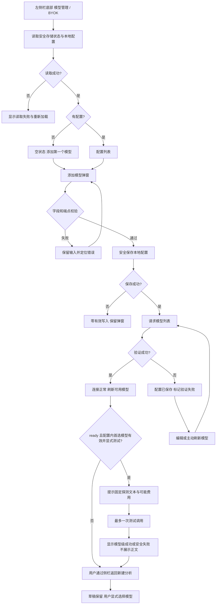
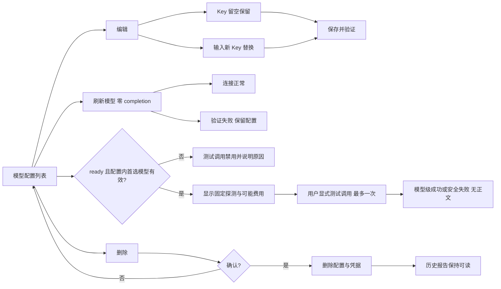
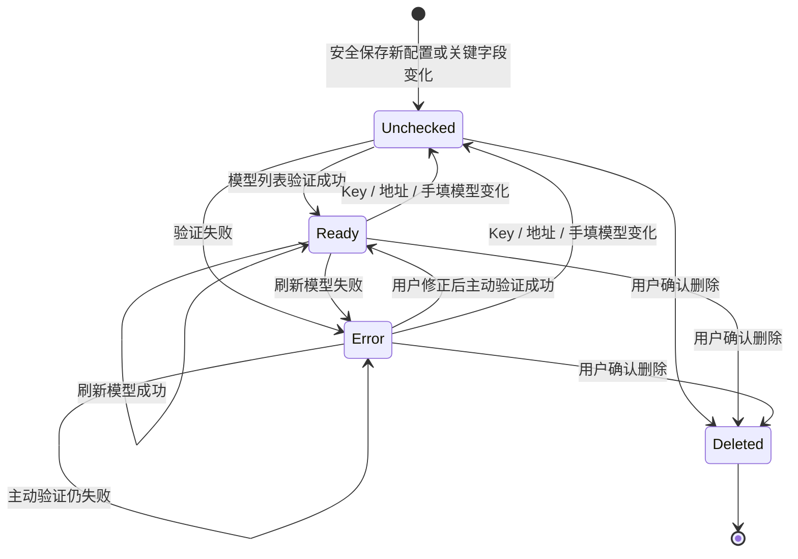
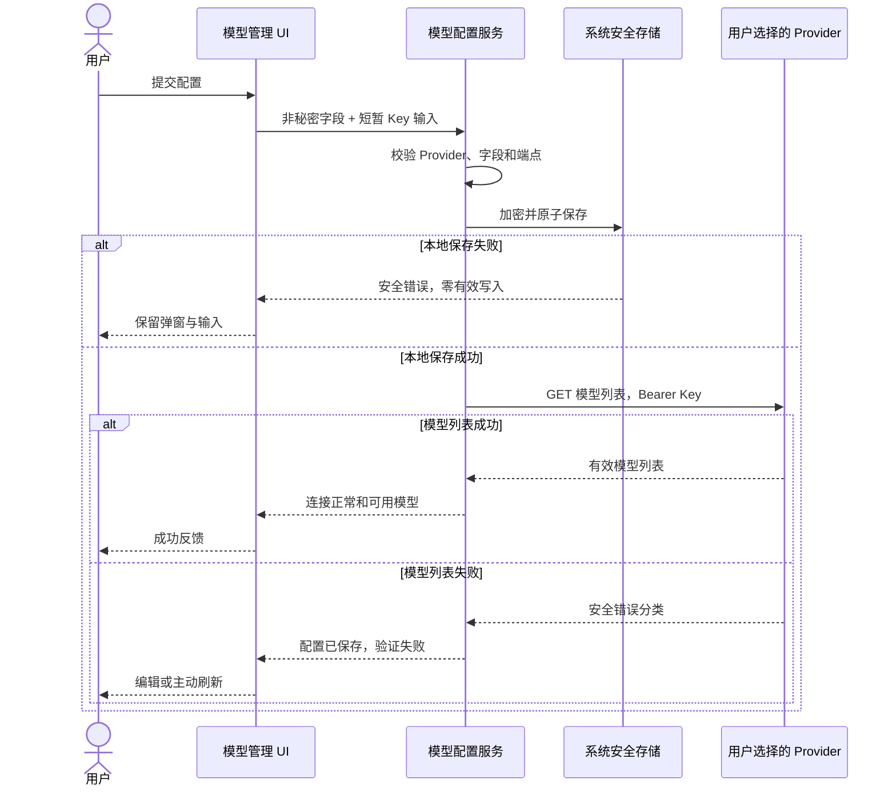
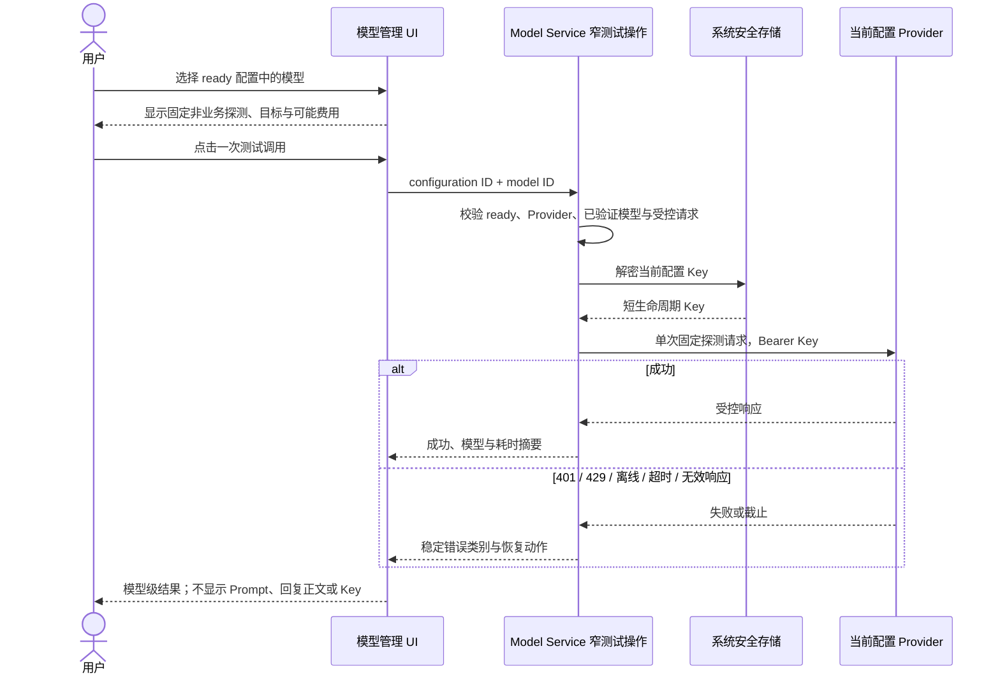

# 模型管理与自定义模型-REQ-0006-v1.0

## 1. 文档信息

| 项目 | 内容 |
| --- | --- |
| 需求名称 / 编号 / 版本 | 模型管理与自定义模型 / 模型管理与自定义模型-REQ-0006 / v1.0 |
| 文档状态 | DRAFT；需求内容完整，待产品负责人确认后转为 ACTIVE |
| 交互类型 | mixed |
| 提出人 | 产品负责人 |
| 编写负责人 | Codex |
| 审核人 | 产品负责人 |
| 创建 / 更新日期 | 2026-08-25 / 2026-08-25 |
| 关联产品需求 | [单素材分析-REQ-0005-v1.0](../单素材分析-REQ-0005/单素材分析-REQ-0005-v1.0.md) |
| 关联技术设计 | [模型接入与安全存储-DEV-0010-v1.0](../../development/模型接入与安全存储-DEV-0010-v1.0.md) |
| 关联任务 | APP-0012（DeepSeek 与 BYOK 基线）、APP-0016（自定义 OpenAI 兼容模型实现基线）、APP-0017（入口与两张原型）、APP-0018（本完整需求文档）、APP-0019（原型截图嵌入与映射修订）、APP-0020（官方 OpenAI 与显式模型测试调用） |
| 工作分支 | codex/req-0006-app-0020-openai-model-connectivity |
| base branch | codex/req-0006-app-0019-model-prototype-embedding |
| 发布单元 | macOS 客户端、Windows 客户端；不新增项目自建 backend |
| 上一版本 | 无，首次形成独立模型管理需求 |
| 变更摘要 | 在完整模型配置合同上增加官方 OpenAI 固定 Provider 与显式“测试调用”，保留自定义 OpenAI 兼容协议和保存 / 刷新零生成请求边界，并补齐费用、状态、恢复、无障碍与证据声明 |

本文档定义用户可观察的产品行为和验收边界。端点归一化、IPC、加密信封、适配器和原子写入等技术设计以 DEV-0010 为准；工程任务和测试结果只能证明特定实现，不能替代本文档。

## 2. 一句话摘要

拥有第三方模型账号和 API Key 的本地客户端用户，可以安全地添加、验证、编辑、刷新、选择和删除自己的模型配置，在知晓可能产生少量费用后显式测试所选模型能否完成一次受控调用，并在每次分析前明确选择模型，不被系统静默重试、路由或切换。

## 3. 背景与现状证据

Material 采用 BYOK（Bring Your Own Key）模式。用户需要自行承担第三方账号、Key、调用费用和数据处理关系，产品不提供共享 Key、代付或自建代理。若只有分析页的模型下拉框而没有完整管理能力，用户无法判断 Key 是否已安全保存、端点是否可用、模型列表来自何处、失败后是否仍可恢复，也无法可靠更新或删除凭据。

当前事实基线如下：

- APP-0012 已建立 DeepSeek 固定接入、模型服务、系统安全存储和安全错误语义。
- APP-0016 分支已包含“模型管理”页面、配置列表、添加 / 编辑弹窗、DeepSeek 和“自定义 OpenAI 兼容 API”两个固定 Provider、模型列表验证、`selectedModelId`、删除与乐观并发保护。当前 UI 将 `selectedModelId` 标为“默认模型”；本需求统一产品术语为“配置内首选模型”，并在后文列明当前实现差距。
- APP-0017 以 P-06 和 P-07 补充模型管理列表与添加弹窗原型，并确认唯一持久入口位于左侧栏底部“模型管理 / BYOK”。本独立需求将两图分别登记应用级别名 P-MM-01 和 P-MM-02，不移动或修改原图。
- APP-0020 在上述基线上增加固定 `openai` Provider 和受限的显式“测试调用”：官方 OpenAI 使用固定 `https://api.openai.com/v1`、Bearer Key、`GET /models` 与 `POST /responses`；用户填写的 `openai-compatible` 配置继续使用 `GET /models` 与 `POST /chat/completions`。测试调用不是保存、刷新或分析运行。
- 当前实现仍不是完整业务验收：开始分析尚未接通真实模型完成调用，模型完成能力未暴露到 renderer 可用的受限业务 IPC；真实 macOS Keychain、Windows DPAPI、安装升级与第三方自定义端点也尚未完成最终验收。
- 用户提供的参考图片只用于列表、弹窗和字段分组方向；其中的系统设置导航、供应商大全、Token Plan、Coding Plan、本地 JSON 路径、MiniMax 文案和品牌结构不是本产品需求。

因此，本需求既不能把参考图文字当成指令，也不能把当前代码状态写成已发布能力；它要形成后续实现、返工和双平台验收共同使用的产品真相。

## 4. 使用者与使用场景

### 4.1 主要使用者

- 模型配置维护者：拥有 DeepSeek 或 OpenAI 兼容服务账号和 API Key，负责理解费用、数据外发和账号风险，维护当前操作系统用户下的模型配置。
- 素材分析使用者：在新建分析时从已验证模型中明确选择“配置 + 模型”，不需要理解内部 Provider、Adapter 或凭据文件。

V1 默认二者是同一位本地用户，不设计管理员、团队成员、审批者或云端组织角色。操作系统登录用户是本地数据访问边界。

### 4.2 典型场景

1. 用户首次打开模型管理，没有配置，添加 DeepSeek Key，保存并通过模型列表验证。
2. 用户添加官方 OpenAI 配置，只填写配置名称和自己的 OpenAI API Key；客户端使用固定官方地址发现模型，不要求用户拼写 URL 或手填模型 ID，也不按 `sk-` 等前缀推断 Key 是否有效。
3. 用户使用自建或第三方 OpenAI 兼容服务，填写 HTTPS 地址、配置名称、Key 和准确模型 ID，验证后用于分析。
4. Key 失效、端点变化或模型列表变化时，用户编辑配置或执行“刷新模型”，看到明确状态并自行决定下一步。
5. 配置已连接正常且已有有效配置内首选模型时，用户在看到“会发送固定非业务探测文本且可能产生少量费用”的提示后点击“测试调用”，得到不含回复正文和 Key 的模型级成功或安全失败结果。
6. 用户在新建分析已填写素材、行业、产品和转化依据后进入模型管理，完成或取消操作，再经侧栏返回；原草稿不丢失。
7. 用户删除不再使用的配置和对应凭据；历史报告不被级联删除。
8. 用户离线打开页面，仍能查看本地配置摘要和删除配置，但联网验证或测试调用失败且不会自动重试。
9. 多窗口或过期页面尝试覆盖新配置时，系统拒绝旧写入并要求刷新。

### 4.3 环境、频率与前置条件

- macOS 和 Windows 桌面客户端，共享产品规则，分别进行系统安全存储和真实客户端验收。
- 用户可按账号或用途保存多个配置；配置维护是低频操作，分析前模型选择是高频操作。
- 新增和联网验证需要可用系统安全存储、用户自己的 API Key、可达网络和第三方服务。
- 本地配置查看、删除和新建分析草稿保留不依赖项目账号登录。

## 5. 目标与成功指标

### 5.1 产品目标

- 提供一个全应用唯一、可发现的模型管理入口。
- 让添加、编辑、验证、刷新、配置内首选模型和删除形成清晰、可恢复的闭环。
- 把“本地保存成功”和“第三方连接验证成功”区分为两个可观察结果。
- 让用户在发送数据和可能产生费用前知道发送目标、数据范围和模型选择。
- 让用户通过独立、显式、最多一次的固定探测请求区分“模型列表可读”和“所选模型当前可调用”，且不把探测结果误写成完整分析可用。
- 保证 API Key 不回显、不进入业务数据库、报告、导出、日志、任务记录或 Git。
- 保证模型失败后不自动重试、不切换配置、不切换模型。
- 保证模型管理往返不破坏新建分析草稿。

### 5.2 V1 可验证指标

| 指标 | V1 目标 | 测量方式 |
| --- | --- | --- |
| 入口唯一性 | 全应用持久模型管理入口数量为 1 | MM-AC-01 |
| CRUD 原子性 | 取消、关闭、字段失败、删除取消和版本冲突造成的意外写入数量为 0 | MM-AC-08～MM-AC-13、MM-AC-24～MM-AC-27 |
| 凭据安全 | SQLite、配置摘要、日志、报告、导出、任务记录和 Git 中 API Key 哨兵命中数为 0 | MM-AC-30～MM-AC-32 |
| 验证透明度 | 每次保存或刷新发起的生成请求数量为 0；用户能区分待验证、连接正常和验证失败 | MM-AC-14～MM-AC-18、MM-AC-29 |
| 模型测试可控性 | 每次显式测试最多调用一次该配置的有效首选模型；隐式测试、自动重试、自动切换、素材外发和正文展示数量均为 0 | MM-AC-41～MM-AC-46 |
| 用户选择权 | 每次分析自动切换、自动重试或未经选择自动开始次数为 0 | MM-AC-20～MM-AC-23 |
| 草稿保持 | 模型管理往返后素材、行业、产品和转化依据丢失数为 0 | MM-AC-02 |
| 失败恢复 | 网络、鉴权、余额、限流、超时、无效响应、存储不可用和并发冲突均有明确恢复动作 | MM-AC-05～MM-AC-06、MM-AC-15、MM-AC-27～MM-AC-29 |
| 无障碍 | 弹窗可仅用键盘完成，焦点不逃逸，错误和状态可被辅助技术感知 | MM-AC-33～MM-AC-34 |
| 兼容回退 | 旧 DeepSeek 配置升级可读；旧版遇到自定义配置不得删除其密文或历史摘要 | MM-AC-35～MM-AC-36 |

“连接正常”只表示模型列表接口在本次检查中成功。“测试调用成功”只表示指定模型对本次固定探测请求返回了可接受响应；二者都不等同于余额持续充足、价格已知、生成质量合格、结构化业务输出正确或完整分析链路已验收。

## 6. 非目标

V1 不提供：

- 供应商商城、供应商大全、Token Plan、Coding Plan、套餐推荐或自动读取供应商价格。
- MiniMax、腾讯云、Kimi 等参考图供应商预置；V1 只固定预置 DeepSeek 和官方 OpenAI，其他兼容服务统一走一个自定义 OpenAI 兼容入口。
- 任意 Provider 名称、任意协议、任意 Header、查询参数鉴权、非 Bearer 鉴权、OAuth、代理中转或分别填写模型列表与完成地址。
- 本地 JSON 配置文件浏览、编辑、导入或导出。
- 项目共享 Key、团队权限、云同步、跨设备同步、账号代购、代付或托管 Key。
- 自动路由、竞价、按价格选择、自动降级、自动重试或静默切换。
- 保存、保存后验证或“刷新模型”时调用生成接口；生成式验证只能由用户另行点击“测试调用”，且不扩展为质量评分或结构化业务输出能力探测。
- 流式输出、工具调用、图片 / 视频 / 音频原始媒体直传或多模态能力配置。
- 模型内容审核、供应商合规认证、数据地域承诺或第三方服务可用性担保。
- 凭据文件系统级不可恢复擦除承诺、回收站或撤销删除。
- 仅凭本需求文档宣称完整分析调用、双平台真机、安装包或生产发布已经完成。

## 7. 范围

### 7.1 产品包含范围

- 左侧栏底部唯一“模型管理 / BYOK”入口和模型管理页。
- 系统安全存储状态、加载、空列表、配置列表和读取失败。
- DeepSeek 固定 Provider、官方 OpenAI 固定 Provider 与自定义 OpenAI 兼容 Provider。
- 新增 / 编辑条件字段、字段校验、API Key 显隐和零写入取消。
- 本地安全保存、模型列表验证、部分成功、状态和恢复。
- 模型发现、手填模型合并、配置内首选模型和最近检查时间。
- 刷新模型、显式测试调用、删除确认、并发冲突和历史报告边界。
- 新建分析只使用已验证配置，每次显式选择，不自动开始或切换。
- 离线、超时、鉴权、余额、限流、服务、响应和安全存储错误。
- 数据外发、费用提示、日志脱敏、兼容、迁移、回退和无障碍要求。

### 7.2 当前 APP-0018 / APP-0019 文档任务范围

APP-0018 只新增本 REQ-0006，并修改 `docs/requirements/README.md`、单素材分析 REQ-0005、DEV-0010 与任务治理记录。不修改其他需求、应用代码、测试、原型图片、凭据文件、SQLite、分析编排、安装包或第三方服务。

APP-0019 只调整本需求中两张既有原型截图的嵌入位置、图注和需求映射，不修改图片像素、产品行为、功能范围或其他文档。

APP-0020 修改 Provider、Model Service、窄 IPC、模型管理 UI、自动化测试和本需求对应技术 / 排障文档，只实现官方 OpenAI 与显式模型测试调用；不接通“开始分析”到模型服务的完整业务链路，不修改分析模板、证据组装、报告 schema、记录保存、产品库或媒体解析。

### 7.3 排除范围

第 6 节事项全部排除。任何新增鉴权方式、共享或云同步 Key、项目自建代理、付费服务、不可兼容迁移、自动切换或媒体直传都必须另立需求，并在费用、数据外发、安全或迁移决定点由用户确认。

## 8. 前置与后置依赖

### 8.1 前置依赖

- Electron 桌面客户端可以调用当前操作系统提供的安全加密能力；不可用时必须失败关闭。
- DeepSeek 与自定义 Provider 能提供 OpenAI 兼容的模型列表和非流式 Chat Completions；官方 OpenAI 能提供 Models 与 Responses API。自定义端点至少需要模型列表接口返回一个有效模型。
- 用户拥有合法 API Key，并自行满足供应商账号、余额、地域、网络和使用条款。
- [单素材分析-REQ-0005-v1.0](../单素材分析-REQ-0005/单素材分析-REQ-0005-v1.0.md)负责新建分析、显式模型选择和分析记录；本需求不定义报告内容。

### 8.2 外部依赖与产品影响

| 依赖 | 用户承担或可见影响 | 产品边界 |
| --- | --- | --- |
| 第三方模型账号 | 注册、Key、余额、费率、限流和服务条款 | 客户端不代购、不代付、不保证费率 |
| 用户填写的端点 | 数据可能离开设备并由端点运营方处理 | 保存前说明目标和外发范围 |
| 本地操作系统安全能力 | Keychain、DPAPI 等可能被锁定或拒绝授权 | 仍可读取非秘密摘要，并在信封可写时确认删除；禁止保存、解密、刷新和调用，不回退明文 |
| 网络 | 模型列表和分析调用可能超时或失败 | 本地摘要与草稿仍可用，不自动重试 |
| Provider 停服或协议变化 | 对应配置不可用 | 不删除配置、Key 或历史报告，由用户编辑或删除 |

### 8.3 后置依赖

- 单素材分析和后续业务模块只能消费“配置 ID + 已验证模型 ID”的稳定选择，不得直接读取 Key。
- 新增 Provider 必须声明字段、鉴权、数据目的地、能力、错误、费用和回退，并单独验收。
- 真实分析接线、双平台系统安全存储和安装升级验收由后续实现或整合任务完成。

## 9. 假设和未决事项

当前没有阻断 V1 文档完成的未决事项。以下结构化表同时登记已确认假设、推荐默认值和后续未决事项；后续 Provider 或协议扩展不能反向改变以下已确认边界。

| ID | 类型 | 内容 | 影响 / 推荐默认值 | 可逆性与最迟决定阶段 |
| --- | --- | --- | --- | --- |
| MM-A-01 | 已确认 | V1 只有 DeepSeek、官方 OpenAI 和自定义 OpenAI 兼容三类接入 | 不建设供应商目录 | 已确认 |
| MM-A-02 | 已确认 | 模型配置只属于当前操作系统用户 | 不登录、不共享、不云同步 | 已确认 |
| MM-A-03 | 已确认 | API Key 使用系统安全能力保护 | 安全能力不可用时对凭据保存、解密与调用失败关闭；初始任务摘要中的“拒绝读取”专指凭据读取，不禁止无需解密的非秘密摘要与确认删除 | 已确认 |
| MM-A-04 | 已确认 | 保存 / 刷新只做模型列表验证 | 不发起生成，不自动产生分析 | 已确认 |
| MM-A-05 | 已确认 | 每次分析显式选择配置和模型 | 配置内首选模型仅用于候选排序，不自动预选或启动分析 | 已确认 |
| MM-A-06 | 已确认 | 任何模型错误都不自动重试或切换 | 由用户决定重试、编辑、换模型或退出 | 已确认 |
| MM-A-07 | 推荐默认 | 配置名称允许重复 | 名称只是显示字段，配置 ID 才是身份；UI 建议用户使用可区分名称 | 可逆；若改为唯一需迁移前决定 |
| MM-A-08 | 推荐默认 | 自定义模型仍要求有效模型列表接口 | 只有完成接口的端点不在 V1 兼容范围 | 可逆；新增 Adapter 前决定 |
| MM-A-09 | 已确认 | 普通卸载默认保留本地模型配置与密文 | 显式“删除本地数据 / 凭据”必须单独说明并由用户确认；安装器无法询问时不自动删除 | 保留可逆；清理不可逆且每次需确认 |
| MM-A-10 | 已确认 | 生成式连通性检查是独立的显式“测试调用” | 仅 ready 配置的有效 `selectedModelId` 可执行；固定非业务文本、最多一次调用、可能产生少量费用、无自动重试 / 切换；不接通完整分析 | 已确认 |
| MM-O-01 | 后续未决 | 是否预置更多供应商 | 必须核对账号、费用、数据、协议、许可和停服风险 | 不影响 V1；新增需求前 |
| MM-O-02 | 后续未决 | 是否支持凭据导入导出或跨设备迁移 | 默认不支持，避免秘密外泄与不可解释恢复 | 高风险；独立需求前 |

## 10. 功能明细与业务规则

### 10.1 术语、对象与状态

- Provider：产品注册的接入类型。V1 为 DeepSeek、官方 OpenAI 和自定义 OpenAI 兼容 API。
- 模型配置：一个 Provider、一组非秘密字段、一份受保护 Key、一次连接状态和可用模型快照的组合。
- 可用模型：最近一次成功模型列表验证返回并通过格式校验的模型，加上符合合并规则的用户手填模型。
- 配置内首选模型：该配置的偏好元数据；仅在新建分析候选中将该模型排在同配置其他模型之前，不是应用全局默认，也不会自动预选或启动分析。当前原型 / UI 的“默认模型”是过渡标签，后续应改为“首选模型”。
- 当前分析选择：用户在本次分析中显式选择的“配置 ID + 模型 ID”，与配置内首选模型分离。

| 状态 | 含义 | 是否进入新建分析模型列表 | 恢复 |
| --- | --- | --- | --- |
| 待验证 | 新建或关键连接字段已变化，尚无本次成功检查 | 否 | 保存并验证或刷新模型 |
| 连接正常 | 最近一次模型列表检查成功 | 是 | 可选择、刷新、编辑或删除 |
| 验证失败 | 最近一次检查失败或响应无效 | 否 | 根据安全错误编辑、重试或删除 |
| Provider 不可用 | 当前版本缺少原配置的 Provider | 否 | 升级恢复 Provider，或删除配置 |
| 已删除 | 配置和密文已按用户确认删除 | 否 | V1 无撤销；历史报告仍可读 |

配置连接状态与模型级测试状态是两组独立事实。测试状态仅针对用户这一次显式选择的模型，不替换模型列表快照，不改变配置 `ready / error`，也不成为分析已接通的证据：

| 模型级测试状态 | 含义 | 用户可执行操作 | 恢复 |
| --- | --- | --- | --- |
| 未测试 | 当前会话尚未对配置内首选模型发起测试调用 | ready 且 `selectedModelId` 有效时可测试 | 无需恢复 |
| 测试中 | 已发出本次唯一探测请求，等待完成 | 等待；按钮保持禁用，不能重复提交 | 请求结束后进入成功或失败 |
| 测试成功 | 指定模型对固定探测文本返回可接受响应 | 可结束或再次由用户显式测试 | 不代表完整分析可用 |
| 测试失败 | 本次调用被鉴权、限流、离线、网络、服务、超时或响应校验拒绝 | 编辑 Key、检查账号 / 网络后由用户再次测试 | 不自动重试、切换或修改连接状态 |

### 10.2 唯一入口、列表与返回（MM-FR-01～MM-FR-02）

1. 全应用唯一持久入口位于左侧栏底部，显示“模型管理 / BYOK”；新建分析页只显示不可用原因和入口提示，不增加第二个可点击入口。
2. 模型管理页没有页面级关闭按钮，也不自动返回。用户通过侧栏进入其他业务页面。
3. 从新建分析进入模型管理不视为取消分析草稿。素材会话、行业、产品和转化依据由应用顶层保留。
4. 页面头部显示 BYOK 说明、系统安全存储状态、验证边界和“添加模型”。
5. 列表按最近更新时间倒序显示配置名称、Provider、状态、Key 已受保护摘要、自定义地址、自定义模型 ID、最近检查时间、配置内首选模型和可用操作。
6. API Key 明文、密文、完整请求、Prompt 和供应商原始错误正文都不得出现在列表。
7. Provider 暂时不可用时仍显示可删除的非秘密摘要，编辑和调用不可用。

#### 10.2.1 P-MM-01 模型管理列表原型截图

*图 1：模型管理列表正常态。该截图直接参与 MM-FR-01、MM-FR-02、MM-FR-07、MM-FR-08 和 MM-FR-10 的界面说明。*

| 截图中的可见元素 | 用于说明的需求 | 关联行为验收（仍需独立证据） |
| --- | --- | --- |
| 左侧栏底部“模型管理 / BYOK” | 唯一持久入口、无页面级关闭、通过侧栏返回 | MM-AC-01～02 |
| “系统安全存储可用”状态 | 正常态显示安全能力；列表只展示 Key 已保护摘要 | MM-AC-04、MM-AC-06、MM-AC-32 |
| “验证边界”说明 | 保存和刷新只验证模型列表，不代表生成、余额或费率可用 | MM-AC-14、MM-AC-18、MM-AC-30 |
| 配置卡片、连接状态和最近检查时间 | 正常列表态展示非秘密配置摘要和最近验证结果 | MM-AC-04、MM-AC-14 |
| 图中“默认模型”（合同术语为“配置内首选模型”） | 过渡 UI 标签仅影响本配置候选排序，不替用户选择分析模型 | MM-AC-19～21 |
| 刷新模型、编辑、删除 | 提供显式操作入口；结果状态与确认过程不由截图证明 | MM-AC-16、MM-AC-24～29 |

该图是 APP-0017 放在 REQ-0005 assets 中的 P-06，本需求登记应用级别名 P-MM-01，不复制或修改原图。它只证明正常列表态的信息层级和当时已有操作位置；APP-0020 新增的“测试调用”和模型级结果没有出现在该截图中，必须以 10.8.1、状态表和 MM-AC-41～MM-AC-47 的运行证据验收。加载、空列表、读取失败、安全存储不可用、验证失败、删除确认、并发冲突及首选模型消费语义仍以状态表、正文和行为验收为准。

### 10.3 Provider 与字段合同（MM-FR-03～MM-FR-05）

| 字段 | DeepSeek | 官方 OpenAI | 自定义 OpenAI 兼容 API | 新增 / 编辑规则 |
| --- | --- | --- | --- | --- |
| Provider | 必填，固定官方接入 | 必填，固定官方接入 | 必填，通用兼容接入 | 新增可选；编辑时不可更换，需更换则新建配置 |
| 配置名称 | 必填 | 必填 | 必填 | 去除首尾空白后 1～80 字符；拒绝控制字符；允许重名但不作为身份 |
| API Key | 必填 | 必填 | 必填 | 新增为 8～512 字符且不得含任何空白或控制字符；按输入原样校验，不静默裁剪首尾空白；编辑永不回显，留空保留原 Key；不以 `sk-` 或其他供应商前缀代替真实鉴权验证 |
| API 地址 | 不显示、不可编辑 | 不显示，固定 `https://api.openai.com/v1` | 必填 | 自定义最长 2048 字符；可填 Base URL 或完整 `/chat/completions` 地址 |
| 模型 ID | 不显示，由列表发现 | 不显示，由列表发现 | 必填 | 自定义值为 1～128 字符；首字符为字母或数字，其余只允许字母、数字、点、下划线、冒号、斜杠和连字符 |
| 配置内首选模型 | 验证成功后可选 | 验证成功后可选 | 验证成功后可选 | 只能从该配置最近成功的可用模型中选择 |

官方 OpenAI 的地址由产品固定，不接受用户覆盖，也不与自定义地址归一化规则混用；模型列表固定使用 `GET https://api.openai.com/v1/models`，显式测试调用固定使用 `POST https://api.openai.com/v1/responses`，两者都使用 `Authorization: Bearer <API Key>`。自定义 OpenAI 兼容 API 继续遵循下列地址规则，并继续通过 `/chat/completions` 发起非流式完成请求。

自定义 API 地址必须满足：

1. 远端地址只允许 HTTPS；HTTP 只允许 localhost、127.0.0.1 或 ::1 回环主机。
2. URL 用户名、密码、query、hash 和非 HTTP(S) 协议在任何网络请求之前拒绝。
3. 接受 Base URL 或完整 /chat/completions 地址；保存后展示规范化 Base URL 供用户核对。
4. 模型列表和完成地址必须共享同一 Base URL；V1 不允许分别填写。
5. 验证请求只向用户填写并确认的初始目标发送。若初始目标返回重定向，客户端不跟随 `Location`、不向跳转目标转发 Authorization，并将本次验证安全失败。

字段错误显示在弹窗内并与对应字段关联；保存按钮只在安全存储可用、Provider 存在、所有当前可见必填字段满足基础条件时启用。提交后发现的服务端校验错误不得清空用户输入，焦点应移到错误摘要或首个错误字段。

### 10.4 新增、编辑、取消和 Key 显隐（MM-FR-03～MM-FR-04）

1. 新增和编辑均使用模态弹窗；标题、说明、字段标签、错误、取消、保存和关闭语义可被辅助技术识别。
2. 切换三个 Provider 时按能力显示或隐藏 API 地址和模型 ID，并清空不适用于新 Provider 的未保存条件字段；DeepSeek 与官方 OpenAI 都隐藏地址和手填模型 ID，自定义 Provider 才显示二者。
3. 编辑弹窗预填非秘密字段，不预填 Key；Key 留空保留原凭据，填写新 Key 才替换。
4. “显示 / 隐藏”只影响当前输入框视觉状态；关闭、取消或保存结束后恢复隐藏并清空输入态。
5. 点击取消、关闭、遮罩或 Escape 在未保存时均零写入；保存进行中禁用关闭和重复提交。
6. 关闭弹窗后焦点返回触发按钮；Tab / Shift+Tab 不得逃出弹窗。

#### 10.4.1 P-MM-02 添加自定义模型弹窗原型截图

*图 2：添加自定义 OpenAI 兼容模型正常态。该截图直接参与 MM-FR-03～MM-FR-06 的字段、取消和保存交互说明。*

| 截图中的可见元素 | 用于说明的需求 | 关联行为验收（仍需独立证据） |
| --- | --- | --- |
| Provider 选择 | 截图展示 APP-0017 当时的 DeepSeek 与自定义 OpenAI 兼容 API；APP-0020 增加的官方 OpenAI 选项由字段合同和运行测试证明，不由旧截图证明 | MM-AC-07、MM-AC-41 |
| API 地址、配置名称、API Key、模型 ID | 字段显隐、格式、安全端点和编辑留空保留 Key 合同 | MM-AC-08～11 |
| Key 密码态与显隐按钮 | 默认隐藏、仅影响当前输入、关闭后清空输入态 | MM-AC-09、MM-AC-12、MM-AC-33 |
| 取消、右上角关闭和模态遮罩 | 未保存关闭均零写入并恢复焦点 | MM-AC-12～13、MM-AC-33～34 |
| “保存并验证”与底部验证说明 | 先安全保存，再只请求一次模型列表；部分成功必须可见 | MM-AC-13～15、MM-AC-30 |

该图是 APP-0017 放在 REQ-0005 assets 中的 P-07，本需求登记应用级别名 P-MM-02。它只证明自定义 OpenAI 兼容 Provider 的新增正常态字段分组和底部操作；Provider 切换后的 DeepSeek / 官方 OpenAI 条件字段、编辑模式、字段错误、部分成功、焦点与键盘要求仍以正文和行为验收为准。用户参考图中的其他产品导航、供应商清单和 JSON 路径不进入本需求。

### 10.5 保存并验证与部分成功（MM-FR-06）

新建配置，或编辑 Key、地址、手填模型 ID 等连接字段时，“保存并验证”是用户可见的两阶段操作：先安全保存本地配置，再执行一次模型列表验证。结果不得被合并为模糊的“保存失败”。只修改配置名称或首选模型属于本地元数据保存，不发起网络验证。

| 阶段结果 | 本地配置 | 连接状态 | 弹窗 | 用户反馈与恢复 |
| --- | --- | --- | --- | --- |
| 本地字段或端点校验失败 | 零写入 | 原状态不变 | 保持打开 | 保留输入，定位错误后重试或取消 |
| 系统安全存储或原子写入失败 | 零有效写入，不覆盖旧配置 | 原状态不变 | 保持打开 | 显示安全错误，可重试或取消 |
| 本地保存成功，模型列表成功 | 已保存 | 连接正常 | 关闭 | 显示发现数量，刷新列表 |
| 本地保存成功，模型列表失败 | 已保存并保留密文 | 验证失败 | 关闭 | 明确“配置已安全保存但验证失败”，可编辑或刷新模型 |
| 并发版本冲突 | 不覆盖较新配置 | 以重新加载结果为准 | 保持打开 | 保留本次非秘密输入和当前会话 Key 输入，提示先取消；取消后页面加载最新版本，用户再重新打开编辑，不提供强制覆盖 |

保存连接字段后只允许一次模型列表请求，不调用完成接口，不发送素材、Prompt、报告或分析上下文，不自动开始分析。Key、地址或手填模型 ID 变化后，旧可用模型、旧首选模型和旧成功状态立即失效；只修改配置名称或从最近成功快照中修改首选模型时，保留原连接状态与快照。

### 10.6 模型发现、合并和连接状态（MM-FR-06～MM-FR-07）

1. 模型列表验证使用当前配置和 Key，最长等待 30 秒；超时、失败或无效响应不自动重试。
2. 返模型项先丢弃无效 ID，再按 ID 精确去重并按字典序排序；过滤后为 0 个，或与手填模型合并后超过 200 个时验证失败；响应正文上限 4 MiB。
3. 自定义配置的手填模型 ID与发现结果精确去重合并；但模型列表至少返回一个有效模型，不能只靠手填值伪装验证成功。
4. 成功时更新可用模型、连接状态和最近检查时间；失败时配置标记为验证失败，并立即退出新建分析可选范围。
5. 失败后即使本地仍保留旧快照用于诊断，也不得沿用旧模型发起新调用。
6. “连接正常”不得被解释成完成权限、余额、价格、输出格式或分析质量已经验证。

### 10.7 配置内首选模型与分析选择（MM-FR-08～MM-FR-09）

1. 配置内首选模型是每个配置自己的偏好字段，不是全应用默认配置。
2. 自定义配置首次验证成功且尚无偏好时，手填模型 ID 成为首选模型；DeepSeek 尚无偏好时，采用排序后的第一个发现模型。用户可从最近成功快照中显式修改。
3. 刷新后原首选模型不再可用时清空首选值，不按列表顺序替换。
4. 新建分析将每个配置的首选模型排在该配置其他模型之前，但选择值仍为空；用户每次必须明确选择配置和模型，不因新增、刷新或修改首选模型而替换当前分析选择。
5. 当前分析选择失效时只清空模型选择；素材、行业、产品和转化依据保持不变，不自动开始分析。

### 10.8 刷新模型、离线与恢复（MM-FR-07、MM-FR-11）

1. “刷新模型”使用已保存 Key 执行一次模型列表请求，规则与保存后验证相同；按钮名称只表达模型列表刷新，并明确为零 completion。
2. 页面离线时仍可读取本地摘要、打开编辑弹窗、本地保存配置名称或首选模型，以及删除配置；新建或连接字段变化会安全落盘后尝试一次模型列表，网络失败时形成明确的部分成功状态。
3. 网络恢复后由用户主动点击“刷新模型”或再次保存；系统不后台轮询、不自动重试。
4. 加载配置失败显示独立错误和“重新加载”，不得伪装为空列表。
5. 安全存储不可用时显示准确状态：可查看摘要、打开弹窗查看非秘密字段，并在密文信封可写时确认删除；禁止新增 / 编辑保存、凭据解密、刷新和模型调用，不得回退为明文。

### 10.8.1 显式测试调用（MM-FR-13）

1. “测试调用”与“刷新模型”是两个独立按钮和状态：前者发起一次可能计费的生成请求，用于检查当前配置内首选模型能否完成固定探测；后者仍只刷新模型列表、零生成请求。保存和保存后验证也不得暗中触发测试调用。
2. 只有配置状态为连接正常、Provider 已注册、系统安全存储可用，且该配置已有用户显式设置并仍属于最近成功快照的配置内首选模型（`selectedModelId`）时，“测试调用”才可执行。请求必须严格绑定该 configuration 与 `selectedModelId`；缺少任一条件时按钮禁用，并以文字或可访问说明给出原因，客户端不得替用户自动选择或接受另一个 model ID。
3. 发起前页面明确显示配置 / Provider / 模型目标、会发送固定非业务探测文本、不发送素材或分析上下文，以及本次请求可能由用户的第三方账号产生少量费用。用户点击按钮即只确认这一次探测，不授权分析运行、后台轮询或后续自动请求。
4. 服务只发送版本固定、不可由 renderer 或用户改写的非业务文本探测，固定最大输出为 128 tokens；不发送素材、产品信息、行业、转化依据、分析草稿、报告、历史消息、工具、文件或原始媒体。测试 API 是窄的 configuration ID + model ID 操作，不暴露任意 Prompt IPC。
5. 每次点击最多向当前 Provider 和模型发出一次请求。官方 OpenAI 使用 `POST /responses`；DeepSeek 与自定义 OpenAI 兼容 Provider 使用各自受控的 `POST /chat/completions`。失败、超时或取消都不自动重试，不切换配置、Provider 或模型，也不再发第二个完成请求。
6. 测试中显示模型级忙碌状态并禁止重复提交。成功只显示“测试调用成功”、Provider / 配置、requestedModelId、providerReturnedModelId、耗时和时间等非秘密摘要；Provider 返回模型 ID 与请求 ID 不同时明确提示用户核对，不用其中一个覆盖另一个，也不把差异称为客户端自动切换。失败只显示稳定错误类别与恢复动作。无论成功或失败，都不向 renderer、页面、日志、审计、报告、导出或持久化配置返回或保存固定探测文本、模型回复正文、原始响应、API Key 或 Authorization Header。
7. 官方 OpenAI `/responses` 只有 `status === completed`、`error` 和 `incomplete_details` 均为空且提取到非空输出时才算成功；alias 解析后的 `response.model` 可与 requestedModelId 不同并按上一条原样报告。其他 Provider 也必须通过各自受控成功状态与非空正文校验，不能把 HTTP 2xx 或空响应直接显示为成功。
8. 测试调用固定 60 秒超时；`401` 映射为鉴权失败，`429` 映射为限流 / 账号额度类安全错误，离线或连接失败映射为网络不可用，达到 60 秒截止时间映射为超时。页面不透传供应商错误正文；恢复必须由用户更新 Key、处理账号、恢复网络或等待后再次显式点击测试。
9. 测试成功或失败均不修改配置的模型列表连接状态、可用模型快照或首选模型，也不使“开始分析”可用；它只形成当前配置内首选模型的独立测试结果。完整分析接线仍由 10.12 和后续任务验收。

### 10.9 删除与影响边界（MM-FR-10）

1. 删除前显示准确配置名称，并明确对应 API Key 一并删除。
2. 取消确认零变化；删除失败保留配置并显示可重试错误。
3. 删除成功立即使配置和模型不可用于新任务，并移除配置元数据与受保护凭据；V1 无回收站和撤销。
4. 删除不级联删除历史分析记录、报告、反馈、导出或素材引用。历史记录只保留当次非秘密模型摘要。
5. 若当前分析选中被删除配置，只清空模型选择并保留其他草稿。
6. 产品不承诺文件系统级安全擦除；备份或操作系统快照中的历史密文由平台恢复策略控制。

### 10.10 错误分类与用户恢复（MM-FR-11）

| 错误 | 用户可见含义 | 自动行为 | 恢复 |
| --- | --- | --- | --- |
| 输入无效 / 端点被拒绝 | 字段或地址不满足规则 | 不发送 Key、不写入 | 修改字段 |
| API Key 无效或失效（含 `401`） | 第三方拒绝鉴权 | 不重试、不切换 | 更新 Key，再由用户显式刷新或测试 |
| 余额不足 | 账号不能继续服务 | 不充值、不切换 | 用户处理账号后主动刷新 |
| 限流 / 账号额度（含 `429`） | 请求过多、当前额度或账号限制 | 不自动等待重试 | 用户处理账号或稍后主动刷新 / 测试 |
| 网络不可用 / 离线 | 无法连接目标 | 不后台轮询 | 检查网络后主动刷新或测试 |
| 服务不可用 | 第三方失败 | 不自动降级 | 稍后主动重试或编辑 |
| 超时 | 模型列表未在 30 秒内完成，或测试调用未在 60 秒内完成 | 取消本次请求 | 用户主动刷新或测试 |
| 响应无效 | 模型列表为空、超限或结构不兼容 | 标记验证失败 | 联系供应商或更换受支持端点 |
| Provider 不支持 | 当前版本缺少适配器 | 禁止编辑和调用 | 升级或删除 |
| 配置不存在 / 已删除 | 页面状态过期 | 不重建 | 重新加载 |
| 配置已变化 | 其他窗口已有更新 | 不覆盖 | 重新加载后再编辑 |
| 安全存储不可用 | 系统保护能力不可用 | 失败关闭 | 解锁、授权或修复系统能力 |

页面只显示安全归一化错误，不透传供应商原始错误正文、Authorization Header、Key、完整请求或响应正文。

### 10.11 并发、重复操作和一致性（MM-FR-12）

- 编辑、配置内首选模型修改、连接状态刷新和删除都必须基于用户打开页面时看到的配置版本。
- 版本过期时拒绝覆盖，重新加载后再由用户决定；不得采用最后写入者静默覆盖。
- 保存、刷新和删除进行中禁用冲突操作；双击保存最多形成一项有效配置或一次有效更新。
- 原子写入失败不得留下半条配置或空凭据；损坏的凭据存储保留原文件并失败关闭，不自动重建空库覆盖用户数据。
- 弹窗保存发生版本冲突时保持打开，不清空本会话的非秘密输入或 Key 输入；用户取消后页面加载最新版本，重新打开编辑，不自动合并或强制覆盖。卡片上的刷新、首选修改或删除冲突则直接刷新列表并要求用户重新操作。

### 10.12 分析消费合同与当前实现限制（MM-FR-09、MM-NFR-03）

- 新建分析只列出连接正常配置的可用模型，显示“配置名称 · 模型 ID”。
- 分析调用必须绑定准确配置 ID 和模型 ID；模型不在该配置最近成功列表中时直接失败。
- 模型错误后不得自动重试、切换配置、切换模型或产生第二次完成调用。用户可主动重试、编辑配置或选择其他模型后重新开始。
- 分析开始前要让用户看到模型目标、可能外发的数据类别和费用由第三方账号承担；V1 不写死价格。
- 首版只向模型发送文本消息和结构化证据，不直接上传原始视频、图片或音频。
- APP-0016 当前只完成模型管理和内部完成服务基线；开始分析按钮和受限完成调用尚未形成真实端到端证据，后续任务不得把“页面可选模型”当成“分析调用已完成”。
- APP-0020 暴露的只是固定探测文本的窄“测试调用”，不能提交业务 Prompt，也不能由分析页调用；即使真实 OpenAI smoke 成功，也不能把测试探测改写成完整分析接线已完成。
- 本需求还有未由 APP-0016 实现的产品差距：未知 Provider 尚未派生“Provider 不可用”并完全退出新建分析候选；纯名称编辑仍会重新请求模型列表；首选模型未影响候选排序；安全存储不可用时仍可修改 `selectedModelId`；Key 输入上限和首尾空白处理未对齐 8～512 / 任何空白拒绝；字段级错误关联与错误焦点尚未完成。这些项目只能在后续代码任务验证通过后改为已满足。

### 10.13 需求编号与追踪摘要

| 编号 | 产品要求 | 主要章节 | 主要验收 |
| --- | --- | --- | --- |
| MM-FR-01 | 唯一入口、手动返回和草稿保留 | 10.2、11.1 | MM-AC-01～MM-AC-02 |
| MM-FR-02 | 加载、空态、列表摘要和读取失败 | 10.2、11.4～11.5 | MM-AC-03～MM-AC-05 |
| MM-FR-03 | 新增配置和 Provider 条件字段 | 10.3～10.4 | MM-AC-07～MM-AC-11 |
| MM-FR-04 | 编辑配置、Key 不回显和留空保留 | 10.3～10.4 | MM-AC-09、MM-AC-12 |
| MM-FR-05 | 字段、模型 ID和不安全地址校验 | 10.3 | MM-AC-08～MM-AC-11 |
| MM-FR-06 | 本地保存、联网验证和部分成功 | 10.5～10.6 | MM-AC-13～MM-AC-18 |
| MM-FR-07 | 刷新模型、模型合并和最近检查 | 10.6、10.8 | MM-AC-16～MM-AC-18 |
| MM-FR-08 | 配置内首选模型语义 | 10.7 | MM-AC-19～MM-AC-20 |
| MM-FR-09 | 新建分析可用性和失效处理 | 10.7、10.12 | MM-AC-20～MM-AC-23 |
| MM-FR-10 | 删除确认、失败和历史报告边界 | 10.9 | MM-AC-24～MM-AC-26 |
| MM-FR-11 | 离线、鉴权、网络、超时和安全存储恢复 | 10.8、10.10 | MM-AC-05～MM-AC-06、MM-AC-28～MM-AC-29 |
| MM-FR-12 | 并发版本、重复操作和原子一致性 | 10.11 | MM-AC-13、MM-AC-27 |
| MM-FR-13 | ready + 有效配置内首选模型的显式测试调用、模型级状态和恢复 | 10.8.1、11.5 | MM-AC-42～MM-AC-46 |
| MM-NFR-01 | 凭据安全、秘密禁入和失败关闭 | 13～14 | MM-AC-06、MM-AC-30～MM-AC-32 |
| MM-NFR-02 | 端点安全、最小外发和隐私说明 | 10.3、14 | MM-AC-10、MM-AC-30～MM-AC-31 |
| MM-NFR-03 | 费用边界、零生成验证、无自动重试 / 切换 | 10.5、10.12、16.3 | MM-AC-14～MM-AC-18、MM-AC-22～MM-AC-23 |
| MM-NFR-04 | 键盘、读屏、焦点和状态感知 | 11.6 | MM-AC-33 |
| MM-NFR-05 | 窄屏、缩放、性能和可靠性 | 11.6、16 | MM-AC-03、MM-AC-28、MM-AC-34 |
| MM-NFR-06 | 旧配置兼容、迁移、回退、双平台与证据声明边界 | 15、18、20 | MM-AC-35～MM-AC-40 |
| MM-NFR-07 | 官方 OpenAI 协议、最小探测、秘密 / 正文禁入和 fake / live 证据真实性 | 10.3、10.8.1、14～15、20 | MM-AC-41、MM-AC-43～MM-AC-47 |

## 11. 用户流程与交互（UI 必填）

### 11.1 主流程

### 11.2 编辑、刷新、测试调用与删除

### 11.3 原型索引与使用边界

两张原型截图不再只作为本节的集中式追踪附件，而是嵌入其直接约束的功能规则旁边：

| 应用级编号 | 历史编号 | 正文嵌入位置 | 直接用于说明 |
| --- | --- | --- | --- |
| P-MM-01 | P-06 | 10.2.1 | 唯一入口、模型管理列表、配置摘要、状态、首选模型和卡片操作 |
| P-MM-02 | P-07 | 10.4.1 | 新增弹窗、条件字段、Key 显隐、取消和保存并验证 |

静态截图只证明正常态布局和可见信息，不单独证明加载、空态、失败、权限、离线、超时、恢复、并发、安全、无障碍、兼容、外发或真实运行行为；这些要求由 11.1～11.2 流程图、11.5～11.6 状态与无障碍规则、其他正文及 MM-AC 共同定义。

### 11.4 页面和组件

- 左侧栏：底部唯一入口，主业务导航不复制模型设置。
- 页面头部：BYOK 说明、安全存储状态、验证边界和添加按钮。
- 配置列表：加载、空状态、错误、卡片、配置连接状态、模型级测试状态、首选模型、“刷新模型”、“测试调用”和 CRUD 操作。
- 添加 / 编辑弹窗：Provider 条件字段、错误摘要、Key 显隐、外发与费用说明、取消、关闭和保存并验证。
- 删除确认：准确配置名称、凭据一并删除和历史报告不受影响说明。
- 全局消息：成功使用状态语义，错误使用警报语义；消息不含秘密或供应商原文。

权限边界以当前操作系统用户和系统安全存储授权为准：权限不足或授权被拒绝时显示原因、保留本地数据并提供恢复动作，不以空状态或通用失败掩盖。

### 11.5 交互状态表

| 状态 | 展示 | 可执行操作 | 数据是否保留 | 恢复方式 | 验收 |
| --- | --- | --- | --- | --- | --- |
| 首次加载 | 安全存储检查、读取指示 | 等待 | 本地数据不变 | 自动完成或进入读取失败 | MM-AC-03 |
| 空列表 | 无配置说明和添加按钮 | 添加第一个模型 | 无配置 | 打开弹窗 | MM-AC-04 |
| 正常列表 | 配置摘要、状态和操作 | 添加、编辑、刷新、改首选、删除、导航 | 全部保留 | 按操作处理 | MM-AC-04 |
| 读取失败 | 与空态不同的错误和重新加载 | 重新加载、离开页面 | 本地文件不被覆盖 | 修复后重试 | MM-AC-05 |
| 安全存储不可用 | 明确平台状态和警告 | 查看摘要、打开弹窗查看、在信封可写时删除、离开；不能保存 / 解密 / 刷新 / 调用 | 未确认删除时现有密文不变 | 解锁或修复系统能力 | MM-AC-06 |
| 新增默认态 | Provider、必填字段和边界说明 | 输入、显隐 Key、取消、保存 | 仅内存草稿 | 修正或取消 | MM-AC-07～MM-AC-11 |
| 编辑态 | 非秘密字段；Key 空白 | 修改、留空保留 Key、取消、保存 | 未提交内容仅内存 | 保存或取消 | MM-AC-12 |
| 保存中 | 忙碌状态，关闭和重复提交禁用 | 等待 | 已提交输入受控处理 | 成功或错误 | MM-AC-13 |
| 保存与验证成功 | 连接正常、模型数量、最近检查 | 改首选、返回分析 | 配置和密文已保存 | 无需恢复 | MM-AC-14 |
| 本地保存失败 | 安全错误，弹窗保持 | 修正、重试、取消 | 旧配置不变 | 处理存储问题 | MM-AC-13 |
| 已保存但验证失败 | 部分成功说明、验证失败卡片 | 编辑、刷新模型、删除 | 配置和密文保留 | 用户主动恢复 | MM-AC-15 |
| 刷新中 / 超时 | 单卡片忙碌或安全错误 | 等待；完成后主动决定 | 配置保留 | 主动重试 | MM-AC-16、MM-AC-28 |
| 测试调用不可用 | 配置未 ready、Provider 不存在、安全存储不可用或未选模型的准确原因 | 返回修复条件；不能测试 | 配置与模型快照不变 | 刷新成功、恢复安全存储或显式选模型 | MM-AC-42 |
| 测试调用费用确认 | 目标模型、固定非业务探测、不发送素材及可能少量费用 | 显式点击一次测试或离开 | 配置与草稿不变 | 无需恢复 | MM-AC-43 |
| 测试调用中 | 模型级加载 / 忙碌状态，重复按钮禁用 | 等待 | 配置、模型快照与草稿不变 | 单次请求结束 | MM-AC-43、MM-AC-46 |
| 测试调用成功 | 成功、Provider / 配置、requestedModelId、providerReturnedModelId、耗时与时间；模型 ID 不同则提示核对；无探测或回复正文 | 结束或再次显式测试 | 不改变 ready、快照或首选 | 无需恢复；不代表完整分析 | MM-AC-44 |
| 测试调用失败 | 鉴权、限流 / 额度、离线 / 网络、服务、超时或响应无效及对应恢复；无供应商原文 | 编辑、处理账号 / 网络后再次显式测试 | 不改变 ready、快照或首选 | 用户主动恢复 | MM-AC-45 |
| 离线 | 网络不可用说明 | 查看、编辑、删除、离开 | 本地摘要与草稿保留 | 联网后主动刷新 | MM-AC-28 |
| 删除确认 | 配置名和 Key 影响 | 取消或确认 | 确认前不变 | 取消返回 | MM-AC-24 |
| 删除失败 | 错误且卡片仍在 | 重试或取消 | 配置和 Key 保留 | 主动重试 | MM-AC-26 |
| 并发冲突 | 配置已变化 | 弹窗中取消，或卡片上直接重新加载 | 新版本不被覆盖；弹窗当前会话输入保留至取消 | 加载后由用户重新编辑 | MM-AC-27 |
| 返回新建分析 | 原素材、行业、产品、转化依据 | 显式选择模型 | 非模型草稿完整保留 | 重新选择失效模型 | MM-AC-02、MM-AC-21 |

### 11.6 无障碍、键盘和窄屏

- 入口、字段、显隐 Key、关闭、取消、保存、刷新、测试调用、编辑、删除和首选模型都有可辨识名称。
- 弹窗打开后焦点进入首个可操作控件，Tab 循环限制在弹窗内，Escape 等同取消，关闭后焦点返回触发点。
- 字段错误通过标签、错误摘要和 aria 关联可感知；成功和错误消息分别使用状态与警报语义。
- Key 显隐按钮的可访问名称随状态变化，不能只靠图标或颜色表达。
- 状态同时使用文字和颜色；连接正常、待验证和验证失败对色觉障碍用户可区分。
- “测试调用”禁用原因可被读屏读取；测试中按钮暴露忙碌状态并避免重复聚焦触发；模型级成功使用状态语义，`401` / `429` / 离线 / 超时等失败使用警报语义，焦点不被异步结果意外移走。
- 200% 缩放和 360 CSS 像素宽度下不丢字段、错误、取消或保存；内容可滚动，焦点控件不被固定区域遮挡。
- macOS 和 Windows 最终验收覆盖键盘、读屏、系统缩放和高对比度。

## 12. 非 UI 流程图（mixed 需求必填）

### 12.1 配置生命周期

### 12.2 保存并验证时序

非 UI 边界处理包括：端点校验先于发 Key，安全存储与 Provider 之间只传递最少必要数据，并发版本限定可更新对象。失败处理必须区分零写入和本地已保存但联网失败；恢复只能由用户修正、重新加载或主动重试。技术实现可以替换，但这些边界和不变量不能改变。

### 12.3 显式测试调用时序

renderer 不能提交测试文本、消息数组、输出格式、任意 Header 或任意 URL。一次点击只产生图中一条 Provider 请求边；任何失败都回到用户决定点，不产生循环、降级或第二条请求。该时序止于模型管理 UI，不连接分析编排。

## 13. 数据与生命周期

### 13.1 概念数据对象

| 对象 | 关键字段 | 来源 | 敏感等级 | 生命周期与边界 |
| --- | --- | --- | --- | --- |
| ProviderDescriptor | ID、显示名、字段能力、数据目的地、能力摘要、版本 | 产品注册 | 内部配置 | 随客户端版本；不由用户任意创建 |
| ModelConfiguration | 配置 ID、Provider、名称、规范化地址、手填模型 ID、状态、最后检查时间、首选模型、版本 | 用户 + 系统 | 本地私有；地址可能暴露内部服务 | 新增、编辑、刷新、删除；不含 Key 明文或密文 |
| CredentialCiphertext | 配置 ID关联、受系统安全能力保护的密文 | 用户 Key | 高敏感 | 仅本机当前用户；删除配置时一并删除，不导出 |
| AvailableModelSnapshot | 模型 ID、归属摘要、最近成功检查时间 | Provider 模型列表 + 手填 ID | 本地私有 | 成功刷新时替换；失败时不得作为可调用依据 |
| AnalysisModelSelection | 配置 ID、模型 ID、选择时间、配置版本 | 用户每次分析选择 | 本地私有 | 随分析草稿；失效只清空模型选择 |
| ModelConnectivityTestResult | Provider、配置 ID、requestedModelId、providerReturnedModelId、状态、耗时、时间、安全错误码 | 用户显式测试调用 | 本地私有 | 当前模型级 UI 结果；两个模型 ID 不同时明确提示核对，绝不互相覆盖；不含固定探测文本、回复正文、Key、完整 URL 或原始响应，不修改配置连接状态 |
| InvocationAuditSummary | Provider、配置 ID、配置版本、模型 ID、时间、耗时、状态、安全错误码 | 模型调用 | 本地私有 | 产品目标为受控诊断摘要，不含 Key、完整 URL、消息、Prompt、正文或供应商原始错误；当前仅有内部瞬时返回对象，持久化待分析接线时验收 |
| AnalysisDraftReference | 素材会话、行业、产品、转化依据 | 新建分析 | 本地私有 | 切换模型管理时保留；不写入模型配置 |

### 13.2 Key 内存、存储与读取

- Key 输入期间会短暂存在于 renderer 表单内存，并通过受限 IPC 发送到主进程；保存后清空输入态，不在 renderer 持久化或回读。
- 主进程调用操作系统安全能力加密，应用数据目录只保存无法独立解密的密文信封。
- macOS 依赖 Keychain 支持的加密能力；Windows 依赖 DPAPI；不可用时失败关闭。
- 配置列表和编辑只读取非秘密摘要，永不返回旧 Key。
- 密文信封使用版本化 schema 和原子替换；损坏时保留原文件并报错，不创建空文件覆盖。

### 13.3 创建、读取、更新和删除

- 创建：本地字段通过后写入配置与密文，再执行验证；验证失败不回滚已安全保存配置。
- 读取：只返回非秘密摘要和系统安全状态；需要刷新或调用时由主进程按配置 ID 解密 Key。安全能力不可用时摘要仍可读，Key 不可读。
- 更新：名称和首选模型只做本地保存并保留 ready 状态；Key 留空保留。Key、地址或手填模型变化会使旧连接状态和模型快照失效，再执行一次列表验证。
- 删除：用户确认后删除配置元数据和密文；历史报告不级联。V1 不承诺安全擦除或撤销。
- 并发：基于版本拒绝过期更新，避免多窗口静默覆盖。

### 13.4 导入、导出、备份与恢复

- V1 不提供模型配置或 Key 的导入、导出、复制、二维码、剪贴板回读或云备份。
- 用户可导出的业务备份和报告备份必须排除整个模型配置和凭据密文，不仅是排除 Key 明文。
- 应用升级 / 回退可保留正在使用的本机密文信封，并可在受控工程流程中创建同设备恢复副本；该副本不通过 UI 导出，只在原操作系统用户与安全能力未变时支持恢复。
- 操作系统快照可能包含设备绑定密文，但不构成跨设备、跨用户或跨平台恢复承诺。Keychain / DPAPI 变化后无法解密时，保留非秘密摘要并要求重新输入 Key；不得自动清空或上传。
- 历史报告必须保存不含秘密的当次模型摘要，不依赖当前 Key 继续阅读。当前记录 schema 已有配置显示名、模型 ID 和能力版本；Provider、配置 ID / 版本等是后续分析接线时的 schema 选择，未验收前不声称已持久化。

### 13.5 保留与隐私

配置和密文保留至用户在模型管理中明确删除，或在卸载 / 清理流程中单独确认“删除本地数据 / 凭据”。普通卸载默认保留本地模型配置与密文；安装器无法提供准确确认时不得自动删除。同一操作系统用户重装后，文件与系统安全能力仍在时应恢复读取；用户确认清理后删除配置与密文，历史分析数据由其自身卸载合同单独决定。产品不设置自动过期或自动删除。完整自定义端点视为本地私有信息，普通日志和审计只记录必要标识，不记录完整 URL。

## 14. 登录、权限、安全与隐私

### 14.1 登录与权限边界

V1 不要求产品账号登录，不定义远端会话。当前操作系统用户可管理其本地模型配置；其他系统用户不可通过应用正常路径读取。页面和 preload 不提供任意文件读取、任意网络请求或任意 Prompt 调用能力。

### 14.2 数据外发矩阵

| 操作 | 外发目标 | 外发内容 | 明确不外发 | 费用提示 |
| --- | --- | --- | --- | --- |
| 打开模型管理 | 无 | 无 | 配置、Key、草稿 | 无第三方请求 |
| 保存 / 刷新模型 | 用户选择的 Provider | Bearer Key、模型列表请求所需最少 Header | 素材、Prompt、报告、分析上下文、原始媒体 | 零 completion，不主动发起生成费用；第三方是否对列表请求计费由其条款决定 |
| 显式测试调用 | 用户当前配置的 Provider 和有效 `selectedModelId` | Bearer Key、版本固定的非业务探测文本与最小完成参数 | 素材、分析草稿、业务上下文、历史消息、报告、原始媒体、其他配置 Key | 可能产生少量第三方模型费用；点击前可见，每次最多一次调用 |
| 真实分析 | 用户本次选择的 Provider | Bearer Key、文本消息、结构化证据和必要业务上下文 | 原始视频、图片、音频；其他配置的 Key | 费用由用户第三方账号承担，开始前可见 |
| 本地删除 | 无 | 无 | Key、配置正文 | 无第三方请求 |

客户端不能替第三方承诺数据留存、训练用途、地域、子处理方或停服政策。用户自建端点的运营责任由用户承担。

### 14.3 端点与凭据防护

- URL 语法、协议、主机、用户名 / 密码、query 和 hash 在发送 Key 前完成校验；请求只向用户确认的初始目标发送。初始目标返回重定向时不跟随、不向第二目标转发 Authorization，但不伪称初始目标没有收到本次请求。
- Authorization Header、API Key、密文、完整请求 / 响应和供应商原始错误不得进入日志、提示、报告、导出、任务记录、测试快照或 Git。
- Key 显隐只发生在当前输入期间；截屏、剪贴板、恶意系统软件和已解锁用户会话不在应用能够完全消除的威胁范围内。
- 安全存储锁定、拒绝授权、未知后端或损坏密文均失败关闭，不使用明文降级。
- 供应商响应、模型 ID、名称和错误按不可信输入处理，不能作为 HTML、命令、路径或提示词执行。

### 14.4 安全验证边界

自动化可证明字段、端点、日志、密文和请求合同；真实 Keychain、DPAPI、锁屏、权限拒绝、恶意本机用户和第三方服务政策必须在真实环境单独验收。模拟 HTTP 成功不代表真实供应商安全或合规认证。

## 15. 接口与兼容性

### 15.1 V1 Provider 产品合同

| Provider | 地址 | 鉴权 | 模型发现 | 完成能力 | 用户可编辑 |
| --- | --- | --- | --- | --- | --- |
| DeepSeek | 产品固定官方 HTTPS Base URL | Bearer API Key | OpenAI 兼容模型列表 | 非流式文本 / 结构化输出；受控思考参数 | 配置名、Key、配置内首选模型 |
| 官方 OpenAI | 固定 `https://api.openai.com/v1` | Bearer API Key；不假设 Key 前缀 | `GET /models` | `POST /responses` 非流式文本；APP-0020 只对固定探测开放 | 配置名、Key、配置内首选模型 |
| 自定义 OpenAI 兼容 API | 用户填写并通过安全校验 | Bearer API Key | 同一 Base URL 下模型列表，至少一个有效模型 | 同一 Base URL 下非流式文本完成；不发送 DeepSeek 专用字段 | 地址、配置名、Key、手填模型 ID、配置内首选模型 |

增加不同模型列表路径、不同完成地址、额外 Header、非 Bearer 鉴权、流式、工具调用或媒体能力时，必须新增受控 Provider / Adapter 合同，不能开放任意请求构造器。

### 15.2 稳定错误语义

产品稳定错误类别为：输入无效、鉴权失败、余额不足、限流、网络不可用、服务不可用、超时、取消、响应无效、Provider 不支持、配置缺失、配置变化、模型不可用、安全存储不可用和未知错误。第三方 HTTP 状态和原始正文只能在内部映射，页面依赖稳定类别和安全文案。

### 15.3 兼容矩阵

| 场景 | V1 要求 |
| --- | --- |
| 旧 DeepSeek 配置升级 | 缺少自定义地址和手填模型字段时按空读取，无需用户迁移 |
| 新版读取自定义配置 | 按 Provider 和配置字段正常展示；Key 不回显 |
| 旧版读取自定义配置 | 显示未知 / 不可用或忽略调用，但不得删除、清空或重建密文存储 |
| Provider 暂时移除 | 保留可删除摘要和密文；升级恢复后可重新读取 |
| 模型从列表消失 | 清空配置内首选和当前失效选择，不自动替换 |
| 系统用户或设备变化 | 无法解密时提示重新输入 Key，不声称跨用户恢复 |

### 15.4 接口和技术设计边界

Renderer 只使用窄模型设置 API；APP-0020 可额外调用只接受 configuration ID 和 model ID 的固定探测操作，renderer 不能传 Prompt、消息、URL、Header、输出格式或生成参数。业务完成调用仍只能由后续受控分析编排发起，不能暴露任意 Prompt 接口。具体 IPC 名称、schema、写版本、超时、响应上限和 Adapter 字段映射由 DEV-0010 维护，但改变用户可见状态、数据外发、费用或兼容结果时必须先更新本需求。

## 16. 性能、可靠性与成本

### 16.1 性能与容量

- 在 50 个本地配置的验证样例下，模型管理页本地摘要读取目标为 2 秒内完成；加载期间立即显示状态，不出现空白页。
- 字段输入、Provider 切换、Key 显隐和本地按钮反馈目标为 100 毫秒内可感知。
- 模型列表请求固定 30 秒超时；页面持续显示处理中且允许请求结束后恢复。
- 显式测试调用固定 60 秒超时；测试期间只锁定当前配置的测试按钮，不阻塞用户离开页面，结果返回时不得将焦点从用户当前位置强制移走。
- 单次模型列表响应最多 4 MiB、最多 200 个有效模型；超限视为响应无效，不无界加载。
- V1 不规定用户配置数量硬上限；若未来实测需要分页或上限，应另行记录并避免静默丢弃。

模型列表 30 秒、测试调用 60 秒、4 MiB、200 个模型和上述响应目标是 V1 对用户可见的兼容与资源保护边界，不是仅供实现随意调整的参数；改变时先修订需求版本并重验超时、超限和恢复行为。

### 16.2 可靠性

- 本地配置写入使用原子替换和版本冲突保护；失败不覆盖旧有效数据。
- 模型保存、刷新、显式测试调用和后续分析完成请求均不自动重试；模型错误不自动切换。
- 安全存储、配置文件或 Provider 不可用时只停用受影响能力，不删除用户数据或历史报告。
- 页面重载和应用重启后，状态由持久化摘要恢复；未提交弹窗输入不恢复。

### 16.3 成本

项目不承担模型费用、不写死价格、不承诺模型列表请求免费。保存与“刷新模型”保持零 completion；显式“测试调用”发送一次固定探测，可能产生少量第三方费用，必须在点击前提示。真实分析开始前，用户仍应看到费用由其第三方账号承担。任何价格展示、预算上限、余额读取或成本路由另立需求。

## 17. 运维、可观察性和问题排查

### 17.1 用户可见诊断

- 每个配置显示连接状态和最近检查时间。
- 当前选定模型显示测试调用的加载、成功或安全失败结果；结果与连接状态分离且不含回复正文。
- 错误按安全类别给出用户动作，不要求用户理解 HTTP、IPC、密文或 Adapter。
- 页面显示系统安全存储是否可用及平台可识别状态。
- 加载失败、验证失败、删除失败和并发冲突可区分，不以通用“失败”覆盖。

### 17.2 本地审计边界

允许记录配置 ID、配置版本、Provider、模型 ID、时间、耗时、结果和安全错误码。禁止记录 API Key、密文、完整自定义 URL、消息、Prompt、素材证据、模型正文、Authorization Header和供应商原始错误正文。

### 17.3 排障入口

常见问题及恢复见[模型连接与凭据-TRB-0007-v1.0](../../troubleshooting/模型连接与凭据-TRB-0007-v1.0.md)。排障顺序为：确认安全存储状态 → 检查字段与端点 → 主动刷新模型 → 对 ready + 有效配置内首选模型另行显式测试调用 → 根据鉴权 / 余额 / 网络 / 限流 / 超时 / 响应类别处理 → 必要时编辑或删除。不得要求用户粘贴完整 Key 到日志、任务记录或公开渠道。

## 18. 发布、迁移与回退

### 18.1 APP-0018 / APP-0019 文档交付与 APP-0020 实现范围

两个任务只交付文档，不部署应用、不迁移用户数据。APP-0018 形成完整需求及交叉引用；APP-0019 把两张既有截图嵌入对应功能规则并增加映射。最终合并由用户决定。

APP-0020 增加官方 OpenAI 固定 Provider、独立 60 秒显式测试调用、窄 IPC、模型级状态和对应自动化；不部署应用、不迁移 schema、不接通完整分析。真实 OpenAI smoke 需要受控凭据与模型 ID，缺失时只能记为 `SKIP`，最终合并仍由用户决定。

### 18.2 后续实现发布顺序

1. 共享 TypeScript 合同、三个 Provider、系统安全存储、刷新模型 / 测试调用分离和 UI 自动验证。
2. macOS 真实 Keychain、离线、权限拒绝、安装升级和业务行为验收。
3. Windows x64 真实 DPAPI、安装升级、卸载和业务行为验收。
4. 与单素材分析的受控完成调用整合；未完成前不得宣称端到端分析可用。

### 18.3 迁移

旧 DeepSeek 配置缺少自定义字段时保持可读；新增字段使用兼容可选值。迁移不得解密后写入明文、丢失 Key、清空旧模型选择或改写历史报告。需要不兼容 schema 时，必须先备份密文、定义回滚读取窗口并另立任务。

### 18.4 回退

- 回退客户端代码时保留密文信封和未知 Provider 配置，不调用但不删除。
- Adapter 故障只标记对应配置不可用，不处理产品库、分析记录或素材。
- 回退触发条件包括密文不可读、旧配置丢失、Key 泄漏风险、静默切换、错误端点发送或跨平台不兼容。
- 回退验证必须确认旧 DeepSeek 仍可读、自定义配置仍保留、历史报告可查看、无明文泄漏和无后台请求。
- 普通卸载的回归验证必须确认配置与密文保留，同一系统用户重装后可恢复；显式清理必须先准确说明不可撤销后由用户确认，并验证配置与密文已删除。
- 不可回退点仅可能来自未来用户主动删除或不兼容数据迁移；本任务不执行这些操作。

## 19. 验收标准

验收分属必须与证据绑定：APP-0018 / APP-0019 只能完成文档、截图嵌入与原型边界核对，不宣称下表业务行为已验收。APP-0020 可用单元、UI 和本机 fake contract 证据验证官方 OpenAI Adapter 与显式测试调用的确定性合同，但只有满足 MM-AC-47 的受控 live smoke 才能证明真实 OpenAI 当次可达。MM-AC-22、23、31 和 39 仍需后续受控分析整合证据；MM-AC-37～38 需分别绑定 macOS 与 Windows x64 真机安装包。“需求文档门禁通过”“fake contract 通过”“真实 OpenAI smoke 通过”和“完整分析可用”是四个独立结论。

| ID | 前置与操作 | 可观察结果 |
| --- | --- | --- |
| MM-AC-01 | 检查全应用导航、新建分析无模型状态和模型管理页 | 只有侧栏底部一个持久“模型管理 / BYOK”入口；无第二深链和页面级关闭 |
| MM-AC-02 | 在新建分析填写素材、行业、产品和转化依据，进入模型管理后取消或保存，再从侧栏返回 | 四类草稿完整；模型变化只重新校验模型选择，不自动开始 |
| MM-AC-03 | 注入可延迟读取，并用 50 个本地配置的标准样例测量冷启加载 | 立即显示加载状态，完成后进入列表或明确错误，不先显示假空态；标准样例摘要读取在 2 秒内完成 |
| MM-AC-04 | 分别使用零配置和多个配置 | 空态提供添加首个模型；列表显示规定摘要、状态和操作且不含 Key |
| MM-AC-05 | 注入本地读取失败 | 显示读取失败和重新加载，不覆盖或重建空配置 |
| MM-AC-06 | 锁定或拒绝系统安全存储，分别尝试查看、保存、刷新、调用和删除 | 非秘密摘要可见，弹窗可查看但不能保存；解密、刷新和调用禁用且不明文降级；信封可写时用户仍可确认删除 |
| MM-AC-07 | 打开新增弹窗并切换三个 Provider | DeepSeek 与官方 OpenAI 隐藏地址和手填模型 ID；自定义 Provider 显示并要求二者 |
| MM-AC-08 | 输入空名称、超长名称、控制字符和重名 | 前三者拒绝且定位字段；重名允许但配置 ID 独立 |
| MM-AC-09 | 新增输入短于 8、长于 512、含首尾 / 内部空白或控制字符的 Key；编辑留空 | 输入上限为 512，无效 Key 不经静默裁剪即拒绝；编辑不回显旧 Key 且留空保持原凭据 |
| MM-AC-10 | 输入远端 HTTP、回环 HTTP、URL 凭据、query、hash、非 HTTP(S)、Base URL 和完整完成地址；再使初始目标返回重定向 | 静态不安全地址在发送 Key 前拒绝；两种合法形式得到一致规范化 Base URL；重定向只使初始请求到达用户确认目标，不跟随且不向跳转目标转发 Authorization |
| MM-AC-11 | 输入模型 ID 边界字符、空值和超长值 | 只接受规定 1～128 字符格式，错误与字段关联 |
| MM-AC-12 | 填写弹窗后分别点击取消、关闭、遮罩和 Escape | 零写入、Key 输入清空、焦点返回触发点 |
| MM-AC-13 | 保存中双击提交并尝试关闭，再注入本地写入失败 | 最多一次有效写入；保存中不能关闭；失败不覆盖旧配置且弹窗可恢复 |
| MM-AC-14 | 分别使用合法 DeepSeek、官方 OpenAI 和自定义配置完成保存 | 配置安全保存，只发一次模型列表请求，状态连接正常，显示发现数量和最近检查 |
| MM-AC-15 | 令本地保存成功但模型列表鉴权、网络或响应失败 | 弹窗关闭并明确部分成功；配置和密文保留、状态验证失败、不可用于分析，可编辑或刷新 |
| MM-AC-16 | 对 ready 配置执行“刷新模型”成功和失败 | 成功替换可用模型；失败退出新建分析可选范围；两者都零 completion 且不自动重试 |
| MM-AC-17 | 返回重复、乱序、非法、全非法和超限模型，并测试手填模型不在列表 | 非法项被忽略，余下合法模型精确去重并排序；过滤后为 0 或与手填值合并后超过 200 个时失败；只有发现列表至少一项时才合并手填模型 |
| MM-AC-18 | 检查“连接正常”后让所选模型完成权限或余额不可用 | 页面不宣称生成、余额、费率或质量已验收；显式测试调用安全失败且不切换，完整分析仍保持未接通 |
| MM-AC-19 | 修改配置内首选模型并刷新使其消失 | 首选值只在本配置的候选排序中生效；模型消失后清空，不替换为其他模型 |
| MM-AC-20 | 回到新建分析检查模型选择 | 只列 ready 且 Provider 存在的配置；各配置首选模型在同配置内置顶，但选择值为空，用户必须显式选择 |
| MM-AC-21 | 删除、刷新或编辑当前分析已选配置使选择失效 | 只清空模型选择，其他草稿保留，不自动换模型或开始 |
| MM-AC-22 | 让模型调用出现限流、网络、服务和超时 | 每次只有一次目标调用；无自动重试、降级、切换或第二次完成请求 |
| MM-AC-23 | 尝试用配置 A 的模型 ID 调用配置 B 或未验证模型 | 在请求供应商前拒绝，不尝试其他配置或模型 |
| MM-AC-24 | 点击删除后取消 | 配置、密文、分析选择和历史报告均不变 |
| MM-AC-25 | 确认删除未被使用的配置 | 配置和密文移除，新任务不可用；历史报告仍可查看 |
| MM-AC-26 | 注入删除失败 | 卡片和凭据保持，显示安全错误，可重试 |
| MM-AC-27 | 两个窗口先后编辑、改首选、刷新或删除同一版本 | 过期操作不覆盖较新配置；弹窗保持打开并保留当前会话输入，取消后加载最新版本再编辑；卡片操作直接刷新列表，不强制覆盖 |
| MM-AC-28 | 离线加载页面，分别修改名称 / 首选模型、更改连接字段、刷新和删除，并测试 30 秒超时 | 本地摘要和草稿可用；名称 / 首选本地保存不发网络且保留 ready，删除不联网；连接字段落盘后的列表检查和刷新明确失败，无后台轮询 / 自动重试，联网后由用户恢复 |
| MM-AC-29 | 注入鉴权、余额、限流、网络、服务、超时和无效响应；再加载一个密文与摘要完整但 Provider 未注册的配置 | 错误类别与恢复动作准确，不透传供应商原文；未知 Provider 显示“Provider 不可用”、不进入分析候选且不删除数据，用户可确认删除 |
| MM-AC-30 | 检查保存、保存后验证和“刷新模型”请求 | 只向明确端点发送 Bearer Key 和模型列表请求；不发送素材、Prompt、报告或分析上下文，completion 数量为 0 |
| MM-AC-31 | 执行真实分析的受控集成测试 | 只向本次选择端点发送文本与结构化证据；不直接上传原始媒体；费用和目标开始前可见 |
| MM-AC-32 | 使用哨兵 Key 检查 renderer 持久化、配置摘要、SQLite、日志、报告、导出、任务记录、Git和错误 | 所有禁止位置命中数为 0；保存后不回显旧 Key |
| MM-AC-33 | 仅用键盘完成新增、显隐、校验、取消、保存、刷新模型、测试调用、首选模型和删除确认 | 焦点顺序合理，弹窗不逃逸，Escape / 焦点返回、禁用原因和按钮语义正确 |
| MM-AC-34 | 使用读屏、200% 缩放、360 CSS 像素宽度和高对比度；在标准性能环境测量字段输入、Provider 切换、Key 显隐和按钮本地反馈 | 标签、错误、状态和操作可感知；无字段或底部操作不可达；各项本地反馈在 100 毫秒内可感知 |
| MM-AC-35 | 用旧 DeepSeek 密文配置升级 | 无需迁移即可读取和使用；无 Key 丢失或明文写出 |
| MM-AC-36 | 用旧版或缺少 Provider 的版本读取自定义配置后再升级 | 自定义配置可能不可调用，但密文和摘要未被删除或清空；重新升级后可恢复 |
| MM-AC-37 | 在 macOS 真机执行 Keychain 可用 / 锁定 / 拒绝，安装、升级、普通卸载重装和显式清理 | Key 只以 safeStorage 密文保护且无明文落盘；不可解密时摘要可见但保存 / 刷新 / 调用禁用；普通卸载保留配置与密文且同用户重装可恢复；只有用户确认显式清理后才删除；证据绑定准确构建 |
| MM-AC-38 | 在 Windows x64 真机执行 DPAPI 可用 / 不可用，安装、升级、普通卸载重装和显式清理 | Key 只以 safeStorage / DPAPI 密文保护；不可解密时按 MM-AC-06 失败关闭；普通卸载保留且同用户重装可恢复，显式清理需确认且删除配置 / 密文；无明文落盘，Windows CI 不替代真机 |
| MM-AC-39 | 检查 APP-0016 / APP-0020 当前端到端状态与 10.12 差距清单 | 页面模型可选或测试调用成功不被宣称为真实分析完成；开始分析和受限业务完成调用需后续整合证据；未验证差距不被写成已完成 |
| MM-AC-40 | 对照 P-06 / P-MM-01、P-07 / P-MM-02、10.2.1、10.4.1、本文状态表和用户参考图 | 两张截图分别紧邻入口 / 列表与添加 / 编辑规则，并有可见元素到 FR / AC 的映射；两个别名双向一致；原型只证明正常态布局，异常、安全、兼容、外发和运行行为由正文和测试证明；未引入外部产品内容 |
| MM-AC-41 | 用 fake server 分别创建官方 OpenAI 与自定义兼容配置，记录请求合同 | 官方 OpenAI 地址不可编辑，只向 `https://api.openai.com/v1/models` / `/responses` 的受控替身发送 Bearer 与对应协议；自定义仍向规范化 Base URL 的 `/models` / `/chat/completions` 发送；官方 Key 不因缺少 `sk-` 前缀被本地拒绝 |
| MM-AC-42 | 分别令配置非 ready、Provider 缺失、安全存储不可用、未设置配置内首选模型、首选模型不在最近成功快照，或 IPC 传入值与 `selectedModelId` 不同，再尝试测试调用 | 所有情况均在联网前拒绝，按钮禁用且原因可感知；只有 ready + Provider 可用 + 安全存储可用 + 有效 `selectedModelId` 可发起，且请求严格绑定该 configuration 的首选模型 |
| MM-AC-43 | 检查保存、保存后验证、“刷新模型”和一次显式测试调用的全部网络请求 | 前三者 completion 为 0；显式测试前显示目标、固定探测、无素材与可能费用，点击后只发一次 `maxTokens = 128` 请求，无业务数据、任意 Prompt、自动重试或切换 |
| MM-AC-44 | 让显式测试调用返回合法响应，并分别令 Provider 返回相同模型 ID 与 alias 解析后的不同 snapshot ID | OpenAI 只在 `status=completed`、`error` / `incomplete_details` 为空且输出非空时成功；页面同时显示 requestedModelId 与 providerReturnedModelId，差异时提示核对、不覆盖、不称为客户端自动切换；正文、固定探测、Key、Authorization、完整响应均不返回 renderer、不显示、不持久化，ready / 快照 / 首选不变 |
| MM-AC-45 | 分别注入 `401`、`429`、离线 / 网络错误、服务错误、60 秒超时和无效响应 | 各次只发一个目标请求并显示对应稳定错误与恢复动作，不透传供应商正文、不自动重试 / 切换；结果为模型级失败，配置连接状态与快照不变 |
| MM-AC-46 | 仅用键盘和读屏操作测试调用的禁用、费用说明、加载、成功和失败，并在 200% / 360 CSS 像素下复验 | 按钮名称和禁用原因可感知；加载暴露忙碌且不可重复触发；成功使用状态语义、失败使用警报语义，异步结果不抢焦点且无内容不可达 |
| MM-AC-47 | 先运行本机 fake contract，再分别在缺少和具备安全注入 `OPENAI_API_KEY` + `MATERIAL_OPENAI_MODEL_ID` 时运行官方 OpenAI live smoke | fake 只证明请求 / 解析 / 次数合同，不能证明真实服务；任一凭据缺失明确记 `SKIP` 且不算 PASS；两者具备时只向官方 `/models` 与所选模型 `/responses` 各执行受控调用，Key 不进入命令输出、日志、任务或产物，成功证据只证明该账号 / 模型当次可达 |

## 20. 验证计划与证据

### 20.1 APP-0018 / APP-0019 文档验证

| 检查 | 声明 argv | 超时 | 环境 / 发布单元 | 预期和证据 |
| --- | --- | --- | --- | --- |
| docs_reconcile | python3 tools/governance/reconcile.py docs --json | 120 秒 | controlled-local / mac、win | 24 章节非空、两张内嵌截图路径有效、截图元素映射存在、无模板占位、REQ-0006 被索引且交叉引用一致 |
| repository_reconcile | python3 tools/governance/reconcile.py static --json | 120 秒 | controlled-local / mac、win | 分支、范围、文档与控制记录一致，无任务外修改 |
| governance_unit_tests | python3 -m unittest discover -s tools/governance/tests -p test_*.py -v | 1200 秒 | controlled-local / mac、win | 治理回归全部实际执行通过，无 skipped 记为通过 |

本地结果绑定最终工作区内容；内容、范围或控制锚点变化后必须重跑。GitHub CI绑定准确提交，不能用本地结果代替。APP-0018 / APP-0019 不运行桌面业务测试，因为两个任务都不改代码；也不能据此声明 APP-0016 功能验收完成。

### 20.2 APP-0020 自动化与 fake contract 验证

| 层级 | 覆盖 |
| --- | --- |
| Provider / Service 单元测试 | 三个 Provider 范围；官方 OpenAI 固定 Base URL、Bearer、`GET /models`、`POST /responses` 解析；自定义继续 `/chat/completions`；60 秒显式测试超时、`401` / `429` / 网络 / 响应错误、ready + 有效 `selectedModelId` 门禁和无自动重试 / 切换 |
| Vault 单元测试 | 旧配置兼容、Key 不回显、编辑留空、原子写入、密文损坏、版本冲突、删除和安全存储失败关闭 |
| UI 组件测试 | 加载、空态、三个 Provider 条件字段、按钮禁用、部分成功、刷新模型、测试调用费用提示与模型级加载 / 成功 / 失败、首选模型、删除、焦点圈定与状态播报 |
| App 集成测试 | 唯一入口、模型管理往返草稿、ready 过滤、失效只清空模型、无自动开始 |
| 本机 fake 网络合同测试 | 使用假 Key 和本机受控服务断言保存 / 刷新模型只有模型列表请求、零 completion；显式测试只访问明确配置 / `selectedModelId` 一次，官方 `/responses` 与自定义 `/chat/completions` 不串路由，请求不含素材或业务上下文；该结果不得标成真实 OpenAI 可达 |
| 秘密扫描 | renderer 持久化、摘要、SQLite、日志、报告、导出、测试快照和 Git 无哨兵 Key |

### 20.3 真实环境验证

- macOS：真实 Keychain 可用、锁定、拒绝授权、安装升级、应用重启、离线和自定义 HTTPS端点。
- Windows x64：真实 DPAPI、安装、升级、卸载、权限、离线和相同业务状态。
- 第三方端点：DeepSeek 官方账号、官方 OpenAI 和至少一个用户控制的 OpenAI 兼容测试端点；真实 Key 只从系统安全配置或受控短生命周期环境注入，不写入命令参数、任务、日志或产物。
- 官方 OpenAI live smoke 只有同时安全注入 `OPENAI_API_KEY` 和 `MATERIAL_OPENAI_MODEL_ID` 才能执行；测试用 Key 按 Bearer 原样使用，不校验或记录前缀。先受控列出模型，再对明确模型执行一次固定探测 `/responses`，不发送业务材料。
- 任一 live smoke 凭据未配置时必须明确报告 `SKIP`，不得计入 PASS、不得用 fake contract 补位；即使 live smoke 成功，也只证明该账号、网络和模型在该时刻可达，不证明模型质量、所有模型、完整分析、双平台真机或发布验收。

## 21. 文档更新清单

本任务更新：

- 新增本需求主文档。
- 更新 docs/requirements/README.md，加入 REQ-0006。
- 更新单素材分析 REQ-0005，把模型管理详细合同交给本需求，保留分析消费和草稿恢复关系，并消除供应商、静默切换和自动重试冲突。
- 更新 DEV-0010 的关联需求、APP-0018 追踪和 Key 短暂内存路径事实。
- APP-0019 根据用户审阅反馈，把 P-MM-01 和 P-MM-02 从集中式原型附件改为紧邻对应功能规则的截图，并增加图中元素到 FR / AC 的映射。
- APP-0020 同步更新本需求、DEV-0010 和 [模型连接与凭据-TRB-0007-v1.0](../../troubleshooting/模型连接与凭据-TRB-0007-v1.0.md)，使官方 OpenAI、刷新模型 / 测试调用分离、60 秒测试超时和 fake / live 证据边界一致；不修改原型图片或无关历史文档。

## 22. 风险与影响分析

| 风险 | 最坏后果 | V1 控制 | 是否需用户另行决定 |
| --- | --- | --- | --- |
| Key 泄漏 | 第三方账号被盗用并产生费用 | 系统安全能力、窄 IPC、不回显、日志禁入、失败关闭 | 边界已确认；发生泄漏需立即停用和轮换 |
| 不安全自定义端点 | Key或分析数据发送给攻击者 | 远端 HTTPS、回环 HTTP 例外、无 URL 凭据 / query / hash、只请求初始目标且重定向不跟随、目标可见 | 用户填写目标并承担运营方关系 |
| “连接正常”被误解 | 用户以为余额、费用或完成能力已验证 | 明确只验证模型列表，生成前再显示目标和费用边界 | 无 |
| 显式测试被误解或重复触发 | 产生意外费用，或被误写成完整分析已可用 | 独立按钮、点击前费用 / 数据说明、ready + 有效 `selectedModelId` 门禁、加载禁用、最多一次请求、模型级结果与连接状态分离 | 用户每次点击只决定本次少量探测费用 |
| 保存后验证失败 | 用户误以为配置丢失或可直接使用 | 部分成功文案、验证失败状态、编辑 / 主动刷新恢复 | 无 |
| 自动重试或切换 | 重复费用、数据发往未选目标、结果不可解释 | 一次请求、显式配置与模型、错误后由用户决定 | 若未来需要必须新需求确认 |
| 密文或 Provider 不兼容 | 升降级后配置不可用或被误删 | 可选字段、未知配置保留、失败关闭、回退验证 | 不兼容迁移前必须确认 |
| 删除不可撤销 | 当前配置和凭据无法恢复 | 准确确认、无级联历史报告、无自动删除 | 用户每次删除时确认 |
| 本地恶意软件或已解锁会话 | 输入期间 Key 被读取 | 缩短内存驻留、不持久化 renderer、系统用户边界说明 | 剩余风险需用户理解 |
| 第三方费用 / 停服 | 调用失败、余额损失或工作中断 | BYOK、无价格承诺、无自动重试、配置可编辑 / 删除 | 新付费或共享能力需确认 |
| 文档与实现漂移 | 验收误判 | REQ / DEV / AC 追踪、当前限制显式记录、变更重验 | 无 |

## 23. 审核与回执

- 用户于当前对话明确要求“补充完整的需求文档”，构成本 APP-0018 文档范围决定。
- 用户随后指出文档没有实际使用原型截图，构成 APP-0019 对截图编排和映射的同需求修订决定。
- 用户于当前对话要求“开始开发模型接入部分，需要测试模型是否能够调通，同时还需要兼容 openai 的 key”，构成 APP-0020 官方 OpenAI 固定 Provider 和显式测试调用的范围决定；该授权不扩展到完整分析、合并、部署或发布。
- 独立 REQ-0006 是可逆的文档组织选择：模型管理是应用级能力，REQ-0005 只保留分析消费关系，避免把安全、凭据和 Provider 技术工作混入分析产品流程。
- V1 Provider、唯一入口、BYOK、安全存储、保存 / 刷新零 completion、显式测试可能产生少量费用、无静默切换和参考图边界均来自已确认产品合同，不新增共享 Key 或不兼容迁移。
- 本任务无需验证豁免，不执行删除历史、迁移、合并、部署或发布。
- 文档转为 ACTIVE、分支最终合并以及任何发布仍由用户决定；不得在正文伪造 reviewctl 回执。

## 24. 变更历史

| 版本 | 日期 | 变更 | 原因 | 关联任务 |
| --- | --- | --- | --- | --- |
| v1.0 | 2026-08-25 | 首次形成模型管理与自定义模型独立完整需求，包含 24 章节、两张原型、12 组功能规则、6 组非功能边界和 MM-AC-01～MM-AC-40 | 用户在原型交付后要求补充完整需求文档；消除现有主 PRD 的字段、状态、安全、兼容和验收缺口 | APP-0018 |
| v1.0 | 2026-08-25 | 将两张既有原型截图分别嵌入入口 / 列表和添加 / 编辑功能规则，补充可见元素到 FR / AC 的映射与截图使用边界 | 用户审阅指出原型截图没有真正参与需求说明；在首次 ACTIVE 前修正文档编排 | APP-0019 |
| v1.0 | 2026-08-25 | 增加官方 OpenAI 固定 Provider、独立 60 秒“测试调用”、模型级状态、费用 / 外发 / 无障碍合同、MM-FR-13、MM-NFR-07 与 MM-AC-41～MM-AC-47；保留自定义 `/chat/completions` 与“刷新模型”零 completion | 用户要求开始模型接入开发、实际测试模型可调用并兼容官方 OpenAI Key | APP-0020 |
