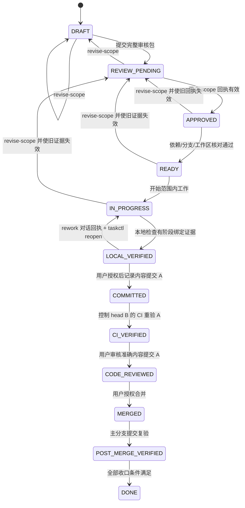
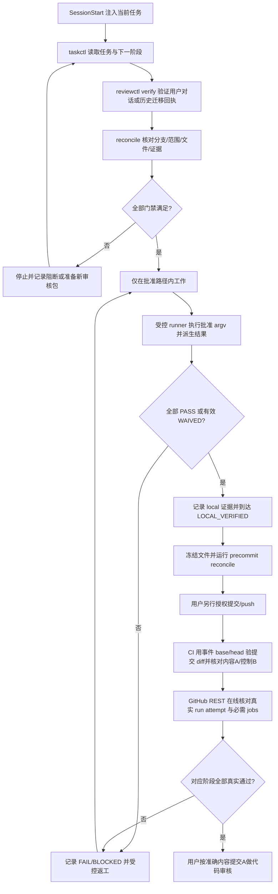

# 治理基线-REQ-0001-v1.0

## 1. 文档信息

| 项目 | 内容 |
| --- | --- |
| 需求名称/编号/版本 | 治理基线 / REQ-0001 / v1.0 |
| 状态 | IN_PROGRESS；R003 最终签名迁移已完成，R004 已批准 scope v4，R005/R006 已批准首次 CI 闭环与受控提交传输，R007 已批准修复真实 Windows CI 失败及单次非强制恢复；正在重新执行全部本地验证，不表示 CI 已通过或任务已完成 |
| 交互类型 | `non_ui`；G0 是治理控制层，图示要求由第 12 节满足 |
| 提出人/审核人/负责人 | 用户 / 用户 / Codex |
| 创建/更新日期 | 2026-08-18 / 2026-08-19 |
| 项目分类 | `M + multi` |
| 关联任务/分支 | GOV-0001 / G0 根信任初始化例外使用 `main`，后续需求必须使用独立 `codex/` 分支 |
| 发布单元 | macOS 客户端、Windows 客户端、统一后端服务 |
| 上一版本与变更摘要 | 首版；本次按 24 个默认章节补齐治理需求 |
| 工作分支 / base branch | `main` / `main`；仅限空仓库 GOV-0001 bootstrap，后续任务禁止复用 |

本需求只允许建立 `.codex/` Hook、`tools/governance/` 控制工具、`project-control/` 机器记录、分维度文档和 `.github/` 治理 CI。它不授权应用脚手架、应用依赖、业务代码、产品数据库迁移、提交、push、合并或部署。

## 2. 一句话摘要

在任何产品实现开始前，为用户和 Codex 建立一套失败关闭、可核对、可追溯且不能把跳过伪装成通过的开工与验证控制层。

## 3. 背景与现状证据

仓库开始时没有可信的任务、审核、核对和 CI 控制层；如果直接进入 vibe coding，单人维护下容易出现范围漂移、多个需求混在同一分支、验证证据错配和文档缺失。

已确认产品由一个 monorepo 管理三个独立发布单元。macOS 与 Windows 客户端共享业务代码且功能一致，但仍需独立构建、验证、发布和回退；统一后端独立发布。当前仓库仅处于 G0 治理初始化，尚无应用脚手架、业务实现或应用依赖。

仓库内已实现历史签名回执复验、对话回执绑定、受控验证 runner、私有 GitHub REST 核验及其负向测试，但这只能证明“控制能力和验证入口存在”，不能证明 GitHub runner 已经执行。只有真实 workflow run 经仓库外只读凭据在线核对并绑定准确提交，才可记录对应 CI 证据。

## 4. 使用者与使用场景

产品主要使用者是广告素材制作者与广告优化师。G0 的直接使用者是：

- 用户：唯一决策人，在 Codex 对话中明确确认范围、验证豁免、代码审核、返工和不可逆操作。
- Codex：读取当前任务、准备审核材料、在有效回执范围内实现与验证，如实报告阻断。
- CI：在 push、PR 和合并后重新运行已定义的自动检查，不代替用户审核。

典型治理场景包括新建或恢复 Codex 会话、工具调用前门禁、需求范围变化、本地验证、提交前核对、PR 跨平台检查、合并后复验和失败排查。

## 5. 目标与成功指标

1. 每次启动、恢复、清空或压缩会话时，自动注入唯一当前任务、阶段、范围、审核、阻断和下一步。
2. 没有有效用户审核、分支不符、路径越界、状态损坏或命令不在范围内时，在工具执行前拒绝写操作。
3. 任务和审核状态只能经 `taskctl`、`reviewctl` 管理，`reconcile` 以只读方式核对文件、阶段、分支、任务、回执和证据。
4. 本地、CI 与合并后证据分别绑定相应工作区摘要或提交，不能跨阶段复用。
5. push、PR 和合并后真实执行治理测试与 `reconcile`；任何必需步骤未运行、失败或超时都保持阻断。
6. 项目、需求、开发、运维、排障、决策和治理文档分目录维护，批准的需求文档满足 24 章节、命名、图示、非空和假设清单规则。
7. G0 完成时不包含任何应用脚手架、应用依赖、业务代码或产品迁移。
8. 所有新 scope、code、validation waiver、rework 和 irreversible operation 回执都由 `record-conversation` 自动绑定当前治理状态；对话回执明确标为非密码学身份凭证，范围或专属字段变化即失效。
9. 本地 PASS 只由受控 runner 从受审核 argv 的真实执行结果派生；CI/合并后 PASS 只由私有 GitHub REST 在线核验结果派生，公开自报入口不能推进阶段。
10. 多发布单元任务逐一绑定 `mac`、`win`、`backend` 的验证、兼容与回退证据；自动 Windows runner 结果不替代真实 Windows 产品验收。

## 6. 非目标

- 不选择 macOS、Windows 或后端技术栈。
- 不创建或手工仿造应用脚手架、依赖清单、锁文件、业务代码和业务测试。
- 不设计产品 UI、身份提供方、业务数据 schema 或自动投放能力。
- 不执行提交、push、合并、发布、商店上架或不可逆迁移。
- 不把用户延期的风险评估解释为已接受风险。
- 不声称尚未真实运行的 GitHub CI、跨平台 runner 或发布后验证已经通过。

## 7. 范围

### 7.1 包含范围

- Codex `SessionStart` 与 `PreToolUse` Hook 及其契约测试。
- Python 标准库实现的 `taskctl`、`reviewctl` 和 `reconcile`。
- R002/R003 历史 OpenSSH 回执复验，以及 scope v3 起对话回执的状态绑定和原子创建。
- 受审核 argv/超时/发布单元驱动的受控验证 runner，以及私有 GitHub Actions REST 在线证据同步。
- 任务、回执、当前任务指针和项目规则的机器可读记录。
- README、协作规则以及项目、需求、开发、运维、排障、决策、治理七类文档。
- GitHub Actions 治理 workflow 与 PR 检查模板。
- 本地只读核对、治理单测和 Hook 契约测试。

### 7.2 排除范围

- 应用目录、应用构建配置、应用依赖、业务逻辑、UI 原型和数据库迁移。
- 真实账号、凭据、令牌、私钥和个人数据。
- 应用商店接入；只在未来设计中预留，不在 G0 实现。
- 产品发布、广告发布或预算调整；产品明确不自动投放广告。
- 未经用户另行授权的 Git 提交、push、PR、合并和部署。

## 8. 前置与后置依赖

前置条件是用户已确认 G0 修改方向、项目为 `M + multi`、三个发布单元边界和唯一审核人权限。G0 是空仓库的根信任初始化例外，只允许在 `main` 准备治理文件；该例外不延伸到应用初始化。

后置依赖如下：

- 第一个应用初始化需求必须引用本基线，先完成风险、技术栈、身份与数据未决事项的确认。
- 后续每个功能点必须有独立需求、任务、分支、范围审核、验证计划和回退计划。
- 跨发布单元需求必须有协调任务，并为受影响发布单元建立可独立验收的实现任务。
- 若后续工具或状态 schema 变更，必须先有独立治理需求、迁移与回退计划。

## 9. 假设和未决事项

完整清单维护在[假设和未决事项](../../governance/假设和未决事项-GOV-0002-v1.0.md)，不得只在对话中口头保留。

已确认边界：

- 项目为 `M + multi`；一个 monorepo、三个独立发布单元。
- macOS 与 Windows 共享业务代码且业务功能一致，但独立发布与回退。
- 产品涉及登录和鉴权；后端不保存账号数据。
- 个人数据保存在客户端本地 SQLite，登录凭据不得明文存入 SQLite。
- 产品不自动发布广告，也不自动调整广告预算。
- 暂不考虑上架商店，但需保留签名、公证、安装包和未来商店接入能力。
- 用户是唯一有权签发审核、验证豁免和不可逆操作回执的人。
- 用户已用 R003 完成最后一次 OpenSSH 迁移签名，并明确选择后续正式审批使用 `conversation-v1`。
- 用户接受对话回执只是审计绑定、不能证明密码学身份或人在场；如需更强保证必须另建治理需求。
- GitHub 仓库为私有仓库；用户允许在仓库外配置 Actions/metadata 最小只读凭据，用于在线核验固定治理 workflow。

R001、R002、R003 迁移已经完成；R003 的固定 payload 摘要与历史公钥共同作为 `conversation-v1` 的迁移根。首次 CI 证据同步时仍必须由用户在仓库外配置只读凭据；无网络或凭据时保持阻断。

阻断后续应用初始化的未决事项包括最坏后果风险评估、身份提供方与鉴权模型、SQLite 字段与保护、客户端/后端技术栈和可信脚手架。用户已将风险评估延期；“延期”不是低风险、无风险或默认接受。

## 10. 功能明细与治理规则

### 10.1 SessionStart Hook

`.codex/hooks.json` 在 `startup`、`resume`、`clear` 和 `compact` 场景调用 SessionStart。输出必须使用 Codex Hook 契约，并注入：

- 当前任务、需求与范围版本；
- 当前阶段、可信分支和允许路径；
- 有效审核、假设、未决事项与阻断项；
- 可进入的下一阶段和当前应执行的下一步。

找不到唯一当前任务、状态损坏或解析失败时，输出明确阻断，不得用空上下文假装成功。

### 10.2 PreToolUse Hook

PreToolUse 对 Codex Hook 覆盖的每次工具调用，在执行前核对任务阶段、审核回执、分支、路径、命令和工具。没有有效审核时只允许为理解和准备审核材料所需的严格只读操作；有审核时仍须拒绝越界或未知操作。对 Hook 已接收但无法解析的输入一律失败关闭。已获准程序启动的子进程、用户外部终端和其他未进入 Hook 的路径没有再次受其拦截，不能据此声称整个进程树或系统都被 Hook 覆盖；这些路径由绑定回执、受控 runner、专用 CLI、CI 与分支保护约束。

`project-control/tasks/**`、`project-control/reviews/**` 和 `project-control/current-task.json` 是受保护的机器记录，禁止通过编辑器、`apply_patch`、Shell 重定向或其他通用写工具直接修改。任务和当前任务只能由 `taskctl` 修改；审核回执只能由 `reviewctl` 的受控流程写入。

### 10.3 taskctl

`taskctl` 提供读取当前任务、查看/列举任务、创建任务、选择当前任务、合法状态流转、范围修订、受控验证和 GitHub 证据同步入口。调用者必须以脚本 `--help` 为准，不得猜测不存在的命令。

- 普通状态流转不能倒退。
- 范围、需求版本、允许路径或验证计划改变时，必须使用 `taskctl revise-scope`。
- `revise-scope` 递增 `scope_version`、回到 `DRAFT` 或 `REVIEW_PENDING`，并使旧范围回执和旧验证证据失效。
- `reopen` 只处理未提交、范围不变且已有有效 `rework` 对话回执的 `LOCAL_VERIFIED` 返工；它归档并清空旧本地结果后返回 `IN_PROGRESS`。
- `run-validation` / `run-required` 只执行范围中审核过的 argv、超时和发布单元，使用 `shell=False` 和受限环境，根据真实退出状态/超时派生结果，并核对执行前后 scope、工作区和受保护状态未变化。
- 公开 `record-validation --status passed` 永久拒绝；失败/阻断历史可以追加，调用者不能用该入口自报 PASS。
- `sync-github-run` 是 `ci` / `post_merge` PASS 的唯一写入入口，必须先在线核验真实 GitHub Actions run；验证记录只追加，不覆盖失败历史。

### 10.4 reviewctl

`reviewctl` 提供 `list`、`show`、`verify` 和 `record-conversation`；`prepare` / `import-signed` 仅保留历史签名兼容，旧 `record` / `waive` 永久拒绝。它不存在“创建审核申请”命令；审核申请由需求文档、任务范围、验证/回退计划和 `REVIEW_PENDING` 状态共同形成，再交给用户判断。

用户在当前 Codex 对话中明确决定后，Codex 才可调用 `record-conversation`，并必须记录对话引用、用户原话摘要、原因和 `recorded_by=Codex`。工具从当前状态自动派生 scope 和类型专属字段，原子创建且不覆盖回执文件。Codex 不得把自己的判断记录成用户决定，也不得直接编辑、覆盖或复制回执。

对话回执固定绑定项目、源仓库、回执/任务编号、类型、决定、用户原话、对话引用、scope 版本/摘要、决定/失效时间、supersedes 及所有类型专属字段。它不提供密码学身份或人在场证明；同一操作系统身份下的恶意进程是已知信任边界。项目策略、R003 固定摘要或任一绑定变化时失败关闭。

回执类型及绑定规则：

- `scope`：绑定任务、需求版本、`scope_version`、规范化 `scope_hash`、分支、允许/禁止路径、验证与回退计划和有效期。
- `code`：绑定准确 `commit_sha`、当前 `scope_hash` 和审核结论；工作区内容、其他提交或旧绿色结果不能替代。
- `validation_waiver`：机器强制绑定准确检查项、证据阶段、工作区摘要或提交、环境、原因、该阶段最远门禁和未来到期时间；风险与补验材料由 `confirmation_source` 关联；只产生 `WAIVED`，绝不产生 `PASS`。
- `rework`：绑定当前 scope、`LOCAL_VERIFIED` 的冻结工作区摘要和未来到期时间；只允许 `taskctl reopen` 归档旧本地结果，不允许范围变化或提交后倒退。
- `irreversible_operation`：G0 绑定唯一操作编号、当前范围、规范化操作材料的 `target_digest` 和有效期。材料必须包含准确目标、动作、影响、不可逆后果、恢复方案和工作区摘要或提交。G0 没有执行/单次消费器，因此回执本身不能授权工具执行；首次使用前另建治理需求。

R001、R002、R003 只作为历史迁移证据保留。R003 是最后一次用户 OpenSSH 签名并授权 scope v3 起采用对话审批；后续新回执不再要求签名。

### 10.5 reconcile

`reconcile` 只读核对任务、回执、阶段、分支、文件范围、文档完整性和验证证据，不静默修复。它必须报告可定位的问题：

- `0`：所选 profile 的全部必需检查真实满足；
- `1`：存在 drift、blocker、无效回执、越界、文档或验证缺口；
- `2`：状态损坏或命令用法错误。

任何非零结果都阻止推进；调用者不得手工改机器记录来消除报告。

### 10.6 CI

治理 CI 只使用仓库 Python 标准库测试和 `reconcile`，不安装应用依赖。push 运行 Linux 检查；PR 为 Hook 跨平台入口同时运行 Ubuntu、macOS 和 Windows。所有必需步骤必须实际运行，不使用 `continue-on-error`，空测试集合也必须失败。

PR 的 `windows-latest` job 只证明治理工具和 Hook 契约在 Windows runner 上执行，不能证明尚未初始化的 Windows 客户端已经完成真实安装、升级、卸载、系统安全存储或业务行为验收。产品需求必须另行保存真实平台证据。

CI 的范围核对以 GitHub 事件中可信的 base/head 为准：

- PR 使用事件 payload 的 base/head SHA，并使用 `GITHUB_BASE_REF`、`GITHUB_HEAD_REF` 识别可信源/目标分支；不得把 detached HEAD 或临时 merge ref 当成需求分支。
- push 使用事件 payload 的 `before`/`after` SHA；首次 push 的全零 `before` 必须走显式的初始提交处理。
- 文件范围由事件 base/head 的已提交 diff 计算，不能用 runner 工作区中的未提交状态代替。

workflow 定义存在不等于 CI 已通过。私有仓库的 `ci` / `post_merge` PASS 只由 `taskctl sync-github-run` 写入：工具使用用户在仓库外配置的 `MATERIAL_GITHUB_ACTIONS_READ_TOKEN` 通过 GitHub REST API 查询固定 `wzhic/material` 和治理 workflow，核对 run ID/attempt、事件、分支、head SHA、状态/结论以及必需 job 全部成功。调用者提供的 URL、结论或日志片段不可信；无网络、无凭据、权限不足或响应不匹配时失败关闭，凭据不得写入仓库、证据或日志。

由于任务 JSON 不可能在同一 Git 提交中记录该提交自身 SHA，提交证据分两层：内容提交 A 由 `task.git.committed_sha` 标识；`taskctl` 后续状态记录可形成控制提交 B。CI 必须证明 A 是 B 的祖先；A..B 仅允许 `project-control/tasks/**`、`project-control/reviews/**` 和 `project-control/current-task.json`，同时报告 A/B。任何普通内容变化都使 CI 范围核对失败。

首次 G0 push 的闭环固定为：根内容提交 A 在 `GOV-0001/main` 上运行三个发布单元的全部批准检查并核对完整根快照，但只返回 `bootstrap_pending`、不写 CI PASS。真实 Run `32221854668` 的 Windows job 因 CP1252 解码 Git UTF-8 输出失败；历史 A 保留，R007 只允许一个绑定 A、固定消息和精确路径集合的非强制修复子提交，其 CI 返回 `bootstrap_repair_pending`。三个 job 全部成功后，`taskctl` 记录准确内容提交，只形成受保护控制提交；控制提交再次运行全部检查，只有同时证明内容提交为根 A 或精确 R007 子提交、它是控制 head 的祖先、区间全为受保护机器记录时才报告 `bootstrap_control_head` 并允许 GitHub REST 同步。项目 bootstrap 白名单必须精确只有 `GOV-0001`；其他任务、第二个修复、普通内容进入控制区间、空提交、强制推送或跳过检查均拒绝。

### 10.7 状态完整性与冻结

任务到达 `LOCAL_VERIFIED` 后，普通源代码、文档和配置冻结，不能继续直接修改后沿用旧本地证据。

- 同一范围内发现实现或文档缺陷时，使用受控返工流程使相关验证失效，再修改并重新执行全部受影响检查。
- 如果实际范围发生变化，提交前必须使用 `taskctl revise-scope`，重新审核后再开工。
- 已提交任务需要改变范围时新建任务和分支，不原地改写已提交范围。
- `tasks`、`reviews` 和 `current-task` 记录无论处于何种阶段都禁止直接编辑。

## 11. 用户流程与交互（UI 必填）

**不适用。** G0 只建立治理控制层，不创建产品 UI、页面、组件或原型，因此没有可供广告素材制作者或广告优化师操作的 UI 流程。该不适用结论由用户对 G0 范围的确认支持。

后续任何 UI 需求不得沿用本节的不适用结论，必须提供用户流程图，并逐项写清入口、主流程、返回/取消、空状态、加载、成功、校验失败、系统失败、权限不足、登录失效、离线/超时、恢复、数据保持和无障碍交互；单张原型图不能替代这些文字。

## 12. 非 UI 流程图（非 UI 需求必填）

### 12.1 任务状态图



状态图之外的规则：失败、阻断或受控返工必须保留原失败记录并使后续阶段声明失效；普通 `transition` 不得倒退。`LOCAL_VERIFIED` 后文件冻结，代码审核必须发生在准确提交上，合并后必须对主分支实际提交重新验证。

### 12.2 开工与验证流程



流程图不能代替异常规则：缺明确用户决定、R003 迁移根损坏、范围变化、错误分支、状态损坏、runner 改动工作区、GitHub 网络/凭据缺失、事件 SHA 不可信、测试未运行或证据阶段不符都必须进入阻断，而不是沿成功路径继续。缺回执时 Codex 等待用户在当前对话明确决定，再通过 `record-conversation` 记录并核验后回到成功路径。

## 13. 数据与生命周期

G0 不处理产品个人数据，只保存治理 JSON。治理记录包含任务范围、审核元数据、验证结果和当前任务指针，不得包含密码、令牌、私钥或真实个人数据。

- 任务从创建到完成由 `taskctl` 管理；状态和验证历史只能追加或通过显式迁移改变。
- 回执由 `reviewctl record-conversation` 在用户明确决定、项目策略、当前任务和绑定检查通过后原子追加且禁止覆盖；撤销或替代必须通过新对话回执的 `supersedes` 保留关联。旧 `record` / `waive` 保持禁用。
- `current-task.json` 只能由 `taskctl set-current` 等受控入口更新。
- `scope_version` 改变时，旧回执和旧验证证据保留为历史但不再有效。
- 本地证据绑定规范化范围与确定性工作区摘要；提交后证据绑定准确内容提交，并另列控制 head。
- schema 变更必须另建治理任务，说明迁移、兼容、备份和回退；不能直接编辑现有记录“修复”格式。

## 14. 登录、权限、安全与隐私

产品登录与鉴权存在，但身份提供方、令牌生命周期和恢复流程未决，故本需求不实现产品认证。后端不保存账号数据；若未来方案要求保存身份映射、用户资料或凭据，属于项目边界变化，必须重新审核。

G0 权限边界是：

- 用户是唯一审核人和不可逆操作授权人。
- Codex 只能在用户明确回复后记录对话回执，不得把自身判断冒充用户决定；历史私钥仍不得生成、读取或保存。
- CI 不授予开工、合并、发布或不可逆操作权限。
- 日志和证据必须脱敏。

Hook 只覆盖实际进入它的调用，不描述为不可绕过的系统安全边界；还需要对话回执的状态绑定、受控 runner、私有 GitHub REST 核验、受保护分支和用户审核共同约束。对话回执自身不是强身份认证。

## 15. 接口与兼容性

- Hook 入口为 `.codex/hooks.json`，SessionStart 与 PreToolUse 使用 Codex 支持的 JSON 输入/输出契约。
- POSIX 与 Windows 通过各自启动包装器寻找 Python 3.9+；找不到兼容解释器时清晰失败。
- 控制入口为 `python3 tools/governance/{taskctl,reviewctl,reconcile}.py`，命令及参数以 `--help` 为唯一可信说明。
- 对话回执使用稳定 JSON 结构并自动绑定当前状态；历史 R002/R003 使用固定 namespace 的 OpenSSH detached signature 复验，私钥不属于任何仓库接口。
- `taskctl run-validation` / `run-required` 执行受审核验证；`sync-github-run` 在线同步私有 GitHub Actions 证据。无可信工具、网络或凭据时均失败关闭。
- `reconcile` 的退出码为 `0/1/2`，含义见 10.5。
- CI 用事件 base/head SHA 和可信分支变量核对已提交 diff，兼容 PR detached HEAD。

本需求没有产品 API、文件格式或业务兼容矩阵；**不适用的理由**是 G0 未引入产品实现。未来客户端与后端接口必须另行记录版本兼容窗口。

## 16. 性能、可靠性与成本

- Hook 应快速完成，超时、解析失败和解释器缺失时失败关闭，不以放行保证可用性。
- 治理工具仅使用 Python 标准库，避免引入应用依赖和额外供应链成本。
- 普通 push 只跑 Linux；PR 才运行 Ubuntu、macOS、Windows，兼顾跨平台入口可信度与单人项目成本。
- Windows runner 只承担治理入口兼容检查；真实 Windows 产品验收单独规划，不能为降低成本用 runner 结论替代。
- 状态损坏、证据缺失和 runner 未运行都保持阻断，不能为节省时间降低门禁。

产品响应时间、容量、可用性和运行成本在 G0 **不适用**，因为尚无产品服务；它们必须在首次相关需求中量化或登记为未决事项。

## 17. 运维、可观察性和问题排查

治理可观察性由工具 JSON 输出、退出码、脱敏测试日志、GitHub run 元数据和任务历史组成。排障按[治理门禁问题排查](../../troubleshooting/治理门禁问题排查-TRB-0001-v1.0.md)执行。

- `reconcile --json` 应指出具体 profile、检查项和阻断原因。
- 每份 CI 证据记录事件、base/head、准确提交、runner OS、run ID/URL 与结果。
- 私有 GitHub run 证据额外记录 REST 核验的 workflow、attempt、分支、head SHA、job 集合和核验时间，不记录只读凭据。
- 每项自动验证记录审核 argv、超时、发布单元、实际退出状态、输出哈希/大小和执行前后完整性结论，不记录可能泄密的完整输出。
- 失败、超时和重跑历史必须保留，不能只展示最后一次绿色结果。
- 不通过手工编辑 `tasks`、`reviews` 或 `current-task` 排障；需要写入时另建获准治理任务。

产品日志、指标、告警和服务 runbook 在 G0 **不适用**，因为尚未部署产品；首次部署需求必须补齐。

## 18. 发布、迁移与回退

G0 的交付对象是治理文件，不是可发布应用。若后续提交 G0，只有在没有下游状态 schema 依赖且数据兼容时才可按独立提交回退；已有任务或回执引用新版 schema 时，先执行经审核的治理迁移或前滚修复。

产品发布规则见[发布与回退](../../operations/发布与回退-OPS-0001-v1.0.md)：三个发布单元独立版本、自动验证、真实环境验收、发布和回退；跨单元变化使用协调任务和逐单元证据。任何删除历史、破坏性迁移、强制覆盖或不可恢复操作都必须先有用户明确对话决定及有效 `irreversible_operation` 回执；G0 尚无执行/单次消费器，因此首次实际操作前还必须通过独立治理需求补齐并验证该通道。

G0 不执行产品迁移或发布，故具体应用版本与迁移步骤 **不适用**。

## 19. 验收标准

| 编号 | 前置条件与操作 | 可观察结果 | 当前证据状态 |
| --- | --- | --- | --- |
| AC-01 | 在启动、恢复、清空、压缩会话触发 SessionStart | 注入准确任务、阶段、范围、审核、阻断与下一步；异常时阻断 | 需本地测试和真实会话证据 |
| AC-02 | 无有效审核、错误分支、越界路径或状态损坏时请求写操作 | PreToolUse 在执行前拒绝并说明原因 | 需 Hook 契约与行为证据 |
| AC-03 | 范围或验证计划变化后运行 `revise-scope` | `scope_version` 增加，旧回执/证据失效，任务回审核阶段 | 需治理单测证据 |
| AC-04 | 使用 taskctl/reviewctl/reconcile 管理治理状态 | 受保护记录不能由通用写工具直接编辑，工具留下可核对历史 | 需门禁与单测证据 |
| AC-05 | 运行 reconcile 的 session/docs/workflow/static/precommit/ci profile | drift 返回 1、损坏/用法错误返回 2、全部满足才返回 0 | 需治理单测和实际输出 |
| AC-06 | 记录 local、ci、post_merge 结果 | 每阶段绑定其工作区摘要或准确提交；ci/post_merge 另绑匹配 run ID/URL；任一证据不能跨阶段复用 | 需治理单测证据 |
| AC-07 | 到达 LOCAL_VERIFIED 后尝试修改普通文件 | 被冻结规则拒绝；受控返工或 `revise-scope` 后旧证据失效 | 需 Hook/治理单测证据 |
| AC-08 | 用户审核代码 | `code` 回执绑定准确内容提交 SHA 与当前范围 | 需提交后真实回执；当前不适用 |
| AC-09 | 请求不可逆操作 | G0 可核验绑定当前范围、操作编号、材料摘要与有效期的用户回执，但没有消费器时仍拒绝执行 | 需治理单测；G0 不执行操作 |
| AC-10 | 检查批准的需求文档 | 目录、命名、24 章节、非空、适用图示和假设清单全部满足 | 需文档门禁证据 |
| AC-11 | push 或发起 PR | CI 用事件 base/head 核对已提交范围；PR detached HEAD 使用可信事件分支；首次 G0 内容 run 与精确 R007 修复 run 只产生 PENDING，受保护控制 head 全量复验后才可同步 PASS | Run 32221854668 已保留为 Windows 失败证据；待修复 run |
| AC-12 | PR 与 `main` push 在三种 runner 运行 | Ubuntu、macOS、Windows 必需检查均真实完成；同分支旧运行可被新提交取消 | 待真实 GitHub run |
| AC-13 | 查看 G0 文件范围 | 不存在应用脚手架、应用依赖、业务代码或产品迁移 | 需最终文件清单 |
| AC-14 | 必需检查未运行、失败、超时或被豁免 | 分别显示 BLOCKED/FAIL/WAIVED，不显示 PASS | 需治理单测与报告 |
| AC-15 | 记录、篡改或重放新审核回执 | 只允许窄口径对话命令；当前 scope、类型专属字段、对话引用或项目策略变化会失效，重复编号不覆盖；明确报告无密码学身份保证 | 已有治理与 Hook 单测；R003 迁移已完成 |
| AC-16 | 调用者尝试自报 PASS，或受控 runner 执行成功/失败/超时/改动工作区 | 自报入口拒绝；runner 从实际执行派生结果，完整性变化不落盘 | 已有治理单测；scope v4 完成后需重新执行本地证据 |
| AC-17 | 同步私有 GitHub Actions 证据 | 仅固定仓库/workflow 的匹配 run attempt、事件、分支、head SHA 和必需成功 job 可落盘；无凭据/网络、伪 URL 或元数据不符均拒绝 | 已有治理单测；待真实 GitHub run |
| AC-18 | 多发布单元任务执行验证和回退核对 | `mac`、`win`、`backend` 逐一绑定证据；Windows 治理 runner 不替代真实 Windows 产品验收 | 已有结构单测；产品验收当前不适用 |

AC-11、AC-12 和 AC-17 的真实运行部分在尚未提交和 push 的当前 G0 工作区必须保持 `PENDING`，不得用 workflow 文件存在、本地测试、URL 或模拟 REST 响应代替。AC-15 的 R003 真实迁移已完成；后续对话回执仍只能在用户明确回复后记录。

## 20. 验证计划与证据

G0 本地验证入口：

```text
python3 -m unittest discover -s tools/governance/tests -p 'test_*.py' -v
python3 -m unittest discover -s .codex/tests -p 'test_*.py' -v
python3 tools/governance/reconcile.py session --json
python3 tools/governance/reconcile.py docs --json
python3 tools/governance/reconcile.py workflow --json
python3 tools/governance/reconcile.py static --json
python3 tools/governance/reconcile.py precommit --json
python3 tools/governance/reconcile.py ci --json
```

`docs` 和 `workflow` 可分别定位文档/CI 定义问题，`static` 组合两者且不依赖 `LOCAL_VERIFIED`，因此不会形成验证自循环；`precommit` 在冻结 local 摘要上追加范围预检。`ci` 只接受 GitHub Actions 提供的可信事件上下文，本地缺少该上下文时失败是正确行为，不能当作已运行 CI。

scope v2 起的本地阶段统一使用：

```text
python3 tools/governance/taskctl.py run-required GOV-0001 --phase local --json
```

该入口从任务中的 argv 数组、超时和 `release_units` 读取计划并派生 PASS/FAIL/BLOCKED；不能把上面的底层命令手工执行结果再通过 `record-validation --status passed` 写入。scope v4 的治理变更完成后必须重新运行全部本地检查；R005/R006 同范围返工均已归档各自修复前的结果，本轮不得复用任何旧本地证据。

审核绑定的检查为治理单测、Hook 契约、session 核对、static 文档/定义核对、workflow 定义核对，以及仅在 CI/合并后运行的 committed diff 核对。前五项覆盖 `LOCAL_VERIFIED`、`CI_VERIFIED` 和 `POST_MERGE_VERIFIED`；committed diff 仅覆盖后两项。

证据阶段严格隔离：

| 阶段 | 必须绑定 | 不得证明 |
| --- | --- | --- |
| `local` | 当前 `scope_hash`、确定性的 `workspace_digest`、命令、环境、时间和退出码 | CI runner 或合并后主分支 |
| `precommit`（派生报告） | 与 local 相同的冻结 `workspace_digest`、当前分支和预提交核对报告 | 任何 `record-validation` 门禁、已提交 commit、CI runner 或合并后主分支 |
| `ci` | 内容提交 A、事件控制 head B、base/head diff、runner OS、workflow run ID/URL | 未提交工作区、其他内容提交或夹带普通内容的控制提交 |
| `post_merge` | 合并后的主分支 commit、push before/after、run ID/URL | PR head 或合并前 CI |

`local`、`ci`、`post_merge` 三类验证结果不能跨阶段复用；`precommit` 只是同一冻结 local 摘要上的只读报告，不能满足其他门禁。重新运行、工作区变化、范围变化或提交变化时，旧证据只保留为历史。`validation_waiver` 必须绑定相同阶段、工作区摘要/提交、环境和该阶段门禁，只能记为 `WAIVED`。

多发布单元检查还必须绑定它覆盖的 `release_units`；协调记录逐单元关联验证与回退检查。共享客户端检查可以覆盖 mac/win，但真实平台安装、升级、卸载和行为仍分别留证。

当前 G0 未提交、未 push，因此 GitHub CI、PR 跨平台和合并后验证尚未运行，状态必须保持 `PENDING`。scope v4/R006 返工后的本地结果只有由最终受控组合命令真实执行并写入任务记录后，才称为当前阶段证据。

## 21. 文档更新清单

| 维度 | 本需求文档 | G0 要求 |
| --- | --- | --- |
| 项目 | `docs/project/项目基线-PROJ-0001-v1.0.md` | 记录用途、规模、发布单元、数据与风险边界 |
| 需求 | 本文与需求模板 | 版本化、24 章节、按需求独立目录 |
| 开发 | `docs/development/开发流程-DEV-0001-v1.0.md` | 分支、范围、冻结、依赖、注释与提交规则 |
| 运维 | `docs/operations/发布与回退-OPS-0001-v1.0.md` | 三单元发布、迁移和回退 |
| 排障 | `docs/troubleshooting/治理门禁问题排查-TRB-0001-v1.0.md` | 只读诊断和失败关闭 |
| 决策 | `docs/decisions/项目形态与发布单元-ADR-0001.md` | `M + multi` 和 monorepo 决策 |
| 治理 | `docs/governance/` 下三份基线 | 门禁、假设、验证和豁免 |

文档完整性门禁必须同时检查：

1. 七个维度的目录和入口存在。
2. 需求目录为 `<需求名>-<REQ-ID>/`，主文档以需求名开头并含 REQ-ID 与版本。
3. 获准开工的需求文档包含且按顺序保留 24 个默认章节。
4. 每节非空；不适用项写明“不适用”、理由和确认依据，不能保留未填写占位。
5. UI 需求包含用户流程图和交互状态；非 UI 需求包含适当的状态图、时序图或数据流图，并有文字解释。
6. 存在假设和未决事项清单，且高影响事项明确确认阶段。
7. 本地相对链接可解析，需求版本、任务和回执范围一致。

模板文件可保留填表提示；一旦成为待审核或已批准需求，所有占位必须消除。

## 22. 风险与影响分析

| 风险 | 影响 | G0 控制 |
| --- | --- | --- |
| 无审核先开工 | 范围、成本和结果不可控 | SessionStart + PreToolUse + scope 回执 |
| 通用工具改机器记录 | 伪造阶段、回执或当前任务 | 受保护路径 + 专用 CLI + reconcile |
| 跨阶段复用绿色证据 | 未验证提交被误判为通过 | 阶段、工作区摘要、commit 和事件绑定 |
| LOCAL_VERIFIED 后继续修改 | 验证对象与实际内容不同 | 文件冻结、受控返工、`revise-scope` |
| PR detached HEAD 误判分支 | 越界提交进入 PR | 可信事件分支与 base/head diff |
| 只有图或缺默认章节 | 需求边界与异常流程缺失 | 24 章节和图示/非空门禁 |
| validation waiver 被当 PASS | 风险被隐藏 | 明确 `WAIVED`，限制阶段与有效期 |
| 不可逆操作无准确授权 | 数据或历史无法恢复 | 单次 `irreversible_operation` 回执 |
| 测试子进程绕过顶层 Hook 冒充用户 | 对话回执可能被同机进程伪造 | 明确对话回执不是强身份认证；限制专用 CLI、受保护路径和绑定字段，并保留用户人工复核；如需强认证另建需求 |
| 调用者自报 PASS | 未运行验证被伪装为成功 | PASS 只由受控 runner 或 GitHub REST 派生；Hook 只声明覆盖其接管调用 |
| 私有 GitHub URL、结论或环境变量被伪造 | 未执行 run 被记为 CI PASS | 仓库外只读凭据在线核对固定仓库/workflow/run attempt/事件/commit/jobs，无网络或凭据时阻断 |
| 多发布单元只留一个绿色结果 | 平台或后端缺陷被共享结论掩盖 | 逐单元验证、兼容、发布和回退绑定；Windows CI 不替代真实 Windows 验收 |
| 跨平台 CI 成本过高 | 单人维护负担 | push Linux、PR 三平台 |

产品层面的最坏后果目前无法评估，用户已明确延期。它阻断相关技术选型和业务开发，不阻断仅建立 G0 控制层；该处理不代表用户接受未知风险。

## 23. 审核与回执

用户已在对话中确认 G0 修改方向和边界；这允许形成当前治理文件，但不等同于提交、push、合并、发布或不可逆操作授权。机器回执是否有效只由 `reviewctl verify` 和 `reconcile` 判断，本文不伪造回执编号。

实现审计确认：PreToolUse 不能拦截已批准程序内部再启动的子进程，因此仅凭 `approver=user`、`recorded_by=Codex`、对话文本、终端环境或 URL 字符串不能证明用户亲自批准或 CI 真实成功。用户已在了解该边界后用 R003 完成最后一次签名迁移并选择对话审批；受控 runner 和 GitHub 在线核验仍保持强证据要求。

- scope 审核包由本需求、GOV-0001 任务、范围、验证和回退计划组成；任务进入 `REVIEW_PENDING` 后交用户确认。
- 用户明确回复后，Codex 使用 `reviewctl record-conversation` 记录对话引用、用户原话摘要和原因；旧 `record` / `waive` 永久拒绝。
- R003 的固定 payload 摘要和历史 `review_authority` 只用于验证对话策略迁移根；新回执自动绑定项目/源仓库、任务/范围、类型专属字段与时间。
- code 回执必须在内容提交存在后绑定准确 SHA；不能在未提交工作区预签。
- validation waiver 必须绑定准确检查、阶段、工作区摘要或提交、风险与到期时间。
- rework 回执必须绑定 `LOCAL_VERIFIED` 的冻结工作区摘要和到期时间；只有 `taskctl reopen` 可以归档旧证据并恢复写入。
- irreversible operation 的规范化材料必须在操作前明确目标、动作、影响、恢复方案和摘要/提交；G0 回执绑定该材料摘要与有效期，但实际执行仍等待独立的单次消费器需求。
- 任何绑定内容变化、过期、范围修订或摘要不匹配都会使回执失效。
- R001、R002、R003 保留为历史迁移链；R003 是最后一份签名回执，后续回执统一采用对话模式。R004 是 scope v4 审批，R005 批准首次 CI 协议返工，R006 批准受控提交传输入口，R007 批准 Windows UTF-8 修复和失败根的单次非强制恢复。

## 24. 变更历史

| 版本 | 日期 | 变更摘要 | 原因 | 关联任务/审核人 |
| --- | --- | --- | --- | --- |
| v1.0 | 2026-08-19 | 建立 G0 治理基线；补齐 24 章节、受控 PASS、私有 GitHub REST、多发布单元证据、R001-R007 审批/返工链、scope v4 对话审批、首次 G0 提交闭环及失败根恢复 | 为应用初始化建立可持续维护且可追溯的前置约束 | GOV-0001 / 用户 |

本历史只描述需求文档变化；实现变化记录在任务、Git 和决策记录中。当前没有提交、push 或 GitHub CI 通过声明。
