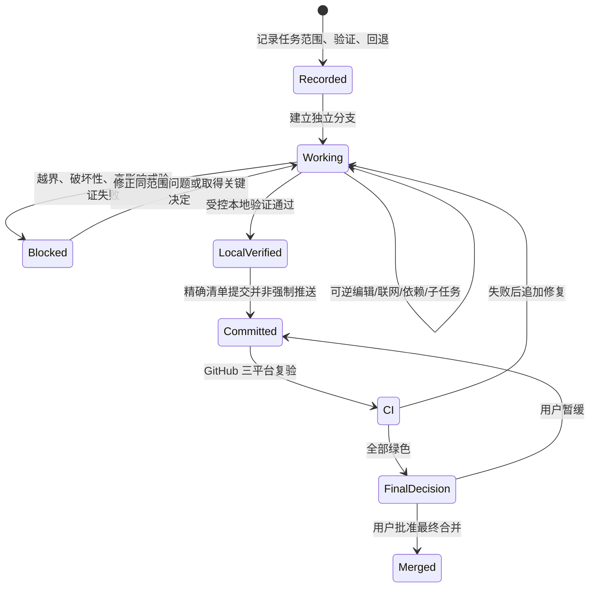

# 治理精简-REQ-0004-v1.0

## 1. 文档信息

| 项目 | 内容 |
| --- | --- |
| 需求名称/编号/版本 | 治理精简 / 治理精简-REQ-0004 / v1.0 |
| 状态 | IN_PROGRESS |
| 交互类型 | `non_ui` |
| 提出人/审核人/负责人 | 用户 / 用户 / Codex |
| 创建与更新日期 | 2026-08-21 |
| 关联任务与分支 | GOV-0003 / `codex/req-0004-gov-0003-minimal-governance` |
| 发布单元 | macOS、Windows、backend 的共享治理 |
| 上一版本 | 首版，无上一版本 |
| base branch | `codex/req-0002-app-0001-project-bootstrap` |

## 2. 一句话摘要

让 Codex 在清晰需求和当前任务范围内自主完成普通可逆工作，只把真实高风险与最终动作留给用户决定。

## 3. 背景与现状证据

现有治理曾为仓库首次初始化建立签名迁移、逐阶段回执、GitHub Run 导入、Token 配置和多层恢复协议。它们帮助发现过跨平台编码、换行与提交绑定问题，但继续作为普通任务前置会导致用户反复发送链接、配置凭据和确认低风险动作，已偏离“一人维护、不让用户充当流程操作员”的目标。用户已连续要求放宽审批、解除联网门禁、收缩治理，并明确允许有记录的子 Agent 与子任务。

## 4. 使用者与使用场景

直接使用者是唯一维护者和 Codex。维护者用自然语言提出需求；Codex 在 macOS 本地仓库中拆任务、实现、验证和准备 PR，GitHub Actions 在 Linux、macOS、Windows 上复验。广告素材制作者与广告优化师不直接接触本治理界面，但会受项目质量与发布边界保护。

## 5. 目标与成功指标

- 清晰需求不再重复索取 scope 或 code 确认，普通联网、依赖、编辑、测试、提交、功能分支 push、PR 准备和子 Agent 创建可连续完成。
- 任务外写入、受保护记录直编、不安全 Git、验证伪报和冻结阶段写入仍被阻止。
- 子 Agent/子任务均有父任务、名称、目的、状态、时间和结果摘要记录，且不记录内部推理或秘密。
- 本地必需验证仍由受控 runner 实际执行；三平台 GitHub Actions 在提交后真实复验并直接展示结果。
- 普通流程不要求用户提供 Run 链接、GitHub 读取 Token 或把 CI 结果复制回本地。

## 6. 非目标

本需求不实现产品业务、登录、SQLite schema、部署、发布或应用商店能力；不降低既有测试要求；不允许 force push、`--no-verify`、验证伪造、跨任务写入或受保护记录直编；不把 GitHub Windows runner 宣称为真实 Windows 客户端验收。

## 7. 范围

### 7.1 包含范围

精简 `SessionStart`、`PreToolUse`、`taskctl`、`reviewctl`、`reconcile`、治理 CI、仓库协作规则和治理/需求/开发/运维/排障/决策文档。覆盖 `.codex/**`、`.github/workflows/governance.yml`、`AGENTS.md`、`README.md`、`docs/**`、受控 `project-control/**` 和 `tools/governance/**`。

### 7.2 排除范围

不修改 `apps/**` 业务或依赖；不合并、部署、发布；不删除历史回执或 Git 历史；不把第二个产品需求夹入 GOV-0003；不覆盖其他任务和用户已有内容。

## 8. 前置与后置依赖

前置是 APP-0001 已形成可工作的 Electron Forge/FastAPI 框架以及现有治理工具可运行。实现过程中保留旧任务记录的读取兼容。后续产品任务依赖本需求提供的最小任务入口、轻量子任务记录、受控本地验证和三平台 CI。

## 9. 假设和未决事项

### 假设清单

| 编号 | 内容 | 影响与处理 | 可逆性/确认 |
| --- | --- | --- | --- |
| A-001 | 清晰用户需求可作为普通可逆工作的范围决定 | 不再生成普通 scope/code 回执 | 可逆；用户已明确确认 |
| A-002 | 子 Agent 和子任务只需轻量审计 | 记录名称、目的、状态、时间和结果，不记录提示词/推理/秘密 | 可逆；用户已明确确认 |
| A-003 | Actions 页面足以承载普通 CI 结果 | 不做本地 Token/Run 同步和状态推进 | 可逆；用户已明确要求 |

### 未决事项清单

| 编号 | 内容 | 影响与处理 | 可逆性/确认 |
| --- | --- | --- | --- |
| O-001 | 产品最坏后果仍未完成量化 | 不影响本次治理工具精简；进入敏感数据、部署或不可逆迁移前必须重新确认 | 高影响，保持未决 |
| O-002 | 最终分支保护规则尚未核对 | 不在本任务远程修改；合并前由用户在 GitHub 决定 | 可逆，最迟合并前确认 |

## 10. 功能明细与业务规则

1. 新任务记录目标、允许路径、非目标、验证和回退后即可进入独立 `codex/...` 分支工作，不要求普通 scope 回执。
2. `IN_PROGRESS` 内允许普通可逆工具调用；必要联网和常规依赖安装不单独审批。
3. `SessionStart` 只给出行动所需摘要；`PreToolUse` 只拦越界、受保护记录、不安全 Git、错误分支和冻结写入。
4. `reviewctl` 只服务验证豁免、破坏性/不可逆、高影响数据/安全/成本/兼容边界与最终动作。
5. 子 Agent 创建前登记，回收后补结果；主 Agent 负责整合和统一验证。
6. 本地 PASS 只能由受控 runner 派生；CI 在独立 runner 执行但不回写本地状态。
7. 一个独立功能保持一个任务、一个分支和一个 PR；CI 等待期间可切换到下一独立任务。

## 11. 用户流程与交互（UI 必填）

**不适用。** 本需求没有产品 UI、页面、组件或用户输入控件；用户已通过对话明确治理方向。命令输出只需提供当前任务、阻断原因和下一步，不新增原型。交互成功、失败与恢复由下一节的非 UI 状态图和文字定义。

## 12. 非 UI 流程图（非 UI 需求必填）

路径外写入、状态损坏或受保护记录直编立即停止并说明原因；验证失败的恢复处理是返回同范围返工并重试受控检查，不改名为通过；范围变化建立新任务或修订范围；最终合并、部署和发布始终停在用户决定点。

## 13. 数据与生命周期

本需求只处理仓库文件、任务元数据、验证摘要和子任务审计记录，不读取产品个人数据。子任务记录创建于分派前、结束时更新，随任务和 Git 历史保留；不保存提示词、内部推理、凭据、秘密、原始隐私数据或完整无关日志。受保护任务与审核记录仍由专用控制工具写入。

## 14. 登录、权限、安全与隐私

不改变产品登录或鉴权。联网只在当前任务需要时访问资料、包注册表和 GitHub，不将 Token 写入仓库或日志。PreToolUse 不是操作系统安全沙箱，仍依赖任务范围、受保护路径、非强制 Git、CI 与最终人工决定。高影响数据、安全、成本和不可逆操作继续单独确认。

## 15. 接口与兼容性

保留 `taskctl run-validation`、`run-required`、受控任务读写和现有任务记录的读取兼容；旧 scope/code/CI 同步记录可继续审计，但不再是新普通任务的前置。GitHub workflow 对 PR head 或 main commit 的当前 checkout 执行，矩阵仍为 `backend/Linux`、`mac/macOS`、`win/Windows`。Hook 输入输出合同通过既有测试保证。

## 16. 性能、可靠性与成本

SessionStart 输出应保持短小，普通工具调用不执行网络回执查询。子任务只存摘要，避免日志膨胀。CI 保持三个 runner 且同一分支新提交取消旧运行，以控制私有仓库分钟数；不增加付费外部服务。失败、超时和空测试集都不得当作通过。

## 17. 运维、可观察性和问题排查

日常观察入口为 `taskctl current`、`reconcile session/static`、本地受控 runner 输出和 GitHub Actions 页面。排障先区分真实越界、任务状态问题、验证失败与 Hook 误拒绝；保留失败事实，修复后重跑。用户无需转发 Run 链接，Codex 也不依赖仓库外 Token 同步本地状态。

## 18. 发布、迁移与回退

本需求只发布治理文件，不部署产品。迁移保留历史任务与回执，不删除或改写 G0 记录；新普通任务使用精简策略。若精简造成越界放行或验证缺失，停止新工作，在独立治理修复任务中回退 GOV-0003 内容提交或前滚修复。最终合并由用户决定；force push、历史改写和不可逆迁移不属于回退手段。

## 19. 验收标准

- AC-01：清晰需求启动普通任务不需要 scope/code 对话回执。
- AC-02：范围内文件编辑、必要联网、常规依赖、测试、提交、功能分支 push 和 PR 准备不逐项询问。
- AC-03：任务外写入、受保护记录直编、force push、`--no-verify` 和冻结阶段写入仍被拒绝。
- AC-04：子 Agent 可创建，且开始和结束均有轻量记录；没有提示词、内部推理或秘密。
- AC-05：SessionStart 只显示行动摘要和未完成子任务，不注入旧签名/CI 同步长协议。
- AC-06：本地验证失败、超时、未运行或环境缺失不会成为 PASS，豁免需要用户决定。
- AC-07：PR 和 main 的 Linux、macOS、Windows job 真实运行单测、Hook 测试、静态核对和任务检查。
- AC-08：普通 CI 不要求用户发送链接、配置读取 Token、导入 Run 或推进本地 CI 状态。
- AC-09：最终合并、部署、发布与高影响/不可逆边界仍停下等待用户决定。
- AC-10：需求、治理、开发、运维、排障和决策文档链接可解析，24 节完整非空。

## 20. 验证计划与证据

本地由 `taskctl run-required GOV-0003 --phase local` 按任务中固定 argv 实际执行以下检查：治理单测（1200 秒）、Hook 契约测试（600 秒）、`reconcile static --json`（120 秒），覆盖 `mac`、`win`、`backend`。命令的退出码、超时和摘要由受控 runner 记录，未运行或失败不得手工改为通过。

GitHub Actions 对 PR 与 main 当前提交在三个 runner 重跑治理单测、Hook 契约测试、静态核对和 `taskctl run-required ... --phase ci --release-unit <unit>`。结果直接在 Actions 页面展示，不回写本地任务、不需要用户提供链接或 Token。Windows runner 结果不替代真实 Windows 产品验收。

## 21. 文档更新清单

更新 `AGENTS.md`、根 README、需求索引、本需求、治理索引与 GOV-0004 说明、开发流程与协作索引、运维发布基线、项目基线中的治理段、治理排障说明、决策索引和最小治理 ADR。项目分类与产品边界不变；子任务事实由 `taskctl` 维护，文档只说明记录合同，不复制动态状态。

## 22. 风险与影响分析

放宽过度可能造成越界、错误依赖或验证缺口，因此保留任务路径、分支、受保护记录、不安全 Git、受控 runner 和 CI。门禁过严会增加等待、诱发绕过并让用户成为操作员，因此删除普通回执和 Run 回写。数据、安全、成本、不兼容迁移和不可逆结果仍由用户确认。最坏产品后果未量化，不得用本次治理精简推定为低风险。

## 23. 审核与回执

用户已在当前对话明确要求进一步精简门禁，并明确允许生成子 Agent 和子任务但必须留有记录；这些原话构成本需求的范围决定。GOV-0003 的历史 R001/R002 只作为迁移审计，不要求后续普通工作重复生成 scope/code 回执。验证豁免、不可逆/破坏性操作、高影响数据/安全/成本/兼容边界，以及最终合并、部署、发布仍使用对话决定和相应关键回执。

## 24. 变更历史

- `v1.0`，2026-08-21：首次定义最小治理、轻量子任务审计、CI 展示边界和十项验收标准；关联任务 GOV-0003。
