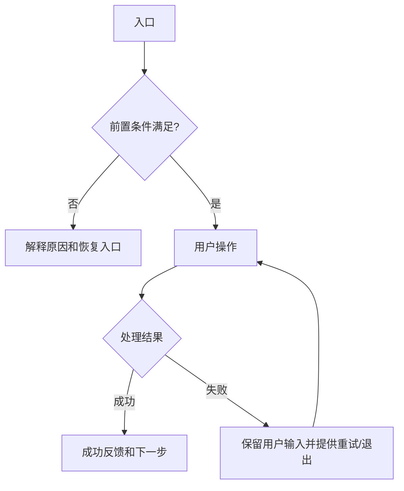

# 需求文档模板-REQ-TEMPLATE-0001-v1.0

> 使用规则：复制到 `docs/requirements/<需求名>-<REQ-ID>/<需求名>-<REQ-ID>-v<版本>.md` 后填写。以下 24 个默认章节不得删除、合并、乱序或留空；不适用时写“**不适用**”、理由和确认人。未决内容进入假设和未决事项清单，不得用模糊措辞直接开工。模板中的“待填”只用于起草提示，文档作为现行需求或任务进入实施前必须全部替换。

## 1. 文档信息

| 项目 | 必填内容 |
| --- | --- |
| 需求名称/编号/版本 | 易读名称、REQ-ID、语义化文档版本 |
| 文档状态 | `DRAFT` / `ACTIVE` / `SUPERSEDED` / `RETIRED`；这里只描述需求文档成熟度，机器任务状态由 `taskctl` 独立维护 |
| 交互类型 | `ui` / `non_ui` / `mixed`；文档成为 `ACTIVE` 或任务进入实施前写入任务 `requirement.interaction_kind` |
| 提出人/审核人/负责人 | 人或明确角色 |
| 创建/更新日期 | YYYY-MM-DD |
| 关联任务、分支和发布单元 | TASK-ID、分支、macOS/Windows/backend |
| 上一版本与变更摘要 | 链接和变化原因 |
| 工作分支 / base branch | 两者都记录在任务范围中；除获准 bootstrap 外不得相同，不为此另设普通 scope 回执 |

## 2. 一句话摘要

用不带实现术语的一句话说明谁在什么场景解决什么问题。

## 3. 背景与现状证据

描述现状、问题、证据、频率和不处理的影响。不要把猜测写成事实。

## 4. 使用者与使用场景

列出主要/次要使用者、入口、前置条件、使用频率、设备与环境。

## 5. 目标与成功指标

列出可观察、可验证的目标和指标，注明测量方式与期限。

## 6. 非目标

明确本版本不会解决的相邻问题，防止范围扩张。

## 7. 范围

### 7.1 包含范围

逐项列出功能点、发布单元和允许修改路径。

### 7.2 排除范围

逐项列出禁止修改路径、延后功能和不得顺带重构的内容。

## 8. 前置与后置依赖

列出上游任务、接口、数据、环境、外部服务、版本约束，以及本需求对下游产生的影响。

## 9. 假设和未决事项

每项注明影响类别、风险、推荐默认值、可逆性、确认人和最迟确认阶段。普通低风险可逆项可采用明确记录的推荐默认值；个人/敏感数据、显著安全风险、实质成本、不兼容迁移或不可逆结果必须由用户决定。

## 10. 功能明细与业务规则

按可独立验收的功能点拆分；每项包含输入、处理规则、输出、权限、边界、失败和恢复，不省略默认行为。

## 11. 用户流程与交互（UI 必填）

`ui` 或 `mixed` 需求必须用流程图描述入口、主路径、返回/取消、失败与恢复。不能只附一张原型图。`non_ui` 需求明确写不适用理由与确认依据。

逐页面/组件补齐以下交互状态：

| 状态 | 展示 | 可执行操作 | 数据是否保留 | 恢复方式 | 验收条件 |
| --- | --- | --- | --- | --- | --- |
| 初始/默认 | 待填 | 待填 | 待填 | 待填 | 待填 |
| 空状态 | 待填 | 待填 | 待填 | 待填 | 待填 |
| 加载/处理中 | 待填 | 待填 | 待填 | 待填 | 待填 |
| 成功 | 待填 | 待填 | 待填 | 待填 | 待填 |
| 校验失败 | 待填 | 待填 | 待填 | 待填 | 待填 |
| 系统失败/超时 | 待填 | 待填 | 待填 | 待填 | 待填 |
| 离线/重连 | 待填 | 待填 | 待填 | 待填 | 待填 |
| 权限不足/登录失效 | 待填 | 待填 | 待填 | 待填 | 待填 |
| 返回/取消/关闭 | 待填 | 待填 | 待填 | 待填 | 待填 |
| 无障碍/键盘操作 | 待填 | 待填 | 待填 | 待填 | 待填 |

## 12. 非 UI 流程图（非 UI 需求必填）

`non_ui` 或 `mixed` 需求根据内容选择并填写时序图、状态图、流程图或数据流图，解释边界、失败分支和重试；不能只写一条成功路径。纯 `ui` 需求明确写不适用理由与确认依据；涉及后端、数据或运维变化时仍补充相应图。

## 13. 数据与生命周期

列出数据字段、来源、存储位置、个人/敏感等级、schema 版本、创建/读取/更新/删除、保留、导入导出、备份、迁移和恢复。

## 14. 登录、权限、安全与隐私

描述身份提供方、鉴权边界、最小权限、令牌存储、会话失效、日志脱敏、滥用场景和隐私影响。

## 15. 接口与兼容性

列出 API/文件格式/事件/错误码、超时重试、幂等、客户端与后端兼容矩阵、旧版本支持窗口和弃用流程。

## 16. 性能、可靠性与成本

给出响应时间、容量、资源、可用性、降级、恢复目标和可接受成本；无法量化时登记未决事项。

## 17. 运维、可观察性和问题排查

说明环境、配置、日志、指标、告警、健康检查、支持入口、常见失败和所需 runbook。

## 18. 发布、迁移与回退

按发布单元列出版本、顺序、开关、数据迁移、兼容窗口、回退触发条件、回退步骤、不可回退点和恢复验证。

## 19. 验收标准

使用可复现的前置条件、操作和可观察结果；覆盖成功、边界、失败、恢复、权限、兼容和数据保持。

## 20. 验证计划与证据

列出每项检查声明的 argv、超时、环境、覆盖发布单元、负责人、预期和证据位置。本地 PASS 必须由受控 runner 从实际执行结果派生；未运行、失败、超时和 `skipped` 不能写为通过，豁免必须链接用户明确对话决定生成的绑定回执。

按阶段说明绑定对象：`local` 绑定当前工作区；`ci` 由 GitHub Actions 在 PR 或 `main` 的准确提交上重跑并直接展示。两类结果不得互相替代；范围、工作区或提交变化后必须重验。

涉及多个发布单元时，逐项说明 `mac`、`win`、`backend` 的自动验证、真实环境验收、兼容和回退证据。Windows CI runner 不得替代真实 Windows 安装、升级、卸载或业务行为验收。普通流程不要求用户提供 Run 链接、CI 读取凭据或把 Actions 结果抄回本地。

## 21. 文档更新清单

列出需要更新的项目、需求、开发、运维、排障、决策和治理文档；不适用项逐项说明理由。

## 22. 风险与影响分析

覆盖范围、数据、安全、隐私、兼容、成本、性能、运维、不可逆结果和失败最坏后果，并注明是否已由用户确认。

## 23. 审核与回执

记录清晰需求的范围决定和真正需要用户确认的关键节点。普通编辑、联网、依赖、测试、提交、功能分支 push、PR 准备、同范围返工和有记录的子 Agent 不需要 scope/code 回执。验证豁免绑定检查、对象、环境和有效期；破坏性/不可逆或高影响操作记录准确目标、影响、最坏后果与恢复方案；最终合并、部署和发布记录用户决定。不得在需求正文伪造回执。

关键回执必须在用户于当前 Codex 对话明确决定后，由 `reviewctl` 从当前治理状态创建；回执目录禁止直编。对话回执是审计记录而非密码学身份凭证；若需求需要更强身份保证，必须在该需求中明确引入独立审批能力。

## 24. 变更历史

记录文档版本、日期、变更摘要、原因和关联任务；实现细节历史由任务与 Git 保存。
