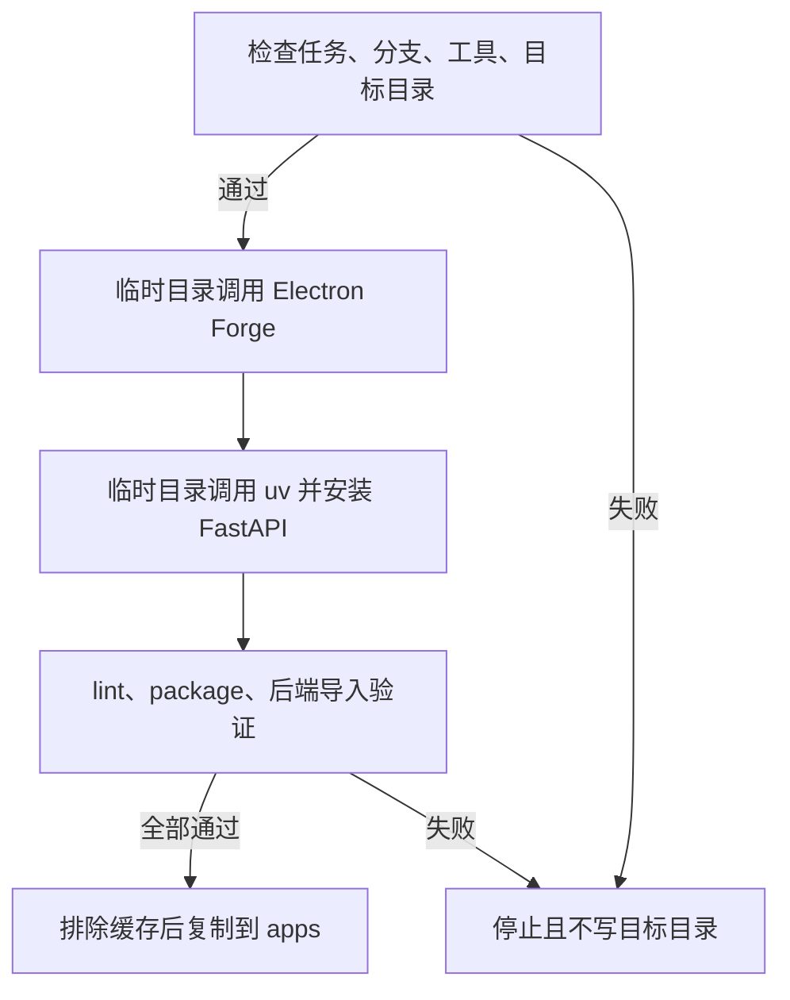

# 项目初始化-REQ-0002-v1.0

## 1. 文档信息

需求编号 `项目初始化-REQ-0002`，版本 `v1.0`，交互类型 `non_ui`，实现任务 `APP-0001`。

## 2. 一句话摘要

用一个命令调用官方生成器，建立共享桌面客户端与统一后端的可运行框架和依赖。

## 3. 背景与现状证据

仓库已有治理工具但没有应用脚手架、应用依赖或业务代码；技术栈此前处于未决状态。

## 4. 使用者与使用场景

维护者在新仓库阶段执行一次初始化；广告素材制作者与广告优化师是后续应用使用者，本需求不提供业务界面。

## 5. 目标与成功指标

`apps/desktop` 由 Electron Forge TypeScript 模板生成并能 lint/package；`apps/backend` 由 uv 生成并能导入 FastAPI；目标目录无缓存、虚拟环境或嵌套 Git。

## 6. 非目标

不实现登录、SQLite schema、素材处理、广告发布、部署、商店发布或任何业务功能。

## 7. 范围

范围包含官方生成、依赖安装、生成结果预验证、复制到 monorepo、基础 CI 接入和文档更新。覆盖 `mac`、`win`、`backend` 三个发布单元。

## 8. 前置与后置依赖

前置为 GOV-0002 治理收缩提交；初始化分支以该提交所在分支为基线。后续业务需求依赖本任务形成的稳定项目结构。

## 9. 假设和未决事项

- 假设：Electron Forge webpack-typescript 与 uv + FastAPI 是可逆默认值。
- 未决事项：身份模型、SQLite 字段和部署环境留给后续独立需求，不能在本任务中暗自实现。

## 10. 功能明细

入口为 `python3 tools/governance/projectctl.py init --json`。命令检查当前任务、分支、范围、工具和空目标目录，在临时目录生成并验证，再原子式引入两个应用目录。

## 11. 用户流程与交互

不适用：本需求没有产品 UI。命令只输出成功 JSON 或可操作的失败原因，不发起交互式问答。

## 12. 非 UI 流程图

所有生成命令使用精确 argv 和 `shell=False`。写入边界仅限两个 `apps` 目标；失败不会留下半成品目标目录。临时失败可重试同一命令恢复依赖缓存，检测到不完整或非生成器目标时则阻断，不能覆盖。

## 13. 数据与生命周期

本任务不创建产品数据或 SQLite schema。依赖缓存、`node_modules`、`.venv`、`out` 和嵌套 `.git` 不进入仓库。

## 14. 登录、权限、安全与隐私

不实现登录与鉴权，不读取或保存个人数据、令牌和私钥。网络仅用于官方包注册表下载公开依赖。

## 15. 接口与兼容性

客户端与后端尚无业务 API。目录合同为 `apps/desktop` 与 `apps/backend`；macOS/Windows 共用桌面源代码但分别构建。

## 16. 性能、可靠性与成本

初始化只执行一次，允许下载依赖和本机打包。没有云部署成本；GitHub 后续按三平台运行，旧运行可取消以控制 CI 时间。

## 17. 运维、可观察性和问题排查

命令返回失败的精确子命令和退出码，不记录秘密。注册表不可达、工具缺失或生成器变化时失败关闭，不手工伪造输出。

## 18. 发布、迁移与回退

本任务不发布。回退方式是整体回退 APP-0001 提交；由于尚无产品数据，不涉及数据迁移。已存在目标目录时命令拒绝覆盖。

## 19. 验收标准

Electron Forge 和 uv 生成痕迹、依赖清单与锁文件存在；桌面 lint/package 成功；后端 FastAPI 导入成功；缓存目录未纳入 Git；治理核对通过。

## 20. 验证计划与证据

受控 runner 执行 `desktop_lint`、`desktop_package`、`backend_import` 和 `repository_reconcile`。CI 对 macOS、Windows 和后端分别验证，未运行或失败不能通过。

## 21. 文档更新清单

更新根 README、本需求文档和必要的开发说明；生成器自带 README 作为脚手架来源记录保留。

## 22. 风险与影响分析

主要风险是供应链下载、生成器版本漂移和本机打包差异。使用官方入口、锁文件、临时目录预验证、无覆盖写入和三平台 CI 降低风险。

## 23. 审核与回执

用户已明确授权一个命令自动完成前置约束、官方脚手架和依赖安装，并授权 Codex 采用推荐可逆默认值；最终合并、部署与发布仍需用户决定。

## 24. 变更历史

`v1.0`：首次定义单命令应用初始化边界、默认技术栈、验证和回退方式。
