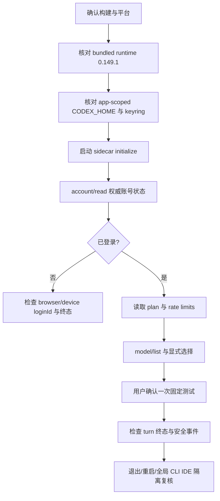
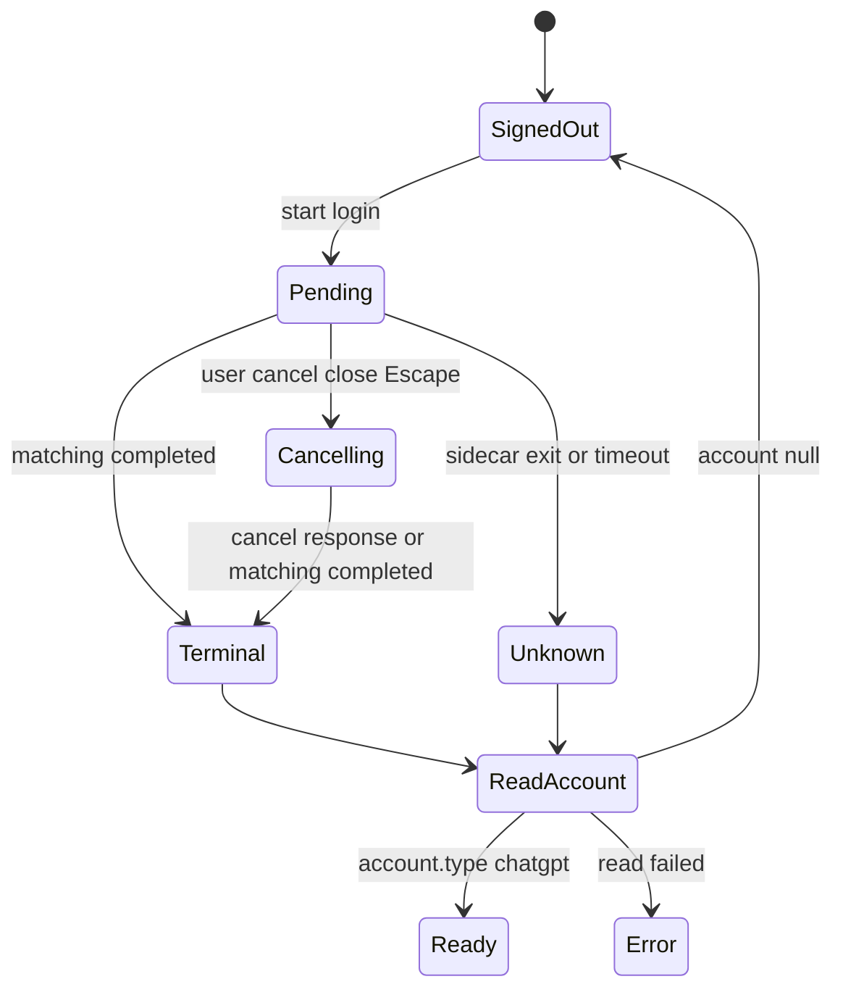

# Codex订阅登录与调用-TRB-0010-v1.0

## 1. 适用范围与安全原则

本文用于排查 `APP-0022` 的 Material 专属 Codex 订阅区域，包括固定 `@openai/codex-sdk` / Codex runtime `0.149.1`、App Server stdio JSONL、浏览器与设备码登录、app-scoped `CODEX_HOME`、OS keyring、账号/套餐/限额/credits、`model/list`、显式固定测试、退出与账号切换。产品合同见 [Codex订阅接入-REQ-0007-v1.0](../requirements/Codex订阅接入-REQ-0007/Codex订阅接入-REQ-0007-v1.0.md)，实现设计见 [Codex-SDK订阅接入-DEV-0013-v1.0](../development/Codex-SDK订阅接入-DEV-0013-v1.0.md)。API Key 模型问题继续参照 [模型连接与凭据-TRB-0007-v1.0](模型连接与凭据-TRB-0007-v1.0.md)。

官方依据：

- [Codex Authentication](https://learn.chatgpt.com/docs/auth)：ChatGPT 订阅登录和 API Key 按量访问是两条不同路径；凭据可存 OS keyring。
- [Codex App Server](https://learn.chatgpt.com/docs/app-server)：账号、浏览器/设备码登录、取消、退出、模型目录、限额和事件协议。
- [Codex SDK](https://learn.chatgpt.com/docs/codex-sdk)：本地 Codex 线程和 Node.js runtime 前提。
- [Codex Pricing](https://learn.chatgpt.com/docs/pricing)：订阅限额与 credits 会随计划、模型、上下文和策略变化。
- [Codex Config Reference](https://learn.chatgpt.com/docs/config-file/config-reference)：凭据存储、历史、环境和扩展配置字段。
- [openai/codex#3026](https://github.com/openai/codex/issues/3026)：内置 OpenAI Provider 当前不能由同名自定义 Provider 覆盖其传输恢复默认值。

### 1.1 排障禁止项

排障人员和自动诊断不得：

- 要求用户粘贴 access/refresh token、cookie、Authorization、完整 `authUrl`、回调 URL、设备码或 `auth.json`；
- 读取、复制、移动、覆盖或删除用户全局 `~/.codex`，也不得运行全局 `codex logout` 代替应用退出；
- 把 app-scoped `CODEX_HOME` 改回 `~/.codex`，或把 keyring 降级为明文文件、SQLite、环境变量或普通 JSON；
- 关闭 TLS、允许任意登录 URL、打开实验 WebSocket 监听、放宽 renderer IPC 或把 App Server stdout/stderr 原样展示；
- 允许 command、file change、MCP、web、hook、skill、plugin、memory、subagent、image view、dynamic tool 或任何权限请求；
- 通过删除整个应用 userData、产品库、分析记录、API Key 密文或卸载应用“重置登录”；
- 在一次测试确认后由 Material 创建第二个 thread/turn、续跑、切换模型或 API Key、购买/兑换 credits，或把 mock/无登录 runtime 当作真实订阅成功；官方 runtime 仍可能在同一 turn 内执行其传输恢复；
- 把测试成功写成完整素材分析可用。APP-0022 不接收素材或业务 Prompt，也不进入新建分析候选。

### 1.2 可安全记录的证据

允许记录 runtime 版本、generation、阶段、稳定错误码、RPC 方法类别、受控 request/login ID 的短摘要、模型数量、非秘密模型 ID、耗时、时间、sidecar exit code 和是否发生安全事件。禁止记录账号原值、绝对敏感路径、JSONL、Prompt/回复/reasoning、原始限额响应或 stderr。

## 2. 先识别证据层级

| 证据 | 能证明 | 不能证明 |
| --- | --- | --- |
| 单元/UI/mock App Server | 状态机、IPC、JSONL、错误、次数、秘密禁入和可访问性合同 | OpenAI 可达、账号有订阅、真实模型可用 |
| bundled runtime 无登录测试 | 安装包内 `0.149.1` runtime 可启动、initialize 与 signed-out 状态可解析 | 真实订阅登录、模型目录、额度或完成能力 |
| 单平台真实登录 + 固定测试 | 当次账号、模型、平台和时间点可达 | 另一平台、无限额度、模型质量、完整分析或发布 |
| macOS/Windows 全局登录隔离真机 | 对应平台上 Material 登录/退出未影响当次 CLI/IDE canary | 所有系统版本和未来 runtime 永久无副作用 |

缺少 Material 专属 ChatGPT 登录时，真实 smoke 必须是 `SKIP`/未登录，不能写 PASS。mock 或本机已有全局 Codex 登录不能补位。

## 3. 状态与错误定位

| 页面状态/错误 | 首要检查 | 允许恢复 |
| --- | --- | --- |
| `unavailable` / `RUNTIME_UNAVAILABLE` | bundled runtime 是否存在、架构/版本/执行权限、keyring 是否可用 | 修复准确安装包或系统凭据后重试；不搜索全局 CLI |
| `signedOut` / `SIGNED_OUT` | `account/read` 的 `account` 是否为 null，并结合 `requiresOpenaiAuth` 定位协议状态；renderer 只显示派生状态 | 在 Material 内重新浏览器/设备码登录；全局 CLI 已登录也仍可预期 signed out |
| `loginPending` / `LOGIN_IN_PROGRESS` | 当前 loginId、方式、开始时间、runtime generation | 等待、取消当前尝试；不启动第二个登录 |
| `LOGIN_FAILED` | 浏览器/设备码终态、网络、账号/工作区政策 | 按安全文案恢复，再由用户显式登录 |
| `PROTOCOL_ERROR` | JSONL 超长/非法、未知必需字段、ID 或版本不一致 | 停止当前 generation，升级/修复适配；不透传原文 |
| `ready` 但 plan/限额为空 | 对应字段可能未提供或刷新失败 | 显示“暂不可用”，手动刷新；不推断免费/无限 |
| `limited` / `RATE_LIMITED` | `rateLimitReachedType`、窗口与重置快照 | 等待或处理账号/管理员；刷新后再测试，不切 API Key |
| `NO_MODEL_SELECTED` | 最新成功目录与 selectedModelId | 用户从当前目录显式选择 |
| `MODEL_UNAVAILABLE` | 模型是否下线、隐藏、不支持文本或来自旧账号 | 刷新目录并显式重选；不采用 isDefault/upgrade 自动替换 |
| `TEST_TIMEOUT` | 60 秒截止、interrupt 和最终 turn 状态 | 显示未知/超时；用户再次确认才产生新测试 |
| `SECURITY_VIOLATION` | command/file/MCP/web/tool/approval 等事件 | 立即中断并停用当前 runtime；保留安全摘要、禁止继续真实调用 |

## 4. 常见现象、原因与安全恢复

### 4.1 Runtime、打包与 sidecar

| 现象 | 可能原因 | 安全恢复 |
| --- | --- | --- |
| 开发环境可用，安装包提示 runtime 不可用 | 可执行未作为 extra resource 放在 ASAR 外、路径依赖 `node_modules`、执行位丢失 | 检查准确平台资源和 `codexPathOverride`；重新打包签名，不从 PATH 补位 |
| 显示版本不一致 | 打包了浮动/全局 Codex 或 SDK/runtime lock 不一致 | 恢复精确 `0.149.1` 依赖和资源；版本不一致时 fail closed |
| macOS 提示无法打开/被系统阻止 | 嵌套可执行未签名、公证或权限错误 | 修复打包签名链和执行位；不让用户关闭 Gatekeeper |
| Windows 安装后找不到/不能启动 | Squirrel 资源布局、架构或安全软件隔离问题 | 使用 win32-x64 固定资源重新打包；核对安装包证据，不依赖开发机路径 |
| sidecar 启动后 15 秒无响应 | 架构错误、权限、进程崩溃、initialize 未发送/应答 | 终止固定子进程，记录净化错误，修复后由用户重试 |
| 出现 `Not initialized` / `Already initialized` | JSON-RPC 握手顺序或重复初始化 | 每个 generation 只执行一次 initialize + initialized；重启后重新握手 |
| 超长/非法 JSONL 导致页面卡住 | 未限制行长、部分行或异常解析未 fail closed | 停止当前 generation，返回协议错误；修复 parser，不记录原始行 |
| 应用关闭后残留 Codex 进程 | pending turn 未 interrupt、stdin 未关闭或终止超时未处理 | 下次启动先报告上一异常；修复 shutdown 顺序，不能用广泛 kill 命令 |
| stderr 中可能含秘密 | sidecar 原始错误被 console/日志继承 | 关闭原样继承，使用受限内存净化；发生泄漏按安全事件处理 |

### 4.2 浏览器登录与本地回调

| 现象 | 可能原因 | 安全恢复 |
| --- | --- | --- |
| 点击登录没有打开浏览器 | 用户取消确认、`authUrl` 校验失败、系统默认浏览器不可用 | 只对主进程校验通过的官方 HTTPS URL 重试；可改用设备码 Beta |
| URL 被拒绝 | mock/协议返回非 HTTPS、非官方主机、含异常结构 | 保持失败关闭并升级适配；不得把任意 URL 交给 renderer/openExternal |
| 浏览器显示成功，应用仍在等待 | callback/通知延迟、事件丢失、旧 generation、账号读取失败 | 等待当前终态或取消；随后 `account/read`；不读取浏览器 cookie/token |
| 浏览器提示 localhost callback 失败 | 端口冲突、防火墙、代理或组织网络阻断 | 取消当前 browser login，再由用户选择设备码；不手工复制回调 URL |
| 用户取消后页面显示已登录 | 成功先于取消完成，或取消/完成竞态 | 以匹配尝试终态结束 pending，再以 `account/read` 权威状态显示；这是可能的合法收敛 |
| 用户完成后页面显示已取消 | UI 只相信取消 ack，未重读账号 | 立即 `account/read`；若 `account.type=chatgpt` 则显示已登录，修复竞态逻辑 |
| 取消返回错误 | loginId 已结束、过期或 sidecar 已重启 | 清理旧 pending，读取账号；不要对新 loginId 重放取消 |
| 重复出现两个浏览器登录 | 缺少全局 pending 门禁 | 保留第一个 current loginId，拒绝第二个；不要任意取消所有登录 |
| 管理员/工作区拒绝登录 | 账号未配置席位、Codex 被禁用或强制策略 | 让用户联系管理员/选择允许账号；Material 不绕过或回退全局 token |

### 4.3 设备码登录 Beta

| 现象 | 可能原因 | 安全恢复 |
| --- | --- | --- |
| 设备码入口不可用 | 个人安全设置或工作区管理员未启用，服务/版本不支持 | 显示 Beta 与管理员恢复说明；改用浏览器登录，不使用外部 token |
| verification URL 不是固定值 | 协议异常或恶意 mock | 返回协议错误并停止；只允许 `https://auth.openai.com/codex/device` |
| code 无法复制 | 剪贴板权限或 UI 错误 | 允许用户手工输入；不自动复制、不写日志/通知 |
| code 无效/过期 | 过期、重复使用、输入错误或旧 loginId | 结束当前尝试并清除 code；用户显式开始新设备码登录 |
| 关闭弹窗后仍能读取旧 code | DOM/状态清理缺失 | 停止发布并修复内存/DOM/无障碍树清理；不得仅隐藏视觉元素 |
| 在另一个账号完成设备码 | 用户浏览器当前账号与预期不同 | 登录后显示掩码账号/plan；若不正确，显式退出后重新登录 |

### 4.4 app-scoped `CODEX_HOME` 与 keyring

| 现象 | 可能原因 | 安全恢复 |
| --- | --- | --- |
| Material 已登录但全局 CLI 显示另一账号 | 这是独立 home/keyring 的预期结果 | 分别维护；不要复制 token 让两者一致 |
| 全局 CLI 已登录但 Material 显示未登录 | 同上，Material 不复用全局缓存 | 在 Material 内单独登录 |
| 登录后生成 app-scoped `auth.json` | keyring 不可用、配置未生效或 `auto` 回退 | 安全违规：停止功能、删除前先保留不含秘密的证据并由用户确认撤销；修复为 `keyring`，不得继续调用 |
| keyring 锁定/拒绝 | macOS Keychain/Windows 凭据不可用或用户拒绝 | 显示 runtime/登录不可用；恢复系统凭据后重试，不切到文件存储 |
| 应用退出导致 CLI/IDE 也退出 | 错用了全局 home/keyring 命名，或调用了全局 `codex logout` | 立即停止对应平台发布；恢复全局登录并修复隔离，双平台真机重验 |
| 退出后 Material 仍显示已登录 | logout 失败、事件丢失、未确认 `account=null` | 重启 sidecar 并 `account/read`；仅在 `response.account===null` 时宣称成功，再允许重试 |
| app-scoped home 含全局 AGENTS/MCP/skills/hooks | 错误复制/继承配置或 home 路径解析错误 | 停止测试，清理方案需确认；修复生成固定最小 config，不加载全局内容 |
| app-scoped home 出现测试 prompt/回复 rollout | history/ephemeral 合同未生效或 runtime 回归 | 停止真实测试；不能事后删除后写 PASS，修复/升级并覆盖崩溃路径重验 |

固定 app userData 下的 canonical `CODEX_HOME` 与 `0.149.1` runtime keyring 命名设计用于隔离账号，但只有 macOS/Windows 真机建立全局 CLI/IDE canary 后，才能声明对应平台未受影响。

### 4.5 账号、套餐、限额与 credits

| 现象 | 可能原因 | 安全恢复 |
| --- | --- | --- |
| 已登录但没有账号标签 | 原始账号缺失或主进程不能安全掩码 | 显示“已登录 ChatGPT”；不要返回原始 email/account ID |
| planType 为 null | 服务未提供、账号类型特殊或读取失败 | 显示“套餐暂不可用”，不推断 Free/Plus/无限 |
| 限额显示“暂不可用” | `account/rateLimits/read` 失败或字段 null | 网络恢复后用户刷新；测试是否可用按权威账号/限额状态处理 |
| usedPercent 是小于 0 或大于 100 的有限数值 | 上游快照越界 | 客户端按 0～100 钳制显示；保留“这是归一化快照”的语义，不将其解释为精确计费 |
| usedPercent 非数值/非有限或窗口结构无效 | 可选窗口不可解析 | 忽略该窗口并显示“暂不可用”；若整体响应不是 object 等顶层合同破坏才返回协议错误 |
| 页面显示达限但 dashboard 看似可用 | 快照过期、不同限额 bucket、重置延迟 | 手动刷新；保留各 bucket 信息，不自行合并为余额 |
| credits 数量未知 | 服务只返回 null/未提供 | 显示“暂不可用”；不显示 0、不估算金额/次数 |
| 到限后 API Key 自动被选中 | 实现违反双分区和无静默切换 | 停止调用并修复；用户只能显式进入 API Key 区选择 |
| 用户要求购买/兑换 credits | APP-0022 是只读额度展示 | 引导官方账号/usage dashboard；Material 不购买、兑换、发加额邮件 |

### 4.6 模型目录与选择

| 现象 | 可能原因 | 安全恢复 |
| --- | --- | --- |
| 模型目录为空 | 账号/计划/管理员无可见模型，目录失败或无文本模型 | 显示无模型和刷新/管理员恢复；不伪造默认模型 |
| 模型数量不完整 | 未读取 nextCursor、错误截断或超过客户端上限 | 修复分页；超过 200 失败关闭，不把截断列表称完整 |
| 出现 hidden 模型 | 错用 `includeHidden:true` 或未过滤 | 固定 false 并移除隐藏项；不允许 renderer 控制参数 |
| isDefault 模型自动被选中 | 把推荐标记误作用户授权 | 清空选择并要求显式选择；推荐只作排序/标签 |
| 原选择突然不可测试 | 模型下线、隐藏、账号切换或目录变旧 | 刷新后显示原模型不可用，用户重选；不自动升级/替换 |
| 刷新失败仍能测试旧模型 | 旧目录被错误视为当前 | 禁用测试；旧快照只作说明，恢复成功后再选择 |
| requested 与 returned 模型不同 | alias 解析或服务返回具体 snapshot | 同时显示并提示核对；不互相覆盖、不称为自动切换 |

### 4.7 固定测试

| 现象 | 可能原因 | 安全恢复 |
| --- | --- | --- |
| 测试按钮不可用 | 未登录、限额、目录过期、未选模型、模型下线、另一个测试中 | 显示常驻禁用原因；恢复相应前置，不自动处理 |
| 点击测试没有先确认 | UI 绕过成本/外发确认 | 停止真实调用并修复；每次调用都需显示账号/模型/固定文本/额度说明 |
| 一次确认出现多个 `thread/start` 或 `turn/start` | 重复提交、截止后客户端补发或 sidecar 重连重放 | 立即停用；修复为每次确认一个 thread + 一个 turn，未知结果由用户决定是否再测。不要把同一 turn 内的官方 runtime 传输恢复误判为第二个逻辑 turn |
| 测试 60 秒后仍在运行 | 截止/interrupt 未生效 | 主进程发一次 interrupt 并结束 UI；sidecar 不收敛则终止 generation，不自动重发。V1 没有运行中手动取消测试 API |
| 只看到一个 turn，但怀疑有多次网络尝试 | 内置 OpenAI Provider 可能在同一 turn 内执行请求/流传输恢复 | 这是已披露的 Beta 剩余风险；核对 Material 没有第二次 `turn/start`，不要声称底层只有一次传输，runtime 升级时复核默认值 |
| 成功却不显示回复正文 | 这是正确的最小结果合同 | 只显示模型、耗时和时间；不要为排障开放正文 |
| 成功后新建分析仍无 Codex 模型 | 这是 APP-0022 的预期范围 | 完整分析另立任务；不要手工打开隐藏开关 |
| 出现 command/file/MCP/web/tool 请求 | runtime 配置或模型行为越界 | 一律拒绝和 interrupt，返回安全违规；保留最小事件摘要并停止真实测试 |
| 空目录外 canary 可读/有文件写入 | sandbox、cwd、附加目录或环境隔离失败 | 安全事件；停止平台发布，修复后全路径重验 |
| 测试成功但限额未刷新 | 测试不隐式刷新额度 | 用户显式刷新；不要推算本次 credits |

### 4.8 退出、切换、升级与卸载

| 现象 | 可能原因 | 安全恢复 |
| --- | --- | --- |
| 退出按钮在测试中仍可点 | 未落实并发门禁 | 禁用退出并等待测试受控终态或 60 秒截止；V1 不通过 UI 手动取消运行中测试 |
| 退出失败后页面变未登录 | UI 只看请求返回，未读 account | 重读账号并恢复真实状态；只有 `response.account===null` 才显示退出成功 |
| 切换账号后仍用旧模型 | 旧目录/选择未清空 | 退出时清空，重新登录后加载目录并显式选择 |
| Codex 退出删除了 API Key 配置 | 错误共享删除逻辑 | 恢复密文备份/停止发布；两区必须完全独立 |
| API Key 删除导致 Codex 退出 | 同上 | 修复独立生命周期；不自动重新登录或重建 Key |
| 升级后直接显示 ready | 沿用旧 UI 快照，未 account/read | 升级启动先读权威账号/目录，旧 ready 不可信 |
| 回退旧版后无法退出订阅 | 旧版不认识 app-scoped runtime | 使用支持该能力的已验证版本显式退出；不要删除整个 userData或全局 keyring |
| 卸载后重装仍登录 | 普通卸载保留 userData/keyring，且不等于显式退出 | 这是需如实说明的可能结果；用户应先退出，平台安装器行为另行真机验收 |

## 5. 建议诊断顺序

1. 先记录准确应用构建、平台/架构、runtime 版本和稳定错误码；不要记录账号或绝对敏感路径。
2. 证明可执行来自应用资源且为 `0.149.1`，不是 PATH、ChatGPT.app 或全局 npm。
3. 证明 `CODEX_HOME` 是应用 userData 下的固定专属路径，凭据策略为 keyring，未创建 auth.json，未加载全局配置。
4. 核对 sidecar generation、initialize 和 JSONL parser；协议异常先停 generation，不继续登录或测试。
5. 使用 `account/read` 的实际 `account` + `requiresOpenaiAuth` 响应判断登录：`account.type=chatgpt` 为订阅账号，`account=null` 为未登录；UI 缓存、浏览器页面或全局 CLI 状态都不是权威来源，renderer 只看派生状态。
6. 登录问题按当前 loginId、方式、完成/取消事件和最终 account/read 收敛；设备码完成后立即清除 code。
7. 已登录后分别核对 plan、限额、credits、目录和选择；缺失字段不推断，不把一个失败合并成全部失败。
8. 固定测试前核对确认、单调用、空 cwd、环境白名单和禁用能力；发生工具/文件事件立即停止。
9. 若排查退出/隔离，在专用测试环境建立全局 CLI/IDE canary，再验证 Material 退出后它仍登录；不要在用户生产会话做破坏性试验。
10. 修复后按第 7 节分层重验，准确报告 mock、runtime、live 和双平台状态。

## 6. 登录回调与取消竞态专项

登录尝试必须由 `(runtimeGeneration, loginId, loginKind)` 唯一标识。排查时使用以下状态规则：

- “第一个匹配终态”只结束当前尝试的等待；账号是否已登录由随后的 account/read/account updated 决定。
- cancel ack 晚于登录成功时，最终 ready 不是错误；错误是页面仍显示“已取消”且不重读账号。
- completion 晚于取消且 account/read 为 null 时保持 signed out；不得因迟到 success 字段改回 ready。
- sidecar 重启使所有旧 ID 失效；旧通知不得与新 generation 关联。
- 任何排障截图都应隐藏/裁掉浏览器 URL、code、账号和回调内容。

## 7. 验证与防复发

### 7.1 自动化与 mock

修复后执行任务要求的 lint、typecheck、普通测试、模型 runtime、Codex runtime 和 Electron package。mock 回归必须覆盖：

- 浏览器/设备码登录、固定官方 URL、单 pending、取消双顺序、超时、旧 ID 和 sidecar 重启；
- account plan/null、限额/credits/null、达限/恢复、token 过期和管理员禁用；
- model/list 分页、hidden、text 模态、默认推荐不自动选、下线/旧快照；
- 固定测试单 thread/turn、60 秒截止 interrupt、无运行中 cancel API、无客户端第二 turn、同 turn 内传输恢复披露、正文/reasoning 禁返；
- command/file/permission/MCP/web/dynamic tool/image/collab 事件 fail closed；
- 超长/非法 JSONL、恶意 stderr、child exit、秘密哨兵和环境/路径 canary；
- Codex logout 与 API Key CRUD 互不影响。

### 7.2 Runtime 与持久化

对实际打包 runtime 检查版本/架构/执行位、initialize、未登录状态、关闭后无僵尸进程。固定测试正常、失败、超时、安全违规和崩溃后扫描 app-scoped home，固定测试文本、回复、reasoning、history/rollout 明文命中数必须为 0；测试前预置的合成 canary 要与 runtime 自身文件区分。

### 7.3 真实 smoke

真实 smoke 只由用户在 Material 内登录专用测试账号并确认一次固定测试。依次核对同一会话的 `account/read.account.type=chatgpt`、model/list、rateLimits 和 selected model test；成功只记录安全摘要。缺少登录/权益/模型/网络或用户确认时标记未运行/失败，不能用 mock 补位。测试可能消耗订阅额度或 credits；Material 不创建第二个逻辑测试，官方 runtime 仍可能在同一 turn 内传输恢复。

### 7.4 macOS / Windows 真机

分别验证安装、登录、系统凭据可用/拒绝、重启、离线、过期、退出、全局 CLI/IDE canary、升级、回退和普通卸载/重装。CI 打包、一个平台或开发机全局 Codex 都不能替代另一个平台的证据。

## 8. 事件升级与安全处置

出现以下任一情况，停止 Codex 订阅功能继续真实调用并升级为安全问题：

- token、完整 auth URL、设备码、账号原值、Prompt/回复/reasoning 出现在禁止位置；
- Material 读取/修改全局 `~/.codex`，或退出影响 CLI/IDE；
- app-scoped keyring 降级出 auth.json/明文 token；
- command、file、MCP、web、hook、skill、plugin、memory、subagent 或工具网络实际执行；
- 固定测试内容在正常或异常路径持久化；
- 一次点击产生多个真实 turn 或自动切换模型/API Key；
- 包内 runtime 来源、版本、签名或架构无法证明。

处置只隔离 Codex 分区和固定 sidecar，不删除产品库、分析记录、素材引用、API Key 配置或整个 userData。凭据撤销/退出、证据保留、依赖回退和重新发布分别处理；最终发布恢复由用户决定。

## 9. 变更历史

| 版本 | 日期 | 摘要 | 关联任务 |
| --- | --- | --- | --- |
| v1.0 | 2026-08-25 | 新增 Codex 订阅 runtime、浏览器/设备码登录与取消竞态、app-scoped home/keyring、限额/credits、模型、固定测试、退出和证据分层排障 | APP-0022 |
