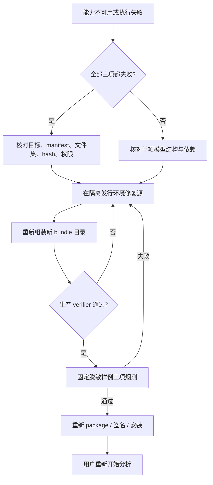

# 本地学习型媒体生产运行时-TRB-0019-v1.0

## 1. 适用范围与禁止操作

本文用于排查随客户端发行的 M04 OCR、M06 ASR 和 M07 声音事件生产运行时。能力输出和媒体解析通用问题同时参照[确定性媒体解析-TRB-0006-v1.0](确定性媒体解析-TRB-0006-v1.0.md)，构建与安全合同见[本地学习型媒体生产运行时-DEV-0022-v1.0](../development/本地学习型媒体生产运行时-DEV-0022-v1.0.md)。

排障不得修改成品 manifest 或 hash、只替换一个模型、关闭完整性检查、改用系统 Python / PATH、打开用户 site-packages、让模型临时联网下载、上传用户素材、记录绝对路径 / OCR / ASR 原文 / stderr、静默换模型或用成功空数组掩盖 unavailable。发行目录损坏时恢复完整安装单元，不在用户机器上现场拼包。

## 2. 现象、判断与恢复

| 现象 | 判断重点 | 安全恢复 |
| --- | --- | --- |
| 三项都显示“随应用安装的运行时缺失或校验失败” | `learned-runtime` 是否随目标 package 注入；manifest 目标、文件集、hash、执行权限或签名是否变化 | 退出应用，重新安装同平台已验证发行单元；不要配置系统 Python 绕过 |
| 仅一个能力 unavailable | 对应模型布局或依赖 import 失败；OCR 查 `det/rec`，ASR 查 `config.json/model.bin`，YAMNet 查 `saved_model.pb/variables` | 在发行环境修正源并重新组装整个 bundle，完成三项健康和固定样例后重新 package |
| 开发 bundle 校验失败 | `MATERIAL_LEARNED_RUNTIME_ROOT` 指向错误目标、目录名 / 文件集不匹配、build 后又被修改 | 删除该显式开发配置或用组装器生成新目录；不改成品 manifest |
| package 未携带运行时 | 正式构建没有设置 `MATERIAL_REQUIRE_LEARNED_RUNTIME=1` 和 bundle 输入，或输入目录不叫 `learned-runtime` | 让发行流水线以正确目标重新 package；开发 package 可无 bundle，但不能标为生产发行候选 |
| OCR 首次调用尝试联网或失败 | 模型路径未显式传入、PaddleOCR API 退回旧版、模型与 Paddle 版本不匹配 | 保持离线环境，使用 3.x `text_*_model_dir` 和 `predict()` 合同重新构建；不开放下载 |
| OCR 健康检查报缓存目录不可写 | 应用临时目录权限、磁盘空间或操作系统清理策略；生产运行时不应写入签名的 resources 或用户主目录 | 恢复应用临时目录的可写性并重启检查；不改用 resources、系统 Python 缓存或联网下载 |
| OCR 有文字但位置异常 | 模型多边形、图片旋转或缩放维度处理不一致 | 用固定 PNG 核对像素框到 0～1 的转换，再核对上游 M02 旋转；不截断非法框伪装成功 |
| ASR 报模型加载失败 | CTranslate2 模型不完整、目标架构不兼容、依赖漂移或误用了普通 Whisper 权重 | 使用锁定的 faster-whisper CTranslate2 模型重组装；确认 `local_files_only=True`、CPU int8 |
| ASR 时间或词为空 | 音轨无人声、VAD 过滤、模型置信不足、word timestamp 未返回 | 用固定中文短 WAV 复验，再检查结构化结果；区分成功空内容与能力失败 |
| 声音事件无法加载 | YAMNet SavedModel / variables 不完整、TensorFlow 目标 wheel 不兼容或 16kHz WAV 无效 | 用固定 16kHz 单声道 WAV 直接复验 sidecar；重新构建对应平台 bundle |
| 声音事件边界显得偏宽 | YAMNet 使用约 0.96 秒窗口、0.48 秒步长 | 保留近似限制；需要精确起止时新增专用事件定位模型，不能提高当前结果的时间精度声明 |
| 分析返回失败但看不到 Python 堆栈 | 这是设计行为，sidecar stderr 和路径不对外公开 | 用固定脱敏样例在受控开发环境运行专用测试；只记录能力、bundle / 模型版本和安全原因码 |
| Windows 能启动但 Python 进程打不开 | 目标 bundle 错误、缺 DLL、ACL / 签名或长路径问题 | 在 Windows x64 真机以安装后路径复验；不能用 macOS 合同测试代替 |

## 3. 建议诊断顺序

1. 记录平台、架构、应用版本、bundle 版本、能力 ID、有限健康状态和调用 ID；不记录素材名、路径、媒体内容、识别文本或 stderr。
2. 判断是全部能力失败还是单模型失败。全部失败先看 package / manifest，单项失败再看模型结构和固定依赖 import。
3. 在源码工作区执行 `npm --prefix apps/desktop run test:learned-runtime`，确认 manifest、组装器、配置隔离、Adapter 与 Python sidecar 合同。
4. 在隔离发行环境用 `uv.lock --frozen` 结果和固定模型组装同目标 bundle，再由生产 verifier 读回；不要直接编辑输出目录。
5. 先用无隐私固定 PNG / WAV 分别执行 OCR、ASR、声音事件；全部通过后才用本地素材会话调用完整分析。
6. 重新 package，执行目标平台的安装、启动、健康检查、固定样例、卸载和上一版本回退。Windows 问题必须在 Windows 真机复验。
7. 修复后运行 `taskctl run-required`；不得通过删除专用测试、放宽 hash / schema、降低门禁或把 unavailable 改为空结果来得到绿色状态。

## 4. 恢复流程

运行时失败不修改产品库、分析记录或系统凭据。当前未确认分析的临时帧 / WAV 仍按 Tool Broker 生命周期清理；用户重新开始分析时创建新调用，旧失败输出不能拼入新报告。已经确认的历史报告保留原能力与模型版本摘要，不因安装新 bundle 被重算。

## 5. 回退与防复发

- 回退必须安装上一份同平台、完整、已签名和已验证的应用单元；不要只复制旧 `models` 或 Python 目录。
- 发行流水线把“必须提供 learned-runtime bundle”作为正式 package 硬门禁，目标不匹配或 bundle 校验失败立即停止。
- 每次依赖 / 模型更新都生成新 bundle 版本，归档来源、不可变 revision、许可证、逐文件 hash、固定样例结果和目标平台结论。
- 共享单元测试只证明合同；macOS arm64 / x64 和 Windows x64 的二进制加载、性能、签名、安装、卸载分别验证。
- 若模型体积、下载可用性或中国大陆网络使随包发行不可接受，暂停扩大范围并新建下载 / 镜像产品需求；不能让 sidecar 临时联网规避产品决定。
