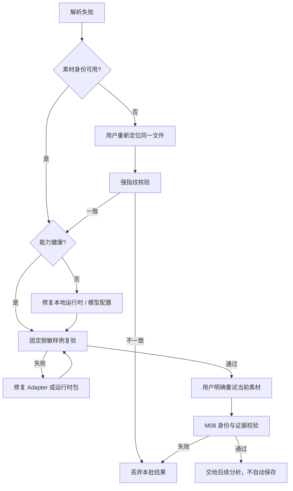

# 确定性媒体解析-TRB-0006-v1.0

## 1. 适用范围与安全原则

本文用于排查 APP-0011 的 M01～M08：FFmpeg / ffprobe、取帧、镜头候选、OCR、音频基础特征、ASR、声音事件和证据归一化。工具底座本身的问题先参照 [工具执行底座-TRB-0005-v1.0](工具执行底座-TRB-0005-v1.0.md)，素材移动与重新定位参照 [本地素材引用-TRB-0004-v1.0](本地素材引用-TRB-0004-v1.0.md)。

排障不得上传用户素材、把绝对路径或 OCR / ASR 原文写入日志、关闭 schema / 指纹 / 时间校验、启用 shell、无限提高超时、隐式下载模型、静默切换工具，或把失败结果保存成已确认报告。诊断优先使用固定脱敏样例、能力 ID / 版本、安全错误码和有限健康状态。

## 2. 常见现象、原因与恢复

| 现象 | 可能原因 | 安全恢复 |
| --- | --- | --- |
| M01～M05 显示工具链不可用 | FFmpeg 或 ffprobe 未配置、路径不是绝对路径、架构 / ACL / 签名不兼容、`-version` 失败 | 核对健康状态和固定安装来源；配置兼容的绝对路径后发起新调用，不回退为 shell 或任意 PATH 命令 |
| M04 / M06 / M07 不可用 | 生产 bundle 缺失 / 损坏、目标不匹配、模块缺失或本地模型结构错误；开发态才可能是显式路径未配置 | 发行客户端重新安装完整、已验证的同平台单元；开发态重新组装 bundle。不得让 sidecar 自行联网下载或改用系统 Python；详见 [TRB-0019](本地学习型媒体生产运行时-TRB-0019-v1.0.md) |
| OCR 模型存在但仍不可用 | 根目录没有 `det/` 与 `rec/`，或 PaddleOCR API / 权重版本不匹配 | 只修正受控模型包结构或 Adapter 兼容层；不要让 PaddleOCR改用默认下载目录 |
| ASR 模型存在但执行失败 | faster-whisper 与 CTranslate2 / Python / 架构不兼容，模型不完整，媒体音轨损坏 | 用固定短 WAV 和同一模型包复验；固定依赖版本与 hash，失败时保留为 optional 降级 |
| 声音事件模型存在但执行失败 | TensorFlow、SoundFile、YAMNet SavedModel 或 16kHz 输入不兼容 | 先用固定 16kHz 单声道 WAV 验证 runtime，再接素材；不要临时上传云服务替代 |
| 素材需要重新定位 | 文件移动、权限丢失、大小 / 修改状态或强指纹变化 | 让用户选择候选文件，通过同文件强指纹后恢复；不接受“文件名相同”作为依据 |
| 返回 `SOURCE_CHANGED` | M08 收到不同指纹、类型或大小的 M01～M07 结果 | 丢弃整批中间结果，从当前已校验素材重新运行；不得手工改指纹或只删掉冲突字段 |
| 返回媒体无效 / 不支持 | 容器损坏、缺画面轨、视频时长不可读、codec 不受当前构建支持，或对图片调用镜头检测 | 用 M01 健康和固定样例区分 runtime 与文件问题；图片分析计划不加入 M03 |
| 指定结束点取不到帧 | 请求时间等于视频时长或超出时长 | 等于结束点会自动退到最后 1ms；超出时长应修正上游时间，不循环重试 |
| 代表帧没有覆盖关键转场 | 代表帧是等间隔采样，不是语义镜头 | 同时运行 M03，再用候选 `keyframeMs` 调用 M02 指定取帧；不要把 I-frame 当镜头真值 |
| 镜头过碎或完全不切 | scene threshold / 最短镜头不适合素材，淡入淡出或高运动画面影响分数 | 在已允许 0.05～0.95 和 100ms～30s 范围内调整，并记录使用值；结果仍标为候选 |
| 视频有声音但波形 / 响度为空 | 解码失败、分析 filter 不受构建支持、临时 WAV 无效 | 用固定短样例分别验证 PCM、`volumedetect`、`ebur128` 和 `silencedetect`；不要用 0 冒充缺失值 |
| 静音区间偏长 / 偏短 | -35dB / 300ms 是基础候选阈值，压缩噪声或底噪影响 | 保留原阈值和结果作为证据；需要行业调整时另立版本，不原地改写历史结果 |
| OCR / ASR 返回空数组 | 画面无可识别文字、抽帧未覆盖字幕、音轨无人声，或模型置信不足 | 区分“能力已运行且为空”与“能力未提供”；视频 OCR 可用 M03 关键帧或显式时间点重跑 |
| 节奏变化候选不准确 | 当前为 RMS 能量差代理，不是 BPM / beat tracking | 报告保留限制说明；如需节拍真值，新增独立版本化工具，不提高当前候选置信度 |
| 输出被 Broker 拒绝 | 未知字段、文本 / 数组超限、坐标越界、时间超过 M01 时长、身份不一致或产物逃逸 | 修复 Adapter 转换；不放宽为任意 JSON，不截断越界时间后伪装为正确结果 |
| 取消 / 超时后暂时有临时目录 | 固定子进程仍在响应 `SIGTERM` 并结束 | 等进程 Promise 结束后由 Broker 清理；下次启动仅清扫严格命名且过期的工作区 |

## 3. 建议诊断顺序

1. 记录 invocation ID、capability ID / version、状态、安全错误码、运行时版本是否存在和耗时；不记录素材路径、文件名、帧、音频、识别原文、stderr 或模型输入。
2. 调用套件 `health()`，先区分 FFmpeg / ffprobe、Python 模块、本地模型和 M08 内置能力；健康失败不继续真实素材调用。
3. 用 `test:media-runtime` 的固定黑白场景 / 正弦 / 静音样例复验 M01、M02、M03、M05、M08，再用固定 PNG 复验图片分支。专用测试缺运行时应失败，不得 skip。
4. 对 M04、M06、M07 先用明确许可证、版本和 hash 的本地模型包跑最小样例；若只是模块或模型缺失，应保持 unavailable，而不是改成成功空数组。
5. 对媒体失败先检查 M01 的容器、轨道、时长、time base 和 codec，再分别检查取帧、镜头 filter、PCM、响度与静音；避免一次排查所有阶段。
6. 对 M08 失败逐项比较 `MediaIdentity`，再检查所有时间是否在 M01 时长内、图片区域是否在 0～1 内、置信度是否为有限 0～1、schema / runtime version 是否存在。
7. 修复后重跑普通单元测试、专用真实 runtime 测试、lint、typecheck 和 Electron package；Windows 相关问题必须再做 Windows x64 真机验证。

开发环境可直接执行已配置的 `ffmpeg -version` 与 `ffprobe -version` 核对构建参数，但输出只能进入受控开发证据，不能把用户素材命令行复制到普通日志。发现 `--enable-gpl`、`--enable-nonfree`、架构不符或来源不明时，只能判定该构建不可直接作为发行候选。

## 4. 失败后的数据与状态恢复

解析中间结果和临时产物都不是正式分析记录。任一必要节点失败、素材身份变化或 M08 拒绝时，整批未确认结果可直接丢弃并清理；不得部分保存为“成功”。运行时修复只影响之后的新调用，已经确认的报告将来应保留当时的能力快照，不追溯重解释。

## 5. 回退与防复发

- 回退 APP-0011 不涉及 SQLite 迁移或素材删除，只移除媒体能力注册、Adapter、sidecar 和相应测试 / 文档；隔离临时目录按既有生命周期清理。
- 运行时包回退必须回到上一份已验证的同平台绝对路径、版本和 hash；不能覆盖原目录后继续复用旧能力快照。
- 新 codec、模型、阈值、采样算法或输出字段必须提升能力或 schema 版本，并补视频、图片、无音轨、损坏媒体、越界、取消和路径脱敏回归。
- Windows / macOS 的二进制、安装、签名、ACL、长路径和卸载分别验收；共享 TypeScript 测试不能代替真机。
- 许可证、模型条款、下载源或运行时维护状态变化时暂停新的发行候选，先形成新的依赖与成本决策。
